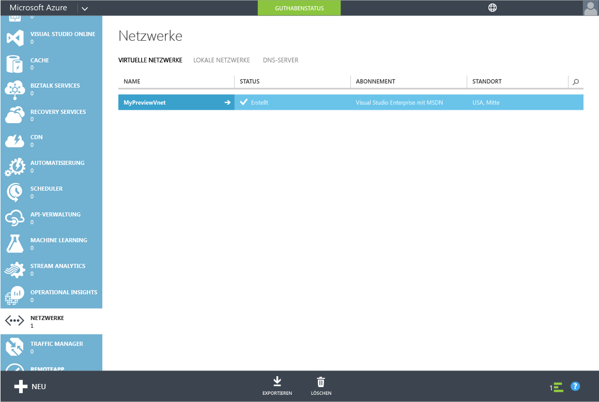
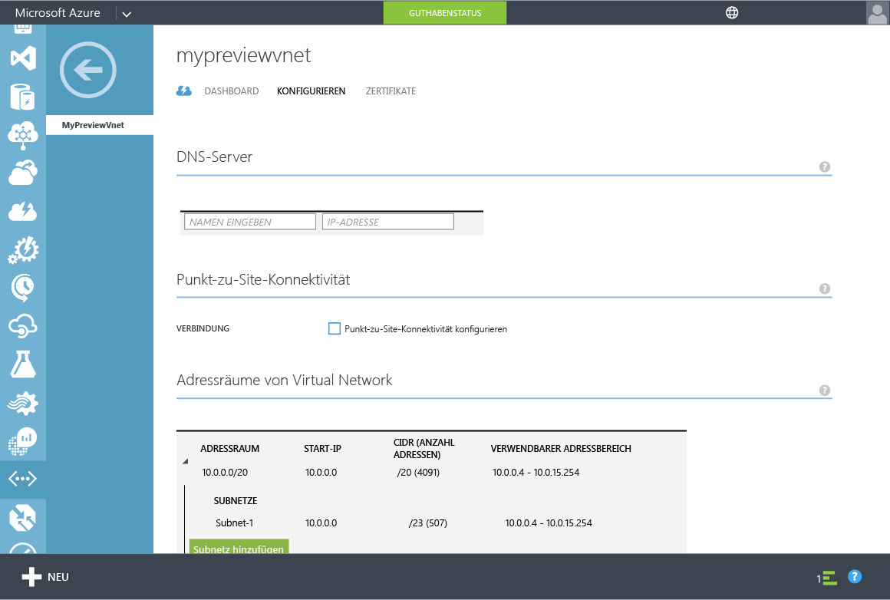
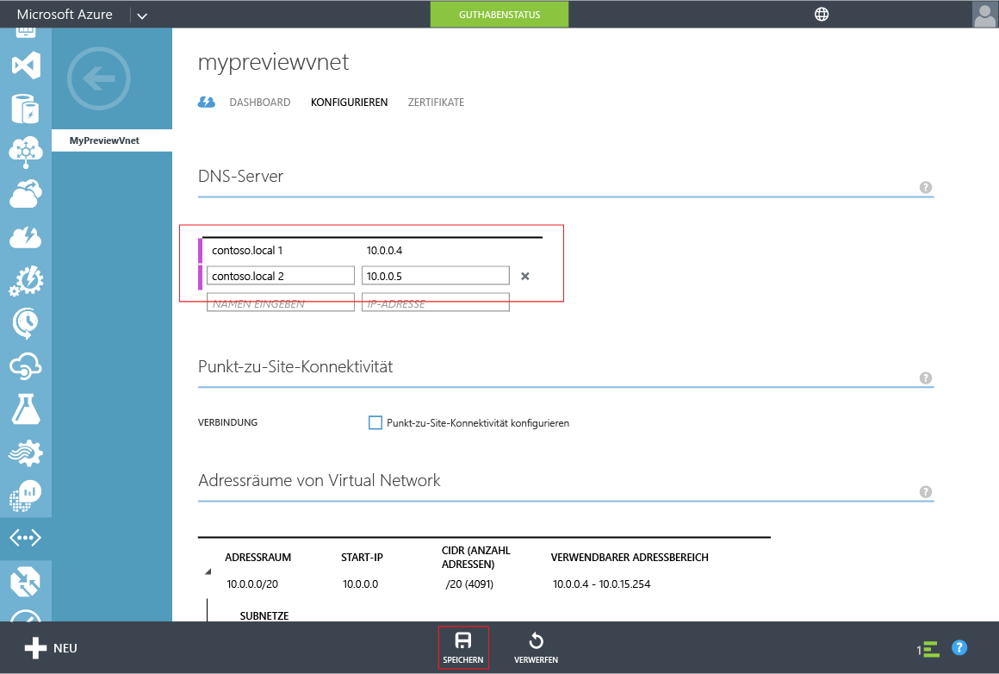

<properties
	pageTitle="Azure AD-Domänendienste: Aktualisieren der DNS-Einstellungen für das virtuelle Azure-Netzwerk | Microsoft Azure"
	description="Erste Schritte mit Azure Active Directory-Domänendiensten"
	services="active-directory-ds"
	documentationCenter=""
	authors="mahesh-unnikrishnan"
	manager="stevenpo"
	editor="curtand"/>

<tags
	ms.service="active-directory-ds"
	ms.workload="identity"
	ms.tgt_pltfrm="na"
	ms.devlang="na"
	ms.topic="get-started-article"
	ms.date="09/21/2016"
	ms.author="maheshu"/>

# Azure AD-Domänendienste – Aktualisieren der DNS-Einstellungen für das virtuelle Azure-Netzwerk

## Aufgabe 4: Aktualisieren der DNS-Einstellungen für das virtuelle Azure-Netzwerk
In den vorangegangenen Konfigurationsaufgaben haben Sie Azure AD-Domänendienste für Ihr Verzeichnis erfolgreich aktiviert. Als Nächstes stellen Sie sicher, dass Computer im virtuellen Netzwerk eine Verbindung mit diesen Diensten herstellen und diese nutzen können. Aktualisieren Sie die DNS-Servereinstellungen für Ihr virtuelles Netzwerk so, dass sie auf die beiden IP-Adressen verweisen, unter denen Azure Active Directory-Domänendienste im virtuellen Netzwerk verfügbar ist.

> [AZURE.NOTE] Notieren Sie sich die IP-Adressen für Azure AD-Domänendienste, die auf der Registerkarte **Konfigurieren** für Ihr Verzeichnis angezeigt werden, nachdem Sie Azure AD-Domänendienste für das Verzeichnis aktiviert haben.

Führen Sie die folgenden Konfigurationsschritte aus, um die DNS-Servereinstellung für das virtuelle Netzwerk zu aktualisieren, in dem Sie Azure AD-Domänendienste aktiviert haben.

1. Navigieren Sie zum **klassischen Azure-Portal** ([https://manage.windowsazure.com](https://manage.windowsazure.com)).

2. Wählen Sie den Knoten **Netzwerke** auf der linken Seite aus.

    

3. Wählen Sie in der Registerkarte **Virtuelle Netzwerke** das virtuelle Netzwerk aus, in dem Sie Azure AD-Domänendienste aktiviert haben, um dessen Eigenschaften anzuzeigen.

4. Klicken Sie auf die Registerkarte **Configure**.

    

5. Geben Sie im Abschnitt **DNS-Server** die IP-Adressen von Azure AD-Domänendiensten ein.

6. Stellen Sie sicher, dass Sie beide IP-Adressen eingeben, die im Abschnitt **Domänendienste** auf der Registerkarte **Konfigurieren** für Ihr Verzeichnis angezeigt werden.

7. Klicken Sie im Aufgabenbereich am unteren Rand der Seite auf **Speichern**, um die DNS-Servereinstellungen für dieses virtuelle Netzwerk zu speichern.

   

> [AZURE.NOTE] Nach der Aktualisierung der DNS-Servereinstellungen für das virtuelle Netzwerk kann es eine Weile dauern, bis virtuelle Computer im Netzwerk die aktualisierte DNS-Konfiguration erhalten. Wenn ein virtueller Computer keine Verbindung mit der Domäne herstellen kann, können Sie den DNS-Cache (z.B. „ipconfig /flushdns“) auf dem virtuellen Computer leeren. Dieser Befehl erzwingt eine Aktualisierung der DNS-Einstellungen auf dem virtuellen Computer.

## Aufgabe 5: Aktivieren der Synchronisierung von Kennwörtern für Azure AD-Domänendienste
Die nächste Konfigurationsaufgabe besteht im [Aktivieren der Kennwortsynchronisierung für Azure AD-Domänendienste](active-directory-ds-getting-started-password-sync.md).

<!---HONumber=AcomDC_0928_2016-->