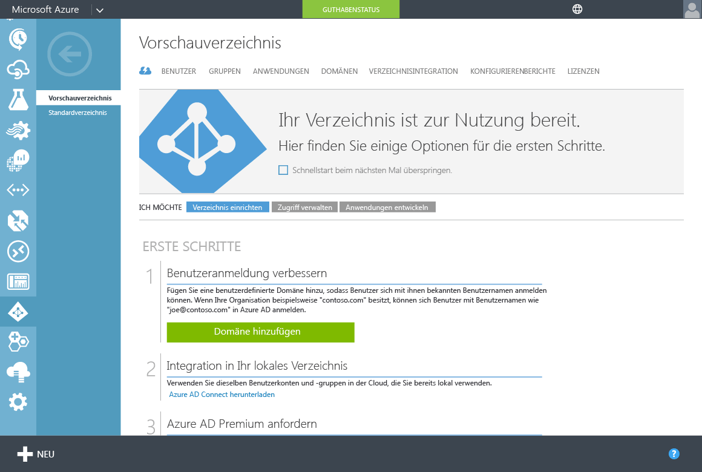
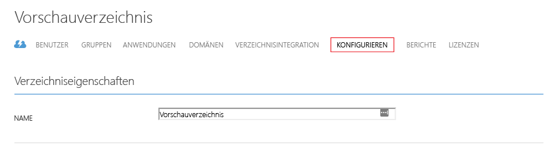
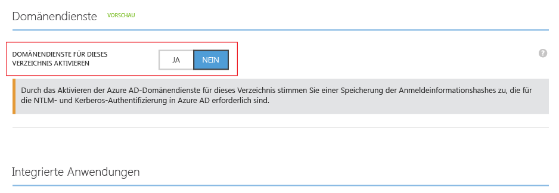
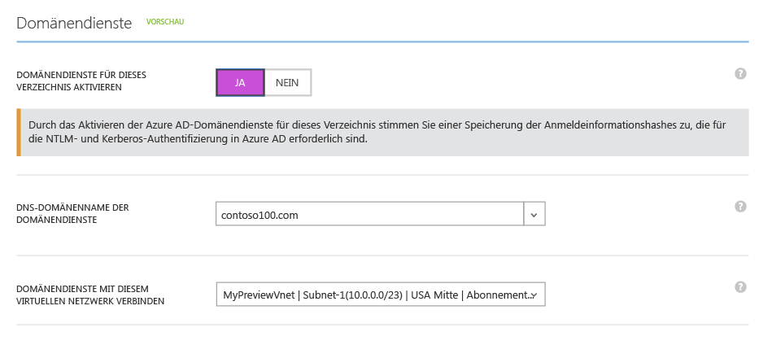
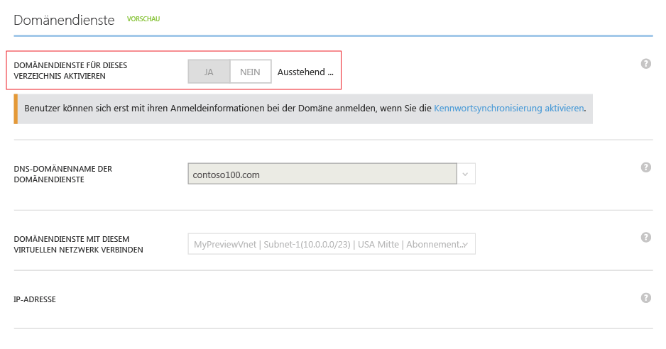
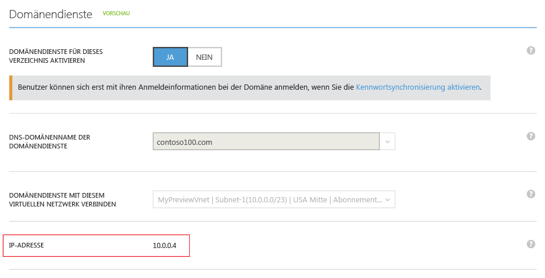
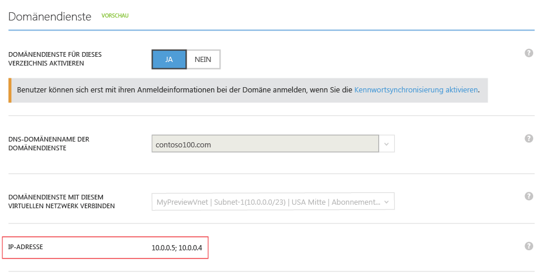

<properties
	pageTitle="Azure AD-Domänendienste: Aktivieren der Azure AD-Domänendienste | Microsoft Azure"
	description="Erste Schritte mit Azure Active Directory-Domänendiensten (Vorschau)"
	services="active-directory-ds"
	documentationCenter=""
	authors="mahesh-unnikrishnan"
	manager="stevenpo"
	editor="curtand"/>

<tags
	ms.service="active-directory-ds"
	ms.workload="identity"
	ms.tgt_pltfrm="na"
	ms.devlang="na"
	ms.topic="get-started-article"
	ms.date="07/06/2016"
	ms.author="maheshu"/>

# Azure AD-Domänendienste *(Vorschau)* – Aktivieren der Azure AD-Domänendienste

## Aufgabe 3: Aktivieren der Azure AD-Domänendienste
In dieser Aufgabe aktivieren Sie Azure AD-Domänendienste für Ihr Verzeichnis. Führen Sie die folgenden Konfigurationsschritte aus, um Azure AD-Domänendienste für Ihr Verzeichnis zu aktivieren.

1. Navigieren Sie zum **klassischen Azure-Portal** ([https://manage.windowsazure.com](https://manage.windowsazure.com)).

2. Wählen Sie den Knoten **Active Directory** im linken Bereich aus.

3. Wählen Sie den Azure AD-Mandanten (Verzeichnis) aus, für den Sie Azure AD-Domänendienste aktivieren möchten.

    

4. Klicken Sie auf die Registerkarte **Konfigurieren**.

    

5. Scrollen Sie hinunter zum Abschnitt **Domänendienste**.

    

6. Schalten Sie die Option **Domänendienste für dieses Verzeichnis aktivieren** auf **JA**. Es werden einige weitere Konfigurationsoptionen für Azure AD-Domänendienste auf der Seite angezeigt.

    

    > [AZURE.NOTE] Wenn Sie Azure AD-Domänendienste für Ihren Mandanten aktivieren, generiert und speichert Azure AD die erforderlichen Hashwerte für die Kerberos- und NTLM-Anmeldeinformationen zum Authentifizieren von Benutzern.

7. Geben Sie einen Wert für **DNS-Domänenname der Domänendienste** an.

   - Standardmäßig ist der Standarddomänenname des Verzeichnisses (d. h. mit dem Domänensuffix **.onmicrosoft.com**) ausgewählt.

   - Die Liste enthält alle Domänen, die für Ihr Azure AD-Verzeichnis konfiguriert wurden, einschließlich überprüfter und nicht überprüfter Domänen, die Sie auf der Registerkarte „Domänen“ konfigurieren.

   - Außerdem können Sie durch eine entsprechende Eingabe einen benutzerdefinierten Domänennamen zu dieser Liste hinzufügen. In diesem Beispiel haben wir den benutzerdefinierten Domänennamen „contoso100.com“ eingegeben.

     > [AZURE.WARNING] Stellen Sie sicher, dass das Domänenpräfix des angegebenen Domänennamens (z.B. „contoso100“ im Domänennamen „contoso100.com“) weniger als 15 Zeichen lang ist. Das Erstellen von Azure Active Directory-Domänendienste-Domänen mit einem Domänenpräfix von mehr als 15 Zeichen ist nicht möglich.

8. Im nächsten Schritt wird ein virtuelles Netzwerk ausgewählt, in dem Azure AD-Domänendienste verfügbar sein soll. Wählen Sie das soeben erstellte virtuelle Netzwerk in der Dropdownliste mit der Bezeichnung **Domänendienste mit diesem virtuellen Netzwerk verbinden** aus.

   - Stellen Sie sicher, dass das angegebene virtuelle Netzwerk zu einer Azure-Region gehört, die von Azure AD-Domänendienste unterstützt wird.

   - Informationen zu den Azure-Regionen, in denen Azure AD-Domänendienste verfügbar sind, finden Sie unter [Azure-Dienste nach Region](https://azure.microsoft.com/regions/#services/).

   - Beachten Sie, dass virtuelle Netzwerke, die zu einer Region gehören, in der Azure AD-Domänendienste nicht unterstützt werden, nicht in der Dropdownliste angezeigt werden.

   - Virtuelle Netzwerke, die mit dem Azure Resource Manager (ARM-basierte virtuelle Netzwerke) erstellt wurden, erscheinen ebenfalls nicht in der Dropdownliste. Das liegt daran, dass ARM-basierte virtuelle Netzwerken derzeit nicht von Azure AD-Domänendiensten unterstützt werden.

9. Stellen Sie sicher, dass der DNS-Domänenname, den Sie für die verwaltete Domäne ausgewählt haben, nicht bereits im virtuellen Netzwerk vorhanden ist. Dies kann in folgenden Szenarien auftreten:

   - Wenn Sie bereits eine Domäne mit dem gleichen DNS-Domänennamen im virtuellen Netzwerk besitzen.

   - Wenn zwischen dem ausgewählten virtuellen Netzwerk und Ihrem lokalen Netzwerk eine VPN-Verbindung besteht und Sie eine Domäne mit dem gleichen DNS-Domänennamen in Ihrem lokalen Netzwerk besitzen.

   - Wenn ein Clouddienst mit dem Namen im virtuellen Netzwerk vorhanden ist.

10. Wenn Sie die obigen Optionen ausgewählt haben, klicken Sie im Aufgabenbereich am unteren Rand der Seite auf **Speichern**, um Azure AD-Domänendienste zu aktivieren.

11. Auf der Seite wird der Status "Ausstehend" angezeigt, während Azure AD-Domänendienste für das Verzeichnis aktiviert wird.

    

    > [AZURE.NOTE] Azure AD-Domänendienste bietet eine hohe Verfügbarkeit für Ihre verwaltete Domäne. Wenn Sie Azure AD-Domänendienste für Ihre Domäne erstmalig aktivieren, werden die IP-Adressen, unter denen Domänendienste im virtuellen Netzwerk verfügbar ist, nacheinander angezeigt. Die zweite IP-Adresse wird angezeigt, sobald der Dienst hohe Verfügbarkeit für Ihre Domäne aktiviert. Wenn hohe Verfügbarkeit für Ihre Domäne konfiguriert und aktiv ist, sollten im Abschnitt **Domänendienste** der Registerkarte **Konfigurieren** zwei IP-Adressen angezeigt werden.

12. Nach ungefähr 20 bis 30 Minuten wird im Feld **IP-Adresse** auf der Seite **Konfigurieren** die erste IP-Adresse angezeigt, unter der Domänendienste in Ihrem virtuellen Netzwerk verfügbar ist.

    

13. Wenn hohe Verfügbarkeit für Ihre Domäne funktionsfähig ist, werden auf der Seite zwei IP-Adressen angezeigt. Dies sind die IP-Adressen, unter denen Azure AD-Domänendienste im ausgewählten virtuellen Netzwerk verfügbar ist. Notieren Sie sich diese IP-Adressen, damit Sie die DNS-Einstellungen für Ihr virtuelles Netzwerk aktualisieren können. Mit diesem Schritt können virtuelle Computer im virtuellen Netzwerk eine Verbindung mit der Domäne für Vorgänge wie Domänenbeitritt herstellen.

    

> [AZURE.NOTE] Abhängig von der Größe Ihres Azure AD-Verzeichnisses (Anzahl der Benutzer, Gruppen usw.) dauert es eine Weile, bis der Inhalt des Verzeichnisses in Azure AD-Domänendienste verfügbar ist. Diese Synchronisation erfolgt im Hintergrund. Bei großen Verzeichnissen mit Zehntausenden von Objekten kann es möglicherweise ein oder zwei Tage dauern, bis alle Benutzer, Gruppenmitgliedschaften und Anmeldeinformationen synchronisiert wurden und in Azure AD-Domänendienste verfügbar sind.

 

## Aufgabe 4: Aktualisieren der DNS-Einstellungen für das virtuelle Azure-Netzwerk
Die nächste Konfigurationsaufgabe besteht in der [Aktualisierung der DNS-Einstellungen für das virtuelle Azure-Netzwerk](active-directory-ds-getting-started-dns.md).

<!---HONumber=AcomDC_0706_2016--->