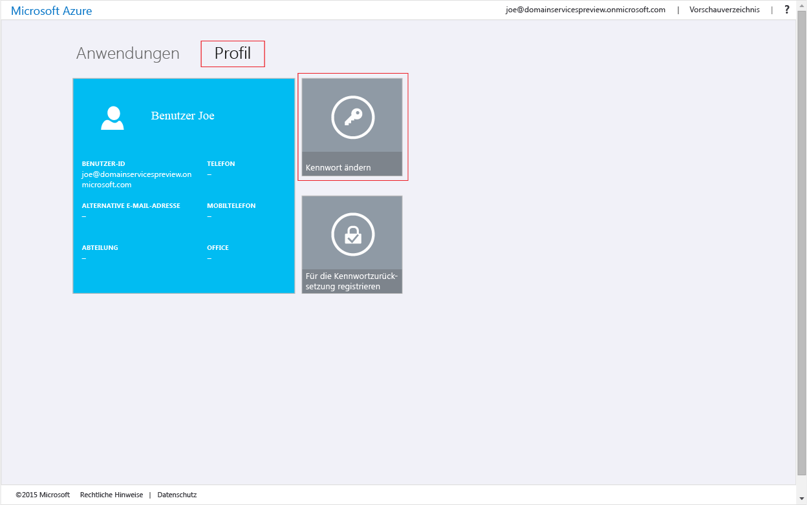
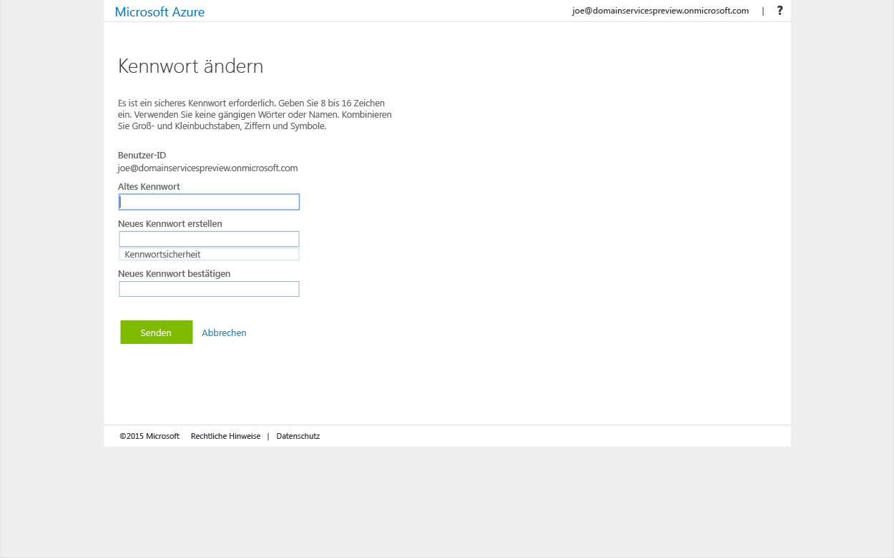

<properties
	pageTitle="Azure AD-Domänendienste: Aktivieren der Kennwortsynchronisierung | Microsoft Azure"
	description="Erste Schritte mit Azure Active Directory-Domänendiensten"
	services="active-directory-ds"
	documentationCenter=""
	authors="mahesh-unnikrishnan"
	manager="stevenpo"
	editor="curtand"/>

<tags
	ms.service="active-directory-ds"
	ms.workload="identity"
	ms.tgt_pltfrm="na"
	ms.devlang="na"
	ms.topic="get-started-article"
	ms.date="09/20/2016"
	ms.author="maheshu"/>

# Aktivieren der Kennwortsynchronisierung für Azure AD-Domänendienste
Im Rahmen der obigen Aufgaben haben Sie Azure AD-Domänendienste für Ihren Azure AD-Mandanten aktiviert. Die nächste Aufgabe besteht darin, für die Hashes von Anmeldeinformationen, die für die NTLM- und Kerberos-Authentifizierung erforderlich sind, die Synchronisierung mit Azure AD-Domänendiensten zu ermöglichen. Nach der Einrichtung der Synchronisierung von Anmeldeinformationen können sich Benutzer mit ihren Unternehmensanmeldeinformationen an der verwalteten Domäne anmelden.

Die einzelnen Schritte unterscheiden sich in Abhängigkeit davon, ob Ihre Organisation über einen auf die Cloud beschränkten Azure AD-Mandanten verfügt oder ob die Synchronisierung mit Ihrem lokalen Verzeichnis über Azure AD Connect erfolgt.

 

> [AZURE.SELECTOR]
- [Auf die Cloud beschränkter Azure AD-Mandant](active-directory-ds-getting-started-password-sync.md)
- [Synchronisierter Azure AD-Mandant](active-directory-ds-getting-started-password-sync-synced-tenant.md)

 

## Aufgabe 5: Aktivieren der Kennwortsynchronisierung für AAD-Domänendienste bei einem auf die Cloud beschränkten Azure AD-Mandanten
Für Azure AD-Domänendienste müssen Hashes von Anmeldeinformationen in einem für die NTLM- und Kerberos-Authentifizierung geeigneten Format vorliegen, um Benutzer für die verwaltete Domäne authentifizieren zu können. Wenn Sie AAD-Domänendienste für Ihren Mandanten nicht aktivieren, generiert oder speichert Azure AD keine Hashes für Anmeldeinformationen in dem Format, das für die NTLM- oder Kerberos-Authentifizierung erforderlich ist. Aus Sicherheitsgründen werden Anmeldeinformationen von Azure AD natürlich auch nicht als Klartext gespeichert. Daher gibt es in Azure AD keine Option zum Generieren dieser Hashes von NTLM- oder Kerberos-Anmeldeinformationen basierend auf den vorhandenen Anmeldeinformationen von Benutzern.

> [AZURE.NOTE] Wenn Ihr Unternehmen über einen auf die Cloud beschränkten Azure AD-Mandanten verfügt, müssen Benutzer, die Azure Active Directory-Domänendienste verwenden, ihre Kennwörter ändern.

Diese Kennwortänderung führt dazu, dass die Anmeldeinformationshashes, die von den Azure AD-Domänendiensten für die Kerberos- und NTLM-Authentifizierung benötigt werden, in Azure AD generiert werden. Sie können entweder die Kennwörter für alle Benutzer im Mandanten ablaufen lassen, die Azure AD-Domänendienste verwenden müssen, oder diese Benutzer zum Ändern ihrer Kennwörter anweisen.

### Aktivieren der Hashgenerierung für NTLM- und Kerberos-Anmeldeinformationen für einen auf die Cloud beschränkten Azure AD-Mandanten
Hier ist die Anleitung angegeben, die Ihre Endbenutzer zum Ändern ihrer Kennwörter benötigen:

1. Navigieren Sie unter [http://myapps.microsoft.com](http://myapps.microsoft.com) zur Seite mit dem Azure AD-Zugriffsbereich Ihres Unternehmens.

2. Wählen Sie auf dieser Seite die Registerkarte **Profil**.

3. Klicken Sie auf dieser Seite auf die Kachel **Kennwort ändern**.

    

    > [AZURE.NOTE] Falls die Option **Kennwort ändern** auf der Seite mit dem Zugriffsbereich nicht angezeigt wird, sollten Sie überprüfen, ob für Ihr Unternehmen die [Kennwortverwaltung in Azure AD](../active-directory/active-directory-passwords-getting-started.md) konfiguriert wurde.

4. Geben Sie auf der Seite **Kennwort ändern** Ihr vorhandenes (altes) Kennwort und dann ein neues Kennwort und die Kennwortbestätigung ein. Klicken Sie auf **Senden**.

    

Nachdem Sie Ihr Kennwort geändert haben, kann das neue Kennwort bald in den Azure AD-Domänendiensten verwendet werden. Nach einigen Minuten (normalerweise ca. 20 Minuten) können Sie sich mit dem neuen Kennwort an Computern in der verwalteten Domäne anmelden.

 

## Verwandte Inhalte

- [Aktualisieren Ihres eigenen Kennworts](../active-directory/active-directory-passwords-update-your-own-password.md)

- [Erste Schritte mit der Kennwortverwaltung in Azure AD](../active-directory/active-directory-passwords-getting-started.md)

- [Aktivieren der Kennwortsynchronisierung für AAD-Domänendienste bei einem synchronisierten Azure AD-Mandanten](active-directory-ds-getting-started-password-sync-synced-tenant.md)

- [Verwalten einer durch Azure AD-Domänendienste verwalteten Domäne](active-directory-ds-admin-guide-administer-domain.md)

- [Einbinden eines virtuellen Windows-Computers in eine verwaltete Domäne der Azure AD-Domänendienste](active-directory-ds-admin-guide-join-windows-vm.md)

- [Einbinden eines virtuellen Red Hat Enterprise Linux-Computers in eine verwaltete Domäne der Azure AD-Domänendienste](active-directory-ds-admin-guide-join-rhel-linux-vm.md)

<!----HONumber=AcomDC_0921_2016-->