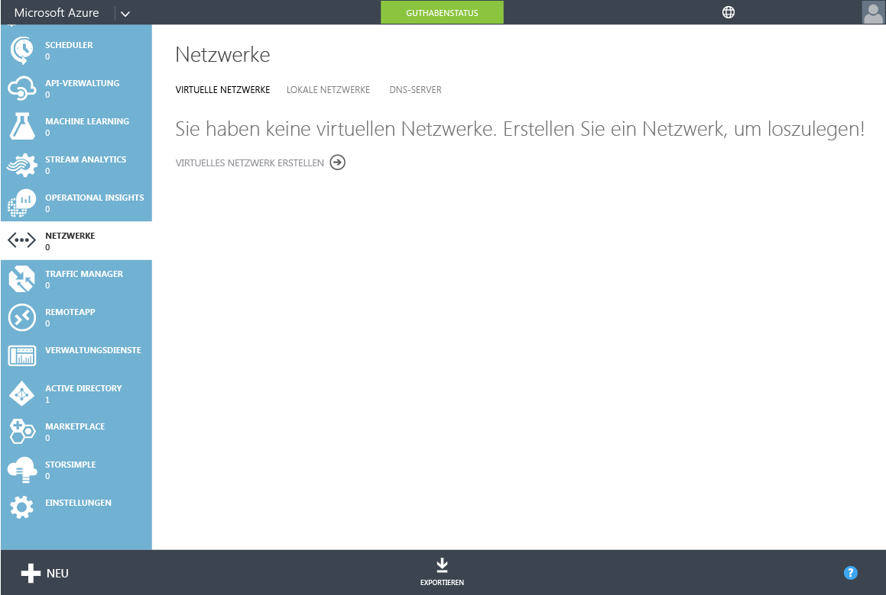
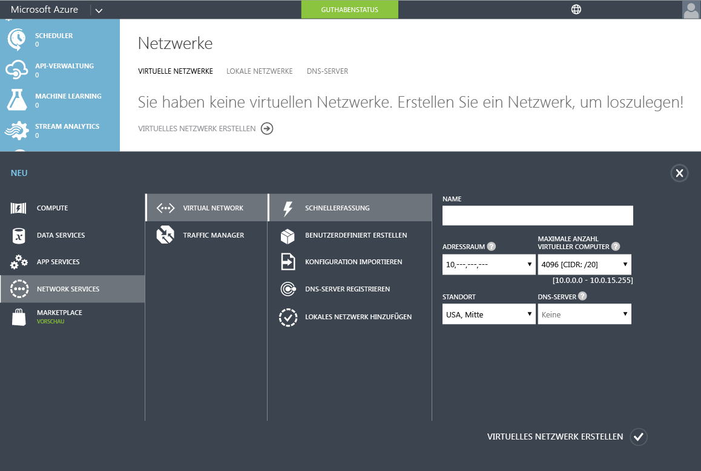
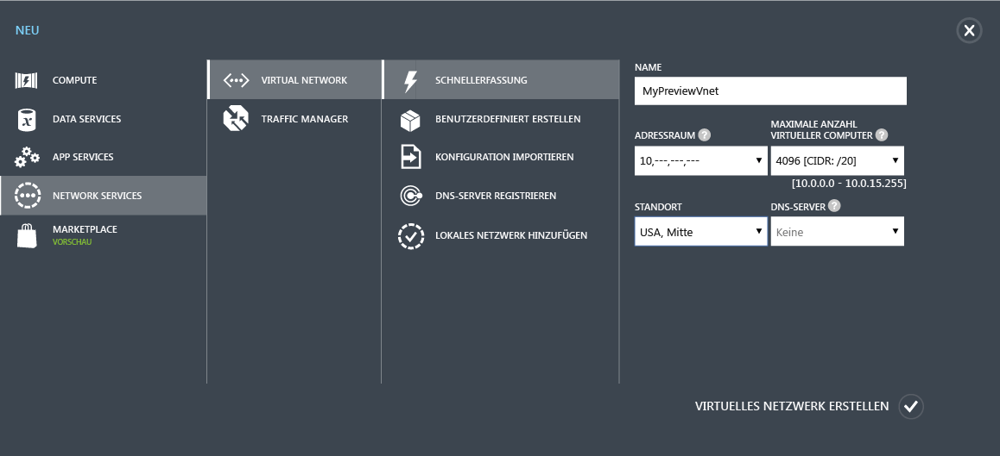
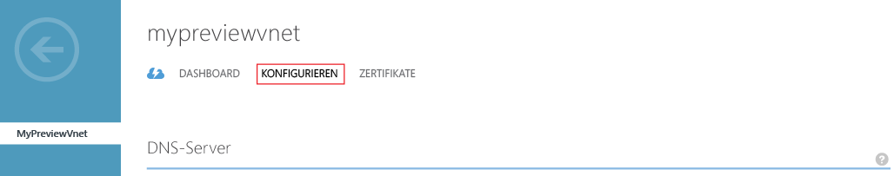

# Erstellen oder Auswählen eines virtuellen Netzwerks für Azure Active Directory Domain Services

> [!IMPORTANT]
> Die in diesem Artikel gezeigte klassische Azure-Portal-Benutzeroberfläche zum Aktivieren von Azure Active Directory Domain Services wird bald entfernt. Verwenden Sie bei neuen Bereitstellungen die [**neue Azure-Portal-Benutzeroberfläche (Vorschauversion)**](active-directory-ds-getting-started.md).
>

## Voraussetzungen
Informationen finden Sie unter [Netzwerkaspekte für die Azure Active Directory Domain Services](active-directory-ds-networking.md).

## Aufgabe 2: Erstellen eines virtuellen Azure-Netzwerks
Die nächste Konfigurationsaufgabe besteht in der Erstellung eines virtuellen Azure-Netzwerks und eines dazugehörigen Subnetzes. Azure Active Directory Domain Services wird dann in diesem Subnetz Ihres virtuellen Netzwerks aktiviert. Wenn Sie über ein vorhandenes virtuelles Netzwerk verfügen, das Sie verwenden möchten, können Sie diesen Schritt überspringen.

> [!NOTE]
> Stellen Sie sicher, dass das virtuelle Azure-Netzwerk, das Sie für Azure Active Directory Domain Services erstellen oder verwenden möchten, einer Azure-Region angehört, die von Azure Active Directory Domain Services unterstützt wird. Unter [Azure-Dienste nach Region](https://azure.microsoft.com/regions/#services/) erfahren Sie, in welchen Azure-Regionen Azure Active Directory Domain Services verfügbar sind.
>
>Notieren Sie sich den Namen des virtuellen Netzwerks, um sicherzustellen, dass Sie das richtige virtuelle Netzwerk auswählen, wenn Sie Azure Active Directory Domain Services in einem nachfolgenden Konfigurationsschritt aktivieren.

Befolgen Sie diese Konfigurationsanleitung, um ein virtuelles Azure-Netzwerk zu erstellen, in dem Sie Azure Active Directory Domain Services aktivieren möchten:

1. Wechseln Sie zum [klassischen Azure-Portal](https://manage.windowsazure.com).
2. Klicken Sie im linken Bereich auf **Netzwerke**.

      
    Das Fenster **Virtuelle Netzwerke** wird geöffnet.
3. Klicken Sie im Aufgabenbereich unten im Fenster auf **Neu**.

    
4. Klicken Sie auf **Network Services**, und wählen Sie dann die Option **Virtuelles Netzwerk**.

    
5. Klicken Sie zum Erstellen eines virtuellen Netzwerks auf **Schnellerstellung**.

6. Geben Sie einen **Namen** für Ihr virtuelles Netzwerk ein. Sie haben dann folgende Möglichkeiten:
    * Optional können Sie den **Adressraum** oder die **maximale Anzahl virtueller Computer** für dieses Netzwerk konfigurieren.
    * Sie können für die Einstellung **DNS-Server** vorerst die Option **Kein** beibehalten. Nach dem Aktivieren von Azure Active Directory Domain Services können Sie die Einstellung aktualisieren.
7. Wählen Sie in der Dropdownliste **Standort** eine unterstützte Azure-Region aus.  
    Informationen dazu, in welchen Azure-Regionen Azure Active Directory Domain Services verfügbar sind, finden Sie unter [Azure-Dienste nach Region](https://azure.microsoft.com/regions/#services/).
8. Klicken Sie auf **Virtuelles Netzwerk erstellen**, um das virtuelle Netzwerk zu erstellen.

    
9. Wählen Sie nach dem Erstellen eines virtuellen Netzwerks den Namen des virtuellen Netzwerks aus, und klicken Sie dann auf die Registerkarte **Konfigurieren**.

    
10. Klicken Sie unter **Adressräume von Virtual Network** auf **Subnetz hinzufügen**, und geben Sie dann ein Subnetz mit dem Namen **AaddsSubnet** an.

    

11. Klicken Sie zum Erstellen des Subnetzes auf **Speichern**.

## Nächster Schritt
[Aufgabe 3: Aktivieren von Azure Active Directory Domain Services](active-directory-ds-getting-started-enableaadds.md)

