<properties
	pageTitle="Active Directory-Verbunddienste in Azure | Microsoft Azure"
	description="In diesem Dokument wird beschrieben, wie Sie AD FS in Azure bereitstellen, um eine hohe Verfügbarkeit zu erzielen."
    keywords="AD FS in Azure bereitstellen, Azure ADFS bereitstellen, Azure ADFS, Azure AD FS, ADFS bereitstellen, AD FS bereitstellen, ADFS in Azure, ADFS in Azure bereitstellen, AD FS in Azure bereitstellen , ADFS Azure, Einführung in AD FS, Azure, AD FS in Azure, IaaS, ADFS, ADFS in Azure verschieben"
	services="active-directory"
	documentationCenter=""
	authors="anandyadavmsft"
	manager="femila"
	editor=""/>

<tags
	ms.service="active-directory"
	ms.workload="identity"
	ms.tgt_pltfrm="na"
	ms.devlang="na"
	ms.topic="get-started-article"
	ms.date="07/13/2016"
	ms.author="anandy;billmath"/>

# AD FS-Bereitstellung in Azure 

AD FS verfügt über Funktionen für den vereinfachten, geschützten Identitätsverbund und die einmalige Webanmeldung (SSO). Der Verbund mit Azure AD oder O365 ermöglicht Benutzern die Authentifizierung mit lokalen Anmeldeinformationen und den Zugriff auf Ressourcen in der Cloud. Daher ist es wichtig, dass eine hoch verfügbare AD FS-Infrastruktur vorhanden ist, um den Zugriff auf lokale Ressourcen und Ressourcen in der Cloud sicherzustellen. Durch die Bereitstellung von AD FS in Azure kann die erforderliche hohe Verfügbarkeit mit wenig Aufwand erzielt werden. Die Bereitstellung von AD FS in Azure hat mehrere Vorteile, von denen hier einige aufgeführt sind:

* **Hohe Verfügbarkeit**: Mit der Leistungsfähigkeit von Azure-Verfügbarkeitsgruppen sorgen Sie für eine hoch verfügbare Infrastruktur.
* **Einfache Skalierung**: Benötigen Sie eine höhere Leistung? Sie können die Migration zu leistungsfähigeren Computern in Azure leicht mit nur wenigen Klicks durchführen.
* **Standortübergreifende Redundanz**: Mit der geografischen Redundanz von Azure können Sie sicher sein, dass Ihre Infrastruktur weltweit eine hohe Verfügbarkeit aufweist.
* **Einfache Verwaltung**: Dank der stark vereinfachten Verwaltungsfunktionen im Azure-Portal ist die Verwaltung der Infrastruktur sehr einfach und problemlos.

## Entwurfsprinzipien

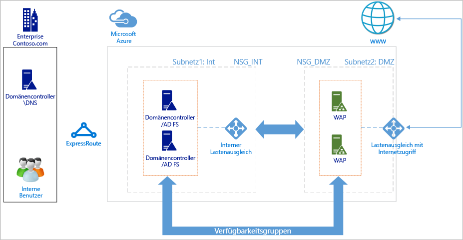

Im obigen Diagramm ist die empfohlene grundlegende Topologie dargestellt, mit der Sie die Bereitstellung Ihrer AD FS-Infrastruktur in Azure beginnen können. Die Prinzipien hinter den verschiedenen Komponenten der Topologie sind unten angegeben:

* **DC/AD FS-Server**: Wenn Sie weniger als 1.000 Benutzer haben, können Sie die AD FS-Rolle einfach auf Ihren Domänencontrollern installieren. Wenn Sie Leistungsbeeinträchtigungen für die Domänencontroller ausschließen möchten oder mehr als 1.000 Benutzer haben, können Sie AD FS auf separaten Servern bereitstellen.
* **WAP-Server**: Webanwendungsproxy-Server müssen so bereitgestellt werden, dass die Benutzer AD FS auch erreichen können, wenn sie sich nicht im Unternehmensnetzwerk befinden.
* **DMZ**: Die Webanwendungsproxy-Server werden in der DMZ angeordnet, und NUR der TCP/443-Zugriff ist zwischen der DMZ und dem internen Subnetz zulässig.
* **Load Balancers**: Zur Sicherstellung einer hohen Verfügbarkeit von AD FS- und Webanwendungsproxy-Servern empfehlen wir die Verwendung eines internen Load Balancers für AD FS-Server und von Azure Load Balancer für Webanwendungsproxy-Server.
* **Verfügbarkeitsgruppen**: Zur Sicherstellung der Redundanz für die AD FS-Bereitstellung wird empfohlen, zwei oder mehr virtuelle Computer für ähnliche Workloads in einer Verfügbarkeitsgruppe zu gruppieren. Durch diese Konfiguration wird sichergestellt, dass während eines geplanten oder ungeplanten Wartungsereignisses mindestens ein virtueller Computer verfügbar ist.
* **Speicherkonten**: Es wird empfohlen, zwei Speicherkonten zu verwenden. Die Verwendung von nur einem Speicherkonto kann zur Schaffung einer einzelnen Fehlerquelle führen und bewirken, dass die Bereitstellung in dem unwahrscheinlichen Fall, dass das Speicherkonto ausfällt, nicht mehr verfügbar ist. Bei zwei Speicherkonten kann jedem Fehlerpunkt ein Speicherkonto zugeordnet werden.
* **Netzwerktrennung**: Webanwendungsproxy-Server sollten in einem separaten DMZ-Netzwerk bereitgestellt werden. Sie können ein virtuelles Netzwerk in zwei Subnetze unterteilen und Webanwendungsproxy-Server dann in einem isolierten Subnetz bereitstellen. Sie können die Netzwerksicherheitsgruppen-Einstellungen für jedes Subnetz leicht konfigurieren und zwischen den beiden Subnetzen nur die erforderliche Kommunikation zulassen. Weitere Details sind unten jeweils für die einzelnen Bereitstellungsszenarien angegeben.

##Schritte zum Bereitstellen von AD FS in Azure

Mit den Schritten dieser Anleitung wird die unten dargestellte AD FS-Infrastruktur in Azure bereitgestellt.

### 1\. Bereitstellen des Netzwerks

Wie oben beschrieben, können Sie entweder zwei Subnetze in einem einzelnen virtuellen Netzwerk oder zwei gänzlich unterschiedliche virtuelle Netzwerke (VNet) erstellen. In diesem Artikel geht es um die Bereitstellung eines einzelnen virtuellen Netzwerks und die Unterteilung in zwei Subnetze. Dies ist derzeit ein einfacherer Ansatz, da bei zwei separaten VNets ein VNet-zu-VNet-Gateway für die Kommunikation erforderlich wäre.

**1.1 Erstellen eines virtuellen Netzwerks**

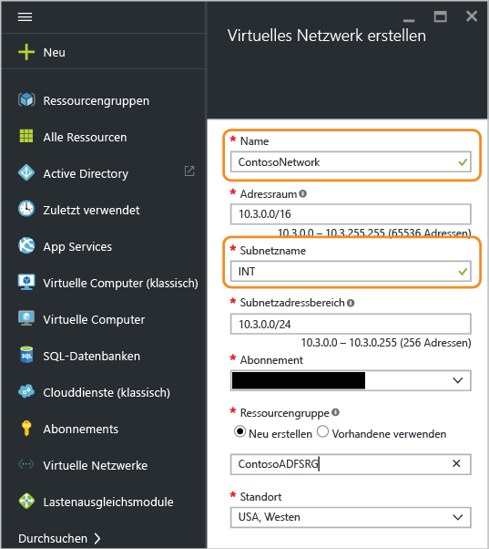
	
Wählen Sie im Azure-Portal die Option „Virtuelles Netzwerk“. Sie können das virtuelle Netzwerk und ein Subnetz sofort mit nur einem Klick bereitstellen. Das INT-Subnetz wird ebenfalls definiert, und diesem Subnetz können VMs hinzugefügt werden. Der nächste Schritt ist das Hinzufügen eines weiteren Subnetzes zum Netzwerk, nämlich des DMZ-Subnetzes. Gehen Sie wie folgt vor, um das DMZ-Subnetz zu erstellen:

* Wählen Sie das neu erstellte Netzwerk aus.
* Wählen Sie in den Eigenschaften die Option „Subnetz“.
* Klicken Sie im Bereich „Subnetz“ auf die Schaltfläche „Hinzufügen“.
* Geben Sie den Subnetznamen und die Adressrauminformationen an, um das Subnetz zu erstellen.

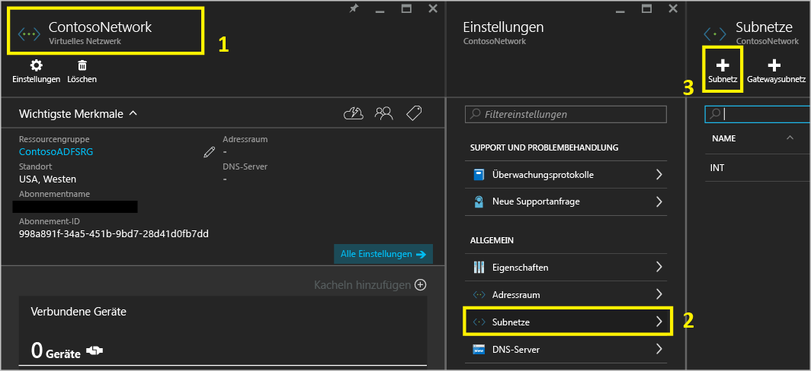

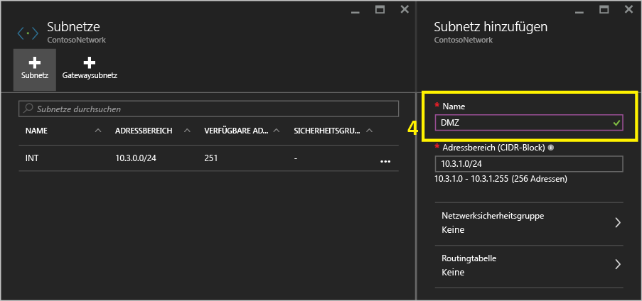

**1.2. Erstellen der Netzwerksicherheitsgruppen**

Eine Netzwerksicherheitsgruppe (NSG) enthält eine Zugriffssteuerungsliste (Access Control List, ACL) zum Zulassen oder Verweigern von Netzwerkdatenverkehr an Ihre VM-Instanzen in einem virtuellen Netzwerk. NSGs können Subnetzen oder einzelnen VM-Instanzen innerhalb dieses Subnetzes zugeordnet werden. Wenn eine NSG einem Subnetz zugeordnet ist, gelten die ACL-Regeln für alle VM-Instanzen in diesem Subnetz. In dieser Anleitung erstellen wir zwei NSGs: jeweils eine für ein internes Netzwerk und eine DMZ. Sie erhalten die Namen NSG\_INT und NSG\_DMZ.

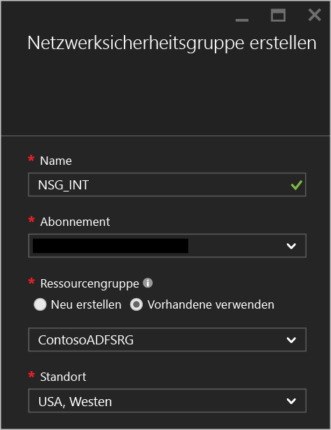

Nach der Erstellung der NSG sind 0 eingehende und 0 ausgehende Regeln vorhanden. Nachdem die Rollen auf den entsprechenden Servern installiert wurden und betriebsbereit sind, können die eingehenden und ausgehenden Regeln gemäß der gewünschten Sicherheitsebene eingerichtet werden.

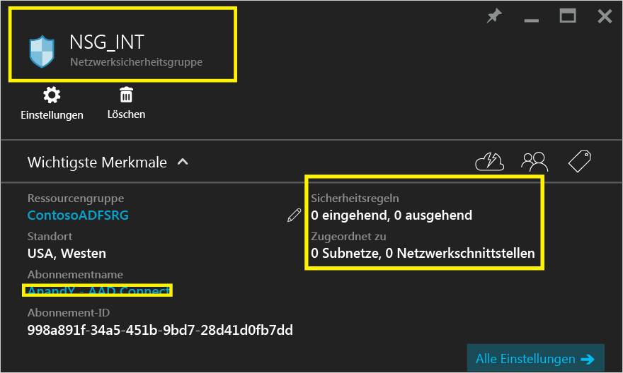

Ordnen Sie nach der NSG-Erstellung NSG\_INT dem Subnetz INT und NSG\_DMZ dem Subnetz DMZ zu. Unten ist ein Screenshot mit einem Beispiel angegeben:

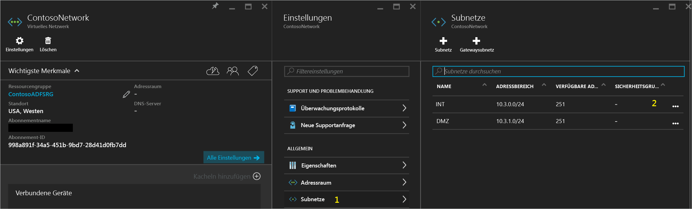

* Klicken Sie auf „Subnetze“, um den Bereich für Subnetze zu öffnen.
* Wählen Sie das Subnetz aus, das Sie der NSG zuordnen möchten.

Nach der Konfiguration sollte der Bereich für Subnetze wie folgt aussehen:

**1.3. Erstellen einer Verbindung mit einem lokalen Ort**

Wir benötigen eine Verbindung mit einem lokalen Ort, um den Domänencontroller (DC) in Azure bereitzustellen. Azure verfügt über verschiedene Verbindungsoptionen, um für Ihre lokale Infrastruktur eine Verbindung mit der Azure-Infrastruktur herzustellen.

* Punkt-zu-Standort
* Standort-zu-Standort für virtuelle Netzwerke
* ExpressRoute

Es wird empfohlen, ExpressRoute zu verwenden. ExpressRoute ermöglicht Ihnen das Herstellen privater Verbindungen zwischen Azure-Datencentern und einer Infrastruktur, die sich bei Ihnen vor Ort oder in einer Datenzusammenstellungsumgebung befindet. ExpressRoute-Verbindungen verlaufen nicht über das öffentliche Internet. Sie bieten mehr Zuverlässigkeit, eine höhere Geschwindigkeit, niedrigere Latenzzeiten und mehr Sicherheit als herkömmliche Verbindungen über das Internet. Die Verwendung von ExpressRoute wird zwar empfohlen, aber Sie können eine beliebige Verbindungsmethode wählen, die für Ihr Unternehmen am besten geeignet ist. Weitere Informationen zu ExpressRoute und den verschiedenen Verbindungsoptionen mit ExpressRoute finden Sie unter [ExpressRoute – Technische Übersicht](https://aka.ms/Azure/ExpressRoute).

### 2\. Erstellen von Speicherkonten

Sie können zwei Speicherkonten erstellen, um für eine hohe Verfügbarkeit zu sorgen und die Abhängigkeit von einem einzelnen Speicherkonto zu vermeiden. Teilen Sie die Computer in jeder Verfügbarkeitsgruppe in zwei Gruppen, und weisen Sie jeder Gruppe dann ein separates Speicherkonto zu. Beachten Sie hierbei, dass Ihnen nur die tatsächliche Nutzung des Speichers berechnet wird.

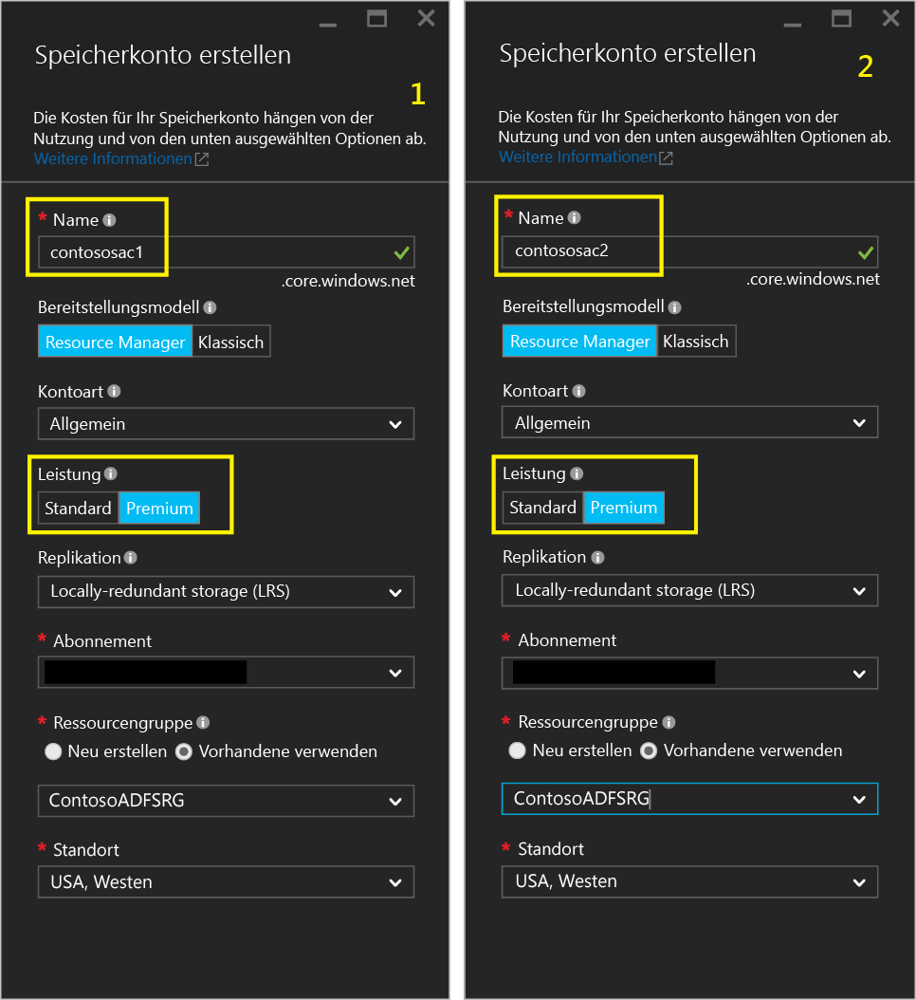

### 3\. Erstellen von Verfügbarkeitsgruppen

Erstellen Sie für jede Rolle (DC/AD FS und WAP) Verfügbarkeitsgruppen, die jeweils mindestens zwei Computer enthalten. So erzielen Sie für jede Rolle ein höhere Verfügbarkeit. Beim Erstellen der Verfügbarkeitsgruppen ist es sehr wichtig, Entscheidungen zu den folgenden Komponenten zu treffen:
* **Fehlerdomänen**: Virtuelle Computer einer Fehlerdomäne nutzen dieselbe Stromquelle und denselben physischen Netzwerkswitch. Mindestens zwei Fehlerdomänen werden empfohlen. Der Standardwert ist 3. Sie können ihn für diese Bereitstellung beibehalten.
* **Updatedomänen**: Computer, die derselben Updatedomäne angehören, werden während eines Updates zusammen neu gestartet. Es wird empfohlen, mindestens zwei Updatedomänen zu verwenden. Der Standardwert ist 5. Sie können ihn für diese Bereitstellung beibehalten.

Erstellen Sie die folgenden Verfügbarkeitsgruppen:

| Verfügbarkeitsgruppe | Rolle | Fehlerdomänen | Updatedomänen |
|:----------------:|:----:|:-----------:|:-----------|
| contosodcset | DC/ADFS | 3 | 5 |
| contosowapset | WAP | 3 | 5 |

### 4\. Bereitstellen von virtuellen Computern
Der nächste Schritt ist die Bereitstellung von virtuellen Computern, auf denen die verschiedenen Rollen in Ihrer Infrastruktur gehostet werden. Es wird empfohlen, in jeder Verfügbarkeitsgruppe mindestens zwei Computer zu verwenden. Erstellen Sie sechs virtuelle Computer für die grundlegende Bereitstellung.

| Computer | Rolle | Subnetz | Verfügbarkeitsgruppe | Speicherkonto | IP-Adresse |
|:-----:|:-----:|:-----:|:-----:|:-----:|:-----:|
|contosodc1|DC/ADFS|INT|contosodcset|contososac1|Statisch|
|contosodc2|DC/ADFS|INT|contosodcset|contososac2|Statisch|
|contosowap1|WAP|DMZ|contosowapset|contososac1|Statisch|
|contosowap2|WAP|DMZ|contosowapset|contososac2|Statisch|

Sie haben vielleicht bemerkt, dass keine NSG angegeben wurde. Dies liegt daran, dass Sie NSGs bei Azure auf Subnetzebene verwenden können. Anschließend können Sie den Computerdatenverkehr steuern, indem Sie die individuelle NSG verwenden, die entweder dem Subnetz oder dem NIC-Objekt zugeordnet ist. Weitere Informationen finden Sie unter [Was ist eine Netzwerksicherheitsgruppe (NSG)?](https://aka.ms/Azure/NSG). Eine statische IP-Adresse wird empfohlen, wenn Sie das DNS verwalten. Sie können auch Azure DNS verwenden und in den DNS-Einträgen für Ihre Domäne über die Azure FQDNs auf die neuen Computer verweisen. Nach Abschluss der Bereitstellung sollte der Bereich für virtuelle Computer wie folgt aussehen:

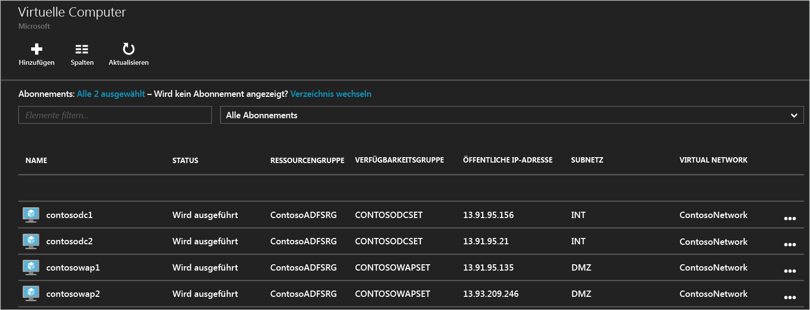

### 5\. Konfigurieren des Domänencontrollers/AD FS-Servers
 Um jede eingehende Anforderung authentifizieren zu können, muss AD FS mit dem Domänencontroller Kontakt aufnehmen. Es wird empfohlen, ein Replikat des Domänencontrollers in Azure bereitzustellen, um für die Authentifizierung den aufwändigen Weg von Azure zum lokalen DC zu vermeiden. Um eine hohe Verfügbarkeit zu erzielen, ist es ratsam, eine Verfügbarkeitsgruppe mit mindestens zwei Domänencontrollern zu erstellen.

|Domänencontroller|Rolle|Speicherkonto|
|:-----:|:-----:|:-----:|
|contosodc1|Replikat|contososac1|
|contosodc2|Replikat|contososac2|

* Stufen Sie die beiden Server als Replikatdomänencontroller mit DNS hoch.
* Konfigurieren Sie die AD FS-Server, indem Sie die AD FS-Rolle mit dem Server-Manager installieren.

###6\. Bereitstellen des internen Load Balancers (ILB)

**6.1. Erstellen des ILB**

Wählen Sie zum Bereitstellen eines ILB im Azure-Portal die Option „Lastenausgleichsmodule“, und klicken Sie auf „Hinzufügen“ (+).
>[AZURE.NOTE] Gehen Sie wie folgt vor, wenn **Lastenausgleichsmodule** nicht im Menü angezeigt wird. Klicken Sie unten links im Portal auf **Durchsuchen**, und scrollen Sie, bis **Lastenausgleichsmodule** eingeblendet wird. Klicken Sie auf den gelben Stern, um die Option dem Menü hinzuzufügen. Wählen Sie anschließend das neue Load Balancer-Symbol, um den Bereich zu öffnen und mit der Konfiguration des Load Balancers zu beginnen.

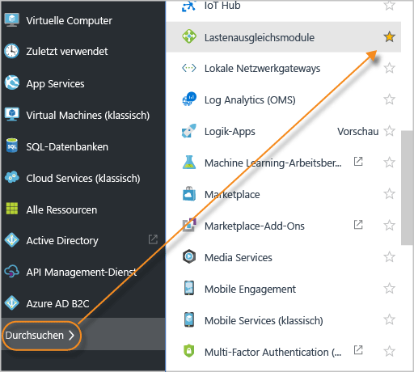

* **Name**: Geben Sie dem Load Balancer einen beliebigen passenden Namen.
* **Schema**: Wählen Sie „Intern“, da dieser Load Balancer vor den AD FS-Servern angeordnet wird und NUR für interne Netzwerkverbindungen bestimmt ist.
* **Virtuelles Netzwerk**: Wählen Sie das virtuelle Netzwerk aus, in dem Sie AD FS bereitstellen möchten.
* **Subnetz**: Wählen Sie hier das interne Subnetz aus.
* **IP-Adresszuweisung**: Wählen Sie „Dynamisch“.

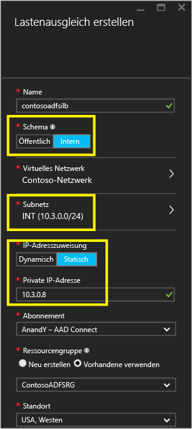
 
Nach dem Klicken auf „Erstellen“ und der Bereitstellung des ILB sollte er in der Liste mit den Load Balancern angezeigt werden:

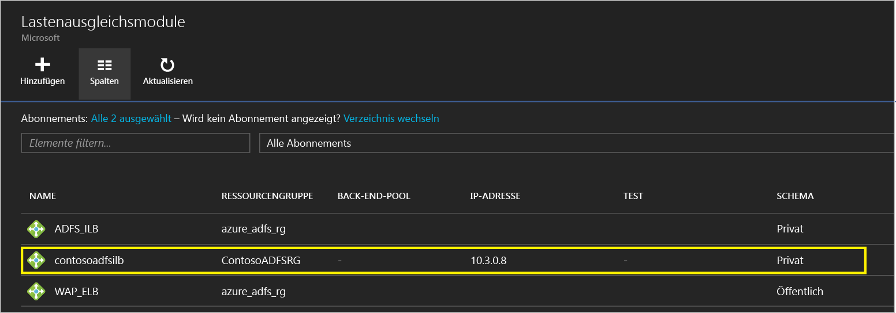
 
Der nächste Schritt ist das Konfigurieren des Back-End-Pools und Back-End-Tests.

**6.2. Konfigurieren des ILB-Back-End-Pools**

Wählen Sie den neu erstellten ILB im Bereich „Lastenausgleichsmodule“ aus. Der Bereich mit den Einstellungen wird geöffnet.
1.	Wählen Sie im Bereich „Einstellungen“ die Option „Back-End-Pools“.
2.	Klicken Sie im Bereich „Back-End-Pool“ auf „Virtuellen Computer hinzufügen“.
3.	Es wird ein Bereich angezeigt, in dem Sie eine Verfügbarkeitsgruppe auswählen können.
4.	Wählen Sie die AD FS-Verfügbarkeitsgruppe aus.

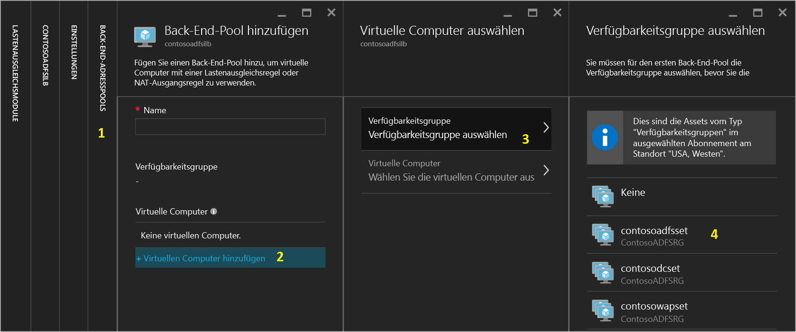
 
**6.3. Konfigurieren des Tests**

Wählen Sie im Bereich mit den ILB-Einstellungen die Option „Tests“.
1.	Klicken Sie auf „Hinzufügen“.
2.	Geben Sie die Details für den Test an. a. **Name**: Name des Tests. b. **Protokoll**: TCP. c. **Port**: 443 (HTTPS). d. **Intervall**: 5 (Standardwert). Dies ist das Intervall, nach dem der ILB die Computer im Back-End-Pool testet. e. **Unhealthy threshold limit** (Fehlerhafter Schwellenwert): 2 (Standardwert). Dies ist der Schwellenwert für aufeinanderfolgende fehlgeschlagene Tests, nach dem der ILB einen Computer im Back-End-Pool als nicht reagierend deklariert und keinen Datenverkehr mehr sendet.

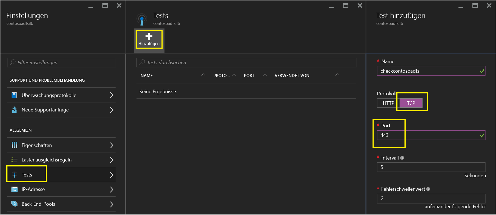
 
**6.4. Erstellen von Lastenausgleichsregeln**

Um den Datenverkehr effektiv ausgleichen zu können, sollte der ILB mit Lastenausgleichsregeln konfiguriert werden. Gehen Sie wie folgt vor, um eine Lastenausgleichsregel zu erstellen:
1.	Wählen Sie im Bereich „Einstellungen“ des ILB die Option „Lastenausgleichsregel“.
2.	Klicken Sie im Bereich „Lastenausgleichsregel“ auf „Hinzufügen“.
3.	Bereich „Lastenausgleichsregel hinzufügen“: **Name**: Geben Sie einen Namen für die Regel an. b. **Protokoll**: Wählen Sie „TCP“. c. **Port**: 443. d. **Back-End-Port**: 443. e. **Back-End-Pool**: Wählen Sie den Pool aus, den Sie zuvor für den AD FS-Cluster erstellt haben. f. **Test**: Wählen Sie den Test aus, den Sie zuvor für AD FS-Server erstellt haben.

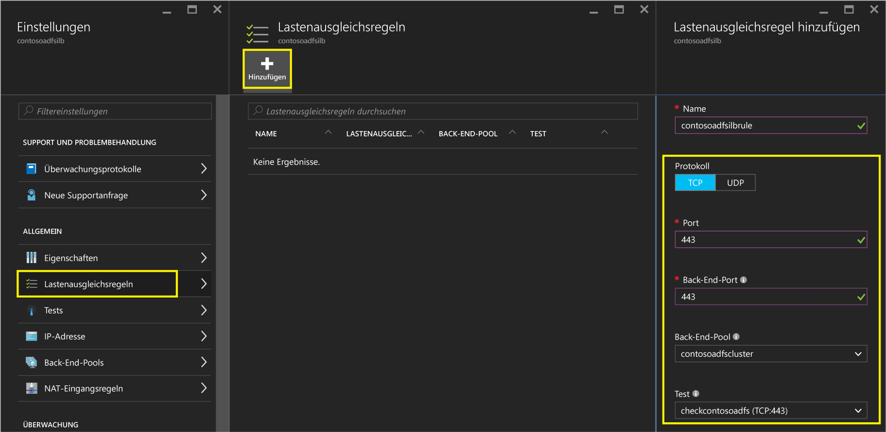

**6.5. Aktualisieren des DNS mit ILB**

Wechseln Sie auf Ihren DNS-Server, und erstellen Sie einen CNAME für den ILB. Der CNAME sollte für den Verbunddienst gelten, und die IP-Adresse sollte auf die IP-Adresse des ILB verweisen. Wenn die ILB-DIP-Adresse beispielsweise 10.3.0.8 lautet und der installierte Verbunddienst „fs.contoso.com“ ist, sollten Sie einen CNAME für „fs.contoso.com“ erstellen, für den auf 10.3.0.8 verwiesen wird. So wird sichergestellt, dass die gesamte Kommunikation mit „fs.contoso.com“ über den ILB läuft und richtig weitergeleitet wird.

###7\. Konfigurieren des Webanwendungsproxy-Servers

**7.1. Konfigurieren der Webanwendungsproxy-Server für die Verbindung mit AD FS-Servern**

Erstellen Sie für den ILB einen Eintrag unter „%systemroot%\\system32\\drivers\\etc\\hosts“, um sicherzustellen, dass Webanwendungsproxy-Server die AD FS-Server hinter dem ILB erreichen. Beachten Sie, dass der Distinguished Name (DN) der Verbunddienstname sein sollte, z.B. „fs.contoso.com“. Der IP-Eintrag sollte der IP-Adresse (in diesem Beispiel 10.3.0.8) des ILB entsprechen.

**7.2. Installieren der Webanwendungsproxy-Rolle**

Nachdem Sie sichergestellt haben, dass Webanwendungsproxy-Server die AD FS-Server hinter dem ILB erreichen können, können Sie als Nächstes die Webanwendungsproxy-Server installieren. Webanwendungsproxy-Server werden nicht mit der Domäne verknüpft. Installieren Sie die Webanwendungsproxy-Rollen auf den beiden Webanwendungsproxy-Servern, indem Sie die Remotezugriffsrolle auswählen. Sie werden vom Server-Manager durch die Schritte der WAP-Installation geführt. Weitere Informationen zur Bereitstellen von WAP finden Sie unter [Installieren und Konfigurieren des Webanwendungsproxy-Servers](https://technet.microsoft.com/library/dn383662.aspx).

###8\. Bereitstellen des (öffentlichen) Load Balancers mit Internetzugriff

**8.1. Erstellen des (öffentlichen) Load Balancers mit Internetzugriff**
 
Wählen Sie im Azure-Portal die Option „Lastenausgleichsmodule“, und klicken Sie dann auf „Hinzufügen“. Geben Sie im Bereich „Lastenausgleich erstellen“ die folgenden Informationen ein:
1. **Name**: Geben Sie den Namen für den Load Balancer ein.
2. **Schema**: Wählen Sie „Öffentlich“. Mit dieser Option wird Azure mitgeteilt, dass für diesen Load Balancer eine öffentliche Adresse erforderlich ist.
3. **IP-Adresse**: Erstellen Sie eine neue IP-Adresse (dynamisch).

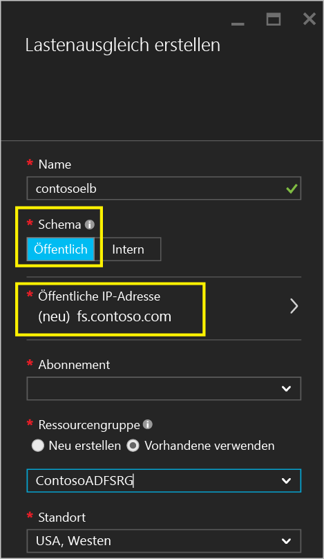

Nach der Bereitstellung wird der Load Balancer in der Liste „Lastenausgleichsmodule“ angezeigt.

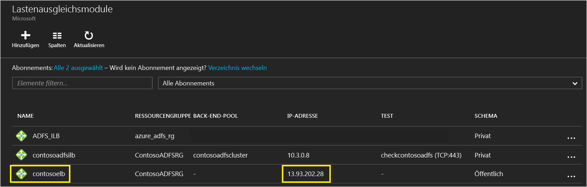
 
**8.2. Zuweisen einer DNS-Bezeichnung zur öffentlichen IP**

Klicken Sie im Bereich „Lastenausgleichsmodule“ auf den neu erstellten Load Balancer-Eintrag, um den Bereich für die Konfiguration zu öffnen. Führen Sie die unten angegebenen Schritte aus, um die DNS-Bezeichnung für die öffentliche IP zu konfigurieren:
1.	Klicken Sie auf die öffentliche IP-Adresse. Der Bereich für die öffentliche IP und mit den dazugehörigen Einstellungen wird geöffnet.
2.	Klicken Sie auf „Konfiguration“.
3.	Geben Sie eine DNS-Bezeichnung an. Sie wird zur öffentlichen DNS-Bezeichnung, auf die Sie von jedem Ort aus zugreifen können, z.B. „contosofs.westus.cloudapp.azure.com“. Sie können einen Eintrag im externen DNS für den Verbunddienst (z.B. „fs.contoso.com“) hinzufügen, der in die DNS-Bezeichnung des externen Load Balancers (contosofs.westus.cloudapp.azure.com) aufgelöst wird.

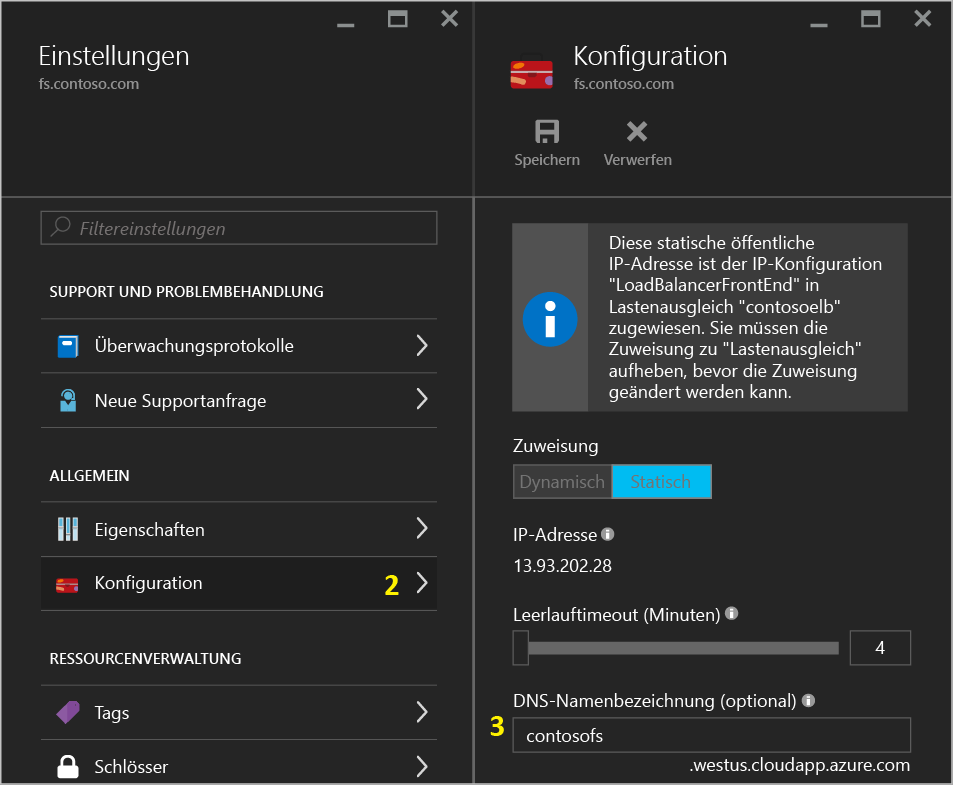

**8.3. Konfigurieren des Back-End-Pools für den (öffentlichen) Load Balancer mit Internetzugriff**

Führen Sie die gleichen Schritte wie beim Erstellen des internen Load Balancers aus, um den Back-End-Pool für den (öffentlichen) Load Balancer mit Internetzugriff als Verfügbarkeitsgruppe für die WAP-Server zu konfigurieren. Beispiel: „contosowapset“.

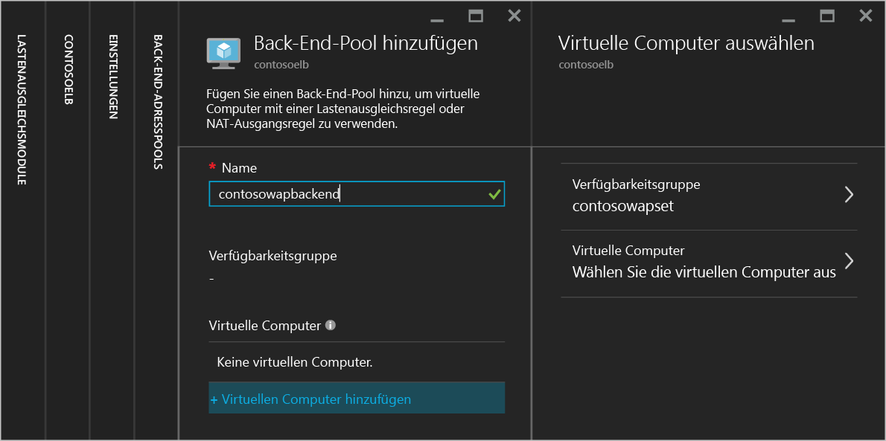
 
**8.4. Konfigurieren des Tests**

Führen Sie die gleichen Schritte wie beim Konfigurieren des internen Load Balancers aus, um den Test für den Back-End-Pool von WAP-Servern zu konfigurieren.

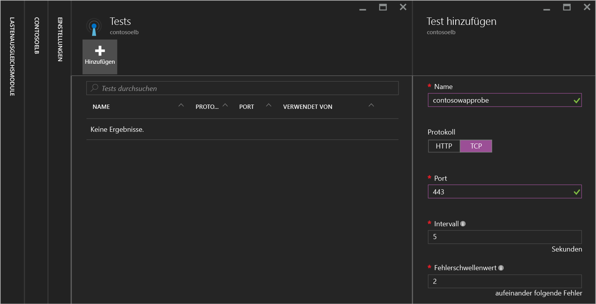
 
**8.5. Erstellen von Lastenausgleichsregeln**

Führen Sie die gleichen Schritte wie für den ILB aus, um die Lastenausgleichsregel für TCP 443 zu konfigurieren.

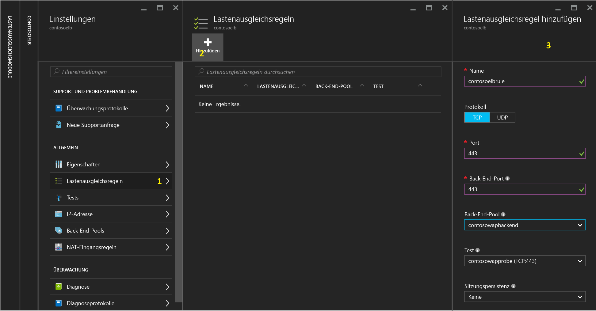
 
###9\. Schützen des Netzwerks

**9.1. Schützen des internen Subnetzes**

Generell benötigen Sie die folgenden Regeln, um Ihr internes Subnetz effizient zu schützen (in der unten angegebenen Reihenfolge).

|Regel|Beschreibung|Flow|
|:----|:----|:------:|
|AllowHTTPSFromDMZ| Mit dieser Regel wird die HTTPS-Kommunikation von der DMZ zugelassen. | Eingehend |
|DenyAllFromDMZ| Mit dieser Regel wird der gesamte Datenverkehr aus der DMZ in das interne Subnetz blockiert. Mit der Regel AllowHTTPSFromDMZ wird bereits sichergestellt, dass die HTTPS-Kommunikation funktioniert, und alles andere wird mit dieser Regel blockiert. | Eingehend |
|DenyInternetOutbound| Es besteht kein Zugriff auf das Internet. | Ausgehend |

[Kommentar]: <> (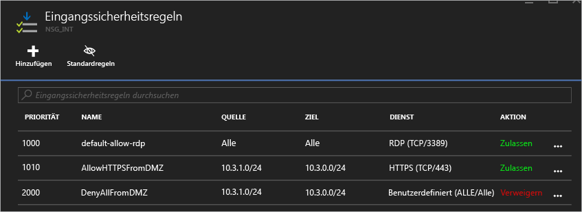) [Kommentar]: <> (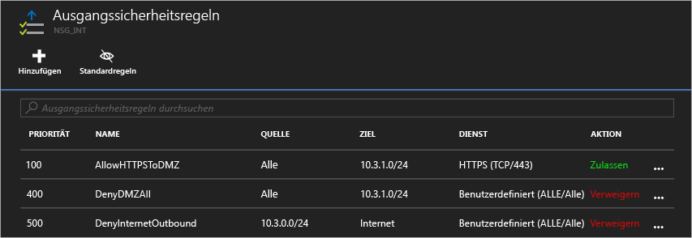)
 
**9.2. Schützen des DMZ-Subnetzes**

|Regel|Beschreibung|Flow|
|:----|:----|:------:|
|AllowHttpsFromVirtualNetwork| HTTPS aus dem virtuellen Netzwerk zulassen | Eingehend |
|AllowHTTPSInternet| HTTPS aus dem Internet an die DMZ zulassen | Eingehend|
|DenyingressexceptHTTPS| Anderen Datenverkehr als HTTPS aus dem Internet blockieren | Eingehend |
|DenyOutToInternet|	Alles außer HTTPS-Verbindungen ins Internet blockieren | Ausgehend |

[Kommentar]: <> () [Kommentar]: <> (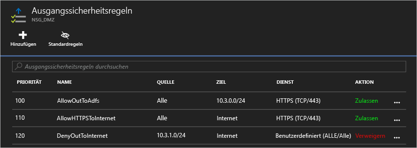)

>[AZURE.NOTE] Wenn eine Clientauthentifizierung mit Benutzerzertifikat (clientTLS-Authentifizierung mit X509-Benutzerzertifikaten) erforderlich ist, muss für AD FS der TCP-Port 49443 für eingehenden Zugriff aktiviert werden.

###10\. Testen der AD FS-Anmeldung

Die einfachste Möglichkeit zum Testen von AD FS ist die Verwendung der Seite „IdpInitiatedSignon.aspx“. Hierfür ist es erforderlich, in den AD FS-Eigenschaften „IdpInitiatedSignOn“ zu aktivieren. Führen Sie die unten angegebenen Schritte aus, um Ihr AD FS-Setup zu überprüfen.
1.	Führen Sie das unten angegebene Cmdlet auf dem AD FS-Server aus, und verwenden Sie PowerShell, um es auf „Aktiviert“ festzulegen. Set-AdfsProperties -EnableIdPInitiatedSignonPage $true
2.	Greifen Sie von externen Computern auf https://adfs.thecloudadvocate.com/adfs/ls/IdpInitiatedSignon.aspx zu.
3.	Die folgende AD FS-Seite wird angezeigt:

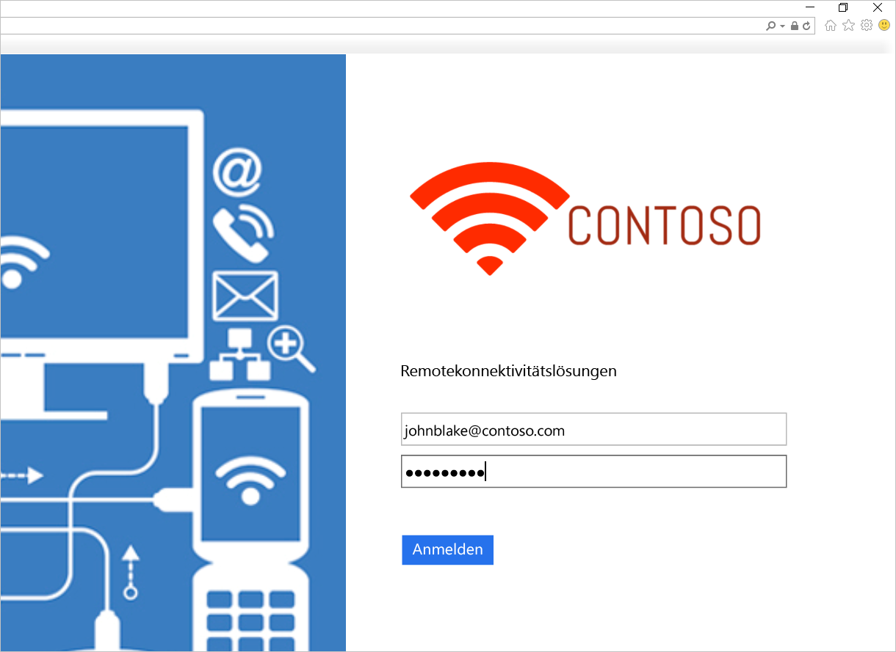

Bei einer erfolgreichen Anmeldung wird die folgende Erfolgsmeldung angezeigt:

## Zusätzliche Ressourcen
* [Verfügbarkeitsgruppen](https://aka.ms/Azure/Availability)
* [Azure-Lastenausgleich](https://aka.ms/Azure/ILB)
* [Interner Load Balancer](https://aka.ms/Azure/ILB/Internal)
* [Load Balancer mit Internetzugriff](https://aka.ms/Azure/ILB/Internet)
* [Speicherkonten](https://aka.ms/Azure/Storage)
* [Virtuelle Azure-Netzwerke](https://aka.ms/Azure/VNet)
* [AD FS- und Webanwendungsproxy-Links](http://aka.ms/ADFSLinks)

## Nächste Schritte

* [Integrieren lokaler Identitäten in Azure Active Directory](active-directory-aadconnect.md)
* [Azure AD Connect und Verbund](active-directory-aadconnectfed-whatis.md)
* [Gebietsübergreifende, hochverfügbare AD FS-Bereitstellung in Azure mit Azure Traffic Manager](active-directory-adfs-in-azure-with-azure-traffic-manager.md)

<!---HONumber=AcomDC_0907_2016-->