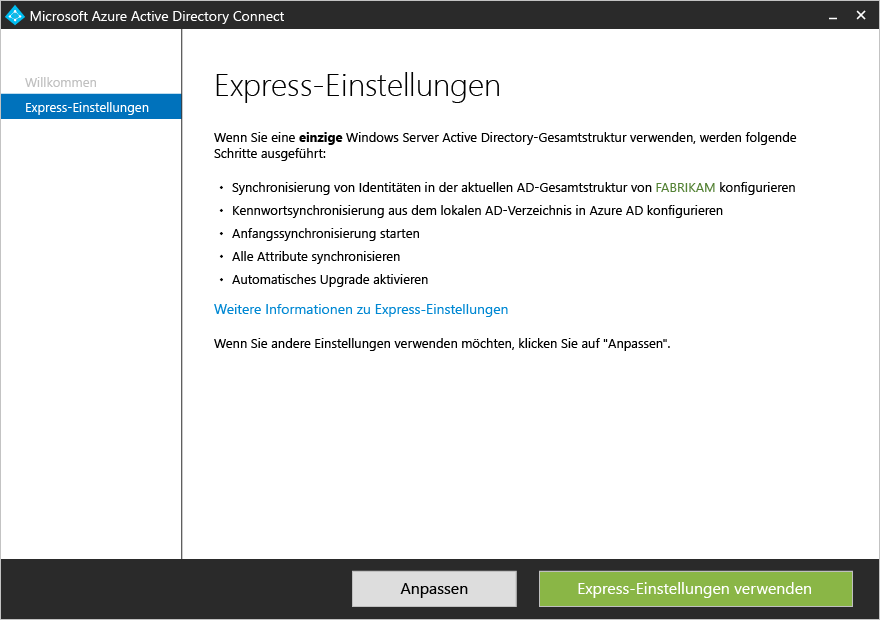
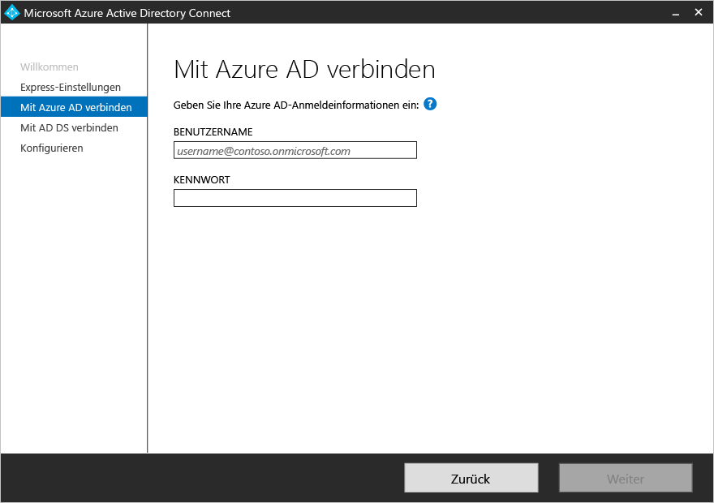
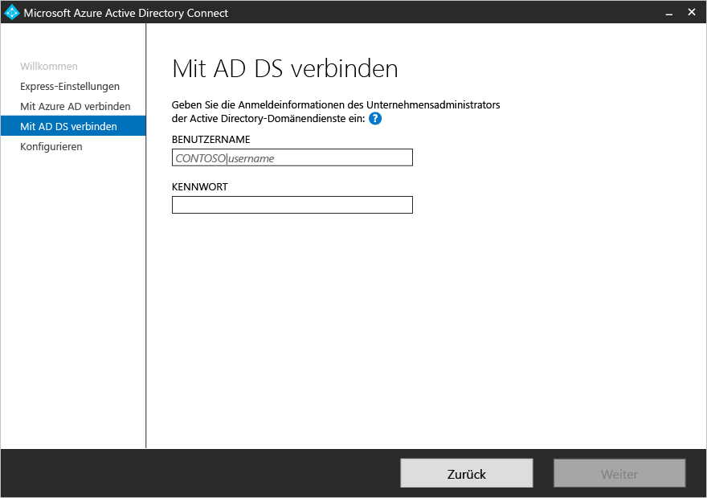
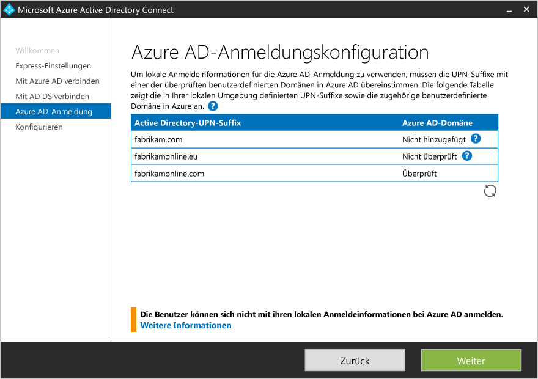
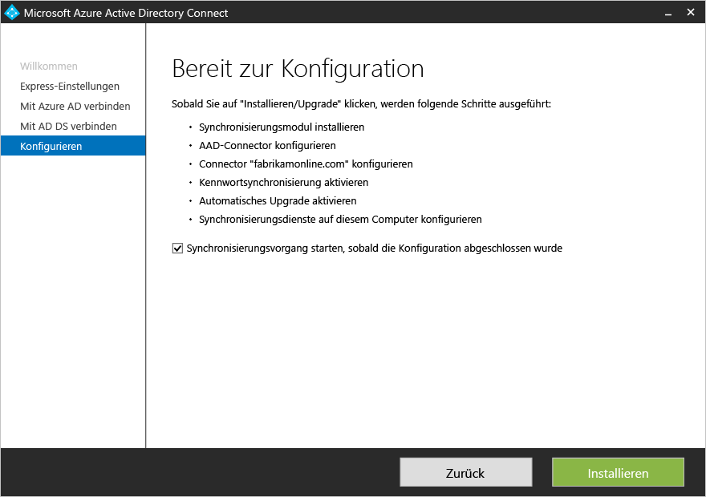

<properties
	pageTitle="Azure AD Connect: Erste Schritte mit Expresseinstellungen | Microsoft Azure"
	description="Informationen zum Herunterladen, Installieren und Ausführen des Setup-Assistenten für Azure AD Connect."
	services="active-directory"
	documentationCenter=""
	authors="andkjell"
	manager="femila"
	editor="curtand"/>

<tags
	ms.service="active-directory"
	ms.workload="identity"
	ms.tgt_pltfrm="na"
	ms.devlang="na"
	ms.topic="get-started-article"
	ms.date="09/13/2016"
	ms.author="billmath;andkjell"/>

# Erste Schritte mit Azure AD Connect mit Expresseinstellungen
Die **Expresseinstellungen** von Azure AD Connect werden verwendet, wenn Sie eine Topologie mit einer einzelnen Gesamtstruktur und die [Kennwortsynchronisierung](active-directory-aadconnectsync-implement-password-synchronization.md) für die Authentifizierung verwenden. Die **Expresseinstellungen** sind die Standardoption und werden für die häufigsten Bereitstellungsszenarien verwendet. Mit nur wenigen Klicks können Sie Ihr lokales Verzeichnis auf die Cloud erweitern.

Stellen Sie vor dem Installieren von Azure AD Connect sicher, dass Sie [Azure AD Connect heruntergeladen](http://go.microsoft.com/fwlink/?LinkId=615771) und die vorbereitenden Schritte unter [Azure AD Connect: Hardware und Voraussetzungen](active-directory-aadconnect-prerequisites.md) ausgeführt haben.

Falls Expresseinstellungen nicht zu Ihrer Topologie passen, finden Sie weitere Szenarien in der [verwandten Dokumentation](#related-documentation).

## Expressinstallation von Azure AD Connect
Im Abschnitt [Videos](#videos) können Sie diese Schritte in Aktion sehen.

1. Melden Sie sich als lokaler Administrator auf dem Server an, auf dem Sie Azure AD Connect installieren möchten. Dies sollte der Server sein, der als Synchronisierungsserver verwendet werden soll.
2. Navigieren Sie zu **AzureADConnect.msi**, und doppelklicken Sie darauf.
3. Aktivieren Sie auf der Willkommensseite das Kontrollkästchen zum Zustimmen zu den Lizenzbedingungen, und klicken Sie auf **Weiter**.
4. Klicken Sie im Bildschirm "Expresseinstellungen" auf **Expresseinstellungen verwenden**. 
5. Geben Sie auf dem Bildschirm „Mit Azure AD verbinden“ den Benutzernamen und das Kennwort eines globalen Azure-Administrators für Azure AD ein. Klicken Sie auf **Next**.  Falls ein Fehler auftritt und Sie Probleme mit der Konnektivität haben, können Sie unter [Problembehebung bei Konnektivitätsproblemen](active-directory-aadconnect-troubleshoot-connectivity.md) nach einer Lösung suchen.
6. Geben Sie auf dem Bildschirm „Mit AD DS verbinden“ den Benutzernamen und das Kennwort für ein Enterprise-Administratorkonto ein. Sie können den Domänenteil entweder im NetBIOS- oder FQDN-Format eingeben, also „FABRIKAM\\administrator“ oder „fabrikam.com\\administrator“. Klicken Sie auf **Weiter**. 
7. Die Seite [**Konfiguration der Azure AD-Anmeldung**](active-directory-aadconnect-user-signin.md#azure-ad-sign-in-configuration) wird nur angezeigt, wenn Sie den Vorgang zum [Überprüfen Ihrer Domänen](active-directory-add-domain.md) unter [Voraussetzungen](active-directory-aadconnect-prerequisites.md) nicht abgeschlossen haben.  Wenn diese Seite angezeigt wird, sollten Sie jede Domäne überprüfen, die als **Nicht hinzugefügt** und **Nicht überprüft** markiert ist. Stellen Sie sicher, dass die verwendeten Domänen in Azure AD überprüft wurden. Klicken Sie auf das Symbol zum Aktualisieren, wenn Sie Ihre Domänen überprüft haben.
8. Klicken Sie im Bildschirm "Bereit zur Konfiguration" auf **Installieren**.
	- Optional können Sie auf der Seite „Bereit zur Konfiguration“ das Kontrollkästchen **Starten Sie den Synchronisierungsvorgang, sobald die Anfangskonfiguration abgeschlossen wurde** deaktivieren. Deaktivieren Sie dieses Kontrollkästchen, wenn Sie eine zusätzliche Konfiguration vornehmen möchten, z.B. [Filtern](active-directory-aadconnectsync-configure-filtering.md). Wenn Sie diese Option deaktivieren, konfiguriert der Assistent die Synchronisierung, der Scheduler bleibt jedoch deaktiviert. Er wird erst ausgeführt, wenn Sie ihn manuell aktivieren, indem Sie den [Installationsassistenten erneut ausführen](active-directory-aadconnectsync-installation-wizard.md).
	- Wenn Sie in Ihrer lokalen Active Directory-Instanz Exchange nutzen, verfügen Sie auch über die Option zum Aktivieren von [**Hybridbereitstellungen in Exchange Server**](https://technet.microsoft.com/library/jj200581.aspx). Aktivieren Sie diese Option, wenn Sie Exchange-Postfächer gleichzeitig in der Cloud und lokal bereitstellen möchten. 
9. Klicken Sie nach Abschluss der Installation auf **Beenden**.
10. Melden Sie sich nach Abschluss der Installation ab und erneut wieder an, ehe Sie den Synchronisierungsdienst-Manager oder Synchronisierungsregel-Editor verwenden.

## Videos

Ein Video zur Expressinstallation finden Sie hier:

>[AZURE.VIDEO azure-active-directory-connect-express-settings]

## Nächste Schritte
Nachdem Sie Azure AD Connect installiert haben, können Sie [die Installation überprüfen und Lizenzen zuweisen](active-directory-aadconnect-whats-next.md).

Weitere Informationen zu diesen Features, die mit der Installation aktiviert wurden: [Automatisches Upgrade](active-directory-aadconnect-feature-automatic-upgrade.md), [Verhindern von versehentlichen Löschungen](active-directory-aadconnectsync-feature-prevent-accidental-deletes.md) und [Azure AD Connect Health](active-directory-aadconnect-health-sync.md).

Weitere Informationen zu folgenden allgemeinen Themen: [Scheduler und Auslösen der Synchronisierung](active-directory-aadconnectsync-feature-scheduler.md).

Weitere Informationen zum [Integrieren lokaler Identitäten in Azure Active Directory](active-directory-aadconnect.md).

## Verwandte Dokumentation

Thema |  
--------- | ---------
Übersicht über Azure AD Connect | [Integrieren lokaler Identitäten in Azure Active Directory](active-directory-aadconnect.md)
Installation mit benutzerdefinierten Einstellungen | [Benutzerdefinierte Installation von Azure AD Connect](active-directory-aadconnect-get-started-custom.md)
Upgrade von DirSync | [Upgrade von Azure AD-Synchronisierungstools (DirSync)](active-directory-aadconnect-dirsync-upgrade-get-started.md)
Für die Installation verwendete Konten | [Weitere Informationen zu Azure AD Connect-Konten und -Berechtigungen](active-directory-aadconnect-accounts-permissions.md)

<!---HONumber=AcomDC_0914_2016-->