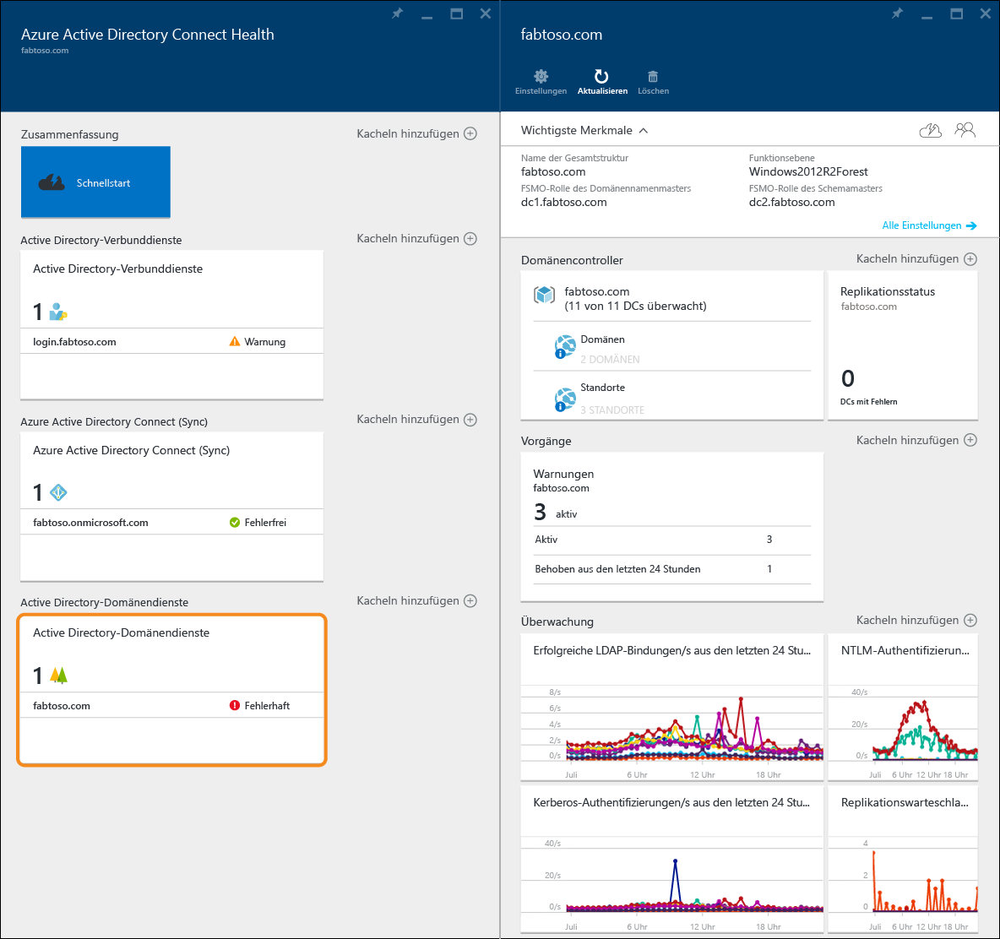
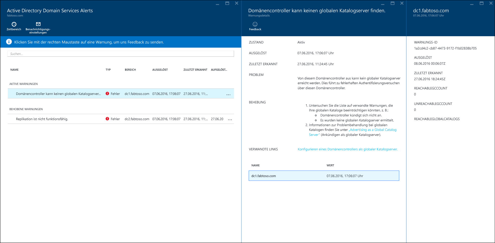
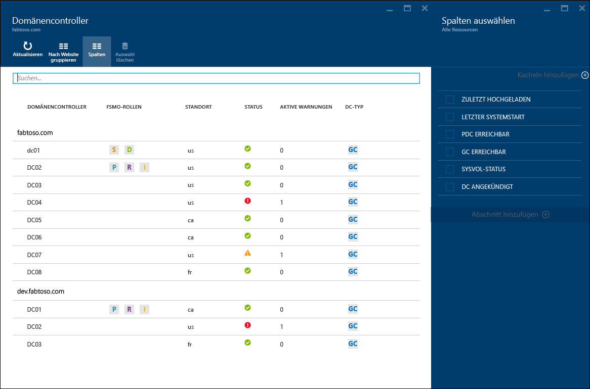
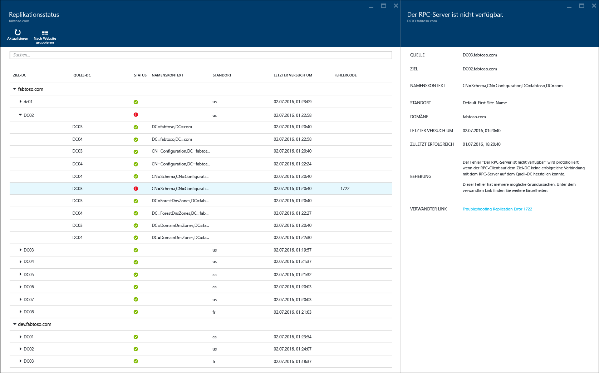
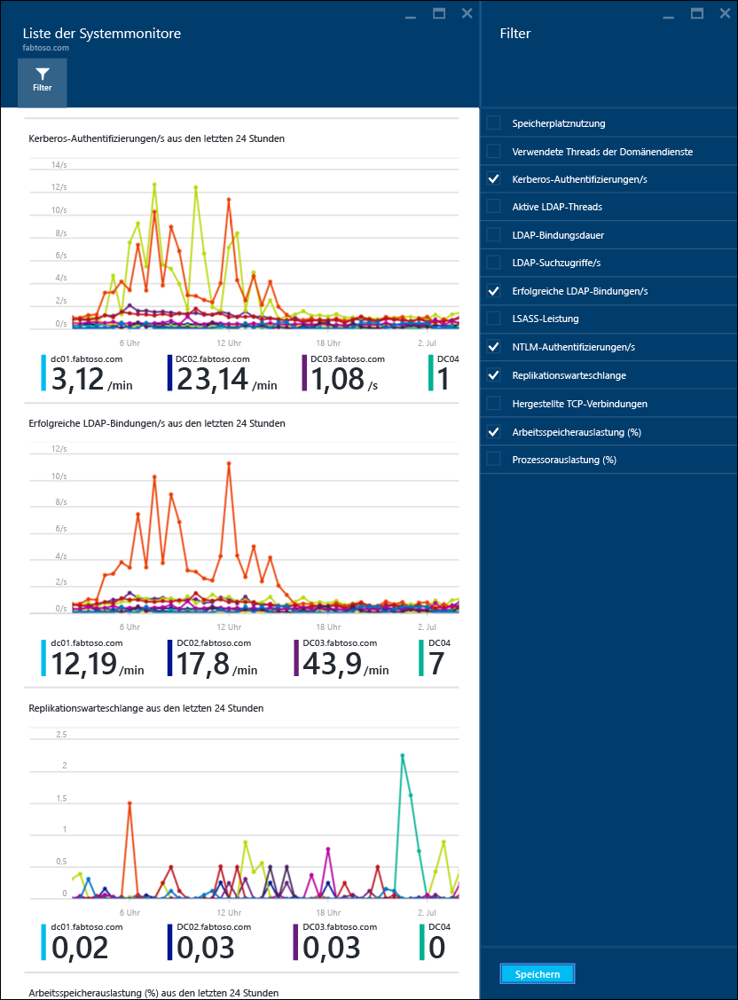

<properties
	pageTitle="Verwenden von Azure AD Connect Health mit AD DS | Microsoft Azure"
	description="Auf dieser Seite zu Azure AD Connect Health wird beschrieben, wie Sie AD DS überwachen."
	services="active-directory"
	documentationCenter=""
	authors="arluca"
	manager="samueld"
	editor="curtand"/>

<tags
	ms.service="active-directory"
	ms.workload="identity"
	ms.tgt_pltfrm="na"
	ms.devlang="na"
	ms.topic="get-started-article"
	ms.date="07/14/2016"
	ms.author="arluca"/>

# Verwenden von Azure AD Connect Health mit AD DS
Die folgende Dokumentation gilt speziell für die Überwachung von Active Directory-Domänendiensten mit Azure AD Connect Health. Dies betrifft die Installation von AD DS unter Windows Server 2008 R2, Windows Server 2012 und Windows Server 2012 R2.

Informationen zum Überwachen von AD FS mit Azure AD Connect Health finden Sie unter [Verwenden von Azure AD Connect Health mit AD FS](active-directory-aadconnect-health-adfs.md). Informationen zum Überwachen von Azure AD Connect (Sync) mit Azure AD Connect Health finden Sie unter [Verwenden von Azure AD Connect Health für die Synchronisierung](active-directory-aadconnect-health-sync.md).

## Warnungen für Azure AD Connect Health für AD DS
Der Abschnitt „Warnungen“ in Azure AD Connect Health für AD DS enthält eine Liste mit aktiven und gelösten Warnungen für ihre Domänencontroller. Wenn Sie eine aktive oder gelöste Warnung auswählen, wird ein neues Blatt mit weiteren Informationen sowie Lösungsschritten und Links zu hilfreicher Dokumentation geöffnet. Jeder Warnungstyp kann über eine oder mehrere Instanzen verfügen, die jeweils den Domänencontrollern entsprechen, die von einer Warnung betroffen sind. Im unteren Bereich des Blatts mit den Warnungen können Sie einen betroffenen Domänencontroller auswählen. Ein neues Blatt mit zusätzlichen Details zur jeweiligen Warnungsinstanz wird geöffnet.

Die Aktivierung von E-Mail-Benachrichtigungen für Warnungen ist auf diesem Blatt möglich, und außerdem können Sie den angezeigten Zeitbereich ändern. Indem Sie den Zeitbereich vergrößern, können Sie die vorherigen gelösten Warnungen einblenden.

## Domänencontroller
Dieses Dashboard enthält eine topologische Ansicht Ihrer Umgebung mit wichtigen Betriebsmetriken und dem Integritätsstatus Ihrer überwachten Domänencontroller. Anhand der dargestellten Metriken können Sie schnell Domänencontroller identifizieren, die ggf. näher untersucht werden müssen. Standardmäßig wird nur eine Teilmenge der Spalten angezeigt. Sie können aber alle verfügbaren Spalten anzeigen, indem Sie auf den Befehl „Spalten“ klicken. Wenn Sie die Spalten auswählen, die für Sie am interessantesten sind, wird das Dashboard zu einem zentralen Ort, an dem Sie die Integrität Ihrer AD DS-Umgebung leicht überblicken können.

Domänencontroller können nach der jeweiligen Domäne oder dem Standort gruppiert werden. Dies ist für das Verständnis der Umgebungstopologie hilfreich. Wenn Sie auf die Blattüberschrift doppelklicken, wird das Dashboard maximiert, um den gesamten Platz auf dem Bildschirm auszunutzen. Dies ist besonders nützlich, wenn Sie mehrere Spalten anzeigen.

## Replikationsstatus
Dieses Dashboard enthält eine Ansicht mit dem Replikationsstatus und der Replikationstopologie Ihrer überwachten Domänencontroller. Der Status des letzten Replikationsversuchs wird zusammen mit hilfreicher Dokumentation zu gefundenen Fehlern angezeigt. Wenn Sie einen Domänencontroller mit einem Fehler auswählen, wird ein neues Blatt mit weiteren Informationen, Lösungsschritten und Links zu Problembehandlungsdokumentation geöffnet.

## Überwachung
Diese Funktion liefert grafische Trends zu verschiedenen Leistungsindikatoren, die über die überwachten Domänencontroller fortlaufend erfasst werden. Die Leistung eines Domänencontrollers kann leicht mit der Leistung aller anderen überwachten Domänencontroller in der Gesamtstruktur verglichen werden. Darüber hinaus können Sie verschiedene Leistungsindikatoren nebeneinander anzeigen, was bei der Behandlung von Problemen in Ihrer Umgebung hilfreich ist.

Standardmäßig sind vorab vier Leistungsindikatoren ausgewählt. Sie können aber weitere Leistungsindikatoren hinzufügen, indem Sie auf den Befehl „Filter“ klicken und alle gewünschten Leistungsindikatoren aktivieren oder deaktivieren. Wenn Sie auf den Graphen eines bestimmten Leistungsindikators klicken, wird außerdem ein neues Blatt mit den entsprechenden Datenpunkten für die einzelnen überwachten Domänencontroller geöffnet.

## Verwandte Links

* [Azure AD Connect Health](active-directory-aadconnect-health.md)
* [Installieren des Azure AD Connect Health-Agents](active-directory-aadconnect-health-agent-install.md)
* [Azure AD Connect Health-Vorgänge](active-directory-aadconnect-health-operations.md)
* [Verwenden von Azure AD Connect Health mit AD FS](active-directory-aadconnect-health-adfs.md)
* [Verwenden von Azure AD Connect Health für die Synchronisierung](active-directory-aadconnect-health-sync.md)
* [Azure AD Connect Health – FAQ](active-directory-aadconnect-health-faq.md)
* [Azure AD Connect Health: Versionsverlauf](active-directory-aadconnect-health-version-history.md)

<!---HONumber=AcomDC_0720_2016-->