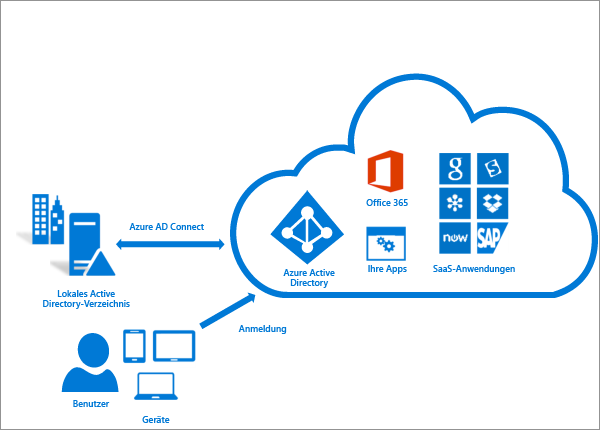
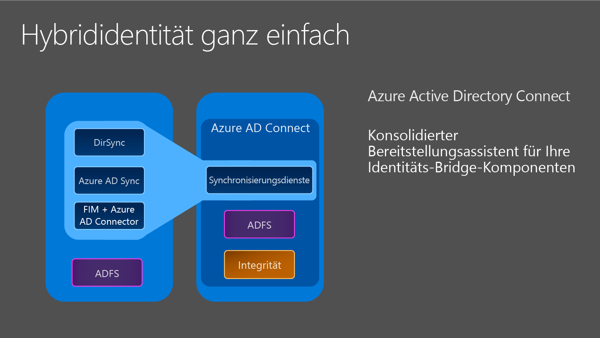

# Integrieren Ihrer lokalen Identitäten in Azure Active Directory
Azure AD Connect integriert Ihre lokalen Verzeichnisse in Azure Active Directory. Dadurch können Sie für Ihre Benutzer eine einzige Identität für in Azure AD integrierte in Office 365-, Azure- und SaaS-Anwendungen bereitstellen. Dieses Thema beschreibt die Planung, Bereitstellung und den Betrieb. Es umfasst Links zu Themen, die mit diesem Bereich zusammenhängen.

<!-- The hardcoded link is a workaround for campaign ids not working in acom links-->

> [!IMPORTANT]
> [Azure AD Connect bietet die beste Möglichkeit, um Ihr lokales Verzeichnis mit Azure AD und Office 365 zu verbinden. Da Windows Azure Active Directory Sync (DirSync) und Azure AD Sync veraltet sind und der Support für diese Tools am 13. April 2017 endet, ist dies ein guter Zeitpunkt, um ein Upgrade auf Azure AD Connect durchzuführen.]active-directory-aadconnect-dirsync-deprecated.md)
> 
> 

## Gründe für die Verwendung von Azure AD Connect
Die Integration Ihrer lokalen Verzeichnisse in Azure AD steigert die Produktivität Ihrer Benutzer, da für den Zugriff auf die Cloud und lokale Ressourcen nur eine Identität benötigt wird. Benutzer und Organisationen können die folgenden Vorteile nutzen:

* Benutzer können eine einzelne Identität verwenden, um auf lokale Anwendungen und Clouddienste wie z. B. Office 365 zuzugreifen.
* Einzelnes Tool zum Bereitstellen einer einfachen Bereitstellungserfahrung für die Synchronisierung und Anmeldung.
* Bietet die neuesten Funktionen für Ihre Szenarien. Azure AD Connect ersetzt ältere Versionen von Identitätsintegrationstools, wie z. B. DirSync und Azure AD Sync. Weitere Informationen finden Sie unter [Vergleich von Tools für die Verzeichnisintegration für Hybrididentitäten](active-directory-hybrid-identity-design-considerations-tools-comparison.md).

### Funktionsweise von Azure AD Connect
Azure Active Directory Connect besteht aus drei Hauptkomponenten: den Synchronisierungsdiensten, der optionalen Active Directory-Verbunddienstkomponente und eine Überwachungskomponente namens [Azure AD Connect Health](active-directory-aadconnect-health.md).

* Synchronisierung: Diese Komponente ist verantwortlich für das Erstellen von Benutzern, Gruppen und anderen Objekten. Er stellt ebenfalls sicher, dass Identitätsinformationen für Ihre lokalen Benutzer und Gruppen denen in der Cloud entsprechen.
* AD FS: Der Verbund ist eine optionale Komponente von Azure AD Connect und kann zum Konfigurieren einer Hybridumgebung mithilfe einer lokalen AD FS-Infrastruktur verwendet werden. Dies kann von Organisationen verwendet werden, um sich mit komplexen Bereitstellungen zu befassen, z.B. Domänenbeitritts-SSO, Erzwingen von AD-Anmelderichtlinien und Smartcard- bzw. Drittanbieter-MFA.
* Systemüberwachung: Azure AD Connect Health bietet eine stabile Überwachung und einen zentralen Speicherort im Azure-Portal, um diese Aktivität anzuzeigen. Weitere Informationen finden Sie unter [Azure Active Directory Connect Health](active-directory-aadconnect-health.md).

## Installieren von Azure AD Connect
Den Download für Azure AD Connect finden Sie im [Microsoft Download Center](http://go.microsoft.com/fwlink/?LinkId=615771).

| Lösung | Szenario |
| --- | --- |
| Vorbereitung: [Hardware und Voraussetzungen](active-directory-aadconnect-prerequisites.md) |<li>Hier erfahren Sie mehr zu den Schritten, die vor dem Installieren von Azure AD Connect ausgeführt werden müssen.</li> |
| [Express-Einstellungen](active-directory-aadconnect-get-started-express.md) |<li>Wenn Sie über eine einzelne Gesamtstruktur-AD-Instanz verfügen, ist dies die empfohlene Option.</li> <li>Benutzer melden Sie sich mit dem gleichen Kennwort mithilfe der Kennwortsynchronisierung an.</li> |
| [Benutzerdefinierte Einstellungen](active-directory-aadconnect-get-started-custom.md) |<li>Wird bei mehreren Gesamtstrukturen verwendet. Unterstützt viele lokale [Topologien](active-directory-aadconnect-topologies.md).</li> <li>Passen Sie die Anmeldeoption an, z.B. ADFS für den Verbund, oder verwenden Sie einen Drittanbieter-Identitätsanbieter.</li> <li>Passen Sie Synchronisierungsfunktionen an, wie das Filtern und Rückschreiben.</li> |
| [Upgrade von DirSync](active-directory-aadconnect-dirsync-upgrade-get-started.md) |<li>Wird bei einem vorhandenen DirSync-Server verwendet, der bereits ausgeführt wird.</li> |
| [Upgrade von Azure AD Sync oder Azure AD Connect](active-directory-aadconnect-upgrade-previous-version.md) |<li>Je nach Bedarf gibt es verschiedene Methoden.</li> |

[Nach der Installation](active-directory-aadconnect-whats-next.md) sollten Sie überprüfen, ob es wie erwartet funktioniert und den Benutzern Lizenzen zuweisen.

### Nächste Schritte für die Installation von Azure AD Connect
| Thema |
| --- | --- |
| Azure AD Connect herunterladen |
| Installieren mit den Express-Einstellungen |
| Installieren mit benutzerdefinierten Einstellungen |
| Upgrade von DirSync |
| Nach der Installation |

### Weitere Informationen über die Installation von Azure AD Connect
Sie sollten sich auch auf [betriebliche](active-directory-aadconnectsync-operations.md) Probleme vorbereiten. Ein Standbyserver empfiehlt sich, damit Sie im [Notfall](active-directory-aadconnectsync-operations.md#disaster-recovery)problemlos ein Failover durchführen können. Wenn Sie häufig Konfigurationsänderungen vornehmen möchten, sollten Sie einen [Stagingmodus](active-directory-aadconnectsync-operations.md#staging-mode) -Server einplanen.

| Thema |
| --- | --- |
| Unterstützte Topologien |
| Entwurfskonzepte |
| Für die Installation verwendete Konten |
| Operative Planung |
| Optionen für die Benutzeranmeldung |

## Konfigurieren der Synchronisierungsfunktionen
Azure AD Connect verfügt über mehrere Funktionen, die Sie optional aktivieren können oder die standardmäßig aktiviert sind. Einige Funktionen benötigen möglicherweise eine zusätzliche Konfiguration in bestimmten Szenarien und Topologien.

[Filtern](active-directory-aadconnectsync-configure-filtering.md) wird verwendet, wenn Sie begrenzen möchten, welche Objekte mit Azure AD synchronisiert werden. Standardmäßig werden alle Benutzer, Kontakte, Gruppen und Windows 10-Computer synchronisiert. Sie können die Filterung ausgehend von Domänen, Organisationseinheiten oder Attributen ändern.

[Kennwortsynchronisierung](active-directory-aadconnectsync-implement-password-synchronization.md) synchronisiert das Kennworthash in Active Directory nach Azure AD. So kann der Endbenutzer das gleiche Kennwort lokal und in der Cloud verwenden, es jedoch nur an einem Ort verwalten. Da es das lokale Active Directory als Autorität verwendet, können Sie auch Ihre eigene Kennwortrichtlinie verwenden.

[Kennwortrückschreiben](active-directory-passwords-getting-started.md) ermöglicht es den Benutzern, ihre Kennwörter in der Cloud zu ändern und zurückzusetzen und die lokale Kennwortrichtlinie anzuwenden.

[Geräterückschreiben](active-directory-aadconnect-feature-device-writeback.md) ermöglicht es Ihnen, ein in Azure AD registriertes Gerät wieder in das lokale Active Directory zurückzuschreiben, damit es für bedingten Zugriff verwendet werden kann.

Die Funktion zum [Verhindern eines versehentlichen Löschvorgangs](active-directory-aadconnectsync-feature-prevent-accidental-deletes.md) ist standardmäßig aktiviert und schützt Ihr Cloudverzeichnis vor mehreren gleichzeitigen Löschvorgängen. Standardmäßig sind 500 Löschvorgänge pro Durchlauf zulässig. Diese Einstellung kann abhängig von der Größe Ihres Unternehmens geändert werden.

[automatische Upgrade](active-directory-aadconnect-feature-automatic-upgrade.md) ist für Installationen mit Expresseinstellungen standardmäßig aktiviert und stellt sicher, dass Ihre Azure AD Connect-Instanz immer mit der neuesten Version aktualisiert wird.

### Nächste Schritte zum Konfigurieren der Synchronisierungsfunktionen
| Thema |
| --- | --- |
| Konfigurieren der Filterung |
| Kennwortsynchronisierung |
| Kennwortrückschreiben |
| Geräterückschreiben |
| Verhindern eines versehentlichen Löschvorgangs |
| automatische Upgrade |

## Anpassen der Azure AD Connect-Synchronisierung
Für die Azure AD Connect-Synchronisierung ist eine Standardkonfiguration vorgegeben, die für die meisten Kunden und Topologien konzipiert wurde. Es gibt jedoch immer Situationen, in denen die Standardkonfiguration nicht funktioniert und angepasst werden muss. Sie können Änderungen wie in diesem Abschnitt und in den verknüpften Themen beschrieben vornehmen.

Wenn Sie noch nicht mit einer Synchronisierungstopologie gearbeitet haben, sollten Sie sich zunächst mit den Grundlagen und verwendeten Begriffen vertraut machen, die unter [Technische Konzepte](active-directory-aadconnectsync-technical-concepts.md)beschrieben werden. Azure AD Connect ist die Weiterentwicklung von MIIS2003, ILM2007 und FIM2010. Selbst wenn einige Dinge identisch sind, hat sich doch auch eine Menge verändert.

Bei der [Standardkonfiguration](active-directory-aadconnectsync-understanding-default-configuration.md) wird davon ausgegangen, dass die Konfiguration möglicherweise mehrere Gesamtstrukturen umfasst. In diesen Topologien kann ein Benutzerobjekt möglicherweise in einer anderen Gesamtstruktur als Kontakt dargestellt werden. Der Benutzer kann in einer anderen Ressourcengesamtstruktur auch über ein verknüpftes Postfach verfügen. Das Verhalten der Standardkonfiguration wird unter [Benutzer und Kontakte](active-directory-aadconnectsync-understanding-users-and-contacts.md)beschrieben.

Das synchronisierte Konfigurationsmodell wird als [deklarative Bereitstellung](active-directory-aadconnectsync-understanding-declarative-provisioning-expressions.md)bezeichnet. Die erweiterten Attributflüsse verwenden [Funktionen](active-directory-aadconnectsync-functions-reference.md) , um Attributtransformationen auszudrücken. Sie können die gesamte Konfiguration mithilfe von Tools, die im Lieferumfang von Azure AD Connect enthalten sind, anzeigen und überprüfen. Wenn Sie Änderungen an der Konfiguration vornehmen müssen, sollten Sie sicherstellen, dass Sie die [bewährten Methoden](active-directory-aadconnectsync-best-practices-changing-default-configuration.md) befolgen, damit neue Versionen leichter übernommen werden.

### Nächste Schritte zur Anpassung der Azure AD Connect-Synchronisierung
| Thema |
| --- | --- |
| Alle Artikel zur Azure AD Connect-Synchronisierung |
| Technische Konzepte |
| Grundlegendes zur Standardkonfiguration |
| Grundlegendes zu Benutzern und Kontakten |
| deklarative Bereitstellung |
| Ändern der Standardkonfiguration |

## Konfigurieren von Verbundfunktionen
AD FS kann für die Unterstützung von [mehreren Domänen](active-directory-aadconnect-multiple-domains.md)konfiguriert werden. Beispiel: Sie besitzen mehrere Domänen der obersten Ebene, die Sie für den Verbund verwenden müssen.

Wenn Ihr AD FS-Server nicht für die automatische Aktualisierung von Zertifikaten in Azure AD konfiguriert wurde oder wenn Sie eine Lösung ohne AD FS nutzen, werden Sie benachrichtigt, wenn Sie [Zertifikate aktualisieren](active-directory-aadconnect-o365-certs.md)müssen.

### Nächste Schritte zum Konfigurieren der Verbundfunktionen
| Thema |
| --- | --- |
| Alle AD FS-Artikel |
| Konfigurieren von AD FS mit Unterdomänen |
| Verwalten der AD FS-Farm |
| Manuelles Aktualisieren von Verbundzertifikaten |

## Weitere Informationen und Referenzen
| Thema |
| --- | --- |
| Versionsverlauf |
| Vergleich von DirSync, Azure ADSync und Azure AD Connect |
| Liste mit Informationen zur Kompatibilität zwischen AD FS-fremden Lösungen und Azure AD |
| Synchronisierte Attribute |
| Überwachen mit Azure AD Connect Health |
| Häufig gestellte Fragen |

**Weitere Ressourcen**

Ignite 2015-Präsentation über die Erweiterung lokaler Verzeichnisse in die Cloud.

> [!VIDEO https://channel9.msdn.com/Events/Ignite/2015/BRK3862/player]
> 
> 

<!--HONumber=Oct16_HO2-->

