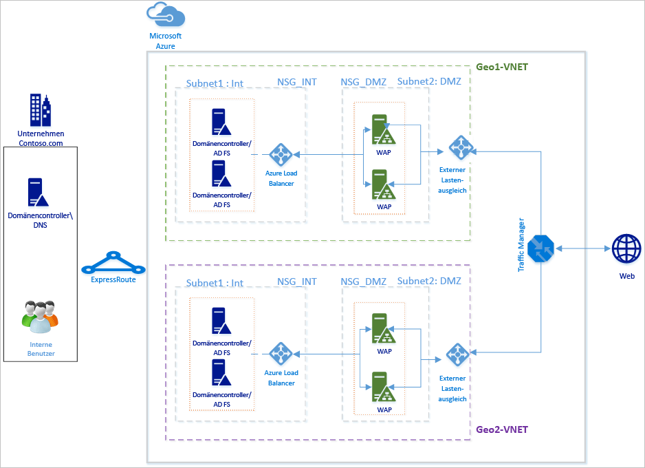
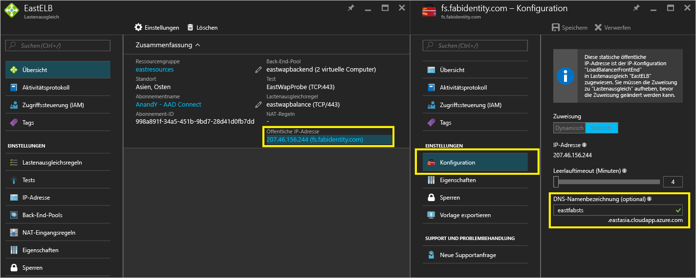
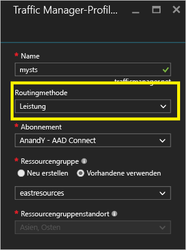
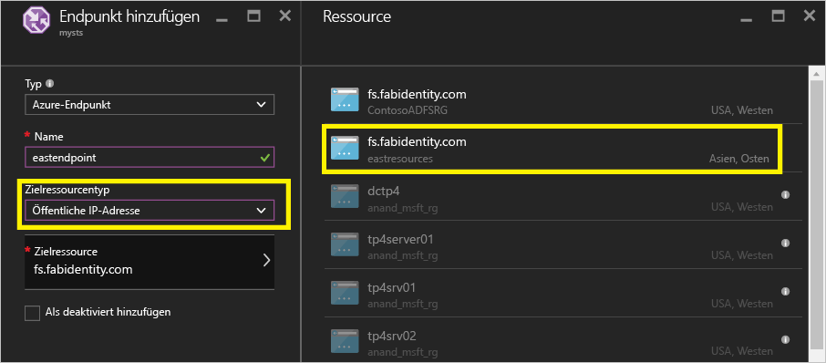
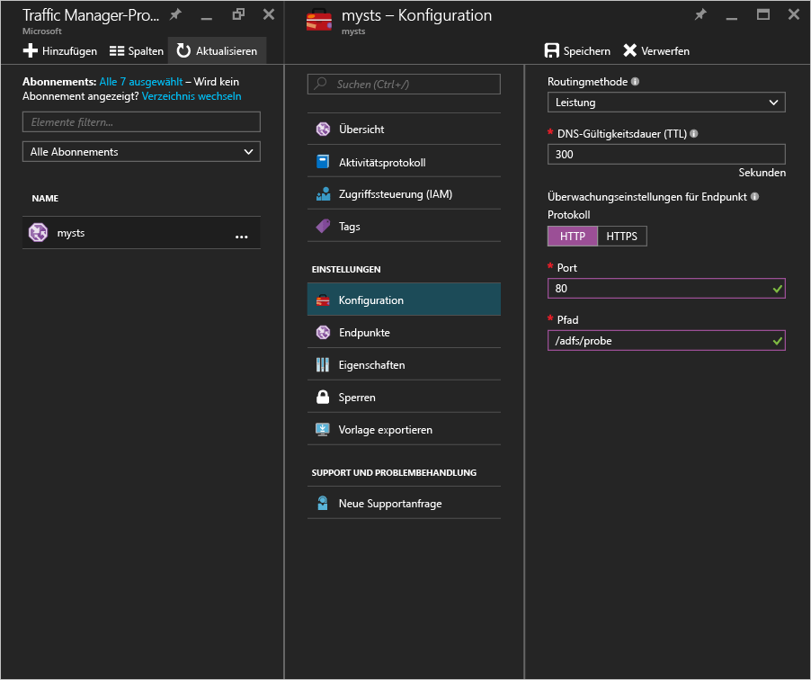
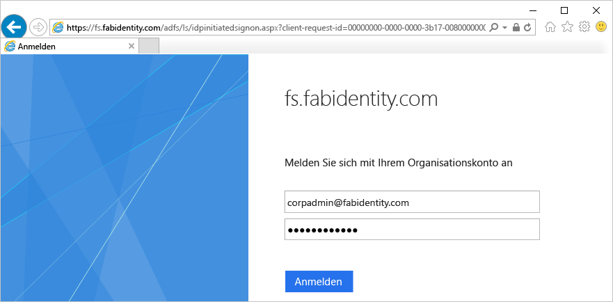
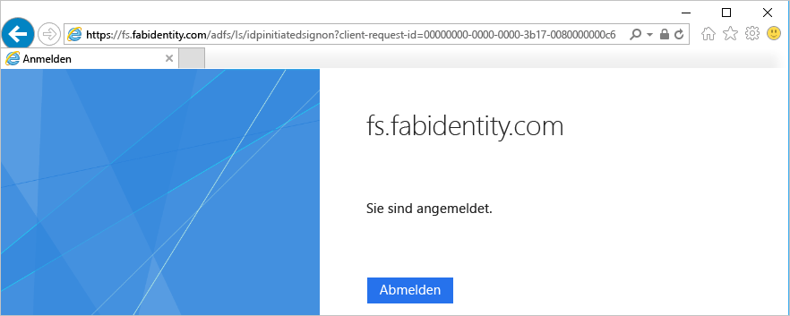

<properties
	pageTitle="Gebietsübergreifende, hochverfügbare AD FS-Bereitstellung in Azure mit Azure Traffic Manager | Microsoft Azure"
	description="In diesem Dokument wird beschrieben, wie Sie AD FS in Azure bereitstellen, um eine hohe Verfügbarkeit zu erzielen."
    keywords="AD FS mit Azure Traffic Manager, ADFS mit Azure Traffic Manager, geografisch, mehrere Datencenter, geografische Datencenter, mehrere geografische Datencenter, AD FS in Azure bereitstellen, Azure ADFS bereitstellen, Azure ADFS, Azure AD FS, ADFS bereitstellen, AD FS bereitstellen, ADFS in Azure, ADFS in Azure bereitstellen, AD FS in Azure bereitstellen, ADFS Azure, Einführung in AD FS, Azure, AD FS in Azure, IaaS, ADFS, ADFS in Azure verschieben"
	services="active-directory"
	documentationCenter=""
	authors="anandyadavmsft"
	manager="femila"
	editor=""/>

<tags
	ms.service="active-directory"
	ms.workload="identity"
	ms.tgt_pltfrm="na"
	ms.devlang="na"
	ms.topic="get-started-article"
	ms.date="09/01/2016"
	ms.author="anandy;billmath"/>
    
#Gebietsübergreifende, hochverfügbare AD FS-Bereitstellung in Azure mit Azure Traffic Manager

Unter [AD FS-Bereitstellung in Azure](active-directory-aadconnect-azure-adfs.md) erfahren Sie Schritt für Schritt, wie Sie in Azure eine einfache AD FS-Infrastruktur für Ihre Organisation bereitstellen. Dieser Artikel enthält die nächsten Schritte, mit denen Sie in Azure mithilfe von [Azure Traffic Manager](../traffic-manager/traffic-manager-overview.md) eine gebietsübergreifende AD FS-Bereitstellung erstellen können. Azure Traffic Manager unterstützt Sie beim Erstellen einer geografisch verteilten, hochverfügbaren und hochleistungsfähigen von AD FS-Infrastruktur für Ihre Organisation. Hierbei kommt eine Reihe von Routingmethoden zum Einsatz, die zur Erfüllung der verschiedenen Anforderungen der Infrastruktur zur Verfügung stehen.

Eine hochverfügbare, gebietsübergreifende AD FS-Infrastruktur bietet folgende Vorteile:

* **Beseitigung einer einzelnen Fehlerquelle (Single Point of Failure):** Mit den Failoverfunktionen von Azure Traffic Manager steht auch dann eine hochverfügbare AD FS-Infrastruktur zur Verfügung, wenn eines der Rechenzentren in einem Teil der Welt ausfällt.
* **Verbesserte Leistung:** Mit der in diesem Artikel empfohlenen Bereitstellung können Sie eine hochleistungsfähige AD FS-Infrastruktur bereitstellen, mit der sich Benutzer schneller authentifizieren können.

##Entwurfsprinzipien

Die grundlegenden Entwurfsprinzipien entsprechen den Entwurfsprinzipien aus dem Artikel „AD FS-Bereitstellung in Azure“. Das obige Diagramm zeigt eine einfache Erweiterung der grundlegenden Bereitstellung auf eine weitere geografische Region. Im Anschluss folgen einige Aspekte, die berücksichtigt werden müssen, wenn Sie Ihre Bereitstellung auf eine neue geografische Region erweitern:

* **Virtuelles Netzwerk:** Es empfiehlt sich, in der geografischen Region, in der Sie die zusätzliche AD FS-Infrastruktur bereitstellen möchten, ein neues virtuelles Netzwerk zu erstellen. Im obigen Diagramm sind „Geo1 VNET“ und „Geo2 VNET“ die beiden virtuellen Netzwerke in den einzelnen geografischen Regionen.

* **Domänencontroller und AD FS-Server im neuen geografischen VNET:** Zur Verbesserung der Leistung empfiehlt sich, Domänencontroller in der neuen geografischen Region bereitzustellen, damit die AD FS-Server in der neuen Region bei der Authentifizierung nicht einen Domänencontroller in einem anderen (weit entfernten) Netzwerk kontaktieren müssen.

* **Speicherkonten:** Speicherkonten sind einer Region zugeordnet. Da Sie Computer in einer neuen geografischen Region bereitstellen möchten, müssen Sie neue Speicherkonten für diese Region erstellen.

* **Netzwerksicherheitsgruppen:** Netzwerksicherheitsgruppen werden genau wie Speicherkonten in einer Region erstellt und können nicht anderen geografischen Regionen verwendet werden. Aus diesem Grund müssen in der neuen geografischen Region neue Netzwerksicherheitsgruppen erstellt werden, die den Netzwerksicherheitsgruppen aus der ersten geografischen Region für das INT- und das DMZ-Subnetz ähneln.

* **DNS-Bezeichnungen für öffentliche IP-Adressen:** Azure Traffic Manager kann AUSSCHLIESSLICH über DNS-Bezeichnungen auf Endpunkte verweisen. Daher müssen Sie DNS-Bezeichnungen für die öffentlichen IP-Adressen der externen Lastenausgleichsmodule erstellen.

* **Azure Traffic Manager:** Microsoft Azure Traffic Manager ermöglicht die Verteilung von Benutzerdatenverkehr auf Ihre Dienstendpunkte in unterschiedlichen Datencentern auf der ganzen Welt. Azure Traffic Manager arbeitet auf DNS-Ebene. Er verwendet DNS-Antworten, um Endbenutzer-Datenverkehr an global verteilte Endpunkte zu leiten. Clients stellen dann eine direkte Verbindung mit diesen Endpunkten her. Dank verschiedener Routingoptionen („Leistung“, „Gewichtet“ und „Priorität“) können Sie komfortabel die Routingoption auswählen, die am besten für die Anforderungen Ihrer Organisation geeignet ist.

* **VNet-zu-VNet-Konnektivität zwischen zwei Regionen:** Zwischen den eigentlichen virtuellen Netzwerken muss keine Verbindung bestehen. Da jedes virtuelle Netzwerk Zugriff auf Domänencontroller hat und selbst über AD FS und WAP-Server verfügt, kann es ganz ohne Verbindung zwischen den virtuellen Netzwerken in verschiedenen Regionen verwendet werden.

##Schritte zum Integrieren von Azure Traffic Manager

###Bereitstellen von AD FS in der neuen geografischen Region
Orientieren Sie sich an den Schritten und Richtlinien in [AD FS-Bereitstellung in Azure](active-directory-aadconnect-azure-adfs.md), um die gleiche Topologie in der neuen geografischen Region bereitzustellen.

###DNS-Bezeichnungen für öffentliche IP-Adressen der (öffentlichen) Lastenausgleichsmodule mit Internetzugriff
Wie weiter oben bereits erwähnt, kann Azure Traffic Manager nur auf DNS-Bezeichnungen als Endpunkte verweisen. Daher müssen unbedingt DNS-Bezeichnungen für die öffentlichen IP-Adressen der externen Lastenausgleichsmodule erstellt werden. Der folgende Screenshot zeigt, wie Sie Ihre DNS-Bezeichnung für die öffentliche IP-Adresse konfigurieren können:

###Bereitstellen von Azure Traffic Manager

Führen Sie die folgenden Schritte aus, um ein Traffic Manager-Profil zu erstellen. Weitere Informationen finden Sie unter [Verwalten von Azure Traffic Manager-Profilen](../traffic-manager/traffic-manager-manage-profiles.md).

1. **Erstellen eines Traffic Manager-Profils:** Versehen Sie Ihr Traffic Manager-Profil mit einem eindeutigen Namen. Dieser Profilname ist Teil des DNS-Namens und fungiert als Präfix für die Traffic Manager-Domänennamenbezeichnung. Der Name bzw. das Präfix wird „.trafficmanager.net“ hinzugefügt, um eine DNS-Bezeichnung für Ihre Traffic Manager-Instanz zu erstellen. Im folgenden Screenshot wird das Traffic Manager-DNS-Präfix auf „mysts“ festgelegt, was die DNS-Bezeichnung „mysts.trafficmanager.net“ ergibt:

    
 
2. **Datenverkehrrouting-Methode:** In Traffic Manager stehen drei Routingoptionen zur Verfügung:

    * Priorität
    * Leistung
    * Gewichtet
    
    Mit der empfohlenen Option **Leistung** erhalten Sie eine besonders reaktionsschnelle AD FS-Infrastruktur. Sie können aber natürlich auch eine der anderen Routingmethoden verwenden, wenn diese für Ihre Anforderungen besser geeignet ist. Die Wahl der Routingoption hat keine Auswirkungen auf die AD FS-Funktion. Weitere Informationen finden Sie unter [Traffic Manager-Methoden für das Datenverkehrsrouting](../traffic-manager/traffic-manager-routing-methods.md). Im obigen Beispielscreenshot ist die Methode **Performance** (Leistung) ausgewählt.
   
3.	**Konfigurieren von Endpunkten:** Klicken Sie auf der Traffic Manager-Seite auf „Endpunkte“, und wählen Sie „Hinzufügen“ aus. Dadurch wird eine Seite zum Hinzufügen eines Endpunkts angezeigt, die in etwa wie auf dem folgenden Screenshot aussieht:
 
    
 
    Orientieren Sie sich bei den verschiedenen Eingaben an der folgenden Richtlinie:

    **Typ:** Wählen Sie „Azure-Endpunkt“ aus, da wir auf eine öffentliche Azure-IP-Adresse verweisen möchten.

    **Name:** Erstellen Sie einen Namen, den Sie dem Endpunkt zuordnen möchten. Dies ist nicht der DNS-Name und hat keinen Einfluss auf DNS-Einträge.

    **Zielressourcentyp:** Wählen Sie für diese Eigenschaft den Wert „Öffentliche IP-Adresse“ aus.

    **Zielressource:** Hier können Sie aus den verschiedenen DNS-Bezeichnungen wählen, die im Rahmen Ihres Abonnements zur Verfügung stehen. Wählen Sie die DNS-Bezeichnung für das Ziel aus.

    Fügen Sie für jede geografische Region, an die Azure Traffic Manager Datenverkehr weiterleiten soll, einen Endpunkt hinzu. Weitere Informationen und ausführliche Schritte zum Hinzufügen/Konfigurieren von Endpunkten in Traffic Manager finden Sie unter [Hinzufügen, Deaktivieren, Aktivieren oder Löschen von Endpunkten](../traffic-manager/traffic-manager-endpoints.md).
    
4. **Konfigurieren eines Tests:** Klicken Sie auf der Traffic Manager-Seite auf „Konfiguration“. Auf der Konfigurationsseite müssen Sie die Überwachungseinstellungen so festlegen, dass der Test am HTTP-Port 80 und am relativen Pfad „/adfs/probe“ durchgeführt wird:

    

    >[AZURE.NOTE] **Vergewissern Sie sich, dass die Endpunkte nach Abschluss die Konfiguration den Status „ONLINE“ aufweisen.** Sollte der Zustand aller Endpunkte beeinträchtigt sein, versucht Azure Traffic Manager, den Datenverkehr unter der Annahme, dass die Diagnoseergebnisse fehlerhaft und alle Endpunkte erreichbar sind, bestmöglich weiterzuleiten.

5. **Ändern von DNS-Einträgen für Azure Traffic Manager:** Bei Ihrem Verbunddienst muss es sich um einen CNAME-Eintrag für den DNS-Namen von Azure Traffic Manager handeln. Erstellen Sie einen CNAME-Eintrag in den öffentlichen DNS-Einträgen, sodass jemand, der den Verbunddienst erreichen möchte, tatsächlich Azure Traffic Manager erreicht.

    Wenn Sie also beispielsweise den Verbunddienst „fs.fabidentity.com“ an Traffic Manager verweisen möchten, müssen Sie Ihren DNS-Ressourceneintrag wie folgt ändern:

    <code>fs.fabidentity.com IN CNAME mysts.trafficmanager.net</code>

##Testen des Routings und der AD FS-Anmeldung   

###Routingtest

Für einen einfachen Routingtest können Sie den DNS-Namen des Verbunddiensts jeweils über einen Computer in den einzelnen geografischen Region anpingen. Der tatsächlich angepingte Endpunkt wird (abhängig von der verwendeten Routingmethode) in der Pingausgabe angezeigt. Bei Verwendung der Routingmethode „Leistung“ wird also beispielsweise der nächstgelegene Endpunkt erreicht. Im Anschluss sehen Sie einen Screenshot mit zwei Pings von zwei Clientcomputern aus unterschiedlichen Regionen („EastAsia“ und „WestUS“):

###Test der AD FS-Anmeldung

Die einfachste Möglichkeit zum Testen von AD FS ist die Verwendung der Seite „IdpInitiatedSignon.aspx“. Hierfür ist es erforderlich, in den AD FS-Eigenschaften „IdpInitiatedSignOn“ zu aktivieren. Führen Sie die unten angegebenen Schritte aus, um Ihr AD FS-Setup zu überprüfen.
 
1. Führen Sie das unten angegebene Cmdlet auf dem AD FS-Server aus, und verwenden Sie PowerShell, um es auf „Aktiviert“ festzulegen. Set-AdfsProperties -EnableIdPInitiatedSignonPage $true
2. Rufen Sie auf einem beliebigen externen Computer „https://<Ihr\_Verbunddienst-DNS>/adfs/ls/IdpInitiatedSignon.aspx“ auf.
3. Die folgende AD FS-Seite wird angezeigt:

    

    Bei einer erfolgreichen Anmeldung wird die folgende Erfolgsmeldung angezeigt:

    
 
##Verwandte Links
* [AD FS-Bereitstellung in Azure](active-directory-aadconnect-azure-adfs.md)
* [Was ist Traffic Manager?](../traffic-manager/traffic-manager-overview.md)
* [Informationen zu Traffic Manager-Routingmethoden für Datenverkehr](../traffic-manager/traffic-manager-routing-methods.md)

##Nächste Schritte
* [Verwalten von Azure Traffic Manager-Profilen](../traffic-manager/traffic-manager-manage-profiles.md)
* [Hinzufügen, Deaktivieren, Aktivieren oder Löschen von Endpunkten](../traffic-manager/traffic-manager-endpoints.md)

<!---HONumber=AcomDC_0914_2016-->