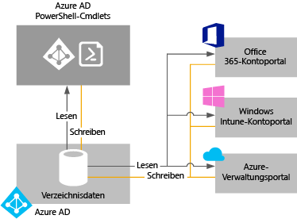

# Verwalten Ihres Azure AD-Verzeichnisses

## Was ist Azure AD-Mandant?
In Azure Active Directory (Azure AD) ist ein Mandant eine dedizierte Instanz eines Azure AD-Verzeichnisses, die Ihre Organisation erhält, wenn sie sich für einen Microsoft-Clouddienst wie Azure oder Office 365 registriert. Jedes Azure AD-Verzeichnis ist eindeutig und von anderen Azure AD-Verzeichnissen getrennt. Genau so wie ein Bürogebäude, das ein sicherer Ort nur für Ihre Organisation ist, soll auch ein Azure AD-Verzeichnis ein sicheres Anlagegut nur für Ihre Organisation darstellen. Die Azure AD-Architektur isoliert Kundendaten und Identitätsinformationen, sodass Benutzer und Administratoren eines Azure AD-Verzeichnisses nicht versehentlich oder mit böser Absicht auf Daten in einem anderen Verzeichnis zugreifen können.

## Wie bekomme ich ein Azure AD-Verzeichnis?
Azure AD bietet die wichtigsten Unternehmensverzeichnis- und Verwaltungsfunktionen für die meisten Clouddienste von Microsoft, einschließlich:

* Azure
* Microsoft Office 365
* Microsoft Dynamics CRM Online
* Microsoft Intune

Sie erhalten ein Azure AD-Verzeichnis, wenn Sie sich für einen dieser Clouddienste von Microsoft registrieren. Sie können je nach Bedarf weitere Verzeichnisse erstellen. Beispielsweise können Sie Ihr erstes Verzeichnis als Produktionsverzeichnis verwalten und dann ein anderes Verzeichnis für Testzwecke oder Staging erstellen.

### Verwenden des in einem neuen Azure-Abonnement enthaltenen Azure AD-Verzeichnisses

Wir empfehlen, bei der Registrierung für andere Microsoft-Dienste das Administratorkonto zu verwenden, das Sie auch für Ihren ersten Dienst verwendet haben. Auf der Grundlage der Informationen, die Sie bei der erstmaligen Registrierung für einen Microsoft-Dienst angeben, wird eine neue Azure AD-Verzeichnisinstanz für Ihre Organisation erstellt. Wenn Sie dieses Verzeichnis beim Abonnieren anderer Microsoft-Dienste zur Authentifizierung von Anmeldeversuchen verwenden, können diese Dienste die vorhandenen Benutzerkonten, Richtlinien, Einstellungen oder die lokale Verzeichnisintegration verwenden, die Sie in Ihrem Standardverzeichnis konfigurieren.

Wenn Sie sich also beispielsweise für ein Microsoft Intune-Abonnement registrieren und dann Ihr lokales Active Directory weiter mit Ihrem Azure AD-Verzeichnis synchronisieren, können Sie sich für einen anderen Microsoft-Dienst wie Office 365 registrieren und komfortabel von den gleichen Vorteilen der Verzeichnisintegration profitieren wie bei Microsoft Intune.

Weitere Informationen zum Integrieren Ihres lokalen Verzeichnisses in Azure AD finden Sie unter [Integrieren Ihrer lokalen Verzeichnisse in Azure Active Directory](active-directory-aadconnect.md).

### Zuordnen eines vorhandenen Azure AD-Verzeichnisses zu einem neuen Azure-Abonnement
Sie können ein neues Azure-Abonnement dem gleichen Verzeichnis zuordnen, das auch die Anmeldung für ein vorhandenes Office 365- oder Microsoft Intune-Abonnement authentifiziert. Weitere Informationen zu diesem Szenario finden Sie unter [Übertragen des Besitzes eines Azure-Abonnements auf ein anderes Konto](../billing/billing-subscription-transfer.md).

### Erstellen Sie ein Azure AD-Verzeichnis, indem Sie sich für einen Microsoft Clouddienst als Organisation registrieren
Falls Sie noch nicht über ein Abonnement für einen Microsoft-Clouddienst verfügen, können Sie sich über einen der folgenden Links registrieren. Bei der Registrierung für Ihren ersten Dienst wird automatisch ein Azure AD-Verzeichnis erstellt.

* [Microsoft Azure](https://account.azure.com/organization)
* [Office 365](http://products.office.com/business/compare-office-365-for-business-plans/)
* [Microsoft Intune](https://portal.office.com/Signup/Signup.aspx?OfferId=40BE278A-DFD1-470a-9EF7-9F2596EA7FF9&dl=INTUNE_A&ali=1#0%20)

### Ändern des Standardverzeichnisses für ein Abonnement

1. Melden Sie sich beim [Azure-Kontocenter](https://account.windowsazure.com/Home/Index) mit einem Konto an, bei dem es sich um den Kontoadministrator für das Abonnement handelt, um den Abonnementbesitz zu übertragen.
2. Achten Sie darauf, dass sich der Benutzer, der als der neue Abonnementbesitzer fungieren soll, im entsprechenden Verzeichnis befindet.
3. Klicken Sie auf **Abonnement übertragen**.
4. Geben Sie den Empfänger an. Der Empfänger erhält automatisch eine E-Mail mit einem Link für den Vorgang zum Akzeptieren.
5. Der Empfänger klickt auf den Link und folgt den Anweisungen. Außerdem gibt er seine Zahlungsinformationen ein. Wenn der Empfänger erfolgreich ist, wird das Abonnement übertragen. 
6. Wenn die Übertragung des Abonnementbesitzes erfolgreich ist, wird das Standardverzeichnis des Abonnements wird in das Verzeichnis geändert, in dem sich der Benutzer befindet.

### Verwalten des Standardverzeichnisses in Azure
Wenn Sie sich für Azure registrieren, wird Ihrem Abonnement Azure AD-Standardverzeichnis zugeordnet. Für die Verwendung von Azure AD fallen keine Kosten an, und bei Ihren Verzeichnissen handelt es sich um eine kostenlose Ressource. Es stehen auch kostenpflichtige Azure AD-Dienste zur Verfügung. Diese werden jedoch separat lizenziert und bieten zusätzliche Funktionen wie Unternehmensbranding bei der Anmeldung oder eine Self-Service-Kennwortzurücksetzung. Anstelle der Standarddomäne „*.onmicrosoft.com“ kann auch eine benutzerdefinierte Domäne mit einem DNS-Namen erstellt werden.

## Wie kann ich Verzeichnisdaten verwalten?
Für die Verwaltung von Microsoft-Clouddienstabonnements können Sie das [Azure AD Admin Center](https://aad.portal.azure.com), das Microsoft Intune-Kontoportal oder das [Office 365 Admin Center](https://portal.office.com/) verwenden, um Verzeichnisdaten Ihrer Organisation zu verwalten. In Azure AD gespeicherte Daten können außerdem mithilfe von [Azure Active Directory-PowerShell-Cmdlets](https://docs.microsoft.com/powershell/azure/active-directory) verwaltet werden.

Über diese Portale (oder über die Cmdlets) können Sie folgende Aktionen durchführen:

* Erstellen und Verwalten von Benutzer- und Gruppenkonten
* Verwalten verwandter Clouddienste für die Abonnements Ihrer Organisation
* Einrichten der lokalen Integration in Identitäts- und Authentifizierungsdienste von Azure AD

Das Azure AD Admin Center, das Office 365 Admin Center, das Microsoft Intune-Kontoportal und die Azure AD-Cmdlets verwenden für Lese- und Schreibvorgänge eine einzelne gemeinsam genutzte Instanz von Azure AD, die dem Verzeichnis Ihrer Organisation zugeordnet ist. Jedes dieser Tools fungiert als Front-End-Schnittstelle, die Ihre Verzeichnisdaten abruft oder ändert.

Wenn Sie die Daten Ihrer Organisation über eines der Portale oder mithilfe der Cmdlets ändern, während Sie im Kontext eines dieser Dienste angemeldet sind, werden die Änderungen auch in den anderen Portalen angezeigt, wenn Sie sich das nächste Mal anmelden. Diese Daten werden von allen Microsoft-Clouddiensten genutzt, die Sie abonnieren.

Wenn Sie beispielsweise über das Office 365 Admin Center die Anmeldung eines Benutzers blockieren, wird dessen Anmeldung für jeden Dienst blockiert, den Ihre Organisation derzeit abonniert hat. Wenn Sie das gleiche Benutzerkonto über das Microsoft Intune-Kontoportal anzeigen, sehen Sie auch dort, dass der Benutzer blockiert ist.

## Wie kann ich mehrere Verzeichnisse hinzufügen und verwalten?
Sie können [ein Azure AD-Verzeichnis über das Azure-Portal](https://portal.azure.com/#create/Microsoft.AzureActiveDirectory) hinzufügen. Geben Sie die erforderlichen Informationen an, und wählen Sie **Erstellen** aus.

Sie können jedes Verzeichnis als vollständig unabhängige Ressource verwalten: Jedes Verzeichnis ist gleichberechtigt, verfügt über sämtliche Features und ist logisch unabhängig von anderen Verzeichnissen, die Sie verwalten. Es ist keine hierarchische Beziehung zwischen den Verzeichnissen vorhanden. Diese Unabhängigkeit zwischen den Verzeichnissen beinhaltet Ressourcen-, Verwaltungs- und Synchronisierungsunabhängigkeit.

* **Ressourcenunabhängigkeit**. Wenn Sie eine Ressource in einem Verzeichnis erstellen oder löschen, hat dies keine Auswirkungen auf Ressourcen in einem anderen Verzeichnis (gilt teilweise nicht für externe Benutzer). Wenn Sie eine benutzerdefinierte Domäne "contoso.com" in einem Verzeichnis verwenden, kann sie in keinem anderen Verzeichnis verwendet werden.
* **Verwaltungsunabhängigkeit**.  Wenn ein Benutzer, der kein Administrator des Verzeichnisses „Contoso“ ist, ein Testverzeichnis namens „Test“ erstellt, gilt Folgendes:
  
  * Die Administratoren für das Verzeichnis „Contoso“ haben keine direkten Administratorberechtigungen für das Verzeichnis „Test“, sofern ihnen nicht ein Administrator dieses Verzeichnisses die Berechtigungen explizit erteilt. Administratoren von „Contoso“ können den Zugriff auf das Verzeichnis „Test“ steuern, da sie das Benutzerkonto steuern können, mit dem das Verzeichnis „Test“ erstellt wurde.
    
  * Wenn Sie eine Administratorrolle für einen Benutzer in einem einzelnen Verzeichnis zuweisen oder entfernen, hat diese Änderung keine Auswirkungen auf Administratorrollen, die der Benutzer möglicherweise in einem anderen Verzeichnis besitzt.
* **Synchronisierungsunabhängigkeit**. Sie können jeden Azure AD-Mandanten unabhängig konfigurieren, um Daten aus einer einzelnen Instanz des Verzeichnissynchronisierungstools Azure AD Connect zu synchronisieren.

Im Gegensatz zu anderen Azure-Ressourcen sind Ihre Verzeichnisse keine untergeordneten Ressourcen eines Azure-Abonnements. Wenn Sie also kündigen oder Ihr Azure-Abonnement ablaufen lassen, können Sie weiterhin auf Ihre Verzeichnisdaten mithilfe von Azure AD PowerShell, der Azure Graph-API oder anderen Schnittstellen wie Office 365 Admin Center zugreifen. Sie können dem Verzeichnis auch ein anderes Abonnement zuordnen.

## Vorbereiten der Löschung eines Azure AD-Verzeichnisses
Ein globaler Administrator kann ein Azure AD-Verzeichnis über das Portal löschen. Beim Löschen eines Verzeichnisses werden auch alle darin enthaltenen Ressourcen gelöscht. Vergewissern Sie sich vor dem Löschen, dass Sie das Verzeichnis nicht benötigen.

> [!NOTE]
> Benutzer, die mit einem Geschäfts-, Schul- oder Unikonto angemeldet sind, dürfen ihr Basisverzeichnis nicht löschen. Wenn der Benutzer beispielsweise als joe@contoso.onmicrosoft.com angemeldet ist, kann er das Verzeichnis mit der Standarddomäne „contoso.onmicrosoft.com“ nicht löschen.

Bei Azure AD müssen bestimmte Bedingungen erfüllt sein, um ein Verzeichnis zu löschen. Dadurch soll verhindert werden, dass die Löschung eines Verzeichnisses Benutzer oder Anwendungen beeinträchtigt, indem es etwa dazu führt, dass Benutzer sich nicht mehr bei Office 365 anmelden oder nicht mehr auf Ressourcen in Azure zugreifen können. Wenn also beispielsweise versehentlich ein Verzeichnis für ein Abonnement gelöscht wird, können Benutzer nicht mehr auf die Azure-Ressourcen dieses Abonnements zugreifen.

Die folgenden Bedingungen werden überprüft:

* Der einzige Benutzer im Verzeichnis muss der globale Administrator sein, der das Verzeichnis löscht. Andere Benutzer müssen gelöscht werden, bevor das Verzeichnis gelöscht werden kann. Wenn Benutzer aus der lokalen Umgebung synchronisiert werden, muss die Synchronisierung deaktiviert werden, und die Benutzer müssen im Cloudverzeichnis über das Azure-Portal oder mithilfe von Azure PowerShell-Cmdlets gelöscht werden. Es gibt keine Anforderung zum Löschen von Gruppen oder Kontakten, z. B. aus Office 365 Admin Center hinzugefügten Kontakten.
* Es können keine Anwendungen im Verzeichnis vorhanden sein. Alle Anwendungen müssen gelöscht werden, bevor das Verzeichnis gelöscht werden kann.
* Mit dem Verzeichnis darf kein Anbieter für Multi-Factor Authentication verknüpft sein.
* Dem Verzeichnis können keine Abonnements für Microsoft Online Services, z.B. Microsoft Azure, Office 365 oder Azure AD Premium, zugeordnet werden. Wenn für Sie in Azure beispielsweise ein Standardverzeichnis erstellt wurde, können Sie dieses Verzeichnis nicht löschen, wenn es vom Azure-Abonnement noch für die Authentifizierung benötigt wird. Analog dazu können Sie auch kein Verzeichnis löschen, wenn ein anderer Benutzer dem Verzeichnis ein Abonnement zugeordnet hat. 

## Nächste Schritte
* [Azure AD-Forum](https://social.msdn.microsoft.com/Forums/home?forum=WindowsAzureAD)
* [Azure Multi-Factor Authentication-Forum](https://social.msdn.microsoft.com/Forums/home?forum=windowsazureactiveauthentication)
* [Stack Overflow für Azure-Fragen](http://stackoverflow.com/questions/tagged/azure)
* [Azure Active Directory PowerShell](https://docs.microsoft.com/powershell/azure/active-directory)
* [Zuweisen von Administratorrollen in Azure AD](active-directory-assign-admin-roles.md)

