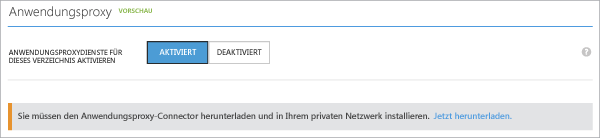

<properties
	pageTitle="Aktivieren des Azure AD-Anwendungsproxys | Microsoft Azure"
	description="Aktivieren Sie den Anwendungsproxy über das klassische Azure-Portal, und installieren Sie die Connectors für den Reverseproxy."
	services="active-directory"
	documentationCenter=""
	authors="kgremban"
	manager="StevenPo"
	editor=""/>

<tags
	ms.service="active-directory"
	ms.workload="identity"
	ms.tgt_pltfrm="na"
	ms.devlang="na"
	ms.topic="get-started-article"
	ms.date="06/01/2016"
	ms.author="kgremban"/>

# Aktivieren des Anwendungsproxys über das Azure-Portal

In diesem Artikel erfahren Sie, wie Sie den Microsoft Azure AD-Anwendungsproxy für Ihr Cloudverzeichnis in Azure AD aktivieren. Hierzu müssen Sie unter anderem in Ihrem privaten Netzwerk den Anwendungsproxy-Connector installieren. Dieser dient zur Verwaltung der Verbindung zwischen Ihrem Netzwerk und dem Proxydienst. Außerdem müssen Sie den Connector bei Ihrem Microsoft Azure AD-Mandantenabonnement registrieren. Weitere Informationen zu den Vorteilen des Anwendungsproxys finden Sie unter [Bereitstellen von sicherem Remotezugriff auf lokale Anwendungen](active-directory-application-proxy-get-started.md).

Nach Abschluss dieser exemplarischen Vorgehensweise zur Aktivierung des Azure AD-Anwendungsproxys können Sie Ihre lokalen Apps für Remotezugriff veröffentlichen.

> [AZURE.NOTE] Das Feature "Anwendungsproxy" ist nur verfügbar, wenn Sie Azure Active Directory auf die Premium oder Basic Edition aktualisiert haben. Weitere Informationen finden Sie unter [Azure Active Directory-Editionen](active-directory-editions.md).

## Voraussetzungen für den Anwendungsproxy
Bevor Sie die Anwendungsproxydienste aktivieren und verwenden können, benötigen Sie Folgendes:

- Ein [Basic- oder Premium-Abonnement](active-directory-editions.md) für Microsoft Azure AD und ein Azure AD-Verzeichnis, für das Sie als globaler Administrator fungieren.
- Einen Server, auf dem Windows Server 2012 R2 bzw. Windows 8.1 oder höher installiert ist und auf dem Sie den Anwendungsproxy-Connector installieren können. Der Server sendet HTTPS-Anforderungen an die Anwendungsproxydienste in der Cloud und benötigt eine HTTPS-Verbindung mit den Anwendungen, die Sie veröffentlichen möchten.
- Wenn der Pfad durch eine Firewall geschützt ist, vergewissern Sie sich, dass die Firewall so konfiguriert ist, dass der Connector HTTPS-Anforderungen (TCP) an den Anwendungsproxy richten kann. Der Connector verwendet diese Ports zusammen mit untergeordneten Domänen, die Teil der übergeordneten Domänen sind: *msappproxy.net* und *servicebus.windows.net*. Stellen Sie sicher, dass **alle** folgenden Ports für den **ausgehenden** Datenverkehr geöffnet sind:

	| Portnummer | Beschreibung |
	| --- | --- |
	| 80 | Ermöglicht ausgehenden HTTP-Verkehr für die Sicherheitsüberprüfung. |
	| 443 | Ermöglicht die Benutzerauthentifizierung für Azure AD (nur für den Connectorregistrierungsprozess erforderlich). |
	| 10100 - 10120 | Ermöglicht das Zurücksenden von LOB HTTP-Antworten an den Proxy. |
	| 9352, 5671 | Ermöglicht eine Kommunikation zwischen Connector und Azure-Dienst für eingehende Anforderungen. |
	| 9350 | Optional; verbessert die Leistung für eingehende Anforderungen. |
	| 8080 | Aktiviert die Bootstrapsequenz des Connectors sowie eine automatische Aktualisierung des Connectors. |
	| 9090 | Ermöglicht die Connectorregistrierung (nur für den Connectorregistrierungsprozess erforderlich). |
	| 9091 | Ermöglicht die automatische Erneuerung des Vertrauenszertifikats für den Connector. |

Wenn Ihre Firewall Datenverkehr gemäß Ursprungsbenutzern erzwingt, öffnen Sie diese Ports für den Datenverkehr aus Windows-Diensten, die als Netzwerkdienst ausgeführt werden. Stellen Sie außerdem sicher, dass Port 8080 für "NT Authority\\System" aktiviert ist.

## Schritt 1: Aktivieren des Anwendungsproxys in Azure AD
1. Melden Sie sich als Administrator beim [klassischen Azure-Portal](https://manage.windowsazure.com/) an.
2. Gehen Sie zu Active Directory, und wählen Sie das Verzeichnis aus, in dem Sie den Anwendungsproxy aktivieren möchten.

	

3. Wählen Sie auf der Verzeichnisseite die Option **Konfigurieren** aus, und navigieren Sie nach unten zu **Anwendungsproxy**.
4. Legen Sie die Option **Anwendungsproxydienste für dieses Verzeichnis aktivieren** auf **Aktiviert** fest.

	

5. Wählen Sie **Jetzt herunterladen** aus. Dadurch gelangen Sie zum Download des Azure AD-Anwendungsproxy-Connectors. Lesen und akzeptieren Sie die Lizenzbedingungen, und klicken Sie auf **Herunterladen**, um die Windows Installer-Datei (.exe) für den Anwendungsproxyconnector herunterzuladen.

## Schritt 2: Installieren und Registrieren des Connectors
1. Führen Sie die Datei *AADApplicationProxyConnectorInstaller.exe* auf dem Server aus, den Sie gemäß den oben genannten Vorgaben vorbereitet haben.
2. Befolgen Sie die Anweisungen des Assistenten für die Installation.
3. Während der Installation werden Sie aufgefordert, den Connector beim Anwendungsproxy Ihres Azure AD-Mandanten zu registrieren.

  - Geben Sie Ihre globalen Azure AD-Administratoranmeldeinformationen ein. Ihr globaler Administratorenmandant kann von Ihren Microsoft Azure-Anmeldeinformationen abweichen.
  - Achten Sie darauf, dass sich der Administrator, der den Connector registriert, in dem Verzeichnis befindet, in dem Sie auch den Anwendungsproxydienst aktiviert haben. Wenn die Mandantendomäne also beispielsweise „contoso.com“ lautet, muss sich der Administrator als admin@contoso.com oder mit einem anderen Aliasnamen in dieser Domäne anmelden.
  - Falls auf dem Server, auf dem Sie den Azure AD-Connector installieren, die Option **Verstärkte Sicherheitskonfiguration für IE** auf **Ein** festgelegt ist, wird der Registrierungsbildschirm möglicherweise blockiert. Befolgen Sie in diesem Fall die Anweisungen in der Fehlermeldung, um den Zugriff zuzulassen. Stellen Sie sicher, dass die erweiterte Sicherheit von Internet Explorer deaktiviert ist.
  - Falls die Connector-Registrierung nicht erfolgreich war, lesen Sie unter [Problembehandlung von Anwendungsproxys](active-directory-application-proxy-troubleshoot.md) weiter.  

4. Nach Abschluss der Installation werden zwei neue Dienste auf dem Server hinzugefügt, wie unten dargestellt.

 	- **Microsoft AAD-Anwendungsproxy-Connector** ermöglicht die Konnektivität.
	- **Microsoft AAD-Anwendungsproxy-Connector-Updater** prüft in regelmäßigen Abständen, ob neue Versionen des Connectors verfügbar sind, und aktualisiert den Connector gegebenenfalls.

	

5. Klicken Sie im Installationsfenster auf **Fertig stellen**, um die Installation abzuschließen.

Nun können Sie [Anwendungen mit dem Anwendungsproxy veröffentlichen](active-directory-application-proxy-publish.md).

Sollten Sie hohe Verfügbarkeit benötigen, müssen Sie mindestens einen weiteren Connector bereitstellen. Wiederholen Sie dazu die oben angegebenen Schritte 2 und 3. Jeder Connector muss separat registriert werden.

Wenn Sie den Connector deinstallieren möchten, deinstallieren Sie sowohl den Connector- als auch den Updatedienst, und stellen Sie anschließend sicher, dass der Computer neu gestartet wird, um den Dienst vollständig zu entfernen.

## Nächste Schritte

- [Veröffentlichen von Anwendungen mit dem Anwendungsproxy](active-directory-application-proxy-publish.md)
- [Veröffentlichen von Anwendungen mit Ihrem eigenen Domänennamen](active-directory-application-proxy-custom-domains.md)
- [Aktivieren der einmaligen Anmeldung](active-directory-application-proxy-sso-using-kcd.md)
- [Problembehandlung von Anwendungsproxys](active-directory-application-proxy-troubleshoot.md)

Aktuelle Neuigkeiten und Updates finden Sie im [Blog zum Anwendungsproxy](http://blogs.technet.com/b/applicationproxyblog/).

<!---HONumber=AcomDC_0608_2016-->