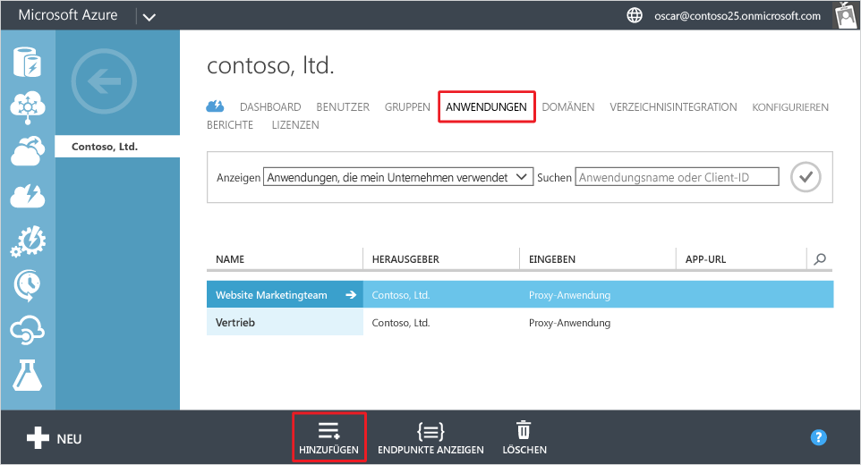
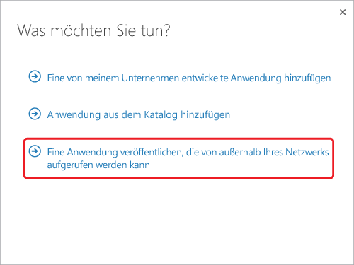
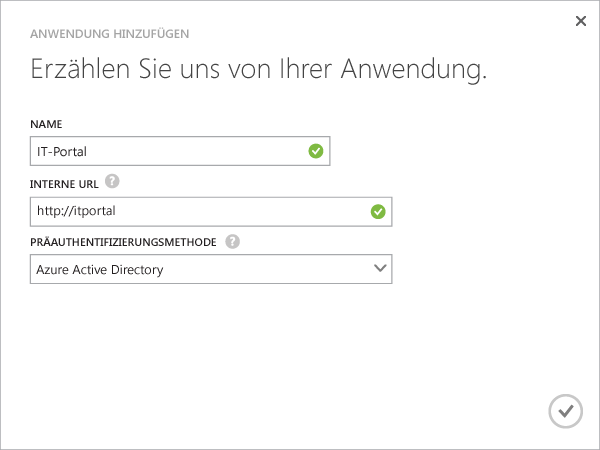
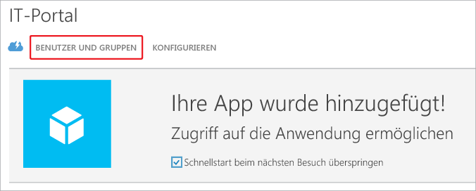
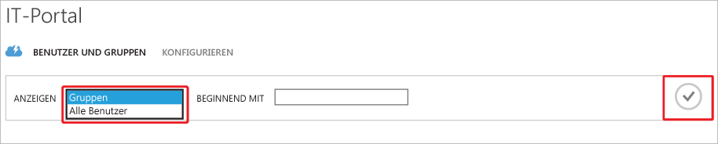
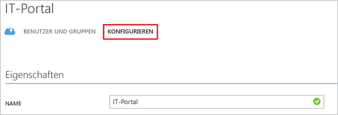

<properties
	pageTitle="Veröffentlichen von Apps mit Azure AD-Anwendungsproxy | Microsoft Azure"
	description="Es wird beschrieben, wie Sie lokale Anwendungen mit dem Azure AD-Anwendungsproxy in der Cloud veröffentlichen."
	services="active-directory"
	documentationCenter=""
	authors="kgremban"
	manager="femila"
	editor=""/>

<tags
	ms.service="active-directory"
	ms.workload="identity"
	ms.tgt_pltfrm="na"
	ms.devlang="na"
	ms.topic="get-started-article"
	ms.date="07/19/2016"
	ms.author="kgremban"/>

# Veröffentlichen von Anwendungen mit Azure AD-Anwendungsproxy

Mit Azure AD-Anwendungsproxy können Sie Remotearbeiter unterstützen, indem Sie lokale Anwendungen veröffentlichen, auf die über das Internet zugegriffen werden kann. Zu diesem Zeitpunkt sollten Sie den [Anwendungsproxy im klassischen Azure-Portal bereits aktiviert haben](active-directory-application-proxy-enable.md). In diesem Artikel werden Sie durch die Schritte zum Veröffentlichen von Anwendungen geführt, die in Ihrem lokalen Netzwerk ausgeführt werden, sowie zum Ermöglichen des sicheren Remotezugriffs von außerhalb Ihres Netzwerks. Nach dem Durcharbeiten dieses Artikels können Sie die Anwendung mit personalisierten Informationen oder Sicherheitsanforderungen konfigurieren.

> [AZURE.NOTE] Das Feature "Anwendungsproxy" ist nur verfügbar, wenn Sie Azure Active Directory auf die Premium oder Basic Edition aktualisiert haben. Weitere Informationen finden Sie unter [Azure Active Directory-Editionen](active-directory-editions.md).

## Veröffentlichen einer App mithilfe des Assistenten

1. Melden Sie sich als Administrator beim [klassischen Azure-Portal](https://manage.windowsazure.com/) an.
2. Navigieren Sie zu Active Directory, und wählen Sie das Verzeichnis aus, in dem Sie den Anwendungsproxy aktiviert haben.

	

3. Klicken Sie auf die Registerkarte **Anwendungen** und dann am unteren Bildschirmrand auf **Hinzufügen**.

	

4. Wählen Sie **Eine Anwendung veröffentlichen, die von außerhalb Ihres Netzwerks aufgerufen werden kann**.

	

5. Geben Sie die folgenden Informationen zur Anwendung an:

	- **Name**: Dies ist der benutzerfreundliche Name für Ihre Anwendung. Er muss in Ihrem Verzeichnis eindeutig sein.
	- **Interne URL**: Die Adresse, die vom Anwendungsproxy-Connector verwendet wird, um aus dem privaten Netzwerk auf die Anwendung zuzugreifen. Sie können einen bestimmten Pfad auf dem Back-End-Server für die Veröffentlichung angeben, während der Rest des Servers nicht veröffentlicht wird. Auf diese Weise können Sie unterschiedliche Websites auf demselben Server veröffentlichen und jeweils einen eigenen Namen und Zugriffsregeln vergeben.

		> [AZURE.TIP] Stellen Sie beim Veröffentlichen eines Pfads sicher, dass er alle erforderlichen Bilder, Skripts und Stylesheets für Ihre Anwendung enthält. Wenn sich die App beispielsweise unter https://yourapp/app befindet und Bilder unter https://yourapp/media genutzt werden, sollten Sie https://yourapp/ als Pfad veröffentlichen.

	- **Präauthentifizierungsmethode**: Gibt das Verfahren an, wie der Anwendungsproxy Benutzer überprüft, bevor diese Zugriff auf Ihre Anwendung erhalten. Wählen Sie im Dropdownmenü eine Option aus.

		- Azure Active Directory: Der Anwendungsproxy leitet Benutzer an die Anmeldung mit Azure AD um. Hierbei werden deren Berechtigungen für das Verzeichnis und die Anwendung authentifiziert.
		- Pass-Through: Benutzer müssen sich nicht authentifizieren, um Zugriff auf die Anwendung zu erhalten.

	

6. Um den Assistenten zu beenden, klicken Sie auf das Häkchen unten im Bildschirm. Die Anwendung ist jetzt in Azure AD definiert.

## Zuweisen von Benutzern und Gruppen zur Anwendung

Damit Benutzer auf die von Ihnen veröffentlichte Anwendung zugreifen können, müssen Sie diese entweder einzeln oder in Gruppen zuweisen. (Denken Sie daran, auch sich selbst den Zugriff zuzuweisen.) Hierfür ist es erforderlich, dass jeder Benutzer über eine Lizenz für Azure Basic oder höher verfügt. Sie können Lizenzen einzeln oder für Gruppen zuweisen. Weitere Informationen finden Sie unter [Zuweisen von Benutzern zu einer Anwendung](active-directory-applications-guiding-developers-assigning-users.md).

Bei Apps, für die eine Präauthentifizierung erforderlich ist, werden hierbei Berechtigungen zum Verwenden der App erteilt. Bei Apps, für die keine Präauthentifizierung erforderlich ist, können Benutzer der App trotzdem zugewiesen werden, damit sie in der Anwendungsliste angezeigt wird, z.B. MyApps.

1. Nach dem Beenden des Assistenten für das Hinzufügen von Apps wird die Schnellstartseite für die Anwendung angezeigt. Wählen Sie die Option **Benutzer und Gruppen**, um zu verwalten, wer Zugriff auf die App hat.

	

2. Suchen Sie in Ihrem Verzeichnis nach bestimmten Gruppen, oder zeigen Sie alle Benutzer an. Klicken Sie zum Anzeigen der Suchergebnisse auf das Häkchen.

  	

2. Wählen Sie die einzelnen Benutzer oder Gruppen aus, die Sie dieser App zuweisen möchten, und klicken Sie auf **Zuweisen**. Sie werden aufgefordert, die Aktion zu bestätigen.

> [AZURE.NOTE] Für Apps mit „Integrierter Windows-Authentifizierung“ können Sie nur Benutzer und Gruppen zuweisen, die über Ihr lokales Active Directory synchronisiert werden. Benutzer, die sich über ein Microsoft-Konto anmelden, und Gäste können nicht für Apps zugewiesen werden, die mit dem Azure Active Directory-Anwendungsproxy veröffentlicht werden. Stellen Sie sicher, dass Ihre Benutzer sich mit Anmeldeinformationen anmelden, die derselben Domäne wie die von Ihnen veröffentlichte App angehören.

## Testen der veröffentlichten Anwendung

Nachdem Sie die Anwendung veröffentlicht haben, können Sie sie testen, indem Sie zur veröffentlichten URL navigieren. Stellen Sie sicher, dass Sie darauf zugreifen können, dass sie richtig gerendert wird und dass alles wie erwartet funktioniert. Wenn Sie Probleme haben oder eine Fehlermeldung erhalten, hilft Ihnen das [Handbuch zur Problembehandlung](active-directory-application-proxy-troubleshoot.md) weiter.

## Konfigurieren der Anwendung

Auf der Seite „Konfigurieren“ können Sie veröffentlichte Apps ändern oder erweiterte Optionen einrichten. Auf dieser Seite können Sie Ihre App anpassen, indem Sie den Namen ändern oder ein Logo hochladen. Außerdem können Sie Zugriffsregeln verwalten, z.B. die Präauthentifizierungsmethode oder die Multi-Factor Authentication.

Nachdem Sie Anwendungen mit dem Azure Active Directory-Anwendungsproxy veröffentlicht haben, werden sie in der Liste der Anwendungen in Azure AD aufgeführt, und Sie können sie dort verwalten.

Wenn Sie Anwendungsproxydienste deaktivieren, nachdem Sie Anwendungen veröffentlicht haben, ist der Zugriff darauf von außerhalb Ihres privaten Netzwerks nicht mehr möglich. Die Anwendungen werden hierbei nicht gelöscht.

Um eine Anwendung anzuzeigen und den Zugriff darauf sicherzustellen, doppelklicken Sie auf den Namen der Anwendung. Wenn der Anwendungsproxydienst deaktiviert und die Anwendung nicht verfügbar ist, wird am oberen Bildschirmrand eine Warnmeldung angezeigt.

Um eine Anwendung zu löschen, wählen Sie eine Anwendung in der Liste aus, und klicken Sie dann auf **Löschen**.

## Nächste Schritte

- [Veröffentlichen von Anwendungen mit Ihrem eigenen Domänennamen](active-directory-application-proxy-custom-domains.md)
- [Aktivieren der einmaligen Anmeldung](active-directory-application-proxy-sso-using-kcd.md)
- [Aktivieren des bedingten Zugriffs](active-directory-application-proxy-conditional-access.md)
- [Arbeiten mit Anwendungen, die Ansprüche unterstützen](active-directory-application-proxy-claims-aware-apps.md)

Aktuelle Neuigkeiten und Updates finden Sie im [Blog zum Anwendungsproxy](http://blogs.technet.com/b/applicationproxyblog/).

<!---HONumber=AcomDC_0727_2016-->