<properties
   pageTitle="Ausführliche exemplarische Vorgehensweise zur Verwendung der Vorschau der Azure Active Directory B2B-Zusammenarbeit | Microsoft Azure"
   description="Die Azure Active Directory B2B-Zusammenarbeit ermöglicht Geschäftspartnern den gezielten Zugriff auf Ihre Unternehmensanwendungen und unterstützt so Ihre unternehmensübergreifenden Beziehungen."
   services="active-directory"
   documentationCenter=""
   authors="viv-liu"
   manager="cliffdi"
   editor=""
   tags=""/>

<tags
   ms.service="active-directory"
   ms.devlang="NA"
   ms.topic="get-started-article"
   ms.tgt_pltfrm="NA"
   ms.workload="identity"
   ms.date="05/09/2016"
   ms.author="viviali"/>

# Vorschau der Azure AD B2B-Zusammenarbeit: Ausführliche exemplarische Vorgehensweise

In dieser exemplarischen Vorgehensweise wird die Verwendung der Azure AD B2B-Zusammenarbeit beschrieben. Als IT-Administrator von Contoso möchten wir für Mitarbeiter von drei Partnerunternehmen Anwendungen freigeben. Keines der Partnerunternehmen benötigt Azure AD.

- Alice von Simple Partner Org.
- Bob von Medium Partner Org benötigt Zugriff auf eine Reihe von Apps.
- Carol von Complex Partner Org benötigt Zugriff auf eine Reihe von Apps und eine Mitgliedschaft in Gruppen von Contoso.

Nachdem Einladungen an Partnerbenutzer gesendet wurden, können wir sie in Azure AD konfigurieren, um ihnen Zugriff auf Apps und die Mitgliedschaft in Gruppen über das Azure-Portal zu gewähren. Zunächst fügen wir Alice hinzu.

## Hinzufügen von Alice zum Verzeichnis „Contoso“
1. Erstellen Sie eine CSV-Datei mit den hier gezeigten Überschriften, und füllen Sie nur die Spalten **E-Mail**, **DisplayName** und **InviteContactUsUrl** für Alice auf. **DisplayName** ist der Name, der in der Einladung und auch im Azure AD-Verzeichnis „Contoso“ angezeigt wird. Über **InviteContactUsUrl** kann Alice Kontakt mit Contoso aufnehmen. Im folgenden Beispiel gibt „InviteContactUsUrl“ das LinkedIn-Profil von Contoso an. Die Schreibweise der Bezeichnungen in der ersten Zeile der CSV-Datei muss exakt der [Referenz zum CSV-Dateiformat](active-directory-b2b-references-csv-file-format.md) entsprechen. 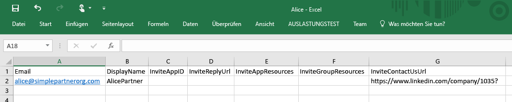

2. Fügen Sie im Azure-Portal im Verzeichnis „Contoso“ einen Benutzer hinzu (Active Directory > Contoso > Benutzer > Benutzer hinzufügen). Wählen Sie im Dropdownmenü „Art des Benutzers“ die Option „Benutzer in Partnerunternehmen“ aus. Laden Sie die CSV-Datei hoch. Vergewissern Sie sich vor dem Hochladen, dass die CSV-Datei geschlossen ist. 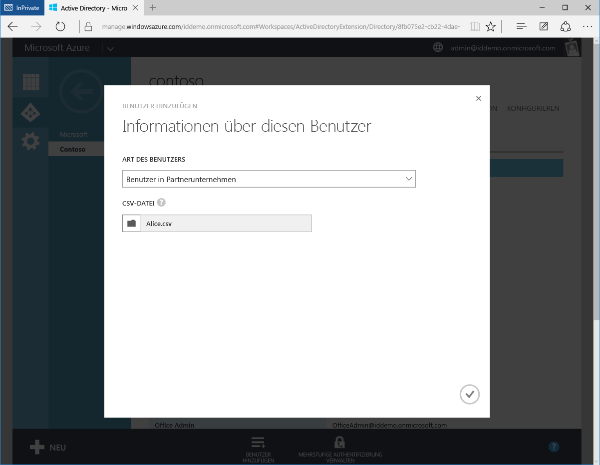

3. Alice wird jetzt als externer Benutzer im Azure AD-Verzeichnis „Contoso“ dargestellt. 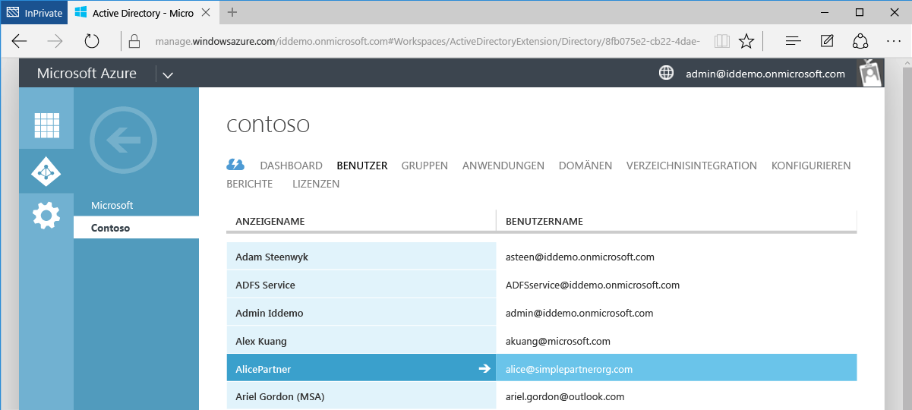

4. Alice erhält die folgende E-Mail: 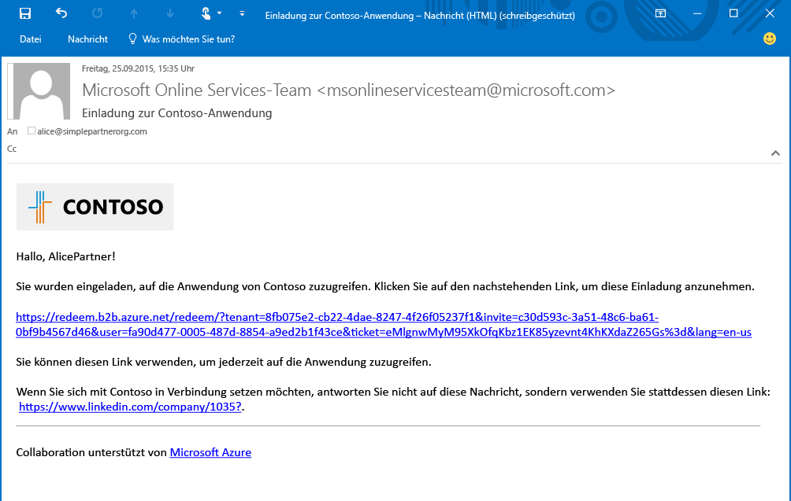

5. Alice klickt auf den Link und wird aufgefordert, die Einladung anzunehmen und sich mit ihren eigenen Anmeldeinformationen anzumelden. Wenn Alice nicht im Azure AD-Verzeichnis vorhanden ist, wird sie zur Anmeldung aufgefordert. 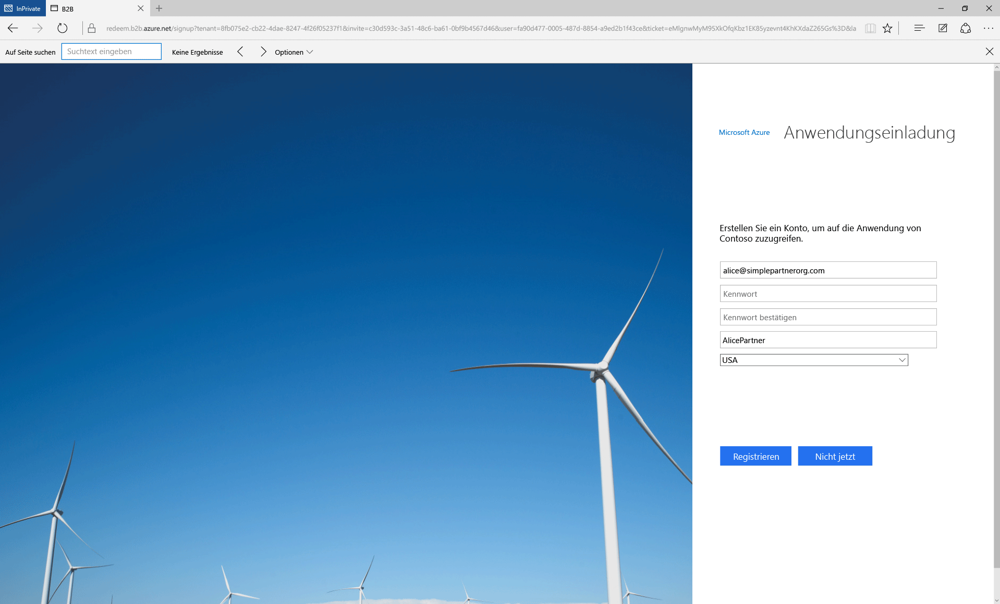

6. Alice wird zum App-Zugriffsbereich umgeleitet, der leer ist, bis ihr Zugriff auf Apps gewährt wird. 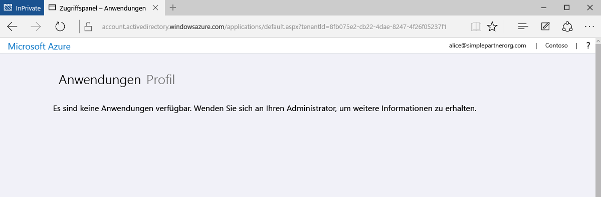

Dieses Verfahren ermöglicht eine besonders einfache B2B-Zusammenarbeit. Als Benutzer im Azure AD-Verzeichnis „Contoso“ kann Alice Zugriff auf Anwendungen und Gruppen über das Azure-Portal gewährt werden. Jetzt fügen wir Bob hinzu, der Zugriff auf die Anwendungen Moodle und Salesforce benötigt.

## Hinzufügen von Bob zum Verzeichnis „Contoso“ und Gewähren des Zugriffs auf Apps
1. Verwenden Sie Windows PowerShell mit dem installierten Azure AD-Modul, um die IDs der Anwendungen Moodle und Salesforce zu ermitteln. Die IDs können mit dem folgenden Cmdlet abgerufen werden: `Get-MsolServicePrincipal | fl DisplayName, AppPrincipalId`. Dadurch wird eine Liste mit allen verfügbaren Anwendungen in Contoso und den zugehörigen AppPrincialIds angezeigt. 

2. Erstellen Sie eine CSV-Datei, und füllen Sie die Spalten „Email“, „DisplayName“, **InviteAppID**, **InviteAppResources** und „InviteContactUsUrl“ für Bob auf. Füllen Sie **InviteAppResources** mit den über PowerShell ermittelten AppPrincipalIds von Moodle und Salesforce auf (jeweils getrennt durch ein Leerzeichen). Füllen Sie **InviteAppId** mit der gleichen AppPrincipalId von Moodle auf, um E-Mail und Anmeldeseite mit einem Moodle-Logo zu versehen. 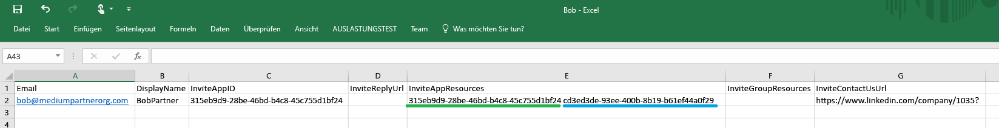

3. Laden Sie die CSV-Datei wie zuvor die Datei für Alice über das Azure-Portal hoch. Bob ist jetzt ein externer Benutzer im Azure AD-Verzeichnis „Contoso“.

4. Bob erhält die folgende E-Mail: 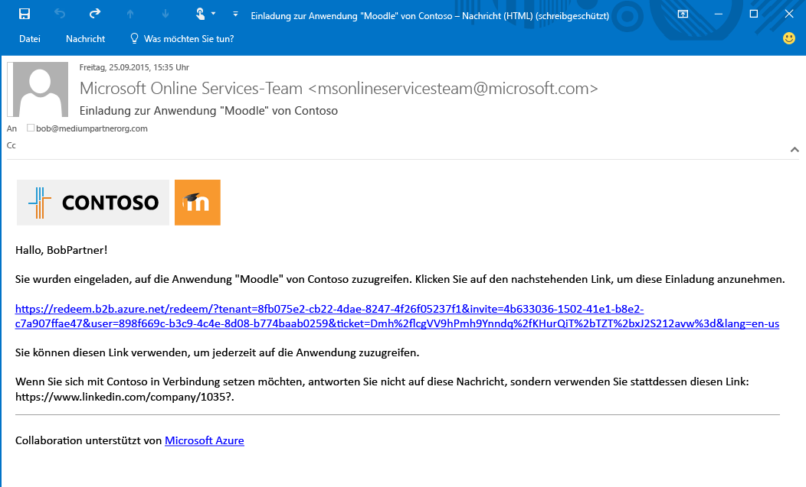

5. Bob klickt auf den Link und wird aufgefordert, die Einladung anzunehmen. Nachdem er sich angemeldet hat, wird er zum Zugriffsbereich umgeleitet und kann Moodle und Salesforce bereits verwenden. 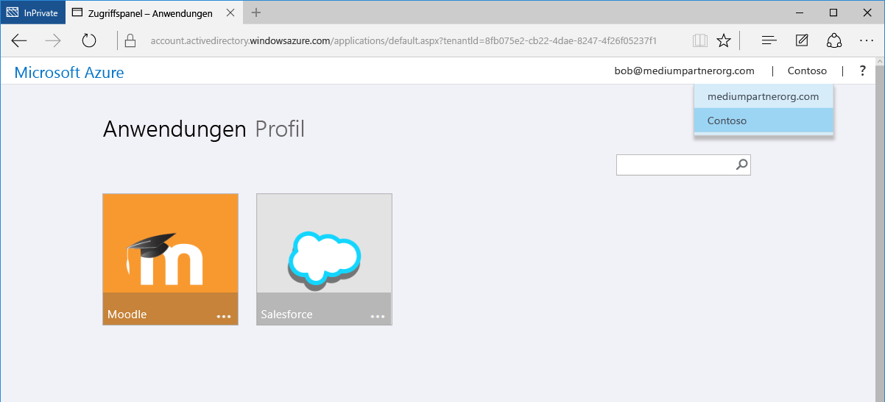

Als Nächstes fügen wir Carol hinzu. Sie benötigt Zugriff auf Anwendungen und eine Gruppenmitgliedschaften im Verzeichnis „Contoso“.

## Hinzufügen von Carol zum Verzeichnis „Contoso“, Gewähren des Zugriffs auf Apps und Festlegen von Gruppenmitgliedschaften

1. Verwenden Sie Windows PowerShell mit dem installierten Azure AD-Modul, um die Anwendungs-IDs und Gruppen-IDs in Contoso zu ermitteln.
 - Rufen Sie wie im Fall von Bob die AppPrincipalId mithilfe des Cmdlets `Get-MsolServicePrincipal | fl DisplayName, AppPrincipalId` ab.
 - Rufen Sie mithilfe des Cmdlets `Get-MsolGroup | fl DisplayName, ObjectId` die ObjectId für Gruppen ab. Dadurch wird eine Liste mit allen Gruppen in Contoso und den zugehörigen ObjectIds angezeigt. Gruppen-IDs können auch im Azure-Portal auf der Registerkarte „Eigenschaften“ der Gruppe als Objekt-ID abgerufen werden. 

2. Erstellen Sie eine CSV-Datei, und füllen Sie die Spalten „Email“, „DisplayName“, „InviteAppID“, „InviteAppResources“, **InviteGroupResources** und „InviteContactUsUrl“ für Carol auf. **InviteGroupResources** wird mit den ObjectIds der Gruppen „MyGroup1“ und „Externals“ aufgefüllt (getrennt durch ein Leerzeichen). 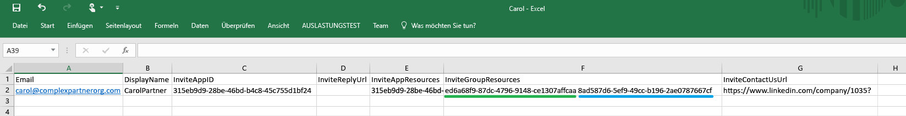

3. Laden Sie die CSV-Datei über das Azure-Portal hoch.

4. Wie im Azure-Portal zu sehen, ist Carol ein Benutzer im Verzeichnis „Contoso“ und zudem Mitglied der Gruppen „MyGroup1“ und „Externals“. 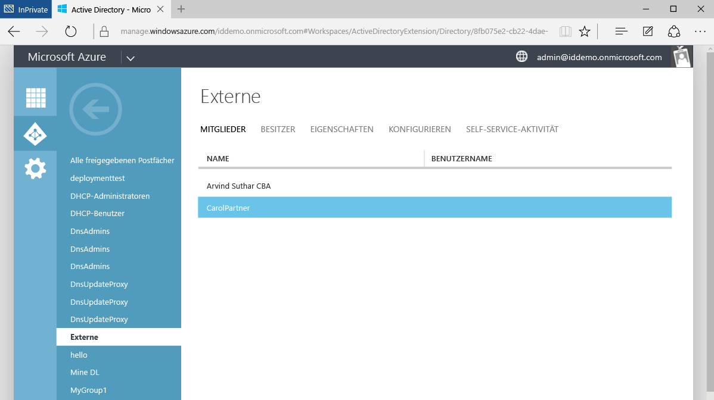

5. Carol erhält eine E-Mail mit einem Link zum Annehmen der Einladung. Nachdem sie sich angemeldet hat, wird sie zum App-Zugriffsbereich umgeleitet und hat Zugriff auf Moodle und Salesforce.

So einfach ist es, Benutzer von Partnerunternehmen in Azure AD B2B-Zusammenarbeit hinzuzufügen. In dieser exemplarischen Vorgehensweise wurden die Benutzer Alice, Bob und Carol dem Verzeichnis „Contoso“ mithilfe von drei separaten CSV-Dateien hinzugefügt. Dieser Prozess kann zur Vereinfachung auch mit einer einzelnen CSV-Datei durchgeführt werden. 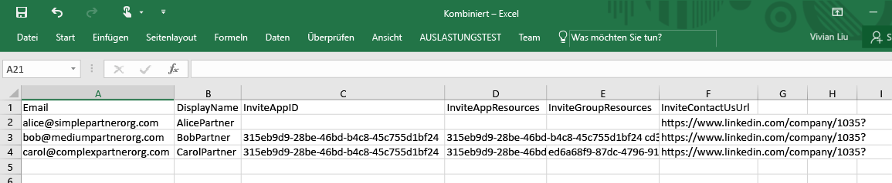

## Verwandte Artikel
Weitere Artikel zur Azure AD B2B-Zusammenarbeit:

- [Was ist die Azure AD B2B-Zusammenarbeit?](active-directory-b2b-what-is-azure-ad-b2b.md)
- [So funktioniert's](active-directory-b2b-how-it-works.md)
- [Referenz zum CSV-Dateiformat](active-directory-b2b-references-csv-file-format.md)
- [Tokenformat für externe Benutzer](active-directory-b2b-references-external-user-token-format.md)
- [Objektattributänderungen für externe Benutzer](active-directory-b2b-references-external-user-object-attribute-changes.md)
- [Aktuelle Einschränkungen der Vorschau](active-directory-b2b-current-preview-limitations.md)
- [Artikelindex für die Anwendungsverwaltung in Azure Active Directory](active-directory-apps-index.md)

<!---HONumber=AcomDC_0511_2016-->