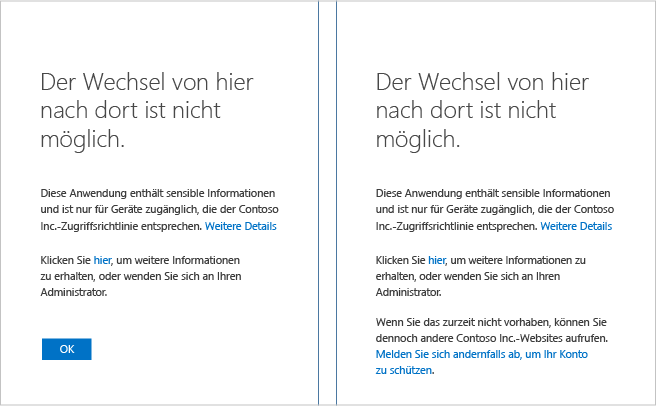
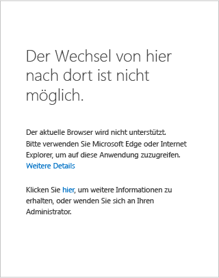

<properties
	pageTitle="Problembehandlung: Zugriff nicht möglich | Microsoft Azure"
	description="Dieses Thema enthält Informationen zu Korrekturschritten, die Sie ausführen können, um auf die Anwendung zuzugreifen."
	services="active-directory"
	keywords="gerätebasierter bedingter Zugriff, Geräteregistrierung, Geräteregistrierung aktivieren, Geräteregistrierung und MDM"
	documentationCenter=""
	authors="markusvi"
	manager="femila"
	editor=""/>

<tags
	ms.service="active-directory"
	ms.workload="identity"
	ms.tgt_pltfrm="na"
	ms.devlang="na"
	ms.topic="get-started-article"
	ms.date="08/23/2016"
	ms.author="markvi"/>

# Problembehandlung: Zugriff nicht möglich

Beim Zugriff auf eine Anwendung wie SharePoint Online wird eine Seite mit der Meldung „Zugriff verweigert“ angezeigt. Was können Sie tun?

Dieser Leitfaden enthält Informationen zu Korrekturschritten, die Sie ausführen können, um auf die Anwendung zuzugreifen.

Auf welcher Geräteplattform wird Ihr Gerät ausgeführt? Die Antwort auf diese Frage bestimmt den passenden Abschnitt in diesem Thema:

-	Windows-Gerät
-	iOS-Gerät (iPhone oder iPad)
-	Android-Gerät

## Zugriff mit einem Windows-Gerät

Wenn auf Ihrem Gerät Windows 10, Windows 8.1, Windows 8.0, Windows 7, Windows Server 2016, Windows Server 2012 R2, Windows Server 2012 oder Windows Server 2008 R2 ausgeführt wird, können Sie die jeweilige Ursache auswählen, indem Sie die Seite identifizieren, die beim versuchten Zugriff auf die Anwendung angezeigt wurde.

### Das Gerät ist nicht registriert

Wenn das Gerät nicht bei Azure Active Directory (Azure AD) registriert und die Anwendung durch eine gerätebasierte Richtlinie geschützt ist, wird ggf. eine Seite mit folgendem Inhalt angezeigt:

Wenn das Gerät einer Domäne der Active Directory-Instanz in Ihrer Organisation angehört, können Sie Folgendes versuchen:

1.	Vergewissern Sie sich, dass Sie sich bei Windows mit Ihrem Geschäftskonto (Active Directory-Konto) angemeldet haben.
2.	Stellen Sie per VPN oder DirectAccess eine Verbindung mit Ihrem Unternehmensnetzwerk her.
3.	Sperren Sie Ihre Windows-Sitzung nach der Verbindungsherstellung durch Drücken von WINDOWS-TASTE+L.
4.	Entsperren Sie Ihre Windows-Sitzung, indem Sie die Anmeldeinformationen Ihres Geschäftskontos eingeben.
5.	Warten Sie eine Minute, und versuchen Sie erneut, auf die Anwendung zuzugreifen.
6.	Sollte die Seite erneut angezeigt werden, kontaktieren Sie den zuständigen Administrator, klicken Sie auf den Link **Weitere Details**, und geben Sie die Details an.

Falls Ihr Gerät keiner Domäne angehört und über Windows 10 verfügt, haben Sie zwei Möglichkeiten:

- Führen Sie Azure AD Join aus.
- Fügen Sie Windows Ihr Geschäfts- oder Schulkonto hinzu.

Informationen zu den Unterschieden zwischen den beiden Konten finden Sie unter [Verwenden von Windows 10-Geräten an Ihrem Arbeitsplatz](active-directory-azureadjoin-windows10-devices.md).

Gehen Sie wie folgt vor, um Azure AD Join auszuführen (für Windows Phone nicht verfügbar):

**Windows 10 Anniversary Update**

1.	Starten Sie die App **Einstellungen**.
2.	Klicken Sie auf **Konten** und anschließend auf die Option für den Zugriff auf ein Geschäfts-, Schul- oder Unikonto.
3.	Klicken Sie auf **Verbinden**.
4.	Klicken Sie unten auf der Seite auf **Dieses Gerät in Azure Active Directory einbinden**.
5.	Führen Sie die Authentifizierung für Ihre Organisation durch, geben Sie bei Bedarf die Daten für die Multi-Factor Authentication an, und führen Sie alle Schritte bis zum Ende aus.
6.	Melden Sie sich ab, und melden Sie sich dann mit Ihrem Geschäftskonto an.
7.	Versuchen Sie erneut, auf die Anwendung zuzugreifen.

**Windows 10 November 2015 Update**

1.	Starten Sie die App **Einstellungen**.
2.	Klicken Sie auf **System** > **Info**.
3.	Klicken Sie auf **Azure AD beitreten**.
4.	Führen Sie die Authentifizierung für Ihre Organisation durch, geben Sie bei Bedarf die Daten für die Multi-Factor Authentication an, und führen Sie alle Schritte bis zum Ende aus.
5.	Melden Sie sich ab, und melden Sie sich dann mit Ihrem Geschäftskonto (Azure AD-Konto) an.
6.	Versuchen Sie erneut, auf die Anwendung zuzugreifen.

Führen Sie die folgenden Schritte aus, um das Geschäfts- oder Schulkonto hinzuzufügen:

**Windows 10 Anniversary Update**

1.	Starten Sie die App **Einstellungen**.
2.	Klicken Sie auf **Konten** > **Access work or school** (Auf Geschäfts-, Schul- oder Unikonto zugreifen).
3.	Klicken Sie auf **Verbinden**.
4.	Führen Sie die Authentifizierung für Ihre Organisation durch, geben Sie bei Bedarf die Daten für die Multi-Factor Authentication an, und führen Sie alle Schritte bis zum Ende aus.
5.	Versuchen Sie erneut, auf die Anwendung zuzugreifen.

**Windows 10 November 2015 Update**

1.	Starten Sie die App **Einstellungen**.
2.	Klicken Sie auf **Konten** > **Ihre Konten**.
3.	Klicken Sie auf **Geschäfts- oder Schulkonto hinzufügen**.
4.	Führen Sie die Authentifizierung für Ihre Organisation durch, geben Sie bei Bedarf die Daten für die Multi-Factor Authentication an, und führen Sie alle Schritte bis zum Ende aus.
5.	Versuchen Sie erneut, auf die Anwendung zuzugreifen.

Wenn das Gerät keiner Domäne angehört und über Windows 8.1 verfügt, können Sie wie folgt eine Arbeitsplatzeinbindung und eine Registrierung bei Microsoft Intune durchführen:

1.	Öffnen Sie **PC-Einstellungen**.
2.	Klicken Sie auf **Netzwerk** > **Arbeitsplatz**.
3.	Klicken Sie auf **Verknüpfen**.
4.	Führen Sie die Authentifizierung für Ihre Organisation durch, geben Sie bei Bedarf die Daten für die Multi-Factor Authentication an, und führen Sie alle Schritte bis zum Ende aus.
5.	Klicken Sie auf **Einschalten**.
6.	Warten Sie, bis der Vorgang abgeschlossen ist.
7.	Versuchen Sie erneut, auf die Anwendung zuzugreifen.

## Nicht unterstützte Browser

Wenn Sie mit den folgenden Browsern auf die Anwendung zugreifen, wird eine Seite wie in der Abbildung weiter oben angezeigt:

- Chrome, Firefox oder andere Browser, bei denen es sich nicht um Microsoft Edge oder Microsoft Internet Explorer unter Windows 10 oder Windows Server 2016 handelt.
- Firefox unter Windows 8.1, Windows 7, Windows Server 2012 R2, Windows Server 2012 oder Windows Server 2008 R2.

Die einzige Abhilfe ist die Verwendung eines Browsers, der von der Anwendung für Ihre Geräteplattform unterstützt wird.

## Zugriff mit einem iOS-Gerät
In Kürze finden Sie hier eine Anleitung für iPhones bzw. iPads.

## Zugriff mit einem Android-Gerät
In Kürze finden Sie hier eine Anleitung für Android-Smartphones bzw. -Tablets.

## Nächste Schritte

[Bedingter Zugriff mit Azure Active Directory](active-directory-conditional-access.md)

<!----HONumber=AcomDC_0831_2016-->