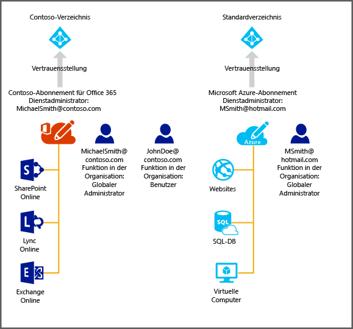

# Verwalten des Verzeichnisses für Ihr Office 365-Abonnement in Azure
Dieser Artikel beschreibt die Verwaltung eines für ein Office 365-Abonnement erstellten Verzeichnisses mithilfe des klassischen Azure-Portals. Die Anmeldung beim klassischen Azure-Portal ist nur als Dienstadministrator oder Co-Administrator eines Azure-Abonnements möglich. Falls Sie noch nicht über ein Azure-Abonnement verfügen, können Sie sich noch heute über diesen Link für eine [kostenlose 30-Tage-Testversion](https://azure.microsoft.com/trial/get-started-active-directory/) registrieren und Ihre erste Cloud-Lösung in weniger als 5 Minuten bereitstellen. Verwenden Sie das Geschäfts- oder Schulkonto, das Sie zum Anmelden an Office 365 nutzen.

Nach Abschluss des Azure-Abonnements können Sie sich beim klassischen Azure-Portal anmelden und auf Azure-Dienste zugreifen. Klicken Sie auf die Active Directory-Erweiterung, um das Verzeichnis zu verwalten, das auch zur Authentifizierung Ihrer Office 365-Benutzer verwendet wird.

Wenn Sie bereits über ein Azure-Abonnement verfügen, ist der Prozess zum Verwalten eines weiteren Verzeichnisses ebenfalls ganz einfach. Beispiel: Michael Smith verfügt über ein Office 365-Abonnement für „contoso.com“. Er besitzt außerdem ein Azure-Abonnement, für das er sich mit seinem Microsoft-Konto msmith@hotmail.com registriert hat. In diesem Fall verwaltet er zwei Verzeichnisse.

| Abonnement | Office 365 | Azure |
| --- | --- | --- |
|   Anzeigename |Contoso |Standardverzeichnis für Azure Active Directory (Azure AD) |
|   Domänenname |contoso.com |msmithhotmail.onmicrosoft.com |

Er möchte die Benutzeridentitäten im Verzeichnis „Contoso“ verwalten, während er mit seinem Microsoft-Konto bei Azure angemeldet ist, damit er Azure AD-Funktionen wie die mehrstufige Authentifizierung aktivieren kann. Das folgende Diagramm veranschaulicht diesen Prozess.

In diesem Fall sind die beiden Verzeichnisse unabhängig voneinander.

## Zwei unabhängige Verzeichnisse verwalten
Damit Michael Smith beide Verzeichnisse verwalten kann, während er in Azure als msmith@hotmail.com, angemeldet ist, muss er die folgenden Schritte ausführen:

> [!NOTE]
> Diese Schritte können nur ausgeführt werden, wenn ein Benutzer mit einem Microsoft-Konto angemeldet ist. Ist der Benutzer mit einem Geschäfts- oder Schulkonto angemeldet, steht die Option **Vorhandenes Verzeichnis verwenden** nicht zur Verfügung. Ein Geschäfts-oder Schulkonto kann nur anhand des entsprechenden Basisverzeichnisses authentifiziert werden (also des Verzeichnisses, in dem sich das Arbeits- oder Schulkonto befindet und dessen Besitzer das Unternehmen oder die Schule ist).
>
>

1. Melden Sie sich beim [klassischen Azure-Portal](https://manage.windowsazure.com) als msmith@hotmail.com an.
2. Klicken Sie auf **Neu** > **App Services** > **Active Directory** > **Directory** > **Benutzerdefiniert erstellen**.
3. Klicken Sie auf „Vorhandenes Verzeichnis verwenden“, und wählen Sie das Kontrollkästchen **Ich bin jetzt für die Abmeldung bereit** .
4. Melden Sie sich beim klassischen Azure-Portal als globaler Administrator von Contoso.onmicrosoft.com (z. B. msmith@contoso.com)) an.
5. Wenn Sie aufgefordert werden, **das Verzeichnis „Contoso“ mit Azure zu verwenden**, klicken Sie auf **Weiter**.
6. Klicken Sie auf **Jetzt abmelden**.
7. Melden Sie sich als msmith@hotmail.com beim klassischen Azure-Portal an. Das Verzeichnis "Contoso" und das Standardverzeichnis werden in der Active Directory-Erweiterung angezeigt.

Nach Abschluss dieser Schritte ist msmith@hotmail.com ein globaler Administrator im Verzeichnis "Contoso".

## Verwalten von Ressourcen als globaler Administrator
Nehmen wir nun an, dass Jane Doe Websites und Datenbankressourcen verwalten möchte, die dem Azure-Abonnement für msmith@hotmail.com zugeordnet sind. Bevor dies möglich ist, muss Michael Smith die folgenden zusätzlichen Schritte ausführen:

1. Melden Sie sich über das Dienstadministratorkonto des Azure-Abonnements beim [klassischen Azure-Portal](https://manage.windowsazure.com) an (in diesem Beispiel msmith@hotmail.com)).
2. Übertragen Sie das Abonnement in das Verzeichnis "Contoso": Klicken Sie auf **Einstellungen** > **Abonnements** > wählen Sie das Abonnement > **Verzeichnis bearbeiten** > wählen Sie **Contoso (Contoso.com)**. Alle Geschäfts- oder Schulkonten, die als Co-Administratoren des Abonnements fungieren, werden im Rahmen der Übertragung entfernt.
3. Fügen Sie Jane Doe dem Abonnement als Co-Administrator hinzu: Klicken Sie auf **Einstellungen** > **Administratoren**, und wählen Sie das Abonnement aus. Klicken Sie anschließend auf **Hinzufügen**, und geben Sie **JohnDoe@Contoso.com** ein.

## Nächste Schritte
Weitere Informationen über die Beziehung zwischen Abonnements und Verzeichnissen finden Sie unter [Zuordnung zwischen einem Abonnement und einem Verzeichnis](active-directory-how-subscriptions-associated-directory.md).

