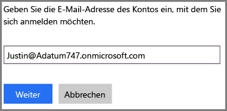
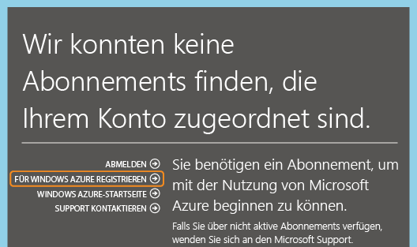

<properties
   pageTitle="Verwalten des Verzeichnisses für Ihr Office 365-Abonnement in Azure | Microsoft Azure"
   description="Verwalten eines Office 365-Abonnementverzeichnisses mithilfe von Azure Active Directory und dem klassischen Azure-Portal"
   services="active-directory"
   documentationCenter=""
   authors="curtand"
   manager="femila"
   editor=""/>

<tags
   ms.service="active-directory"
   ms.devlang="na"
   ms.topic="get-started-article"
   ms.tgt_pltfrm="na"
   ms.workload="identity"
   ms.date="05/26/2016"
   ms.author="curtand"/>

# Verwalten des Verzeichnisses für Ihr Office 365-Abonnement in Azure

In diesem Artikel wird beschrieben, wie ein Verzeichnis verwaltet wird, das für ein Office 365-Abonnement erstellt wurde. Hier verwenden wir aber das klassische Azure-Portal. Sie müssen der Dienstadministrator oder Co-Administrator eines Azure-Abonnements sein, um sich am klassischen Azure-Portal anzumelden. Falls noch kein Azure-Abonnement vorhanden ist

1. Sie können sich registrieren, indem Sie das Geschäfts- oder Schulkonto verwenden, das Sie zum Anmelden an Office 365 verwenden.

Ein entsprechendes Abonnement für Azure wird nicht gefunden. Sie können aber auf **Für Azure registrieren** klicken, sodass relevante Informationen aus dem Office 365-Konto wieder in das Anmeldeformular eingetragen werden. Das gleiche Konto wird standardmäßig der Rolle des Dienstadministrators zugewiesen.

Nach Abschluss des Azure-Abonnements können Sie sich beim klassischen Azure-Portal anmelden und auf Azure-Dienste zugreifen. Klicken Sie auf die Active Directory-Erweiterung, um das gleiche Verzeichnis zu verwalten, das Ihre Office 365-Benutzer authentifiziert.

Wenn Sie bereits über ein Azure-Abonnement verfügen, ist der Prozess zum Verwalten eines weiteren Verzeichnisses ebenfalls ganz einfach. Beispiel: Michael Smith verfügt über ein Office 365-Abonnement für „contoso.com“. Er besitzt außerdem ein Azure-Abonnement, für das er sich mit seinem Microsoft-Konto msmith@hotmail.com registriert hat. In diesem Fall verwaltet er zwei Verzeichnisse.

 Abonnement | Office 365 | Azure
  -------------- | ------------- | -------------------------------
 Anzeigename | Contoso | Standardverzeichnis für Azure Active Directory (Azure AD)
 Domänenname | contoso.com | msmithhotmail.onmicrosoft.com

Er möchte die Benutzeridentitäten im Verzeichnis „Contoso“ verwalten, während er mit seinem Microsoft-Konto bei Azure angemeldet ist, damit er Azure AD-Funktionen wie die mehrstufige Authentifizierung aktivieren kann. Das folgende Diagramm veranschaulicht diesen Prozess.

In diesem Fall sind die beiden Verzeichnisse unabhängig voneinander.

## Zwei unabhängige Verzeichnisse verwalten
Damit Michael Smith beide Verzeichnisse verwalten kann, während er in Azure als msmith@hotmail.com angemeldet ist, muss er die folgenden Schritte ausführen:

> [AZURE.NOTE]
Diese Schritte können nur ausgeführt werden, wenn ein Benutzer mit einem Microsoft-Konto angemeldet ist. Wenn der Benutzer mit einem Geschäfts- oder Schulkonto angemeldet ist, steht die Option **Vorhandenes Verzeichnis verwenden** nicht zur Verfügung. Ein Geschäfts- oder Schulkonto kann nur mithilfe seines Stammverzeichnisses authentifiziert werden (dies ist das Verzeichnis, in dem das Geschäfts- oder Schulkonto gespeichert wird, das im Besitz der Organisation oder Schule ist).

1.	Melden Sie sich als msmith@hotmail.com beim [klassischen Azure-Portal](https://manage.windowsazure.com) an.
2.	Klicken Sie auf **Neu** -> **App Services** -> **Active Directory** -> **Verzeichnis** -> **Benutzerdefiniert erstellen**.
3.	Klicken Sie auf „Vorhandenes Verzeichnis verwenden“, und wählen Sie das Kontrollkästchen **Ich bin jetzt für die Abmeldung bereit**.
4.	Melden Sie sich beim klassischen Azure-Portal als globaler Administrator von Contoso.onmicrosoft.com (z. B. msmith@contoso.com)) an.
5.	Wenn Sie aufgefordert werden, **das Verzeichnis "Contoso" mit Azure zu verwenden**, klicken Sie auf **Weiter**.
6.	Klicken Sie auf **Jetzt abmelden**.
7.	Melden Sie sich als msmith@hotmail.com beim klassischen Azure-Portal an. Das Verzeichnis "Contoso" und das Standardverzeichnis werden in der Active Directory-Erweiterung angezeigt.

Nach Abschluss dieser Schritte ist msmith@hotmail.com ein globaler Administrator im Verzeichnis "Contoso".

## Verwalten von Ressourcen als globaler Administrator
Nehmen wir nun an, dass Jane Doe sich beim klassischen Azure-Portal anmelden und Webseiten und Datenbankressourcen verwalten muss, die dem Azure-Abonnement für msmith@hotmail.com zugeordnet sind. Bevor dies möglich ist, muss Michael Smith die folgenden zusätzlichen Schritte ausführen:

1.	Melden Sie sich über das Dienstadministratorkonto des Azure-Abonnements beim [klassischen Azure-Portal](https://manage.windowsazure.com) an (in diesem Beispiel msmith@hotmail.com)).
2.	Übertragen Sie das Abonnement in das Verzeichnis "Contoso": Klicken Sie auf **Einstellungen** > **Abonnements** > wählen Sie das Abonnement > **Verzeichnis bearbeiten** > wählen Sie **Contoso (Contoso.com)**. Alle Geschäfts- oder Schulonten, die Co-Administratoren des Abonnements sind, werden als Teil der Übertragung entfernt.
3.	Fügen Sie Jane Doe dem Abonnement als Co-Administrator hinzu: Klicken Sie auf **Einstellungen** > **Administratoren**, und wählen Sie das Abonnement aus. Klicken Sie anschließend auf **Hinzufügen**, und geben Sie ****JohnDoe@Contoso.com** ein.

##Nächste Schritte
Weitere Informationen über die Beziehung zwischen Abonnements und Verzeichnissen finden Sie unter [Zuordnung zwischen einem Abonnement und einem Verzeichnis](active-directory-how-subscriptions-associated-directory.md).

<!---HONumber=AcomDC_0601_2016-->