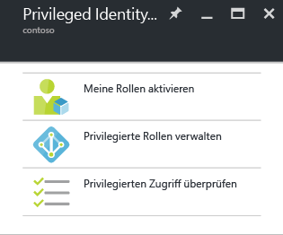

<properties
   pageTitle="Erste Schritte mit Azure AD Privileged Identity Management | Microsoft Azure"
   description="Erfahren Sie, wie Sie mit der Anwendung Azure Active Directory Privileged Identity Management privilegierte Identitäten im Azure-Portal verwalten."
   services="active-directory"
   documentationCenter=""
   authors="kgremban"
   manager="femila"
   editor=""/>

<tags
   ms.service="active-directory"
   ms.devlang="na"
   ms.topic="get-started-article"
   ms.tgt_pltfrm="na"
   ms.workload="identity"
   ms.date="09/16/2016"
   ms.author="kgremban"/>

# Erste Schritte mit Azure AD Privileged Identity Management

Mit Azure Active Directory (AD) Privileged Identity Management können Sie den Zugriff innerhalb Ihrer Organisation verwalten, steuern und überwachen. Dazu zählt der Zugriff auf Ressourcen in Azure AD und anderen Microsoft-Onlinediensten wie Office 365 oder Microsoft Intune.

Dieser Artikel beschreibt, wie Sie die Azure AD PIM-App zu Ihrem Azure-Portaldashboard hinzufügen.

## Hinzufügen der Anwendung Privileged Identity Management

Bevor Sie Azure AD Privileged Identity Management verwenden können, müssen Sie die Anwendung zum Dashboard in Ihrem Azure-Portal hinzufügen.

1. Melden Sie sich beim [Azure-Portal](https://portal.azure.com/) als globaler Administrator Ihres Verzeichnisses an.
2. Wenn Ihre Organisation über mehr als ein Verzeichnis verfügt, klicken Sie in der oberen rechten Ecke des Azure-Portals auf Ihren Benutzernamen. Wählen Sie das Verzeichnis aus, in dem Sie PIM verwenden.
3. Wählen Sie **Weitere Dienste**, und verwenden Sie das Textfeld „Filter“, um nach **Azure AD Privileged Identity Management** zu suchen.
4. Aktivieren Sie das Kontrollkästchen **An Dashboard anheften**, und klicken Sie dann auf **Erstellen**. Die Anwendung Privileged Identity Management wird geöffnet.

Wenn Sie die erste Person sind, die Azure AD Privileged Identity Management in Ihrem Verzeichnis verwendet, führt Sie der [Sicherheits-Assistent](active-directory-privileged-identity-management-security-wizard.md) durch die erste Zuweisung. Danach sind Sie automatisch der erste **Sicherheitsadministrator** und der **Administrator für privilegierte Rollen** des Verzeichnisses. Nur ein Administrator für privilegierte Rollen kann auf diese Anwendung zugreifen, um den Zugriff für andere Administratoren zu verwalten.

## Navigieren zu Ihren Aufgaben

Nachdem Azure AD Privileged Identity Management eingerichtet wurde, wird das Blatt für die Navigation immer angezeigt, wenn Sie die Anwendung öffnen. Verwenden Sie dieses Blatt für Ihre Aufgaben der Identitätsverwaltung.

- Mit **Meine Rollen aktivieren** gelangen Sie zur Liste mit den Rollen, die Ihnen zugewiesen sind. Hier aktivieren Sie alle Rollen, zu deren Nutzung Sie berechtigt sind.

- **Privilegierte Rollen verwalten** ist das Dashboard für Administratoren von privilegierten Rollen. Es dient zum Verwalten von Rollenzuweisungen, Ändern der Einstellungen für die Rollenaktivierung, Starten von Zugriffsüberprüfungen und weitere Aufgaben. Die Optionen in diesem Dashboard sind für alle Benutzer deaktiviert, die keine privilegierten Rollenadministratoren sind.

- Mit **Privilegierten Zugriff überprüfen** gelangen Sie zu ausstehenden Zugriffsüberprüfungen, die durchgeführt werden müssen. Dabei spielt es keine Rolle, ob Sie den Zugriff für sich selbst oder für eine andere Person überprüfen.

<!--Every topic should have next steps and links to the next logical set of content to keep the customer engaged-->
## Nächste Schritte

Die Übersicht über [Azure AD Privileged Identity Management](active-directory-privileged-identity-management-configure.md) enthält weitere Details zur Verwaltung des administrativen Zugriffs in Ihrer Organisation.

[AZURE.INCLUDE [active-directory-privileged-identity-management-toc](../../includes/active-directory-privileged-identity-management-toc.md)]

<!--Image references-->

[1]: ./media/active-directory-privileged-identity-management-configure/PIM_EnablePim.png

<!----HONumber=AcomDC_0921_2016-->