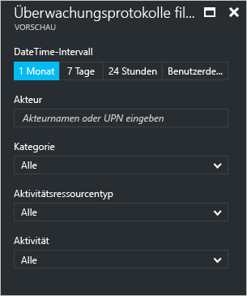
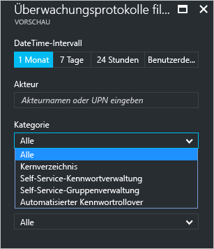
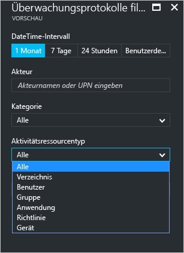
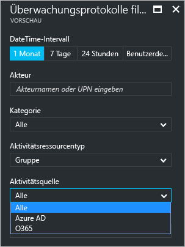

# Berichte zu Überwachungsaktivitäten im Azure Active Directory-Portal – Vorschau

Mit der Berichterstellungsfunktion in Azure Active Directory [(Vorschau)](active-directory-preview-explainer.md) erhalten Sie alle Informationen, die Sie zum Ermitteln des Zustands Ihrer Umgebung benötigen.

Die Architektur für die Berichterstellung in Azure Active Directory umfasst die folgenden Komponenten:

- **Aktivität** 
    - **Anmeldeaktivitäten** : Informationen zur Nutzung von verwalteten Anwendungen und Aktivitäten der Benutzeranmeldung
    - **Überwachungsprotokolle:** Systemaktivitätsinformationen zu Benutzern und zur Gruppenverwaltung sowie zu verwalteten Anwendungen und Verzeichnisaktivitäten.
- **Sicherheit** 
    - **Riskante Anmeldungen:** Eine riskante Anmeldung ist ein Indikator für einen Anmeldeversuch von einem Benutzer, der nicht der rechtmäßige Besitzer eines Benutzerkontos ist. Weitere Informationen finden Sie unter „Riskante Anmeldungen“.
    - **Benutzer mit Risikomarkierung:** Ein Benutzer mit Risikomarkierung ist ein Indikator für ein möglicherweise kompromittiertes Benutzerkonto. Weitere Informationen finden Sie unter „Benutzer mit Risikomarkierung“.

In diesem Thema erhalten Sie einen Überblick über die Überwachungsaktivitäten.
 
## Überwachungsprotokolle

Die Überwachungsprotokolle in Azure Active Directory enthalten Datensätze mit Systemaktivitäten, die zum Nachweisen der Konformität verwendet werden können.

Es gibt drei Hauptkategorien für die Überwachung von zusammengehörigen Aktivitäten im Azure-Portal:

- Benutzer und Gruppen   

- Anwendungen

- Verzeichnis   

Eine vollständige Liste mit den Überwachungsberichtsaktivitäten finden Sie in der [Liste der Überwachungsberichtsereignisse](active-directory-reporting-audit-events.md#list-of-audit-report-events).

Ihr Einstiegspunkt für alle Überwachungsdaten ist die Option **Überwachungsprotokolle** im Abschnitt **Aktivität** von **Azure Active Directory**.

Ein Überwachungsprotokoll verfügt über eine Listenansicht, in der die Akteure (*wer*), die Aktivitäten (*was*) und die Ziele angezeigt werden.

Wenn Sie in der Listenansicht auf einen Eintrag klicken, können Sie weitere Details zum Eintrag anzeigen.

## Überwachungsprotokolle für Benutzer und Gruppen

Mit Überwachungsberichten, die auf Benutzern und Gruppen basieren, können Sie beispielsweise Antworten auf folgende Fragen erhalten:

- Welche Arten von Updates wurden von den Benutzern angewendet?

- Wie viele Benutzer wurden geändert?

- Wie viele Kennwörter wurden geändert?

- Welche Schritte hat ein Administrator in einem Verzeichnis ausgeführt?

- Welche Gruppen wurden hinzugefügt?

- Sind Gruppen mit Änderungen der Mitgliedschaft vorhanden?

- Haben sich die Besitzer der Gruppe geändert?

- Welche Lizenzen wurden einer Gruppe oder einem Benutzer zugewiesen?

Wenn Sie nur Überwachungsdaten überprüfen möchten, die sich auf Benutzer und Gruppen beziehen, können Sie die gefilterte Ansicht unter **Überwachungsprotokolle** im Abschnitt **Aktivität** der Option **Benutzer und Gruppen** verwenden.

## Überwachungsprotokolle für Anwendungen
Mit Überwachungsberichten, die auf Anwendungen basieren, können Sie beispielsweise Antworten auf folgende Fragen erhalten:

* Welche Anwendungen wurden hinzugefügt oder aktualisiert?
* Welche Anwendungen wurden entfernt?
* Hat sich ein Dienstprinzip für eine Anwendung geändert?
* Haben sich die Namen von Anwendungen geändert?
* Wer hat die Zustimmung zu einer Anwendung erteilt?

Wenn Sie nur Überwachungsdaten überprüfen möchten, die sich auf Anwendungen beziehen, können Sie die gefilterte Ansicht unter **Überwachungsprotokoll**e im Abschnitt **Aktivität** der Option **Unternehmensanwendungen** verwenden.

## Filtern von Überwachungsprotokollen
Sie können Anmeldungen nach einem Zeitintervall filtern, um die Menge der angezeigten Daten mithilfe der folgenden Felder zu begrenzen:

- Datum und Uhrzeit

- Benutzerprinzipalname (UPN) des Akteurs

- Kategorie

- Aktivitätsressourcentyp

- Aktivität

Mit dem Filter **Kategorie** können Sie den Umfang Ihres Überwachungsberichts anhand der folgenden Kategorien eingrenzen:

- Kernverzeichnis

- Self-Service-Kennwortverwaltung

- Self-Service-Gruppenverwaltung

- Automatisiertes Kennwortrollover 

Der Inhalt der Liste **Aktivitätsressourcentyp** ist an Ihren Einstiegspunkt für dieses Blatt gebunden.  
Wenn Azure Active Directory Ihr Einstiegspunkt ist, enthält diese Liste alle möglichen Aktivitätstypen:

- Verzeichnis

- Benutzer

- Gruppe 

- Anwendung 

- Richtlinie

- Gerät

Die aufgeführten Aktivitäten werden nach Aktivitätstyp begrenzt.
Wenn Sie z.B. **Benutzer** als **Aktivitätstyp** ausgewählt haben, enthält die Liste **Aktivität** nur die entsprechenden relevanten Aktivitäten.   

Wenn Sie **Gruppe** als **Aktivitätsressourcentyp** wählen, erhalten Sie eine zusätzliche Filteroption, mit der Sie auch basierend auf den folgenden **Aktivitätsquellen** filtern können:

- Azure AD

- O365

Eine andere Methode zum Filtern der Einträge eines Überwachungsprotokolls ist die Suche nach bestimmten Einträgen.

## Nächste Schritte
Weitere Informationen finden Sie unter [Anleitung für Azure Active Directory-Berichte](active-directory-reporting-guide.md).

