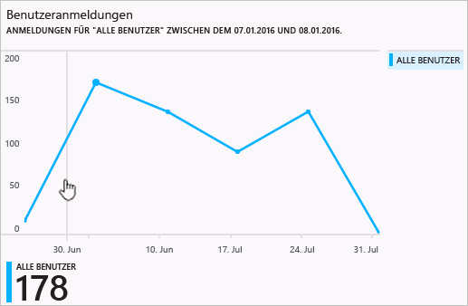
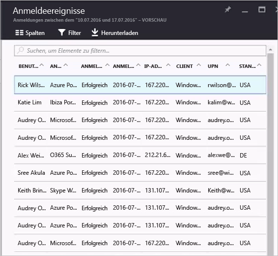

# Berichte zu Anmeldeaktivitäten im Azure Active Directory-Portal – Vorschau

Mit der Berichterstellungsfunktion in Azure Active Directory [(Vorschau)](active-directory-preview-explainer.md) erhalten Sie alle Informationen, die Sie zum Ermitteln des Zustands Ihrer Umgebung benötigen.

Die Architektur für die Berichterstellung in Azure Active Directory umfasst die folgenden Komponenten:

- **Aktivität** 
    - **Anmeldeaktivitäten:** Informationen zur Nutzung von verwalteten Anwendungen und Aktivitäten der Benutzeranmeldung
    - **Überwachungsprotokolle:** Systemaktivitätsinformationen zu Benutzern und zur Gruppenverwaltung sowie zu verwalteten Anwendungen und Verzeichnisaktivitäten.
- **Sicherheit** 
    - **Riskante Anmeldungen:** Eine riskante Anmeldung ist ein Indikator für einen Anmeldeversuch von einem Benutzer, der nicht der rechtmäßige Besitzer eines Benutzerkontos ist. Weitere Informationen finden Sie unter „Riskante Anmeldungen“.
    - **Benutzer mit Risikomarkierung:** Ein Benutzer mit Risikomarkierung ist ein Indikator für ein möglicherweise kompromittiertes Benutzerkonto. Weitere Informationen finden Sie unter „Benutzer mit Risikomarkierung“.

In diesem Thema erhalten Sie einen Überblick über die Anmeldeaktivitäten.

## Anmeldeaktivitäten

Mit den Informationen, die vom Bericht zur Benutzeranmeldung geliefert werden, können Sie beispielsweise Antworten auf folgende Fragen ermitteln:

* Wie sieht das Anmeldemuster eines Benutzers aus?
* Wie viele Benutzer sind für Benutzer im Laufe einer Woche angemeldet?
* Wie lautet der Status dieser Anmeldungen?

Ihr Einstiegspunkt für diese Daten ist der Graph zur Benutzeranmeldung im Abschnitt **Übersicht** unter **Benutzer und Gruppen**.

 

Der Graph für die Benutzeranmeldung zeigt wöchentliche Aggregationen von Anmeldungen für alle Benutzer in einem bestimmten Zeitraum an. Die Standardeinstellung für den Zeitraum beträgt 30 Tage.

Wenn Sie im Graph für die Anmeldung auf einen Tag klicken, wird eine ausführliche Liste mit den Anmeldeaktivitäten angezeigt.

In jeder Zeile der Liste mit den Anmeldeaktivitäten erhalten Sie die ausführlichen Informationen zur ausgewählten Anmeldung, z.B.:

* Wer hat sich angemeldet?
* Welcher UPN wurde verwendet?
* Welche Anwendung war das Ziel der Anmeldung?
* Wie lautet die IP-Adresse der Anmeldung?
* Wie lautete der Status der Anmeldung?

## Nutzung von verwalteten Anwendungen

Mit einer anwendungsorientierten Ansicht Ihrer Anmeldedaten können Sie beispielsweise folgende Fragen beantworten:

* Wer verwendet meine Anwendungen?
* Welche drei Anwendungen sind im Unternehmen am beliebtesten?
* Ich habe vor Kurzem eine Anwendung eingeführt. Wie gut funktioniert sie?

Ihr Einstiegspunkt für diese Daten ist die Liste mit den beliebtesten drei Anwendungen in Ihrem Unternehmen im Bericht zu den letzten 30 Tagen (Abschnitt **Übersicht** unter **Unternehmensanwendungen**).

 

Der Graph zur App-Nutzung gibt die wöchentlichen Aggregationen von Anmeldungen für Ihre beliebtesten drei Anwendungen in einem bestimmten Zeitraum an. Die Standardeinstellung für den Zeitraum beträgt 30 Tage.

Wenn Sie möchten, können Sie den Fokus auf eine bestimmte Anwendung festlegen.

Wenn Sie im Graph für die App-Nutzung auf einen Tag klicken, wird eine ausführliche Liste mit den Anmeldeaktivitäten angezeigt.

Mit der Option **Anmeldungen** können Sie eine vollständige Übersicht über alle Anmeldeereignisse für Ihre Anwendungen anzeigen.

Mit der Spaltenauswahl können Sie die Datenfelder auswählen, die Sie anzeigen möchten.

## Filtern von Anmeldungen
Sie können Anmeldungen nach einem Zeitintervall filtern, um die Menge der angezeigten Daten mithilfe der folgenden Felder zu begrenzen:

* Datum und Uhrzeit 
* Benutzerprinzipalname (UPN) des Benutzers
* Anwendungsname
* Clientname
* Anmeldestatus

Eine andere Methode zum Filtern von Einträgen der Anmeldeaktivitäten ist das Suchen nach bestimmten Einträgen.
Mit der Suchmethode können Sie die Anmeldungen auf bestimmte **Benutzer**, **Gruppen** oder **Anwendungen** begrenzen.

## Nächste Schritte
Weitere Informationen finden Sie unter [Anleitung für Azure Active Directory-Berichte](active-directory-reporting-guide.md).

