<properties
   pageTitle="Azure Active Directory-Berichterstellung – Vorschau | Microsoft Azure"
   description="Enthält eine Liste mit den verschiedenen verfügbaren Berichten für Azure Active Directory (Vorschau)."
   services="active-directory"
   documentationCenter=""
   authors="markusvi"
   manager="femila"
   editor=""/>

<tags
   ms.service="active-directory"
   ms.devlang="na"
   ms.topic="get-started-article"
   ms.tgt_pltfrm="na"
   ms.workload="identity"
   ms.date="09/25/2016"
   ms.author="markvi"/>

# Azure Active Directory-Berichterstellung – Vorschau

*Diese Dokumentation ist Teil des [Handbuchs für Azure Active Directory Reporting](active-directory-reporting-guide.md).*

Mit der Berichterstellungsfunktion in Azure Active Directory (Vorschauversion) erhalten Sie alle Informationen, die Sie zum Ermitteln des Zustands Ihrer Umgebung benötigen. [Was enthält die Vorschauversion?](active-directory-preview-explainer.md)

Die Berichterstellung hat zwei Hauptbereiche:

- **Anmeldeaktivitäten**: Informationen zur Nutzung von verwalteten Anwendungen und Aktivitäten der Benutzeranmeldung

- **Überwachungsprotokolle**: Systemaktivitätsinformationen zu Benutzern und zur Gruppenverwaltung, zu verwalteten Anwendungen und Verzeichnisaktivitäten

Je nach Umfang der Daten, nach denen Sie suchen, können Sie auf die Berichte zugreifen, indem Sie entweder auf **Benutzer und Gruppen** oder im [Azure-Portal](https://portal.azure.com) in der Liste mit den Diensten auf **Enterprise applications** (Unternehmensanwendungen) klicken.

## Anmeldeaktivitäten

### Benutzeranmeldeaktivitäten

Mit den Informationen, die vom Bericht zur Benutzeranmeldung geliefert werden, können Sie beispielsweise Antworten auf folgende Fragen ermitteln:

- Wie sieht das Anmeldemuster eines Benutzers aus?
- Wie viele Benutzer sind für Benutzer im Laufe einer Woche angemeldet?
- Wie lautet der Status dieser Anmeldungen?

Ihr Einstiegspunkt für diese Daten ist der Graph zur Benutzeranmeldung im Abschnitt **Übersicht** unter **Benutzer und Gruppen**.

 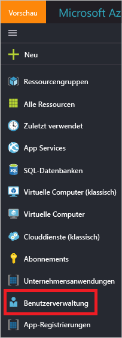

Der Graph für die Benutzeranmeldung zeigt wöchentliche Aggregationen von Anmeldungen für alle Benutzer in einem bestimmten Zeitraum an. Die Standardeinstellung für den Zeitraum beträgt 30 Tage.

Wenn Sie im Graph für die Anmeldung auf einen Tag klicken, wird eine ausführliche Liste mit den Anmeldeaktivitäten angezeigt.

In jeder Zeile der Liste mit den Anmeldeaktivitäten erhalten Sie die ausführlichen Informationen zur ausgewählten Anmeldung, z.B.:

- Wer hat sich angemeldet?

- Welcher UPN wurde verwendet?

- Welche Anwendung war das Ziel der Anmeldung?

- Wie lautet die IP-Adresse der Anmeldung?

- Wie lautete der Status der Anmeldung?

### Nutzung von verwalteten Anwendungen

Mit einer anwendungsorientierten Ansicht Ihrer Anmeldedaten können Sie beispielsweise folgende Fragen beantworten:

- Wer verwendet meine Anwendungen?

- Welche drei Anwendungen sind im Unternehmen am beliebtesten?

- Ich habe vor Kurzem eine Anwendung eingeführt. Wie gut funktioniert sie?

Ihr Einstiegspunkt für diese Daten ist die Liste mit den beliebtesten drei Anwendungen in Ihrem Unternehmen im Bericht zu den letzten 30 Tagen (Abschnitt **Übersicht** unter **Enterprise applications** (Unternehmensanwendungen)).

 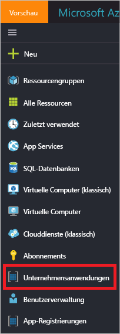

Der Graph zur App-Nutzung gibt die wöchentlichen Aggregationen von Anmeldungen für Ihre beliebtesten drei Anwendungen in einem bestimmten Zeitraum an. Die Standardeinstellung für den Zeitraum beträgt 30 Tage.

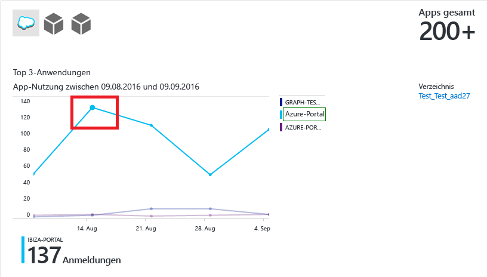

Wenn Sie möchten, können Sie den Fokus auf eine bestimmte Anwendung festlegen.

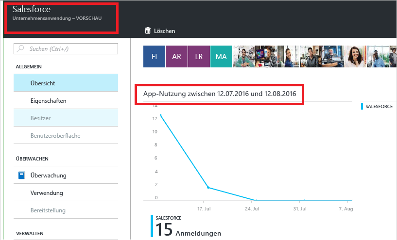

Wenn Sie im Graph für die App-Nutzung auf einen Tag klicken, wird eine ausführliche Liste mit den Anmeldeaktivitäten angezeigt.

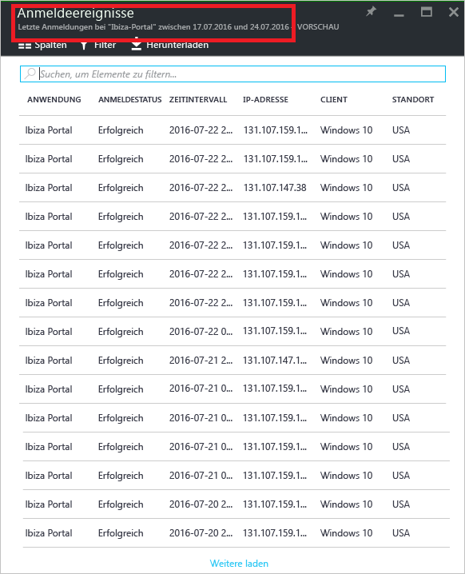

Mit der Option **Anmeldungen** können Sie eine vollständige Übersicht über alle Anmeldeereignisse für Ihre Anwendungen anzeigen.

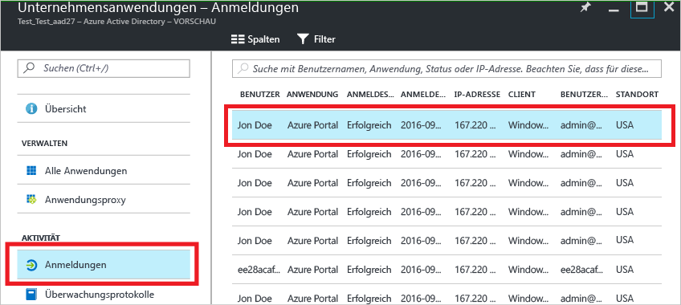

Mit der Spaltenauswahl können Sie die Datenfelder auswählen, die Sie anzeigen möchten.

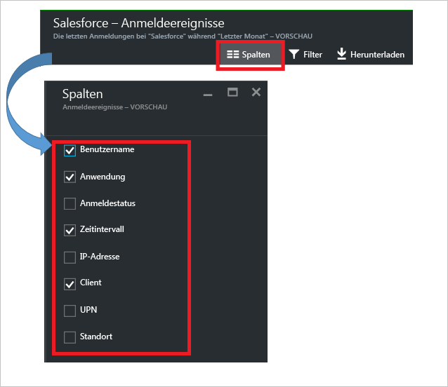

### Filtern von Anmeldungen

Sie können Anmeldungen nach einem Zeitintervall filtern, um die Menge der angezeigten Daten zu begrenzen.

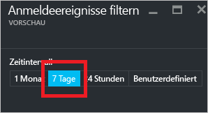

Eine andere Methode zum Filtern von Einträgen der Anmeldeaktivitäten ist das Suchen nach bestimmten Einträgen. Mit der Suchmethode können Sie die Anmeldungen auf bestimmte **Benutzer**, **Gruppen** oder **Anwendungen** begrenzen.

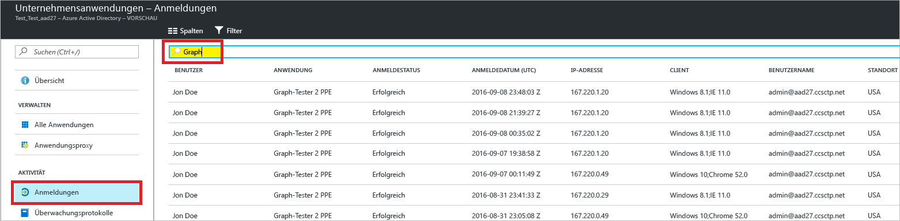

## Überwachungsprotokolle

Die Überwachungsprotokolle in Azure Active Directory enthalten Datensätze mit Systemaktivitäten, die zum Nachweisen der Einhaltung von Bestimmungen verwendet werden können.

Es gibt drei Hauptkategorien für die Überwachung von zusammengehörigen Aktivitäten im Azure-Portal:

- Benutzer und Gruppen

- Anwendungen

- Verzeichnis

Eine vollständige Liste mit den Überwachungsberichtsaktivitäten finden Sie in der [Liste der Überwachungsberichtsereignisse](active-directory-reporting-audit-events.md#list-of-audit-report-events).

Ihr Einstiegspunkt für alle Überwachungsdaten ist die Option **Überwachungsprotokolle** im Abschnitt **Aktivität** von **Azure Active Directory**.

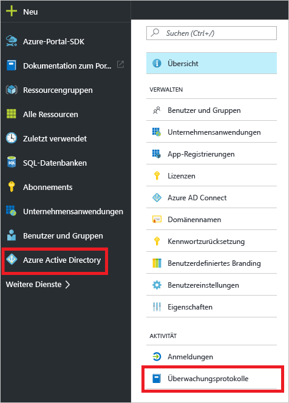

Ein Überwachungsprotokoll verfügt über eine Listenansicht, in der die Akteure (wer), die Aktivitäten (was) und die Ziele angezeigt werden.

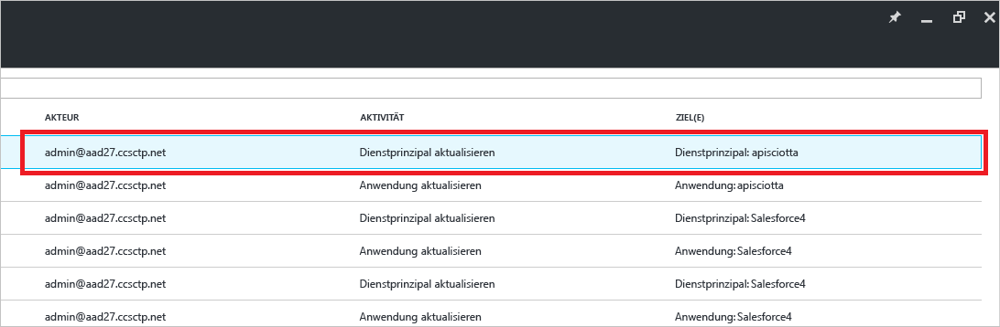

Wenn Sie in der Listenansicht auf einen Eintrag klicken, können Sie weitere Details zum Eintrag anzeigen.

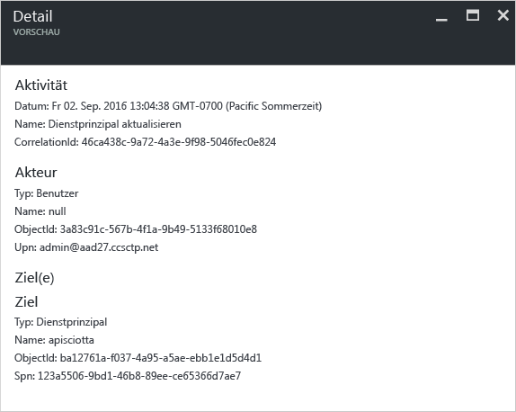

### Überwachungsprotokolle für Benutzer und Gruppen

Mit Überwachungsberichten, die auf Benutzern und Gruppen basieren, können Sie beispielsweise Antworten auf folgende Fragen erhalten:

- Welche Arten von Updates wurden von den Benutzern angewendet?

- Wie viele Benutzer wurden geändert?

- Wie viele Kennwörter wurden geändert?

- Welche Schritte hat ein Administrator in einem Verzeichnis ausgeführt?

- Welche Gruppen wurden hinzugefügt?

- Sind Gruppen mit Änderungen der Mitgliedschaft vorhanden?

- Haben sich die Besitzer der Gruppe geändert?

- Welche Lizenzen wurden einer Gruppe oder einem Benutzer zugewiesen?

Wenn Sie nur Überwachungsdaten überprüfen möchten, die sich auf Benutzer und Gruppen beziehen, können Sie die gefilterte Ansicht unter **Überwachungsprotokolle** im Abschnitt **Aktivität** der Option **Benutzer und Gruppen** verwenden.

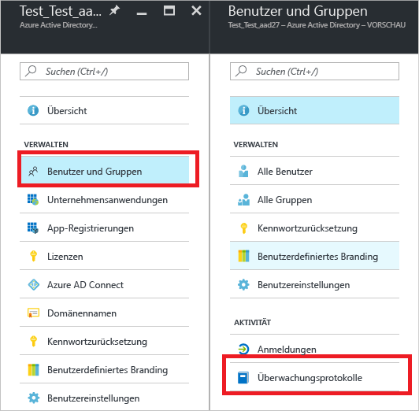

### Überwachungsprotokolle für Anwendungen

Mit Überwachungsberichten, die auf Anwendungen basieren, können Sie beispielsweise Antworten auf folgende Fragen erhalten:

- Welche Anwendungen wurden hinzugefügt oder aktualisiert?

- Welche Anwendungen wurden entfernt?

- Hat sich ein Dienstprinzip für eine Anwendung geändert?

- Haben sich die Namen von Anwendungen geändert?

- Wer hat die Zustimmung zu einer Anwendung erteilt?

Wenn Sie nur Überwachungsdaten überprüfen möchten, die sich auf Anwendungen beziehen, können Sie die gefilterte Ansicht unter **Überwachungsprotokolle** im Abschnitt **Aktivität** der Option **Enterprise applications** (Unternehmensanwendungen) verwenden.

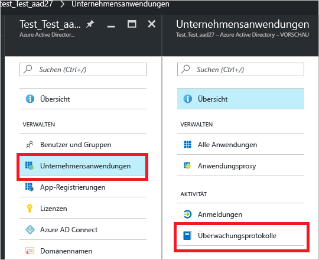

### Filtern von Überwachungsprotokollen

Sie können einen Überwachungsbericht nach einem Zeitintervall filtern, um die Menge der angezeigten Daten zu begrenzen.

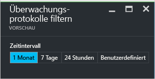

Eine andere Methode zum Filtern der Einträge eines Überwachungsprotokolls ist die Suche nach bestimmten Einträgen.

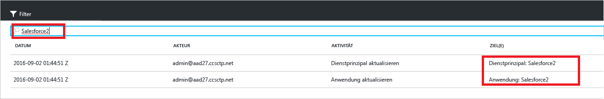

## Nächste Schritte

Weitere Informationen finden Sie unter [Anleitung für Azure Active Directory-Berichte](active-directory-reporting-guide.md).

<!---HONumber=AcomDC_0928_2016-->