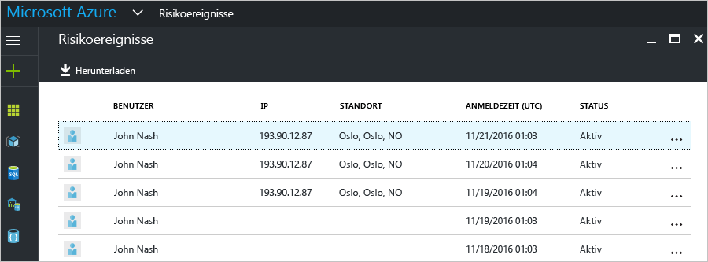
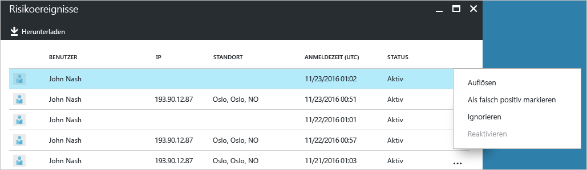
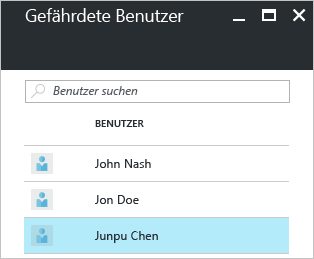
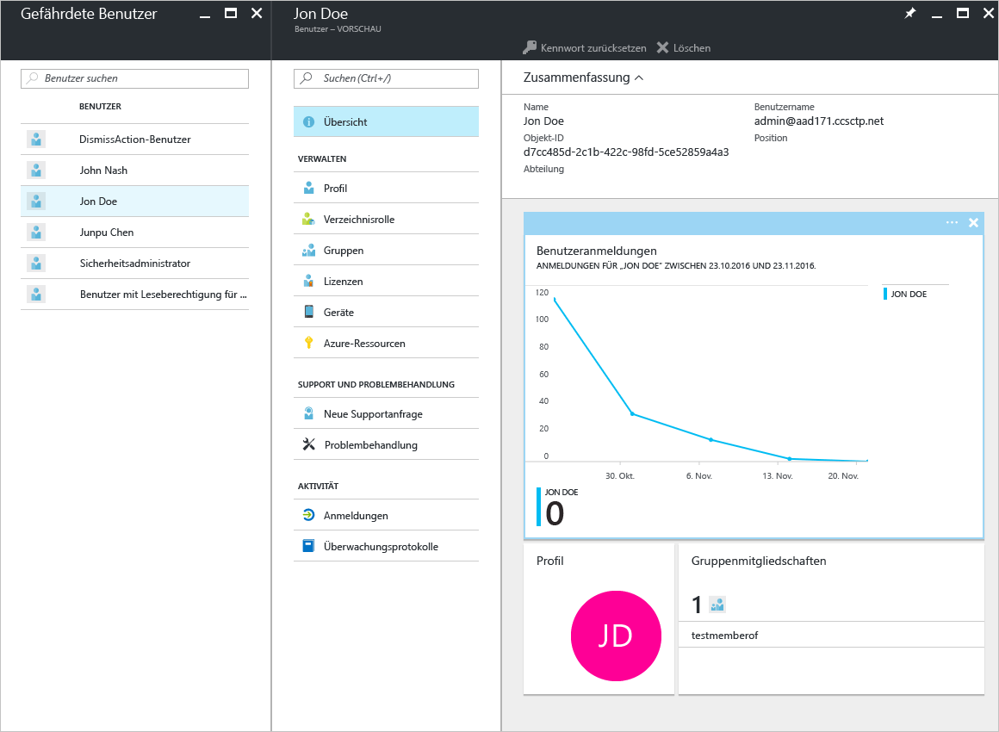

# Sicherheitsberichte in den Azure Active Directory-Editionen Free und Basic – Vorschau

Mit den Sicherheitsberichten in der Azure Active Directory-[Vorschau](active-directory-preview-explainer.md) erhalten Sie Einblicke in die Wahrscheinlichkeit für kompromittierte Benutzerkonten in Ihrer Umgebung. 

Azure Active Directory erkennt verdächtige Aktionen im Zusammenhang mit Ihren Benutzerkonten. Für jede erkannte Aktion wird ein Datensatz mit der Bezeichnung *Risikoereignis* erstellt. Weitere Details finden Sie unter [Azure Active Directory risk events](active-directory-identity-protection-risk-events.md) (Azure Active Directory-Risikoereignisse). 

Die erkannten Risikoereignisse werden zum Berechnen folgender Werte verwendet:

- **Riskante Anmeldungen:** Eine riskante Anmeldung ist ein Indikator für einen Anmeldeversuch von einem Benutzer, der nicht der rechtmäßige Besitzer eines Benutzerkontos ist. Weitere Informationen finden Sie unter [Riskante Anmeldungen](active-directory-identityprotection.md#risky-sign-ins). 

- **Benutzer mit Risikomarkierung:** Ein Benutzer mit Risikomarkierung ist ein Indikator für ein möglicherweise kompromittiertes Benutzerkonto. Weitere Informationen finden Sie unter [Benutzer mit Risikomarkierung](active-directory-identityprotection.md#users-flagged-for-risk).  

## Bericht über riskante Anmeldungen

Die Azure Active Directory-Editionen Free und Basic stellen Ihnen eine Liste riskanter Anmeldungen zur Verfügung, die für Ihre Benutzer erkannt und gemeldet wurden. Der Bericht über Risikoereignisse enthält Folgendes:

- **Benutzer**: Der Name des Benutzers, der während des Anmeldevorgangs verwendet wurde
- **IP**: Die IP-Adresse des Geräts, die für die Verbindung mit Azure Active Directory verwendet wurde
- **Speicherort**: Der für die Verbindung mit Azure Active Directory verwendete Speicherort
- **Zeitpunkt der Anmeldung**: Die Uhrzeit, zu der die Anmeldung erfolgte
- **Status**: Der Status der Anmeldung

In diesem Bericht steht Ihnen eine Option zum Herunterladen der Berichtsdaten zur Verfügung.

Basierend auf Ihrer Untersuchung der riskanten Anmeldung können Sie Azure Active Directory in Form der folgenden Aktionen Feedback bereitstellen:

- Beheben
- Als falsch positiv markieren
- Ignorieren
- Erneut aktivieren

Ausführlichere Informationen finden Sie unter [Manuelles Schließen von Risikoereignissen](active-directory-identityprotection.md#closing-risk-events-manually).

## Bericht „Gefährdete Benutzer“

Mit der Azure Active Directory-Edition Free können Sie eine Liste mit möglicherweise kompromittierten Benutzerkonten erstellen. 

Durch Klicken auf einen Benutzer in der Liste wird das zugehörige Benutzerdatenblatt geöffnet.
Prüfen Sie für gefährdete Benutzer den Anmeldeverlauf des Benutzers, und setzen Sie bei Bedarf das Kennwort zurück.

## Nächste Schritte

- Weitere Informationen zur Azure Active Directory-Berichterstellung finden Sie in der [Anleitung für Azure Active Directory-Berichte](active-directory-reporting-guide.md).
- Weitere Informationen zu Azure Active Directory Identity Protection finden Sie unter [Azure Active Directory Identity Protection](active-directory-identityprotection.md).

<!--HONumber=Jan17_HO3-->

