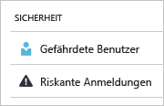
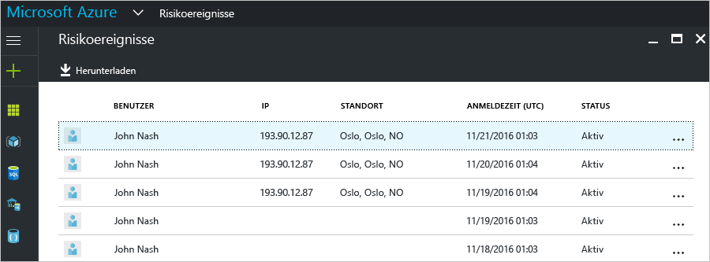
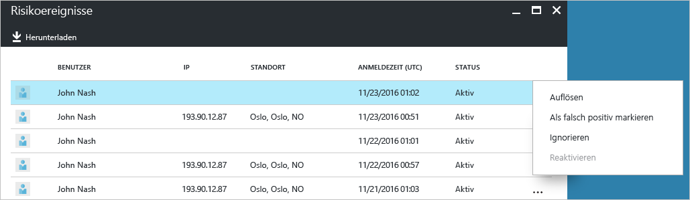
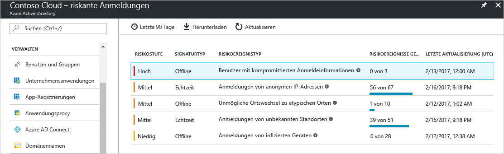
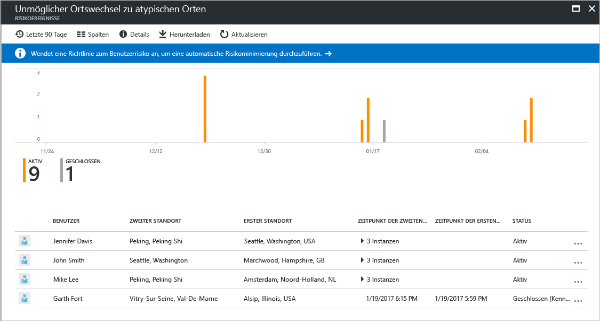
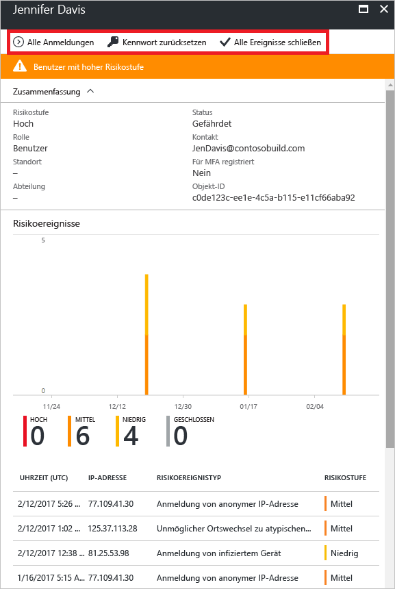
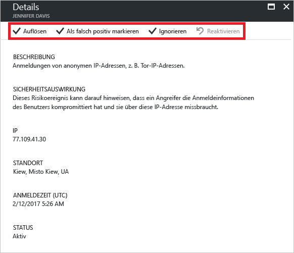

---

title: "Bericht „Riskante Anmeldungen“ im Azure Active Directory-Portal | Microsoft-Dokumentation"
description: "Enthält Informationen zum Bericht „Riskante Anmeldungen“ im Azure Active Directory-Portal."
services: active-directory
author: MarkusVi
manager: femila
ms.assetid: 7728fcd7-3dd5-4b99-a0e4-949c69788c0f
ms.service: active-directory
ms.devlang: na
ms.topic: get-started-article
ms.tgt_pltfrm: na
ms.workload: identity
ms.date: 05/04/2017
ms.author: markvi
ms.translationtype: Human Translation
ms.sourcegitcommit: 2db2ba16c06f49fd851581a1088df21f5a87a911
ms.openlocfilehash: e21b7733bc0f6b8625fbdcec3529ad603ce306c1
ms.contentlocale: de-de
ms.lasthandoff: 05/08/2017

---
# Bericht „Riskante Anmeldungen“ im Azure Active Directory-Portal

Mit den Sicherheitsberichten in Azure Active Directory (Azure AD) erhalten Sie Einblicke in die Wahrscheinlichkeit für kompromittierte Benutzerkonten in Ihrer Umgebung. 

Azure AD erkennt verdächtige Aktionen im Zusammenhang mit Ihren Benutzerkonten. Für jede erkannte Aktion wird ein Datensatz mit der Bezeichnung *Risikoereignis* erstellt. Weitere Details finden Sie unter [Azure Active Directory risk events](active-directory-identity-protection-risk-events.md) (Azure Active Directory-Risikoereignisse). 

Die erkannten Risikoereignisse werden zum Berechnen folgender Werte verwendet:

- **Riskante Anmeldungen:** Eine riskante Anmeldung ist ein Indikator für einen Anmeldeversuch von einem Benutzer, der nicht der rechtmäßige Besitzer eines Benutzerkontos ist. Weitere Informationen finden Sie unter [Riskante Anmeldungen](active-directory-identityprotection.md#risky-sign-ins). 

- **Benutzer mit Risikomarkierung:** Ein Benutzer mit Risikomarkierung ist ein Indikator für ein möglicherweise kompromittiertes Benutzerkonto. Weitere Informationen finden Sie unter [Benutzer mit Risikomarkierung](active-directory-identityprotection.md#users-flagged-for-risk).  

Im [Azure-Portal](https://portal.azure.com) befinden sich die Sicherheitsberichte auf dem Blatt **Azure Active Directory** im Abschnitt **Sicherheit**. 

## Azure Active Directory – Free und Basic Edition

In den Azure Active Directory-Editionen Free und Basic wird Ihnen eine Liste mit riskanten Anmeldungen zur Verfügung gestellt, die für Ihre Benutzer erkannt wurden. Der Bericht über Risikoereignisse enthält Folgendes:

- **Benutzer**: Der Name des Benutzers, der während des Anmeldevorgangs verwendet wurde
- **IP**: Die IP-Adresse des Geräts, die für die Verbindung mit Azure Active Directory verwendet wurde
- **Speicherort**: Der für die Verbindung mit Azure Active Directory verwendete Speicherort
- **Zeitpunkt der Anmeldung**: Die Uhrzeit, zu der die Anmeldung erfolgte
- **Status**: Der Status der Anmeldung

In diesem Bericht steht Ihnen eine Option zum Herunterladen der Berichtsdaten zur Verfügung.

Basierend auf Ihrer Untersuchung der riskanten Anmeldung können Sie Azure Active Directory in Form der folgenden Aktionen Feedback bereitstellen:

- Beheben
- Als falsch positiv markieren
- Ignorieren
- Erneut aktivieren

Ausführlichere Informationen finden Sie unter [Manuelles Schließen von Risikoereignissen](active-directory-identityprotection.md#closing-risk-events-manually).

## Azure Active Directory – Premium Editionen

Der Bericht „Riskante Anmeldungen“ in den Premium Editionen von Azure Active Directory enthält Folgendes:

- Aggregierte Informationen zu den erkannten [Risikoereignistypen](active-directory-identity-protection-risk-events.md)

- Option zum Herunterladen des Berichts

Wenn Sie ein Risikoereignis auswählen, erhalten Sie eine ausführliche Berichtsansicht für das Risikoereignis und haben die folgenden Optionen:

- Option zum Konfigurieren einer [Richtlinie zum Beheben des Benutzerrisikos](active-directory-identityprotection.md#user-risk-security-policy)  

- Überprüfen der Erkennungszeitachse für das Risikoereignis  

- Überprüfen einer Liste mit den Benutzern, für die dieses Risikoereignis erkannt wurde

- [Manuelles Schließen von Risikoereignissen](active-directory-identityprotection.md#closing-risk-events-manually) oder erneutes Aktivieren eines manuell geschlossenen Risikoereignisses 

Wenn Sie einen Benutzer auswählen, erhalten Sie eine ausführliche Berichtsansicht für diesen Benutzer mit folgenden Optionen:

- Öffnen der Ansicht „Alle Anmeldungen“

- Das Kennwort des Benutzers zurücksetzen

- Verwerfen aller Ereignisse

- Untersuchen der gemeldeten Risikoereignisse für den Benutzer 

Wählen Sie in der Liste ein Risikoereignis aus, um es zu untersuchen.  
Das Blatt **Details** wird für das Risikoereignis geöffnet. Auf dem Blatt **Details** können Sie ein [Risikoereignis manuell schließen](active-directory-identityprotection.md#closing-risk-events-manually) oder ein manuell geschlossenes Risikoereignis wieder aktivieren. 

## Nächste Schritte

- Weitere Informationen zu Azure Active Directory Identity Protection finden Sie unter [Azure Active Directory Identity Protection](active-directory-identityprotection.md).

