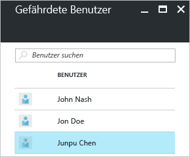
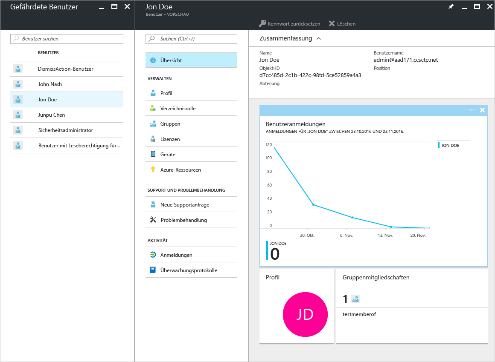
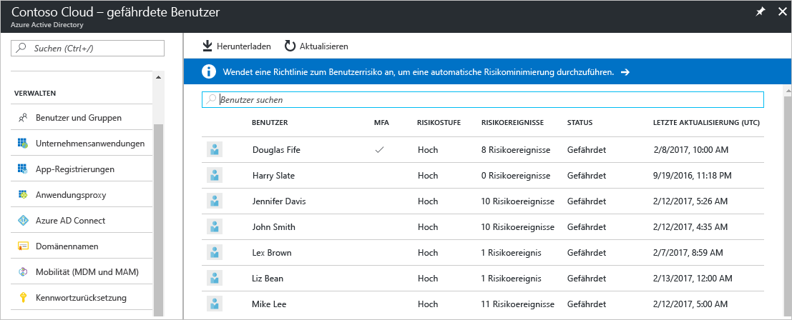
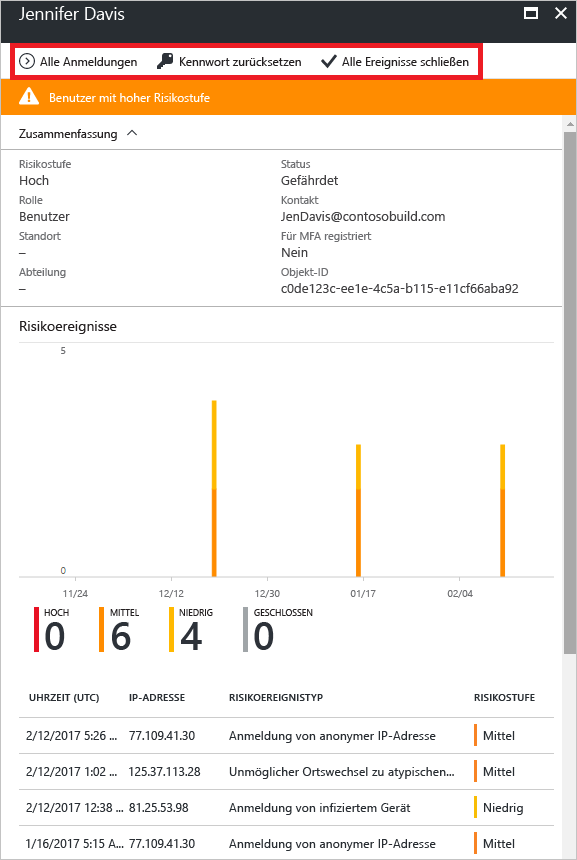
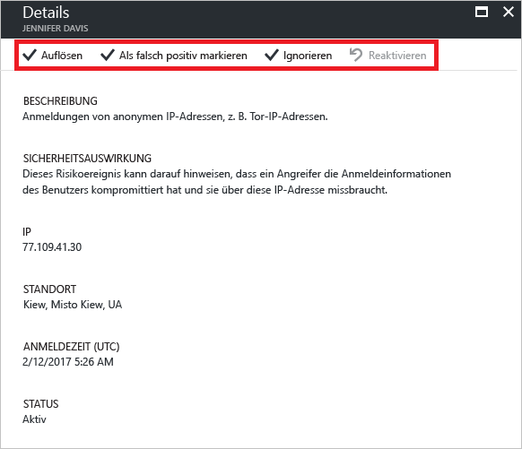

# Sicherheitsbericht „Benutzer mit Risikomarkierung“ im Azure Active Directory-Portal

Mit den Sicherheitsberichten in Azure Active Directory (Azure AD) erhalten Sie Einblicke in die Wahrscheinlichkeit für kompromittierte Benutzerkonten in Ihrer Umgebung. 

Azure Active Directory erkennt verdächtige Aktionen im Zusammenhang mit Ihren Benutzerkonten. Für jede erkannte Aktion wird ein Datensatz mit der Bezeichnung *Risikoereignis* erstellt. Weitere Informationen finden Sie unter [Azure Active Directory-Risikoereignisse](active-directory-identity-protection-risk-events.md). 

Die erkannten Risikoereignisse werden zum Berechnen folgender Werte verwendet:

- **Riskante Anmeldungen:** Eine riskante Anmeldung ist ein Indikator für einen Anmeldeversuch von einem Benutzer, der nicht der rechtmäßige Besitzer eines Benutzerkontos ist. Weitere Informationen finden Sie unter [Riskante Anmeldungen](active-directory-identityprotection.md#risky-sign-ins). 

- **Benutzer mit Risikomarkierung:** Ein Benutzer mit Risikomarkierung ist ein Indikator für ein möglicherweise kompromittiertes Benutzerkonto. Weitere Informationen finden Sie unter [Benutzer mit Risikokennzeichnung](active-directory-identityprotection.md#users-flagged-for-risk).  

Im Azure-Portal befinden sich die Sicherheitsberichte auf dem Blatt **Azure Active Directory** im Abschnitt **Sicherheit**.  

## Welche Azure AD-Lizenz benötigen Sie für den Zugriff auf einen Sicherheitsbericht?  

In allen Editionen von Azure Active Directory stehen Sicherheitsberichte zu Benutzern mit Risikomarkierung zur Verfügung.  
Die Granularitätsebene von Berichten kann für die einzelnen Editionen aber variieren: 

- In den **Free- und Basic-Editionen von Azure Active Directory** erhalten Sie bereits eine Liste mit Benutzern mit Risikomarkierung. 

- Mit der Edition **Azure Active Directory Premium 1** wird dieses Modell erweitert, indem Sie zusätzlich jeweils einige zugrunde liegende Risikoereignisse untersuchen können, die für einen Bericht erkannt wurden. 

- In der Edition **Azure Active Directory Premium 2** erhalten Sie die ausführlichsten Informationen zu allen zugrunde liegenden Risikoereignissen, und Sie können Sicherheitsrichtlinien konfigurieren, mit denen automatisch auf konfigurierte Risikostufen reagiert wird.

## Azure Active Directory – Free und Basic Edition

Der Bericht „Benutzer mit Risikomarkierung“ in den Editionen Free und Basic von Azure Active Directory enthält eine Liste mit Benutzerkonten, die unter Umständen kompromittiert wurden. 

Wenn Sie einen Benutzer auswählen, wird das entsprechende Blatt mit den Benutzerdaten geöffnet.
Sie können für gefährdete Benutzer den Anmeldeverlauf des Benutzers prüfen und bei Bedarf das Kennwort zurücksetzen.

## Azure Active Directory – Premium Editionen

Der Bericht „Benutzer mit Risikomarkierung“ in den Premium-Editionen von Azure Active Directory enthält Folgendes:

- Eine [Liste mit Benutzerkonten](active-directory-identityprotection.md#users-flagged-for-risk), die unter Umständen kompromittiert wurden 

- Aggregierte Informationen zu den erkannten [Risikoereignistypen](active-directory-identity-protection-risk-events.md)

- Option zum Herunterladen des Berichts

- Option zum Konfigurieren einer [Richtlinie zum Beheben des Benutzerrisikos](active-directory-identityprotection.md#user-risk-security-policy)  

Wenn Sie einen Benutzer auswählen, erhalten Sie eine ausführliche Berichtsansicht für diesen Benutzer mit folgenden Optionen:

- Öffnen der Ansicht „Alle Anmeldungen“

- Das Kennwort des Benutzers zurücksetzen

- Verwerfen aller Ereignisse

- Untersuchen der gemeldeten Risikoereignisse für den Benutzer 

Um ein Risikoereignis zu untersuchen, wählen Sie es in der Liste aus, um das Blatt **Details** für dieses Risikoereignis zu öffnen. Auf dem Blatt **Details** können Sie ein [Risikoereignis manuell schließen](active-directory-identityprotection.md#closing-risk-events-manually) oder ein manuell geschlossenes Risikoereignis wieder aktivieren. 

## Nächste Schritte

- Weitere Informationen zu Azure Active Directory Identity Protection finden Sie unter [Azure Active Directory Identity Protection](active-directory-identityprotection.md).

