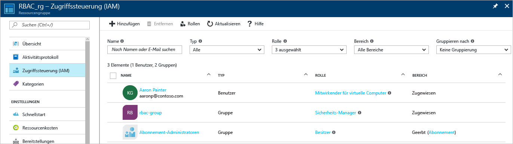
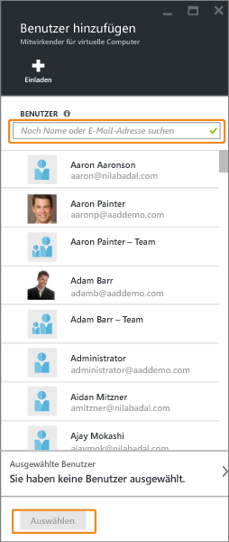
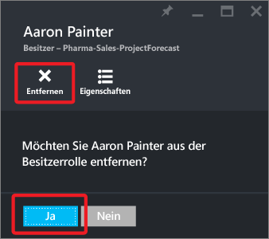
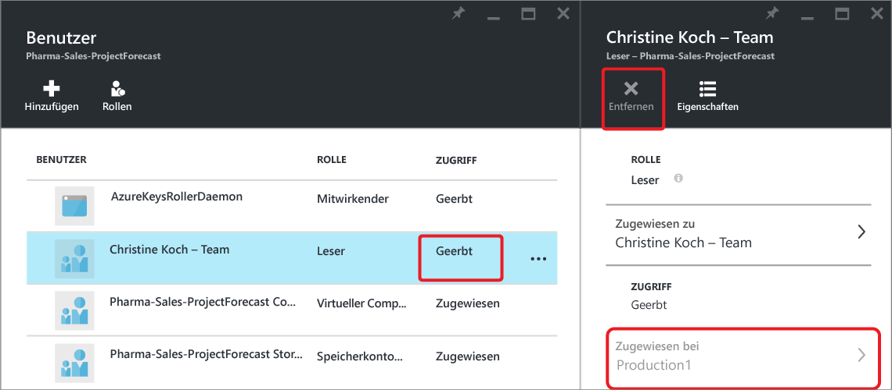

<properties
	pageTitle="Verwenden der rollenbasierten Zugriffssteuerung im Azure-Portal | Microsoft Azure"
	description="Führen Sie die ersten Schritte der Zugriffsverwaltung mit der rollenbasierten Zugriffssteuerung im Azure-Portal aus. Verwenden Sie Rollenzuweisungen, um in Ihrem Verzeichnis Berechtigungen zuzuweisen."
	services="active-directory"
	documentationCenter=""
	authors="kgremban"
	manager="stevenpo"
	editor=""/>

<tags
	ms.service="active-directory"
	ms.devlang="na"
	ms.topic="get-started-article"
	ms.tgt_pltfrm="na"
	ms.workload="identity"
	ms.date="05/03/2016"
	ms.author="kgremban"/>

# Verwenden von Rollenzuweisungen zum Verwalten Ihrer Azure Active Directory-Ressourcen

Die rollenbasierte Access Control in Azure (RBAC) ermöglicht eine präzise Zugriffsverwaltung für Azure. Mit RBAC können Sie den Benutzern nur die Zugriffsrechte gewähren, die diese zum Ausführen ihrer Aufgaben benötigen. Dieser Artikel hilft Ihnen bei der Einrichtung von RBAC im Azure-Portal. Weitere Informationen dazu, wie RBAC Sie bei der Zugriffsverwaltung unterstützt, finden Sie unter [Get started with access management in the Azure portal](role-based-access-control-what-is.md) (Erste Schritte mit der Zugriffsverwaltung im Azure-Portal).

## Zugriff anzeigen
Im Hauptblatt im [Azure-Portal](https://portal.azure.com) können Sie anzeigen, wer Zugriff auf eine Ressource, Ressourcengruppe oder ein Abonnement hat. Wir möchten beispielsweise sehen, wer Zugriff auf eine unserer Ressourcengruppen hat:

1. Wählen Sie in der Navigationsleiste auf der linken Seite **Ressourcengruppe** aus.
	
2. Wählen Sie im Blatt **Ressourcengruppen** den Namen der Ressourcengruppe aus.
3. Wählen Sie oben rechts im Blatt mit der Ressourcengruppe **Benutzer** aus.
	
4. Auf dem Blatt **Benutzer** werden alle Benutzer, Gruppen und Anwendungen aufgeführt, denen Zugriff auf die Ressourcengruppe gewährt wurde.  

	

Beachten Sie, dass einigen Benutzern der Zugriff **zugewiesen** wurde, während andere ihn **geerbt** haben. Der Zugriff wird entweder speziell der Ressourcengruppe zugewiesen oder aus einer Zuweisung des übergeordneten Abonnements geerbt.

> [AZURE.NOTE] Klassische Administratoren und Co-Admins für Abonnements werden im neuen RBAC-Modell als Besitzer des Abonnements betrachtet.

## Zugriff hinzufügen
Sie gewähren Zugriff aus der Ressource, der Ressourcengruppe oder dem Abonnement, die bzw. das als Bereich der Rollenzuweisung gilt.

1. Tippen Sie auf dem Blatt **Benutzer** auf **Hinzufügen**.
	  
2. Wählen Sie auf dem Blatt **Rolle auswählen** auf die Rolle, die Sie zuweisen möchten.
3. Wählen Sie den Benutzer, die Gruppe oder die Anwendung als das Element in Ihrem Verzeichnis aus, für das Sie Zugriff gewähren möchten. Sie können das Verzeichnis mit Anzeigenamen, E-Mail-Adressen und Objektbezeichnern durchsuchen.  

	

4. Wählen Sie **OK**, um die Zuweisung zu erstellen. Das Popupfenster **Der Benutzer wird hinzugefügt** zeigt den Fortschritt an. 
	

Wenn die Rollenzuweisung hinzugefügt wurde, erscheint sie auf dem Blatt **Benutzer**.

## Zugriff entfernen

1. Wählen Sie die Rollenzuweisung auf dem Blatt **Benutzer** aus.
2. Wählen Sie auf dem Blatt mit den Zuweisungsdetails auf **Entfernen**. 
	
3. Wählen Sie **Ja**, um die Entfernung zu bestätigen. 
	

Geerbte Zuweisungen können nicht entfernt werden. In der folgenden Abbildung sehen Sie, dass die „Entfernen“-Schaltfläche ausgegraut ist. Gehen Sie stattdessen zu **Assigned At** (Zugewiesen an). Sie können die Rollenzuweisung entfernen, indem Sie zu der dort aufgelisteten Ressource gehen.

## Andere Tools zum Verwalten des Zugriffs
Sie können auch mit Azure RBAC-Befehlen in anderen Tools als dem Azure-Portal Rollen zuweisen und den Zugriff verwalten. Folgen Sie den Links, um weitere Informationen zu den Voraussetzungen und Hilfe bei den ersten Schritten mit Azure RBAC-Befehlen zu erhalten.

- [Azure PowerShell](role-based-access-control-manage-access-powershell.md)
- [Azure-Befehlszeilenschnittstelle](role-based-access-control-manage-access-azure-cli.md)
- [REST-API](role-based-access-control-manage-access-rest.md)

## Nächste Schritte
- [Erstellen eines Verlaufsberichts zu Zugriffsänderungen](role-based-access-control-access-change-history-report.md)
- Weitere Informationen finden Sie unter [Integrierte RBAC-Rollen in Azure](role-based-access-built-in-roles.md).
- Definieren Sie Ihre eigenen [benutzerdefinierten Rollen in Azure RBAC](role-based-access-control-custom-roles.md).

<!---HONumber=AcomDC_0504_2016-->