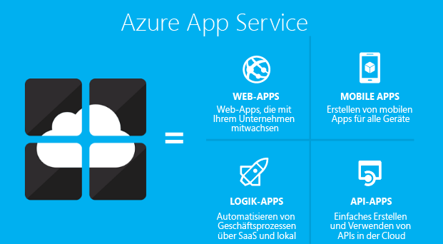
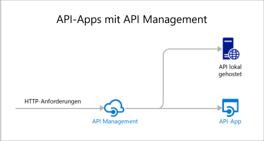

# API-Apps-Übersicht
API-Apps in Azure App Service bieten Funktionen, mit denen APIs in der Cloud und lokal einfacher entwickelt, gehostet und genutzt werden können. Durch API-Apps profitieren Sie von einer geeigneten Sicherheitsstufe für Unternehmen, einfacher Zugriffssteuerung, hybrider Konnektivität, automatischer SDK-Generierung und nahtloser Integration in [Logik-Apps](../app-service-logic/app-service-logic-what-are-logic-apps.md).

[Azure App Service](../app-service/app-service-value-prop-what-is.md) ist eine vollständig verwaltete Plattform für mobile, Web- und Integrationsszenarios. API-Apps ist einer der vier App-Typen, die von [Azure App Service](../app-service/app-service-value-prop-what-is.md)angeboten werden.

## Gründe für die Verwendung von API-Apps
Hier sind einige wichtige Funktionen von API-Apps:

* **Nutzen Sie eigene APIs in unveränderter Form** – Es ist nicht erforderlich, den Code vorhandener APIs zu ändern, um API-Apps zu nutzen – stellen Sie lediglich Ihren Code in einer API-App bereit. Ihre API kann alle von App Service unterstützten Sprachen oder Frameworks verwenden, einschließlich ASP.NET und C#, Java, PHP, Node.js und Python.
* **Einfache Nutzung** – Die integrierte Unterstützung für [Swagger-API-Metadaten](http://swagger.io/) ermöglicht es, dass Ihre APIs auf einfache Weise von zahlreichen Clients genutzt werden können.  Clientcode für Ihre APIs kann in zahlreichen verschiedenen Programmiersprachen generiert werden, darunter C#, Java und Javascript. Sie können ganz einfach [CORS](app-service-api-cors-consume-javascript.md) konfigurieren, ohne den Code zu ändern. Weitere Informationen finden Sie unter [Metadaten in App Service-API-Apps für die API-Ermittlung](app-service-api-metadata.md) und [Codegenerierung und Nutzen einer API-App aus JavaScript mit CORS](app-service-api-cors-consume-javascript.md). 
* **Einfache Zugriffssteuerung** – Sie können eine API-App vor nicht authentifiziertem Zugriff schützen, ohne Änderungen an Ihrem Code vornehmen zu müssen. Integrierte Authentifizierungsdienste sichern APIs für den Zugriff durch andere Dienste oder Clients, die Benutzer repräsentieren. Folgende Identitätsanbieter werden unterstützt: Azure Active Directory, Facebook, Twitter, Google und Microsoft-Konto. Clients können die Active Directory Authentication Library (ADAL) oder das Mobile Apps-SDK verwenden. Weitere Informationen finden Sie unter [Authentifizierung und Autorisierung für API-Apps in Azure App Service](app-service-api-authentication.md).
* **Visual Studio-Integration** – Dedizierte Tools in Visual Studio optimieren das Erstellen, Bereitstellen, Nutzen, Debuggen und Verwalten von API-Apps. Weitere Informationen finden Sie unter [Announcing the Azure SDK 2.8.1 for .NET](https://azure.microsoft.com/blog/announcing-azure-sdk-2-8-1-for-net/)(in englischer Sprache).
* **Integration in Logik-Apps** – Von Ihnen erstellte API-Apps können von [App Service-Logik-Apps](../app-service-logic/app-service-logic-what-are-logic-apps.md)genutzt werden.  Weitere Informationen finden Sie unter [Verwenden der in App Service gehosteten benutzerdefinierten API mit Logik-Apps](../app-service-logic/app-service-logic-custom-hosted-api.md) und [Neue Schemaversion „2015-08-01-preview“](../app-service-logic/app-service-logic-schema-2015-08-01.md).

Darüber hinaus kann eine API-App von Features profitieren, die von [Web-Apps](../app-service-web/app-service-web-overview.md) und [Mobile Apps](../app-service-mobile/app-service-mobile-value-prop.md) bereitgestellt werden. Dies gilt auch umgekehrt: Wenn Sie eine API mithilfe einer Web-App oder einer mobilen App hosten, kann diese von API-App-Funktionen wie Swagger-Metadaten zur Generierung des Clientcodes und CORS für den domänenübergreifenden Browserzugriff profitieren. Der einzige Unterschied zwischen den drei App-Typen (API, Web, mobil) ist der Name und das Symbol im Azure-Portal.

## Was ist der Unterschied zwischen API-Apps und Azure API Management?
API-Apps und [Azure API Management](../api-management/api-management-key-concepts.md) sind sich ergänzende Dienste:

* API Management dient zur Verwaltung von APIs. Sie können mit einem API Management-Front-End auf einer API unter anderem die Nutzung überwachen und drosseln, die Ein- und Ausgabe bearbeiten und mehrere APIs an einem Endpunkt konsolidieren usw. Die verwalteten APIs können an einem beliebigen Ort gehostet werden.
* API-Apps wird für das Hosting von APIs verwendet. Der Dienst umfasst Funktionen zur einfachen Entwicklung und Nutzung von APIs, führt aber nicht die Art von Überwachung, Drosselung, Bearbeitung oder Konsolidierung durch, für die API Management zuständig ist. Wenn Sie die Funktionen von API Management nicht benötigen, können Sie APIs in API-Apps hosten, ohne API Management zu verwenden.

Das folgende Diagramm veranschaulicht die Verwendung von API Management für APIs, die u.a. in API-Apps gehostet werden.

API Management und API-Apps verfügen über ein paar ähnliche Funktionen.  Beispielsweise können beide die CORS-Unterstützung automatisieren. Wenn Sie die beiden Dienste zusammen verwenden, würden Sie API Management für CORS verwenden, da der Dienst als Front-End für API-Apps dient. 

## Erste Schritte
Informationen zu den ersten Schritten mit API-Apps durch die Bereitstellung von Beispielcode finden Sie in den Tutorials zu den entsprechenden Frameworks:

* [ASP.NET](app-service-api-dotnet-get-started.md) 
* [Node.js](app-service-api-nodejs-api-app.md) 
* [Java](app-service-api-java-api-app.md) 

Wenn Sie Fragen zu API-Apps stellen möchten, starten Sie einen Thread im [API-Apps-Forum](https://social.msdn.microsoft.com/Forums/en-US/home?forum=AzureAPIApps). 

<!--HONumber=Dec16_HO2-->

