<properties
	pageTitle="Erste Schritte mit API-Apps und ASP.NET in App Service | Microsoft Azure"
	description="Erfahren Sie, wie Sie mit Visual Studio 2015 eine ASP.NET-API-App in Azure App Service erstellen, bereitstellen und nutzen."
	services="app-service\api"
	documentationCenter=".net"
	authors="tdykstra"
	manager="wpickett"
	editor=""/>

<tags
	ms.service="app-service-api"
	ms.workload="na"
	ms.tgt_pltfrm="dotnet"
	ms.devlang="na"
	ms.topic="hero-article"
	ms.date="09/20/2016"
	ms.author="rachelap"/>

# Erste Schritte mit API-Apps, ASP.NET und Swagger in Azure App Service

[AZURE.INCLUDE [Auswahl](../../includes/app-service-api-get-started-selector.md)]

Dies ist das erste Tutorial einer Reihe von Tutorials zur Verwendung der Features von Azure App Service, die als Unterstützung beim Entwickeln und Hosten von RESTful-APIs dienen. In diesem Tutorial wird die Unterstützung für API-Metadaten im Swagger-Format behandelt.

Sie lernen Folgendes:

* Erstellen und Bereitstellen von [API-Apps](app-service-api-apps-why-best-platform.md) in Azure App Service mit integrierten Tools von Visual Studio 2015
* Automatisieren der API-Ermittlung mit dem Swashbuckle-NuGet-Paket zum dynamischen Generieren von Metadaten der Swagger-API
* Verwenden von Metadaten der Swagger-API zum automatischen Generieren von Clientcode für eine API-App

## Beispielanwendung – Übersicht

In diesem Tutorial arbeiten Sie mit einer einfachen Aufgabenlisten-Beispielanwendung. Die Anwendung verfügt über ein SPA-Front-End (Single-Page-Anwendung), eine ASP.NET-Web-API für die mittlere Ebene und eine ASP.NET-Web-API für die Datenebene.

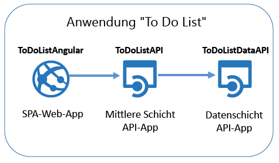

Hier ist ein Screenshot des [AngularJS](https://angularjs.org/)-Front-Ends angegeben.

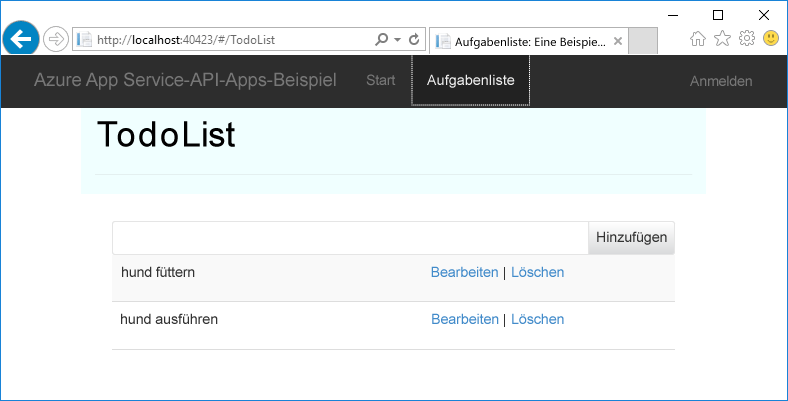

Die Visual Studio-Projektmappe enthält drei Projekte:

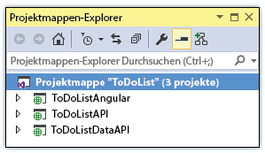

* **ToDoListAngular** – Front-End: AngularJS-SPA zum Aufrufen der mittleren Ebene

* **ToDoListAPI** – Mittlere Ebene: ASP.NET-Web-API-Projekt zum Aufrufen der Datenebene und Durchführen von CRUD-Operationen für Aufgabenelemente

* **ToDoListDataAPI** – Datenebene: ASP.NET-Web-API-Projekt zum Durchführen von CRUD-Operationen für Aufgabenelemente

Die Architektur mit drei Ebenen ist eine von vielen Architekturen, die Sie mit API-Apps implementieren können. Sie wird hier nur zu Demonstrationszwecken verwendet. Der Code auf jeder Ebene ist so einfach wie möglich gehalten, um die Features von API-Apps zu veranschaulichen. Beispielsweise wird für die Datenebene Serverspeicher anstelle einer Datenbank als Persistenzmechanismus verwendet.

Wenn Sie dieses Tutorial abgeschlossen haben, sind die beiden Web-API-Projekte in der Cloud für App Service-API-Apps einsatzbereit.

Im nächsten Tutorial der Reihe wird das SPA-Front-End für die Cloud bereitgestellt.

## Voraussetzungen

* ASP.NET-Web-API: In der Anleitung des Tutorials wird davon ausgegangen, dass Sie über Grundkenntnisse in Bezug auf die Verwendung der ASP.NET-[Web-API 2](http://www.asp.net/web-api/overview/getting-started-with-aspnet-web-api/tutorial-your-first-web-api) in Visual Studio verfügen.

* Azure-Konto: Sie können [ein kostenloses Azure-Konto eröffnen](/pricing/free-trial/?WT.mc_id=A261C142F) oder die [Visual Studio-Abonnementvorteile aktivieren](/pricing/member-offers/msdn-benefits-details/?WT.mc_id=A261C142F).

	Wenn Sie Azure App Service ausprobieren möchten, ehe Sie sich für ein Azure-Konto anmelden, besuchen Sie [Azure App Service-App erstellen](http://go.microsoft.com/fwlink/?LinkId=523751). Dort können Sie direkt eine kurzzeitige Start-App in App Service erstellen – **ohne Kreditkarte** und weitere Verpflichtungen.

* Visual Studio 2015 mit [Azure SDK für .NET](https://azure.microsoft.com/downloads/archive-net-downloads/): Über das SDK wird Visual Studio 2015 automatisch installiert, falls die Anwendung noch nicht installiert ist.

    * Klicken Sie in Visual Studio auf „Hilfe > Info“, und stellen Sie sicher, dass „Azure App Service Tools v2.9.1“ oder höher installiert ist.

	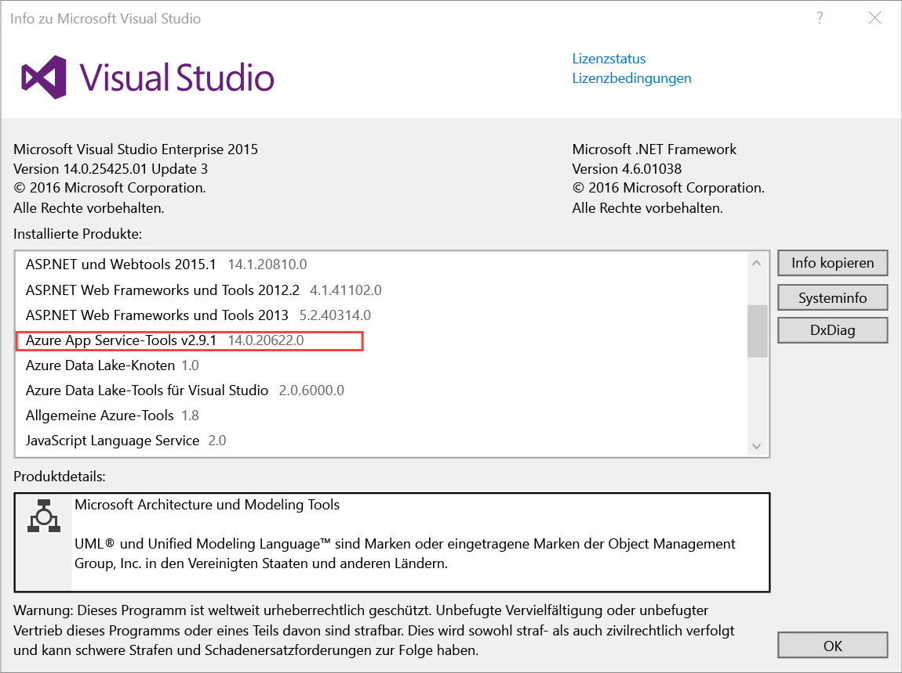

	>[AZURE.NOTE] Abhängig von der Anzahl an bereits bestehenden SDK-Abhängigkeiten auf Ihrem Computer kann der Installationsvorgang des SDK von mehreren Minuten bis hin zu einer halben Stunde oder länger dauern.

## Herunterladen der Beispielanwendung

1. Laden Sie das Repository [Azure-Samples/app-service-api-dotnet-to-do-list](https://github.com/Azure-Samples/app-service-api-dotnet-todo-list) herunter.

	Sie können auf die Schaltfläche **Download ZIP** klicken oder das Repository auf Ihrem lokalen Computer klonen.

2. Öffnen Sie die Projektmappe ToDoList in Visual Studio 2015 oder 2013.
   1. Es ist erforderlich, dass jede Projektmappe als vertrauenswürdig eingestuft wird. 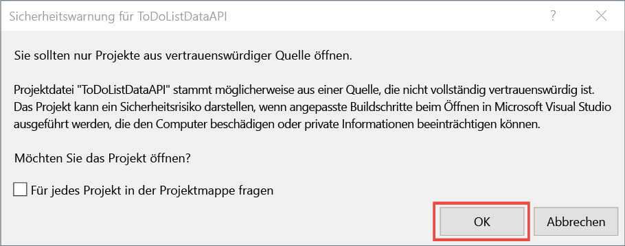

3. Erstellen Sie die Projektmappe (STRG+UMSCHALT+B), um die NuGet-Pakete wiederherzustellen.

	Wenn Sie die Anwendung vor der Bereitstellung in Betrieb sehen möchten, können Sie sie lokal ausführen. Stellen Sie sicher, dass ToDoListDataAPI das Startprojekt ist, und führen Sie die Projektmappe aus. Im Browser sollte der Fehler HTTP 403 angezeigt werden.

## Verwenden von Metadaten und der Benutzeroberfläche der Swagger-API

In Azure App Service ist Unterstützung für [Swagger 2.0](http://swagger.io/)-API-Metadaten integriert. Jede API-App kann einen URL-Endpunkt angeben, der Metadaten für die API im Swagger-JSON-Format zurückgibt. Die Metadaten, die von diesem Endpunkt zurückgegeben werden, können zum Generieren von Clientcode verwendet werden.

Für ein ASP.NET-Web-API-Projekt können Sie Swagger-Metadaten dynamisch erstellen, indem Sie das NuGet-Paket [Swashbuckle](https://www.nuget.org/packages/Swashbuckle) verwenden. Das NuGet-Paket „Swashbuckle“ ist in den Projekten ToDoListDataAPI und ToDoListAPI, die Sie heruntergeladen haben, bereits installiert.

In diesem Abschnitt des Tutorials geht es um die generierten Swagger 2.0-Metadaten, und dann probieren Sie eine Testbenutzeroberfläche aus, die auf den Swagger-Metadaten basiert.

1. Legen Sie das Projekt „ToDoListDataAPI“ (**nicht** das Projekt „ToDoList API“) als Startprojekt fest.

	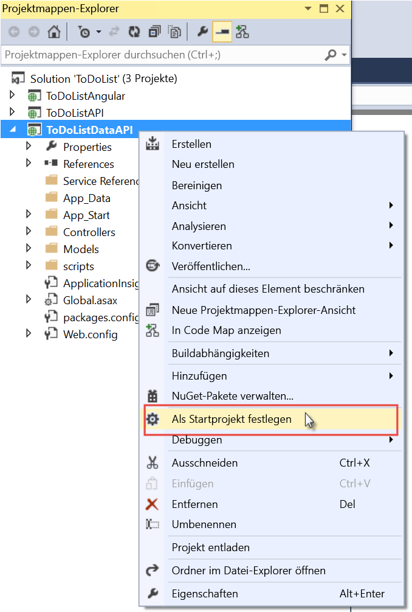

2. Drücken Sie die Taste F5, oder klicken Sie auf **Debuggen > Debugging starten**, um die Projekte im Debugmodus auszuführen.

	Der Browser wird geöffnet und zeigt die Seite mit dem Fehler „HTTP 403“ an.

3. Fügen Sie in der Adressleiste des Browsers „`swagger/docs/v1`“ am Ende der Zeile hinzu, und drücken Sie die EINGABETASTE. (Die URL lautet `http://localhost:45914/swagger/docs/v1`.)

	Dies ist die Standard-URL, die von Swashbuckle zum Zurückgeben von Swagger 2.0-JSON-Metadaten für die API verwendet wird.

	Wenn Sie Internet Explorer verwenden, fordert der Browser Sie zum Herunterladen der Datei *v1.json* auf.

	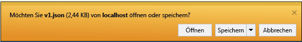

	Wenn Sie Chrome, Firefox oder Edge verwenden, zeigt der Browser die JSON-Daten im Browserfenster an. JSON-Code wird in unterschiedlichen Browsern auch unterschiedlich behandelt, und Ihr Browserfenster sieht unter Umständen nicht genau wie im Beispiel aus.

	

	Im folgenden Beispiel ist der erste Abschnitt der Swagger-Metadaten für die API mit der Definition für die Get-Methode zu sehen. Diese Metadaten stellen die Grundlage der Swagger-Benutzeroberfläche dar, die Sie in den folgenden Schritten verwenden. Sie nutzen sie auch in einem späteren Abschnitt des Tutorials, um Clientcode automatisch zu generieren.

		{
		  "swagger": "2.0",
		  "info": {
		    "version": "v1",
		    "title": "ToDoListDataAPI"
		  },
		  "host": "localhost:45914",
		  "schemes": [ "http" ],
		  "paths": {
		    "/api/ToDoList": {
		      "get": {
		        "tags": [ "ToDoList" ],
		        "operationId": "ToDoList_GetByOwner",
		        "consumes": [ ],
		        "produces": [ "application/json", "text/json", "application/xml", "text/xml" ],
		        "parameters": [
		          {
		            "name": "owner",
		            "in": "query",
		            "required": true,
		            "type": "string"
		          }
		        ],
		        "responses": {
		          "200": {
		            "description": "OK",
		            "schema": {
		              "type": "array",
		              "items": { "$ref": "#/definitions/ToDoItem" }
		            }
		          }
		        },
		        "deprecated": false
		      },

4. Schließen Sie den Browser, und beenden Sie das Debuggen von Visual Studio.

5. Öffnen Sie im Projekt ToDoListDataAPI im **Projektmappen-Explorer** die Datei *App\_Start\\SwaggerConfig.cs*, und scrollen Sie dann nach unten zur Zeile 174. Heben Sie die Auskommentierung für den folgenden Code auf.

		/*
		    })
		.EnableSwaggerUi(c =>
		    {
		*/

	Die Datei *SwaggerConfig.cs* wird erstellt, wenn Sie das Swashbuckle-Paket in einem Projekt installieren. Die Datei bietet unterschiedliche Möglichkeiten zur Konfiguration von Swashbuckle.

	Mit dem Code, für den Sie die Auskommentierung aufgehoben haben, wird die Swagger-Benutzeroberfläche aktiviert, die Sie in den folgenden Schritten verwenden. Wenn Sie ein Web-API-Projekt erstellen, indem Sie die API-App-Projektvorlage verwenden, wird dieser Code als Sicherheitsmaßnahme standardmäßig auskommentiert.

6. Führen Sie das Projekt erneut aus.

7. Fügen Sie in der Adressleiste des Browsers „`swagger`“ am Ende der Zeile hinzu, und drücken Sie die EINGABETASTE. (Die URL lautet `http://localhost:45914/swagger`.)

8. Klicken Sie auf der Seite der Swagger-Benutzeroberfläche auf **ToDoList**, um die verfügbaren Methoden anzuzeigen.

	

9. Klicken Sie in der Liste auf die erste **Get**-Schaltfläche.

10. Geben Sie im Abschnitt **Parameters** ein Sternchen als Wert für den Parameter `owner` ein, und klicken Sie dann auf **Ausprobieren**.

	Beim Hinzufügen der Authentifizierung in späteren Tutorials stellt die mittlere Ebene die tatsächliche Benutzer-ID für die Datenebene bereit. Bisher verfügen alle Aufgaben über ein Sternchen als Besitzer-ID, während die Anwendung ohne aktivierte Authentifizierung ausgeführt wird.

	

	Auf der Swagger-Benutzeroberfläche wird die ToDoList Get-Methode aufgerufen, und der Antwortcode und die JSON-Ergebnisse werden angezeigt.

	

11. Klicken Sie auf **Post** und dann in das Feld unter **Modellschema**.

	Wenn Sie auf das Modellschema klicken, wird das Eingabefeld ausgefüllt, in dem Sie den Parameterwert für die Post-Methode angeben können. (Falls dies in Internet Explorer nicht funktioniert, sollten Sie einen anderen Browser verwenden oder den Parameterwert im nächsten Schritt manuell eingeben.)

	

12. Ändern Sie den JSON-Code im Eingabefeld des Parameters `todo` so, dass er wie im folgenden Beispiel aussieht, oder geben Sie Ihren eigenen Beschreibungstext ein:

		{
		  "ID": 2,
		  "Description": "buy the dog a toy",
		  "Owner": "*"
		}

13. Klicken Sie auf **Ausprobieren**.

	Die ToDoList-API gibt den Antwortcode „HTTP 204“ zurück, der für eine erfolgreiche Durchführung steht.

14. Klicken Sie auf die erste **Get**-Schaltfläche, und klicken Sie dann in diesem Abschnitt der Seite auf die Schaltfläche **Ausprobieren**.

	Die Antwort der Get-Methode enthält jetzt das neue Element.

15. Optional: Probieren Sie auch die Methoden „Put“, „Delete“ und „Get by ID“ aus.

16. Schließen Sie den Browser, und beenden Sie das Debuggen von Visual Studio.

Swashbuckle funktioniert mit allen ASP.NET-Web-API-Projekten. Wenn Sie die Generierung von Swagger-Metadaten einem vorhandenen Projekt hinzufügen möchten, können Sie einfach das Swashbuckle-Paket installieren.

>[AZURE.NOTE] Swagger-Metadaten enthalten für jeden API-Vorgang eine eindeutige ID. Swashbuckle generiert standardmäßig ggf. doppelte Swagger-Vorgangs-IDs für Ihre Web-API-Controllermethoden. Dies geschieht, wenn Ihr Controller überladene HTTP-Methoden aufweist, z.B. `Get()` und `Get(id)`. Informationen zur Behandlung von Überladungen finden Sie unter [Anpassen von mit Swashbuckle generierten API-Definitionen](app-service-api-dotnet-swashbuckle-customize.md). Wenn Sie ein Web-API-Projekt in Visual Studio mithilfe der Azure-API-App-Vorlage erstellen, wird Code, der eindeutige Vorgangs-IDs automatisch generiert, der Datei *SwaggerConfig.cs* hinzugefügt.

##  Erstellen einer API-App in Azure und Bereitstellen von Code für die App

In diesem Abschnitt verwenden Sie Azure-Tools, die in den Visual Studio-Assistenten **Web veröffentlichen** integriert sind, um eine neue API-App in Azure zu erstellen. Sie können dann das Projekt ToDoListDataAPI für die neue API-App bereitstellen und die API aufrufen, indem Sie die Swagger-Benutzeroberfläche ausführen.

1. Klicken Sie im **Projektmappen-Explorer** mit der rechten Maustaste auf das Projekt „ToDoListDataAPI“, und klicken Sie dann auf **Veröffentlichen**.

	

2.  Klicken Sie im Schritt **Profil** im Assistenten **Web veröffentlichen** auf **Microsoft Azure App Service**.

	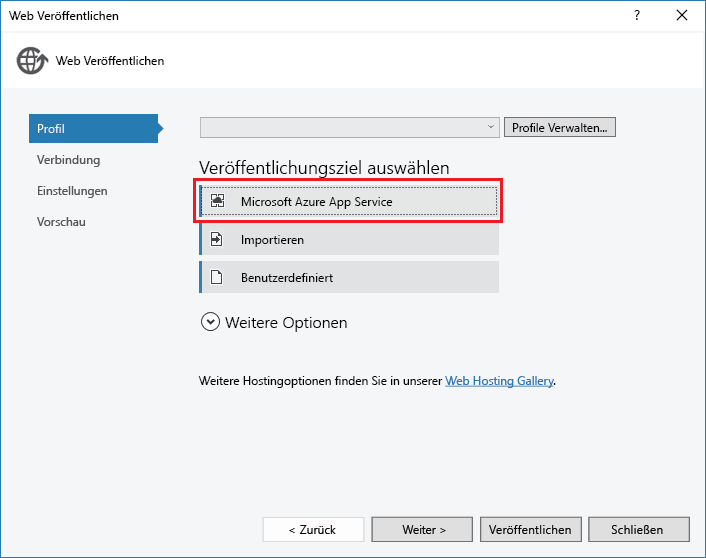

3. Melden Sie sich an Ihrem Azure-Konto an, falls Sie dies noch nicht getan haben, oder aktualisieren Sie Ihre Anmeldeinformationen, falls sie abgelaufen sind.

4. Wählen Sie im App Service-Dialogfeld das gewünschte Azure-**Abonnement** aus, und klicken Sie dann auf **Neu**.

	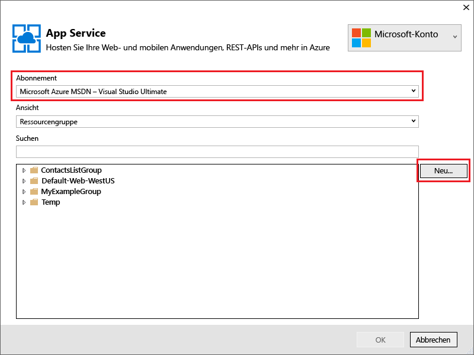

	Die Registerkarte **Hosten** des Dialogfelds **App Service erstellen** wird angezeigt.

	Da Sie ein Web-API-Projekt bereitstellen, für das Swashbuckle installiert wurde, nimmt Visual Studio an, dass Sie eine API-App erstellen möchten. Dies wird durch den Titel **API-App-Name** angegeben sowie durch die Tatsache, dass die Dropdownliste **Typ ändern** auf **API-App** festgelegt ist.

	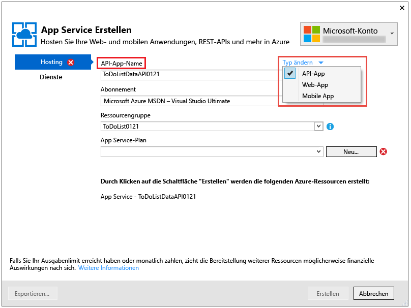

5. Geben Sie einen **API-App-Namen** ein, der in der Domäne *azurewebsites.net* eindeutig ist. Sie können den von Visual Studio vorgeschlagenen Standardnamen übernehmen.

	Wenn Sie einen Namen eingeben, der bereits von einer anderen Person verwendet wurde, wird rechts ein rotes Ausrufezeichen angezeigt.

	Die URL der API-App lautet `{API app name}.azurewebsites.net`.

6. Klicken Sie in der Dropdownliste **Ressourcengruppe** auf **Neu**, und geben Sie dann „ToDoListGroup“ oder einen beliebigen anderen Namen ein.

	Eine Ressourcengruppe ist eine Sammlung mit Azure-Ressourcen, z. B. API-Apps, Datenbanken, VMs usw. Für dieses Tutorial ist es besser, eine neue Ressourcengruppe zu erstellen. Es ist dann einfacher, alle Azure-Ressourcen, die Sie für das Tutorial erstellen, in einem Schritt zu löschen.

	In diesem Feld können Sie eine vorhandene [Ressourcengruppe](../resource-group-overview.md) auswählen oder eine neue Ressourcengruppe erstellen. Geben Sie hierfür einen Namen ein, der sich von den in Ihrem Abonnement vorhandenen Ressourcengruppe unterscheidet.

7. Klicken Sie neben der Dropdownliste **App Service-Plan** auf die Schaltfläche **Neu**.

	Der Screenshot zeigt Beispielwerte für die Optionen **API-App-Name**, **Abonnement** und **Ressourcengruppe**. Ihre Werte werden sich von diesen Werten unterscheiden.

	

	In den folgenden Schritten erstellen Sie einen App Service-Plan für die neue Ressourcengruppe. Mit einem App Service-Plan werden die Computeressourcen angegeben, auf denen Ihre API-App ausgeführt wird. Wenn Sie beispielsweise den Free-Tarif wählen, wird Ihre API-App auf freigegebenen VMs ausgeführt. Für einige kostenpflichtige Tarife wird sie dagegen auf dedizierten VMs ausgeführt. Weitere Informationen zu App Service-Plänen finden Sie unter [App Service-Pläne – Übersicht](../app-service/azure-web-sites-web-hosting-plans-in-depth-overview.md).

8. Geben Sie im Dialogfeld **App Service-Plan konfigurieren** den Namen „ToDoListPlan“ oder einen beliebigen anderen Namen ein.

9. Wählen Sie in der Dropdownliste **Standort** den Standort aus, der Ihnen am nächsten liegt.

	Mit dieser Einstellung wird das Azure-Rechenzentrum angegeben, in dem Ihre App ausgeführt wird. Wählen Sie einen Standort in Ihrer Nähe, um die [Latenz](http://www.bing.com/search?q=web%20latency%20introduction&qs=n&form=QBRE&pq=web%20latency%20introduction&sc=1-24&sp=-1&sk=&cvid=eefff99dfc864d25a75a83740f1e0090) möglichst gering zu halten.

10. Klicken Sie in der Dropdownliste **Größe** auf **Free**.

	Für dieses Tutorial bietet der Tarif „Free“ eine ausreichende Leistung.

11. Klicken Sie im Dialogfeld **App Service-Plan konfigurieren** auf **OK**.

	

12. Klicken Sie im Dialogfeld **App Service erstellen** auf **Erstellen**.

	

	Visual Studio erstellt die API-App und ein Veröffentlichungsprofil, das alle erforderlichen Einstellungen für die API-App enthält. Anschließend wird der Assistent **Web veröffentlichen** geöffnet, den Sie verwenden, um das Projekt bereitzustellen.

	Der Assistent **Web veröffentlichen** wird auf der Registerkarte **Verbindung** geöffnet (unten dargestellt).

	Auf der Registerkarte **Verbindung** verweisen die Einstellungen **Server** und **Websitename** auf Ihre API-App. **Benutzername** und **Kennwort** sind Anmeldeinformationen für die Bereitstellung, die von Azure für Sie erstellt werden. Nach der Bereitstellung öffnet Visual Studio einen Browser mit der **Ziel-URL** (einziger Zweck der **Ziel-URL**).

13. Klicken Sie auf **Weiter**.

	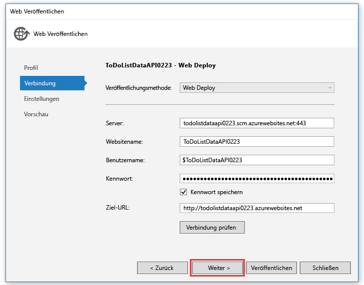

	Die nächste Registerkarte ist die Registerkarte **Einstellungen** (unten dargestellt). Hier können Sie die Buildkonfiguration ändern, um einen Debugbuild für das [Remotedebuggen](../app-service-web/web-sites-dotnet-troubleshoot-visual-studio.md#remotedebug) bereitzustellen. Die Registerkarte enthält außerdem mehrere **Dateiveröffentlichungsoptionen**:

	* Nicht übereinstimmende Dateien im Ziel entfernen
	* Während der Veröffentlichung vorkompilieren
	* Dateien aus dem App\_Data-Ordner ausschließen

	Für dieses Tutorial benötigen Sie diese Optionen nicht. Ausführliche Beschreibungen der Funktionsweise dieser Optionen finden Sie unter [Gewusst wie: Bereitstellen eines Webanwendungsprojekts mit der One-Click-Veröffentlichung in Visual Studio](https://msdn.microsoft.com/library/dd465337.aspx).

14. Klicken Sie auf **Weiter**.

	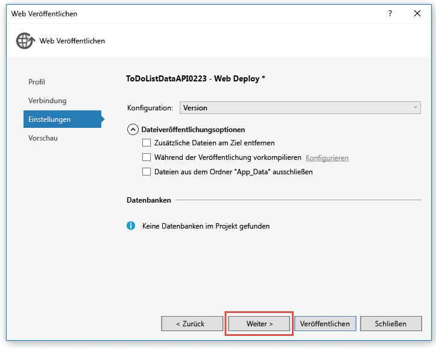

	Die nächste Registerkarte ist die Registerkarte **Vorschau** (unten dargestellt). Darauf können Sie sehen, welche Dateien aus Ihrem Projekt in die API-App kopiert werden. Wenn Sie ein Projekt für eine API-App bereitstellen, für die Sie bereits eine Bereitstellung durchgeführt haben, werden nur geänderte Dateien kopiert. Wenn Sie eine Liste mit den kopierten Dateien anzeigen möchten, klicken Sie auf die Schaltfläche **Vorschau starten**.

15. Klicken Sie auf **Veröffentlichen**.

	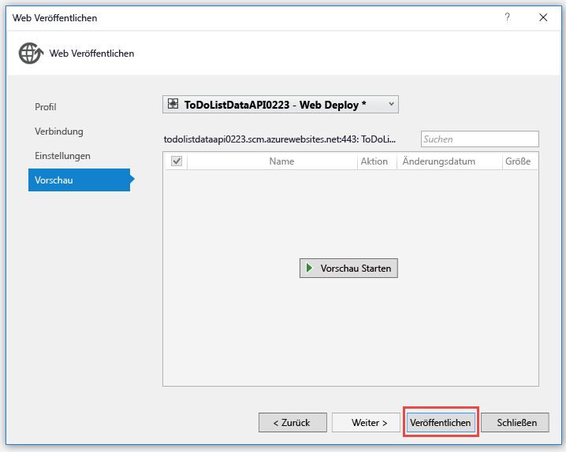

	Visual Studio stellt das Projekt ToDoListDataAPI für die neue API-App bereit. Im Fenster **Ausgabe** wird die erfolgreiche Bereitstellung protokolliert, und in einem Browserfenster mit der URL der API-App wird eine Seite mit dem Hinweis zur erfolgreichen Erstellung angezeigt.

	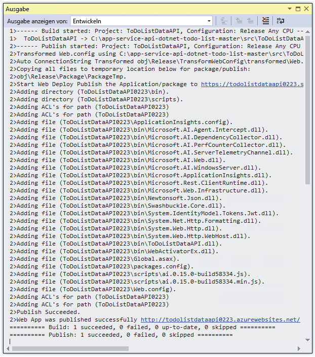

	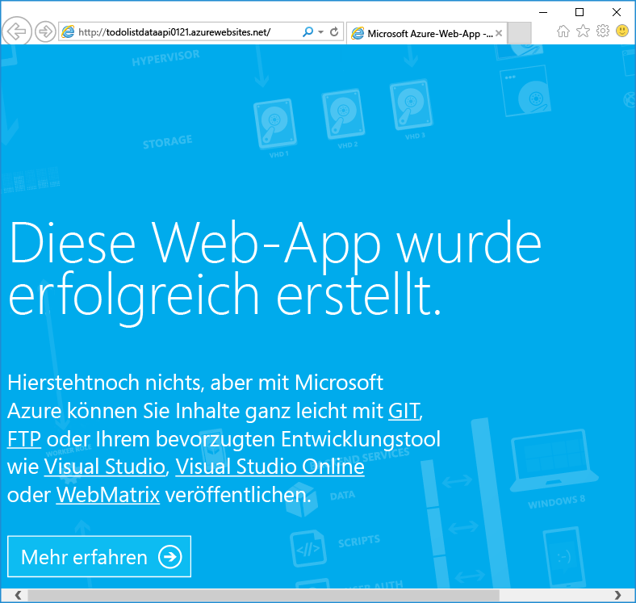

16. Fügen Sie der URL in der Adresszeile des Browsers „swagger“ hinzu, und drücken Sie dann die EINGABETASTE. (Die URL lautet `http://{apiappname}.azurewebsites.net/swagger`.)

	Im Browser wird die gleiche Swagger-Benutzeroberfläche angezeigt, die Sie bereits kennen, aber nun wird sie in der Cloud ausgeführt. Beim Ausprobieren der Get-Methode werden Sie feststellen, dass wieder die beiden standardmäßigen Aufgabenelemente verwendet werden. Die Änderungen, die Sie zuvor vorgenommen haben, wurden im Arbeitsspeicher auf dem lokalen Computer gespeichert.

17. Öffnen Sie das [Azure-Portal](https://portal.azure.com/).

	Das Azure-Portal ist eine Webschnittstelle zum Verwalten von Azure-Ressourcen, z. B. API-Apps.

18. Klicken Sie auf **Weitere Dienste > App Services**.

	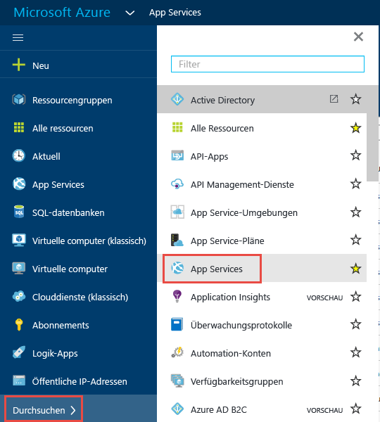

19. Suchen Sie auf dem Blatt **App Services** nach Ihrer neuen API-App, und klicken Sie darauf. (Im Azure-Portal werden Fenster, die auf der rechten Seite geöffnet werden, als *Blätter* bezeichnet.)

	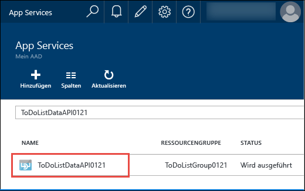

	Zwei Blätter werden geöffnet: Ein Blatt enthält eine Übersicht über die API-App, und ein Blatt enthält eine lange Liste mit Einstellungen, die Sie anzeigen und ändern können.

20. Suchen Sie auf dem Blatt **Einstellungen** nach dem Abschnitt **API**, und klicken Sie auf **API-Definition**.

	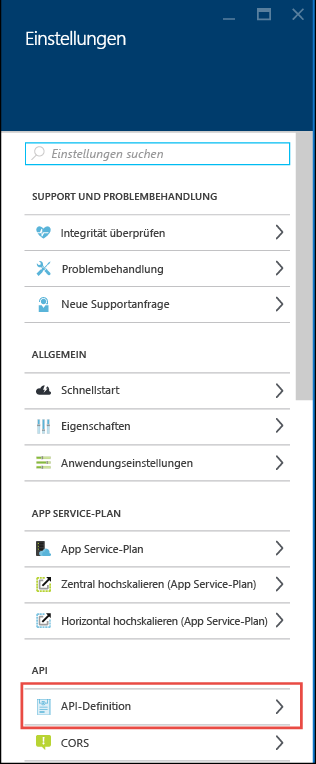

	Auf dem Blatt **API-Definition** können Sie die URL angeben, über die Swagger 2.0-Metadaten im JSON-Format zurückgegeben werden. Beim Erstellen der API-App wird die URL der API-Definition in Visual Studio auf den Standardwert für von Swashbuckle generierte Metadaten festgelegt, den Sie schon kennen. Dies ist die Basis-URL der API-App mit dem Zusatz `/swagger/docs/v1`.

	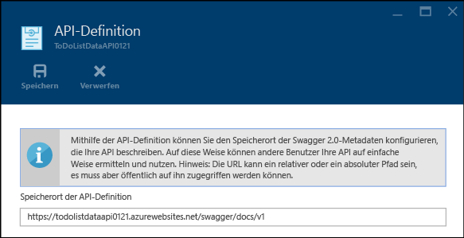

	Wenn Sie eine API-App auswählen, um Clientcode dafür zu generieren, ruft Visual Studio die Metadaten über diese URL ab.

##  Generieren von Clientcode für die Datenebene

Einer der Vorteile der Integration von Swagger in Azure API-Apps ist die automatische Codegenerierung. Generierte Clientklassen erleichtern es, Code zu schreiben, der eine API-App aufruft.

Das Projekt ToDoListAPI verfügt bereits über den generierten Clientcode, aber in den folgenden Schritten löschen Sie ihn und erstellen ihn neu, um die Codegenerierung zu erlernen.

1. Löschen Sie im **Projektmappen-Explorer** von Visual Studio im Projekt „ToDoListAPI“ den Ordner *ToDoListDataAPI*. **Wichtiger Hinweis: Löschen Sie nur den Ordner und nicht das Projekt „ToDoListDataAPI“.**

	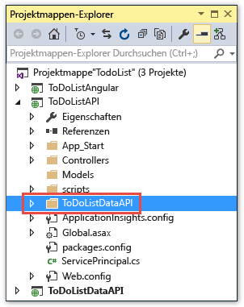

	Dieser Ordner wurde mithilfe des Codegenerierungsprozesses erstellt, den Sie gleich durchlaufen werden.

2. Klicken Sie mit der rechten Maustaste auf das Projekt „ToDoListAPI“, und klicken Sie dann auf **Hinzufügen > REST-API-Client**.

	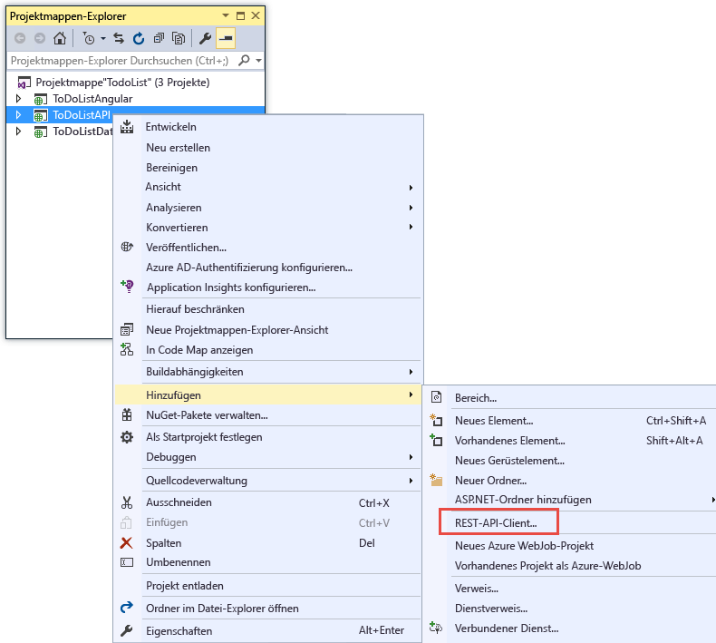

3. Klicken Sie im Dialogfeld **REST-API-Client hinzufügen** auf **Swagger-URL** und dann auf **Azure-Asset auswählen**.

	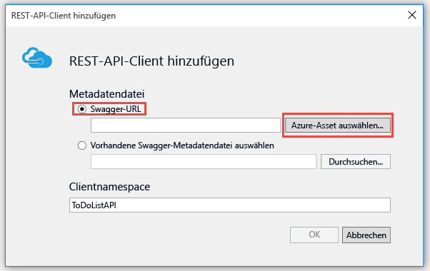

4. Erweitern Sie im Dialogfeld **App Service** die für dieses Tutorial verwendete Ressourcengruppe, und wählen Sie Ihre API-App aus. Klicken Sie anschließend auf **OK**.

	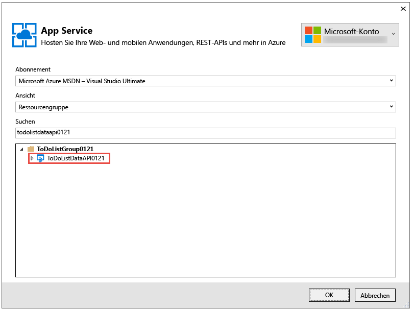

	Beachten Sie Folgendes: Wenn Sie zurück zum Dialogfeld **REST-API-Client hinzufügen** wechseln, sehen Sie, dass das Textfeld mit dem URL-Wert der API-Definition gefüllt wurde. Diesen Wert kennen Sie bereits aus dem Portal.

	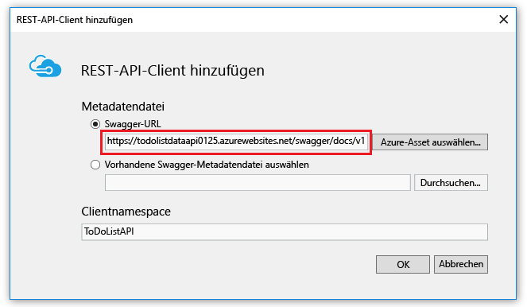

	>[AZURE.TIP] Eine alternative Möglichkeit zum Abrufen von Metadaten für die Codegenerierung ist das direkte Eingeben von Code, anstatt das Dialogfeld „Durchsuchen“ zu verwenden. Falls Sie vor der Bereitstellung für Azure Clientcode generieren möchten, können Sie das Web-API-Projekt lokal ausführen. Navigieren Sie zu der URL, unter der die Swagger-JSON-Datei bereitgestellt wird, speichern Sie die Datei, und verwenden Sie die Option **Vorhandene Swagger-Metadatendatei auswählen**.

5. Klicken Sie im Dialogfeld **REST-API-Client hinzufügen** auf **OK**.

	Visual Studio erstellt einen Ordner, der nach der API-App benannt ist, und generiert Clientklassen.

	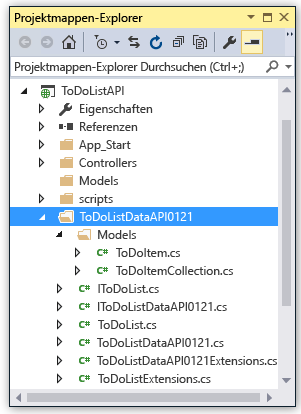

6. Öffnen Sie im Projekt „ToDoListAPI“ die Datei *Controllers\\ToDoListController.cs*, um den Code in Zeile 40 zum Aufrufen der API mit dem generierten Client anzuzeigen.

	Der folgende Codeausschnitt zeigt, wie mit dem Code das Clientobjekt instanziiert und die Get-Methode aufgerufen wird.

		private static ToDoListDataAPI NewDataAPIClient()
		{
		    var client = new ToDoListDataAPI(new Uri(ConfigurationManager.AppSettings["toDoListDataAPIURL"]));
		    return client;
		}

		public async Task<IEnumerable<ToDoItem>> Get()
		{
		    using (var client = NewDataAPIClient())
		    {
		        var results = await client.ToDoList.GetByOwnerAsync(owner);
		        return results.Select(m => new ToDoItem
		        {
		            Description = m.Description,
		            ID = (int)m.ID,
		            Owner = m.Owner
		        });
		    }
		}

	Der Konstruktorparameter ruft die Endpunkt-URL aus der App-Einstellung `toDoListDataAPIURL` ab. In der Datei „Web.config“ ist dieser Wert auf die lokale IIS Express-URL des API-Projekts festgelegt, damit Sie die Anwendung lokal ausführen können. Wenn Sie den Konstruktorparameter weglassen, ist der Standardendpunkt die URL, aus der Sie den Code generiert haben.

7. Ihre Clientklasse wird unter einem anderen Namen basierend auf dem Namen Ihrer API-App generiert. Ändern Sie den Code in *Controllers\\ToDoListController.cs*, damit der Typname mit den Daten übereinstimmt, die in Ihrem Projekt generiert wurden. Wenn Ihre API-App beispielsweise den Namen „ToDoListDataAPI071316“ hat, können Sie diesen Code ändern:

		private static ToDoListDataAPI NewDataAPIClient()
		{
		    var client = new ToDoListDataAPI(new Uri(ConfigurationManager.AppSettings["toDoListDataAPIURL"]));

Und zwar in diesen Code:

		private static ToDoListDataAPI071316 NewDataAPIClient()
		{
		    var client = new ToDoListDataAPI071316(new Uri(ConfigurationManager.AppSettings["toDoListDataAPIURL"]));

## Erstellen einer API-App zum Hosten der mittleren Ebene

Weiter oben haben Sie [die API-App für die Datenebene erstellt und Code dafür bereitgestellt](#createapiapp). Nun verwenden Sie das gleiche Verfahren für die API-App der mittleren Ebene.

1. Klicken Sie im **Projektmappen-Explorer** mit der rechten Maustaste auf das Projekt „ToDoListAPI“ für die mittlere Ebene (nicht „ToDoListDataAPI“ für die Datenebene), und klicken Sie dann auf **Veröffentlichen**.

	

2.  Klicken Sie auf der Registerkarte **Profil** des Assistenten **Web veröffentlichen** auf **Microsoft Azure App Service**.

3. Klicken Sie im Dialogfeld **App Service** auf **Neu**.

4. Übernehmen Sie im Dialogfeld **App Service erstellen** auf der Registerkarte **Hosten** den standardmäßigen **API-App-Namen**, oder geben Sie einen Namen ein, der in der Domäne *azurewebsites.net* eindeutig ist.

5. Wählen Sie das Azure-**Abonnement** aus, das Sie verwendet haben.

6. Wählen Sie in der Dropdownliste **Ressourcengruppe** die Ressourcengruppe aus, die Sie weiter oben erstellt haben.

7. Wählen Sie in der Dropdownliste **App Service-Plan** den Plan aus, den Sie bereits erstellt haben. Dieser Wert ist der Standardwert.

8. Klicken Sie auf **Erstellen**.

	Visual Studio erstellt die API-App und das dazugehörige Veröffentlichungsprofil und zeigt den Schritt **Verbindung** des Assistenten **Web veröffentlichen** an.

9.  Klicken Sie im Schritt **Verbindung** des Assistenten **Web veröffentlichen** auf **Veröffentlichen**.

	Visual Studio stellt das Projekt ToDoListAPI in der neuen API-App bereit und öffnet einen Browser mit der URL der API-App. Die Seite mit dem Hinweis, dass die Erstellung erfolgreich war, wird angezeigt.

## Konfigurieren der mittleren Ebene zum Aufrufen der Datenebene

Wenn Sie jetzt die API-App der mittleren Ebene aufrufen, würde versucht werden, die Datenebene mit der localhost-URL aufzurufen, die noch in der Datei „Web.config“ enthalten ist. In diesem Abschnitt geben Sie die API-App-URL für die Datenebene in eine Umgebungseinstellung in der API-App für die mittlere Ebene ein. Wenn der Code in der API-App für die mittlere Ebene die URL-Einstellung der Datenebene abruft, überschreibt die Umgebungseinstellung die Angaben in der Datei „Web.config“.

1. Navigieren Sie zum [Azure-Portal](https://portal.azure.com/) und dann zum Blatt **API-App** für die API-App, die Sie zum Hosten des Projekts „TodoListAPI“ (mittlere Ebene) erstellt haben.

2. Klicken Sie auf dem Blatt **Einstellungen** der API-App auf **Anwendungseinstellungen**.

3. Scrollen Sie auf dem Blatt **Anwendungseinstellungen** der API-App nach unten zum Abschnitt **App-Einstellungen**, und fügen Sie den folgenden Schlüssel und Wert hinzu: Der Wert ist die URL der ersten API-App, die Sie in diesem Tutorial veröffentlicht haben.

	| **Schlüssel** | toDoListDataAPIURL |
	|---|---|
	| **Wert** | https://{your data tier API app name}.azurewebsites.net |
	| **Beispiel** | https://todolistdataapi.azurewebsites.net |

4. Klicken Sie auf **Speichern**.

	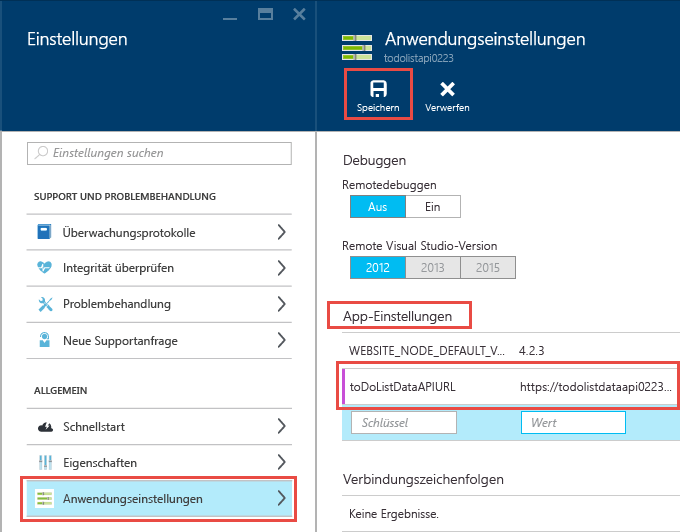

	Wenn der Code in Azure ausgeführt wird, überschreibt dieser Wert nun die localhost-URL in der Datei „Web.config“.

## Test

1. Navigieren Sie in einem Browserfenster zur URL der neuen API-App der mittleren Ebene, die Sie gerade für ToDoListAPI erstellt haben. Sie können darauf zugreifen, indem Sie im Portal auf dem Hauptblatt der API-App auf die URL klicken.

2. Fügen Sie der URL in der Adresszeile des Browsers „swagger“ hinzu, und drücken Sie dann die EINGABETASTE. (Die URL lautet `http://{apiappname}.azurewebsites.net/swagger`.)

	Im Browser wird die gleiche Swagger-Benutzeroberfläche wie zuvor für „ToDoListDataAPI“ angezeigt. `owner` ist jetzt aber kein erforderliches Feld für den Get-Vorgang, weil die API-App der mittleren Ebene diesen Wert für Sie an die API-App der Datenebene sendet. (Wenn Sie die Tutorials zur Authentifizierung durcharbeiten, sendet die mittlere Ebene für den Parameter `owner` echte Benutzer-IDs. Vorerst wird ein Sternchen hartcodiert.)

3. Probieren Sie die Get-Methode und die anderen Methoden aus, um zu überprüfen, ob die API-App der mittleren Ebene die API-App der Datenebene erfolgreich aufruft.

	

## Problembehandlung

Falls beim Durcharbeiten dieses Tutorials Probleme auftreten, helfen Ihnen diese Hinweise zur Problembehandlung weiter:

* Stellen Sie sicher, dass Sie die aktuelle Version des [Azure SDK für .NET](http://go.microsoft.com/fwlink/?linkid=518003) verwenden.

* Zwei der Projektnamen sind ähnlich („ToDoListAPI“, „ToDoListDataAPI“). Wenn Ihre Arbeit mit einem Projekt nicht so funktioniert, wie es in den Anweisungen beschrieben ist, stellen Sie sicher, dass Sie das richtige Projekt geöffnet haben.

* Falls Sie sich in einem Unternehmensnetzwerk befinden und versuchen, die Bereitstellung für Azure App Service über eine Firewall durchzuführen, sollten Sie sicherstellen, dass die Ports 443 und 8172 für Web Deploy geöffnet sind. Wenn Sie diese Ports nicht öffnen können, können Sie andere Bereitstellungsmethoden nutzen. Weitere Informationen finden Sie unter [Bereitstellen der App in Azure App Service](../app-service-web/web-sites-deploy.md).

* Fehler vom Typ „Routennamen müssen eindeutig sein“: Diese Fehler können auftreten, wenn Sie versehentlich das falsche Projekt für eine API-App bereitstellen und dann später das richtige Projekt bereitstellen. Stellen Sie das richtige Projekt erneut für die API-App bereit, und wählen Sie auf der Registerkarte **Einstellungen** des Assistenten **Web veröffentlichen** die Option **Nicht übereinstimmende Dateien im Ziel entfernen**, um dies zu korrigieren.

Nachdem Ihre ASP.NET-API-App in Azure App Service ausgeführt wird, ist es ratsam, sich weiter über Visual Studio-Features zu informieren, mit denen die Problembehandlung vereinfacht werden kann. Informationen zu Protokollierung, Remotedebuggen und weiteren Themen finden Sie unter [Problembehandlung von Azure App Service-Apps in Visual Studio](../app-service-web/web-sites-dotnet-troubleshoot-visual-studio.md).

## Nächste Schritte

Sie haben erfahren, wie Sie vorhandene Web-API-Projekte für API-Apps bereitstellen, Clientcode für API-Apps generieren und API-Apps von .NET-Clients nutzen. Im nächsten Tutorial dieser Reihe wird gezeigt, wie Sie [CORS zum Nutzen von API-Apps über JavaScript-Clients verwenden](app-service-api-cors-consume-javascript.md).

Weitere Informationen zum Generieren von Clientcode finden Sie im [Azure/AutoRest](https://github.com/azure/autorest)-Repository auf „GitHub.com“. Falls Sie Probleme bei der Verwendung des generierten Clients haben, können Sie ein [Problem im AutoRest-Repository](https://github.com/azure/autorest/issues) öffnen.

Falls Sie neue API-App-Projekte von Grund auf neu erstellen möchten, können Sie die **Azure-API-App**-Vorlage verwenden.

Die Projektvorlage **Azure-API-App** entspricht folgenden Schritten: Auswählen der ASP.NET 4.5.2-Vorlage **Leer**, Klicken auf das Kontrollkästchen zum Hinzufügen der Web-API-Unterstützung und anschließendes Installieren des Swashbuckle-NuGet-Pakets. Außerdem wird mit der Vorlage Swashbuckle-Konfigurationscode hinzugefügt, der dafür bestimmt ist, die Erstellung von doppelten Swagger-Vorgangs-IDs zu verhindern. Nachdem Sie ein API-App-Projekt erstellt haben, können Sie es wie in diesem Tutorial gezeigt für eine API-App bereitstellen.

<!---HONumber=AcomDC_0921_2016-->