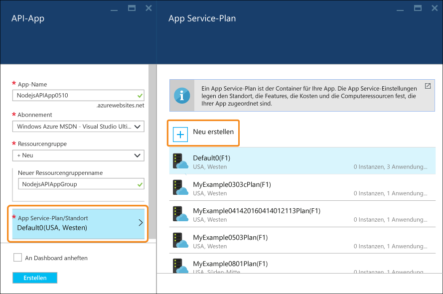

# Erstellen einer Node.js-RESTful-API und Bereitstellen für eine API-App in Azure
[!INCLUDE [app-service-api-get-started-selector](../../includes/app-service-api-get-started-selector.md)]

In diesem Tutorial wird veranschaulicht, wie Sie unter Verwendung von [Git](http://git-scm.com) eine einfache [Node.js](http://nodejs.org)-API erstellen und für eine [API-App](app-service-api-apps-why-best-platform.md) in [Azure App Service](../app-service/app-service-value-prop-what-is.md) bereitstellen. Sie können ein beliebiges, für die Ausführung von Node.js geeignetes Betriebssystem verwenden. Alle Schritte werden mit Befehlszeilentools wie „cmd.exe“ oder bash ausgeführt.

## Voraussetzungen
1. Microsoft Azure-Konto ([Hier können sie ein kostenloses Konto eröffnen.](https://azure.microsoft.com/pricing/free-trial/))
2. Installation von [Node.js](http://nodejs.org) (In diesem Beispiel wird die Node.js-Version 4.2.2 verwendet.)
3. Installation von [Git](https://git-scm.com/)
4. [GitHub](https://github.com/)-Konto

App Service unterstützt viele Wege zur Bereitstellung Ihres Codes in einer API-App. In diesem Tutorial wird die Git-Methode beschrieben, und es wird davon ausgegangen, dass Sie über Git-Grundkenntnisse verfügen. Informationen zu anderen Bereitstellungsmethoden finden Sie unter [Bereitstellen der App in Azure App Service](../app-service-web/web-sites-deploy.md).

## Laden Sie den Beispielcode herunter
1. Öffnen Sie eine Befehlszeilenschnittstelle, mit der Node.js- und Git-Befehle ausgeführt werden können.
2. Navigieren Sie zu einem Ordner, den Sie für ein lokales Git-Repository verwenden können, und klonen Sie das [GitHub-Repository mit dem Beispielcode](https://github.com/Azure-Samples/app-service-api-node-contact-list).
   
        git clone https://github.com/Azure-Samples/app-service-api-node-contact-list.git
   
    Die Beispiel-API stellt zwei Endpunkte bereit: Mit einer Get-Anforderung für `/contacts` wird eine Liste mit Namen und E-Mail-Adressen im JSON-Format zurückgegeben, und mit `/contacts/{id}` wird nur der ausgewählte Kontakt zurückgegeben.

## Erstellen des Node.js-Codegerüsts (automatische Generierung) basierend auf Swagger-Metadaten
[Swagger](http://swagger.io/) ist ein Dateiformat für Metadaten, die eine RESTful-API beschreiben. Azure App Service verfügt über [integrierte Unterstützung für Swagger-Metadaten](app-service-api-metadata.md). In diesem Abschnitt des Tutorials wird ein API-Entwicklungsworkflow modelliert, in dem Sie zuerst Swagger-Metadaten erstellen und diese dann verwenden, um das Servercodegerüst (automatische Generierung) für die API zu erstellen.

> [!NOTE]
> Sie können diesen Abschnitt überspringen, wenn Sie nicht erfahren möchten, wie Sie das Node.js-Codegerüst über eine Swagger-Metadatendatei erstellen. Falls Sie nur Beispielcode für eine neue API-App bereitstellen möchten, können Sie direkt mit dem Abschnitt [Erstellen einer API-App in Azure](#createapiapp) fortfahren.
> 
> 

### Installieren und Ausführen von Swaggerize
1. Führen Sie die folgenden Befehle aus, um die NPM-Module **yo** und **generator-swaggerize** global zu installieren.
   
        npm install -g yo
        npm install -g generator-swaggerize
   
    Swaggerize ist ein Tool, mit dem Servercode für eine API generiert wird, die mit einer Swagger-Metadatendatei beschrieben wird. Die von Ihnen verwendete Swagger-Datei heißt *api.json* und befindet sich im Ordner *start* des geklonten Repositorys.
2. Navigieren Sie zum Ordner *start*, und führen Sie den Befehl `yo swaggerize` aus. Swaggerize stellt eine Reihe von Fragen. Geben Sie für **what to call this project** die Antwort „contactlist“, für **path to swagger document** den Pfad „api.json“ und für **Express, Hapi, or Restify** die Antwort „express“ ein.
   
        yo swaggerize
   
    
   
    **Hinweis**: Falls in diesem Schritt ein Fehler auftritt, hilft Ihnen die Behebungsbeschreibung im nächsten Schritt weiter.
   
    Swaggerize erstellt einen Anwendungsordner, erstellt die Gerüste für Handler und Konfigurationsdateien und generiert die Datei **package.json**. Das Anzeigemodul (Express View) wird zum Generieren der Swagger-Hilfeseite verwendet.
3. Wenn für den Befehl `swaggerize` der Fehler „Unerwartetes Token“ oder „Ungültige Escapesequenz“ auftritt, können Sie die Ursache des Fehlers beheben, indem Sie die generierte Datei *package.json* bearbeiten. Ändern Sie in der Zeile `regenerate` unter `scripts` den umgekehrten Schrägstrich vor *api.json* in einen Schrägstrich, sodass die Zeile wie im folgenden Beispiel aussieht:
   
         "regenerate": "yo swaggerize --only=handlers,models,tests --framework express --apiPath config/api.json"
4. Navigieren Sie zu dem Ordner, der das Codegerüst enthält (in diesem Fall der Unterordner *ContactList*).
5. Führen Sie `npm install` aus.
   
        npm install
6. Installieren Sie das NPM-Modul **jsonpath**.
   
        npm install --save jsonpath
   
    
7. Installieren Sie das NPM-Modul **swaggerize-ui**.
   
        npm install --save swaggerize-ui
   
    

### Anpassen des Codegerüsts
1. Kopieren Sie den Ordner **lib** aus dem Ordner **start** in den Ordner **ContactList**, der mit dem Tool für die Gerüsterstellung (Scaffolder) erstellt wurde.
2. Ersetzen Sie den Code in der Datei **handlers/contacts.js** durch den unten angegebenen Code.
   
    Für diesen Code werden die JSON-Daten verwendet, die in der Datei **lib/contacts.json** gespeichert sind. Diese Datei wird über **lib/contactRepository.js** bereitgestellt. Der neue contacts.js-Code reagiert auf HTTP-Anforderungen, um alle Kontakte abzurufen und als JSON-Nutzlast zurückzugeben.
   
        'use strict';
   
        var repository = require('../lib/contactRepository');
   
        module.exports = {
            get: function contacts_get(req, res) {
                res.json(repository.all())
            }
        };
3. Ersetzen Sie den Code in der Datei **handlers/contacts/{id}.js** durch den folgenden Code:
   
        'use strict';
   
        var repository = require('../../lib/contactRepository');
   
        module.exports = {
            get: function contacts_get(req, res) {
                res.json(repository.get(req.params['id']));
            }    
        };
4. Ersetzen Sie den Code in der Datei **server.js** durch den unten angegebenen Code.
   
    Die an der Datei „server.js“ vorgenommenen Änderungen werden durch Kommentare hervorgehoben, damit Sie die durchgeführten Änderungen verfolgen können.
   
        'use strict';
   
        var port = process.env.PORT || 8000; // first change
   
        var http = require('http');
        var express = require('express');
        var bodyParser = require('body-parser');
        var swaggerize = require('swaggerize-express');
        var swaggerUi = require('swaggerize-ui'); // second change
        var path = require('path');
   
        var app = express();
   
        var server = http.createServer(app);
   
        app.use(bodyParser.json());
   
        app.use(swaggerize({
            api: path.resolve('./config/api.json'), // third change
            handlers: path.resolve('./handlers'),
            docspath: '/swagger' // fourth change
        }));
   
        // change four
        app.use('/docs', swaggerUi({
          docs: '/swagger'  
        }));
   
        server.listen(port, function () { // fifth and final change
        });

### Testen bei lokaler Ausführung der API
1. Aktivieren Sie den Server mit der ausführbaren Node.js-Befehlszeilendatei.
   
        node server.js
2. Wenn Sie zu **http://localhost:8000/contacts** navigieren, wird die JSON-Ausgabe der Kontaktliste angezeigt (oder Sie werden je nach Browser zum Herunterladen aufgefordert).
   
    
3. Wenn Sie zu **http://localhost:8000/contacts/2** navigieren, wird der entsprechende Kontakt für diesen ID-Wert angezeigt.
   
    
4. Die Swagger-JSON-Daten werden über den Endpunkt **/swagger** bereitgestellt:
   
    
5. Die Swagger-Benutzeroberfläche wird über den Endpunkt **/docs** bereitgestellt. Auf der Swagger-Benutzeroberfläche stehen umfassende HTML-Clientfunktionen zum Testen Ihrer API zur Verfügung.
   
    

##  Erstellen einer neuen API-App
In diesem Abschnitt verwenden Sie das Azure-Portal, um eine neue API-App in Azure zu erstellen. Diese API-App stellt die Computeressourcen dar, die von Azure zum Ausführen Ihres Codes bereitgestellt werden. In späteren Abschnitten stellen Sie Ihren Code für die neue API-App bereit.

1. Navigieren Sie zum [Azure-Portal](https://portal.azure.com/).
2. Klicken Sie auf **Neu > Web + Mobil > API-App**.
   
    
3. Geben Sie einen in der Domäne *azurewebsites.net* eindeutigen App-Namen ein (etwa „NodejsAPIApp“ mit einer angehängten Zahl).
   
    Für den Namen `NodejsAPIApp` lautet die URL z. B. `nodejsapiapp.azurewebsites.net`.
   
    Wenn Sie einen Namen eingeben, der bereits von einer anderen Person verwendet wurde, wird rechts ein rotes Ausrufezeichen angezeigt.
4. Klicken Sie in der Dropdownliste **Ressourcengruppe** auf **Neu**, und geben Sie unter **Neuer Ressourcengruppenname** den Namen „NodejsAPIAppGroup“ oder einen anderen Namen ein.
   
    Eine [Ressourcengruppe](../resource-group-overview.md) ist eine Sammlung mit Azure-Ressourcen, z.B. API-Apps, Datenbanken und VMs. Für dieses Tutorial ist es besser, eine neue Ressourcengruppe zu erstellen. Es ist dann einfacher, alle Azure-Ressourcen, die Sie für das Tutorial erstellen, in einem Schritt zu löschen.
5. Klicken Sie auf **App Service-Plan/Standort** und dann auf **Neu erstellen**.
   
    
   
    In den folgenden Schritten erstellen Sie einen App Service-Plan für die neue Ressourcengruppe. Mit einem App Service-Plan werden die Computeressourcen angegeben, auf denen Ihre API-App ausgeführt wird. Wenn Sie beispielsweise den Free-Tarif wählen, wird Ihre API-App auf freigegebenen VMs ausgeführt. Für einige kostenpflichtige Tarife wird sie dagegen auf dedizierten VMs ausgeführt. Weitere Informationen zu App Service-Plänen finden Sie unter [App Service-Pläne – Übersicht](../app-service/azure-web-sites-web-hosting-plans-in-depth-overview.md).
6. Geben Sie auf dem Blatt **App Service-Plan** den Namen „NodejsAPIAppPlan“ oder einen anderen Namen ein.
7. Wählen Sie in der Dropdownliste **Standort** den Standort aus, der Ihnen am nächsten liegt.
   
    Mit dieser Einstellung wird das Azure-Rechenzentrum angegeben, in dem Ihre App ausgeführt wird. In diesem Lernprogramm können Sie ohne spürbaren Unterschied eine beliebige Region auswählen. Bei einer Produktions-App sollte sich der Server allerdings so nah wie möglich bei den Clients befinden, mit denen darauf zugegriffen wird, um die [Latenz](http://www.bing.com/search?q=web%20latency%20introduction&qs=n&form=QBRE&pq=web%20latency%20introduction&sc=1-24&sp=-1&sk=&cvid=eefff99dfc864d25a75a83740f1e0090) zu minimieren.
8. Klicken Sie auf **Tarif > Alle anzeigen > F1 Free**.
   
    Für dieses Tutorial bietet der Tarif „Free“ eine ausreichende Leistung.
   
    
9. Klicken Sie auf dem Blatt **App Service-Plan** auf **OK**.
10. Klicken Sie auf dem Blatt **API-App** auf **Erstellen**.

## Einrichten der neuen API-App für die Git-Bereitstellung
Sie stellen Ihren Code für die API-App bereit, indem Sie Commits per Pushvorgang in ein Git-Repository in Azure App Service übertragen. In diesem Abschnitt des Tutorials erstellen Sie die Anmeldeinformationen und das Git-Repository in Azure, das Sie für die Bereitstellung verwenden.

1. Klicken Sie nach der Erstellung der API-App auf der Startseite des Portals auf **App Services > {Ihre API-App}**.
   
    Im Portal werden die Blätter **API-App** und **Einstellungen** angezeigt.
   
    
2. Führen Sie auf dem Blatt **Einstellungen** einen Bildlauf zum Abschnitt **Veröffentlichung** durch, und klicken Sie dann auf **Anmeldeinformationen für Bereitstellung**.
3. Geben Sie auf dem Blatt **Anmeldeinformationen für die Bereitstellung festlegen** einen Benutzernamen und ein Kennwort ein, und klicken Sie dann auf **Speichern**.
   
    Sie verwenden diese Anmeldeinformationen, um Ihren Node.js-Code für die API-App zu veröffentlichen.
   
    
4. Klicken Sie auf dem Blatt **Einstellungen** auf **Bereitstellungsquelle > Quelle auswählen > Lokales Git-Repository** und dann auf **OK**.
   
    
5. Nachdem das Git-Repository erstellt wurde, ändert sich das Blatt, und Ihre aktiven Bereitstellungen werden angezeigt. Da es sich um ein neues Repository handelt, sind in der Liste keine aktiven Bereitstellungen enthalten.
   
    
6. Kopieren Sie die Git-Repository-URL. Navigieren Sie hierzu zum Blatt für Ihre neue API-App, und sehen Sie sich den Abschnitt **Zusammenfassung** des Blatts an. Im Abschnitt **Zusammenfassung** wird die **Git-Klon-URL** angezeigt. Wenn Sie mit der Maus auf diese URL zeigen, wird rechts ein Symbol angezeigt, mit dem die URL in die Zwischenablage kopiert werden kann. Klicken Sie auf dieses Symbol, um die URL zu kopieren.
   
    
   
    **Hinweis**: Sie benötigen die Git-Klon-URL im nächsten Abschnitt. Sie sollten sie also kurz an einem geeigneten Speicherort speichern.

Nachdem Sie nun über eine API-App mit Git-Repository verfügen, können Sie Code per Push in das Repository übertragen, um ihn für die API-App bereitzustellen.

## Bereitstellen des API-Codes für Azure
In diesem Abschnitt erstellen Sie ein lokales Git-Repository, das den Servercode für die API enthält. Anschließend übertragen Sie den Code aus diesem Repository in das Repository in Azure, das Sie zuvor erstellt haben.

1. Kopieren Sie den Ordner `ContactList` an einen Speicherort, den Sie für ein neues lokales Git-Repository verwenden können. Wenn Sie den ersten Teil des Tutorials durchgearbeitet haben, müssen Sie `ContactList` aus dem Ordner `start` kopieren. Kopieren Sie andernfalls `ContactList` aus dem Ordner `end`.
2. Navigieren Sie in Ihrem Befehlszeilentool zum neuen Ordner, und führen Sie dann den folgenden Befehl aus, um ein neues lokales Git-Repository zu erstellen.
   
        git init
   
     
3. Führen Sie den folgenden Befehl aus, um eine Git-Remoteinstanz für das Repository der API-App hinzuzufügen.
   
        git remote add azure YOUR_GIT_CLONE_URL_HERE
   
    **Hinweis**: Ersetzen Sie die Zeichenfolge „YOUR\_GIT\_CLONE\_URL\_HERE“ durch Ihre eigene Git-Klon-URL, die Sie zuvor kopiert haben.
4. Führen Sie die beiden folgenden Befehle aus, um ein Commit mit Ihrem gesamten Code zu erstellen:
   
        git add .
        git commit -m "initial revision"
   
    
5. Führen Sie den Befehl aus, um den Code an Azure zu übertragen. Geben Sie bei Aufforderung zur Eingabe eines Kennworts das Kennwort ein, das Sie zuvor im Azure-Portal erstellt haben.
   
        git push azure master
   
    Hierdurch wird eine Bereitstellung für Ihre API-App ausgelöst.
6. Navigieren Sie in Ihrem Browser zurück zum Blatt **Bereitstellungen** für die API-App. Sie sehen, dass die Bereitstellung durchgeführt wird.
   
    
   
    Gleichzeitig spiegelt die Befehlszeilenschnittstelle den Status Ihrer Bereitstellung wider, während diese durchgeführt wird.
   
    
   
    Nach Abschluss der Bereitstellung spiegelt das Blatt **Bereitstellungen** die erfolgreiche Bereitstellung der Codeänderungen für Ihre API-App wider.

## Testen bei Ausführung der API in Azure
1. Kopieren Sie die **URL** im Abschnitt **Zusammenfassung** des Blatts für Ihre API-App.
   
    
2. Geben Sie die URL Ihres Contacts-API-Aufrufs (Endpunkt `/contacts` Ihrer API-App) in einem REST-API-Client wie Postman oder Fiddler (oder in Ihrem Webbrowser) an. Die URL lautet `https://{your API app name}.azurewebsites.net/contacts`.
   
    Wenn Sie eine GET-Anforderung für diesen Endpunkt ausgeben, wird die JSON-Ausgabe Ihrer API-App angezeigt.
   
    
3. Navigieren Sie im Browser zum Endpunkt `/docs`, um die in Azure ausgeführte Swagger-Benutzeroberfläche auszuprobieren.

Nachdem Sie die kontinuierliche Bereitstellung eingerichtet haben, können Sie Codeänderungen vornehmen und für Azure bereitstellen, indem Sie einfach Commits an das Azure-Git-Repository übertragen.

## Nächste Schritte
Sie haben nun erfolgreich eine API-App erstellt und dafür Node.js-API-Code bereitgestellt. Im nächsten Tutorial erfahren Sie, wie Sie [API-Apps über JavaScript-Clients mit CORS nutzen](app-service-api-cors-consume-javascript.md).

<!---HONumber=AcomDC_0720_2016-->