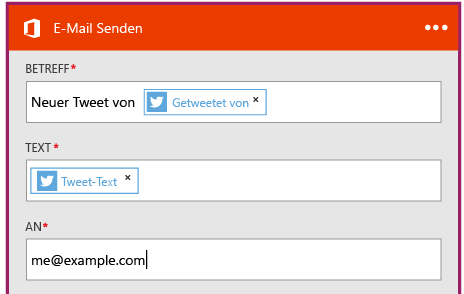

# Erstellen einer Logik-App zum Verbinden von SaaS-Diensten
In diesem Thema wird veranschaulicht, wie Sie in nur wenigen Minuten in [Azure Logic Apps](app-service-logic-what-are-logic-apps.md)einsteigen können. Es werden die Schritte eines einfachen Workflows beschrieben, mit dem Sie interessante Tweets an Ihre E-Mail-Adresse senden können.

Für dieses Szenario benötigen Sie Folgendes:

* Ein Azure-Abonnement
* Ein Twitter-Konto
* Ein Outlook.com- oder gehostetes Office 365-Postfach

## Erstellen einer neuen Logik-App zum Empfangen von Tweets per E-Mail
1. Wählen Sie im [Dashboard des Azure-Portals](https://portal.azure.com)die Option **Neu**. 
2. Suchen Sie in der Suchleiste nach „Logik-App“, und wählen Sie die Option **Logik-App**. Sie können auch **Neu**, **Web und mobil** und dann **Logik-App** auswählen. 
3. Geben Sie einen Namen für die Logik-App ein, wählen Sie einen Speicherort und eine Ressourcengruppe aus, und wählen Sie die Option **Erstellen**.  Wenn Sie **An Dashboard anheften** wählen, wird die Logik-App nach der Bereitstellung automatisch geöffnet.  
4. Nachdem Sie Ihre Logik-App zum ersten Mal geöffnet haben, können Sie eine Vorlage auswählen, um zu beginnen.  Klicken Sie in diesem Fall auf **Blank Logic App** (Leere Logik-App), um die Erstellung von Grund auf durchzuführen. 
5. Als Erstes müssen Sie den Trigger erstellen.  Dies ist das Ereignis, mit dem die Logik-App gestartet wird.  Suchen Sie im Triggersuchfeld nach **Twitter** , und wählen Sie das Ergebnis aus.
6. Als Nächstes geben Sie einen Suchbegriff ein, auf dem die Auslösung basieren soll.  Mit der **Häufigkeit** und dem **Intervall** wird bestimmt, wie häufig Ihre Logik-App eine Prüfung auf neue Tweets durchführt (und alle Tweets dieses Zeitraums zurückgibt).
    
7. Wählen Sie die Schaltfläche **Neuer Schritt** und dann die Option **Aktion hinzufügen** oder **Bedingung hinzufügen**.
8. Bei Auswahl von **Aktion hinzufügen**können Sie eine Auswahl aus den [verfügbaren Connectors](../connectors/apis-list.md) treffen, um eine Aktion auszuwählen. Beispielsweise können Sie **Outlook.com – E-Mail senden** wählen, um E-Mails über eine outlook.com-Adresse zu senden:  
    
9. Nun müssen Sie die Parameter für die gewünschten E-Mails ausfüllen:  
10. Wählen Sie abschließend **Speichern** , um Ihre Logik-App online zu stellen.

## Verwalten Ihrer Logik-App nach der Erstellung
Ihre Logik-App wird nun ausgeführt. Unter Verwendung des eingegebenen Suchbegriffs wird eine regelmäßige Prüfung auf Tweets durchgeführt. Wenn ein übereinstimmender Tweet gefunden wird, wird eine E-Mail an Sie gesendet. Schließlich wird noch gezeigt, wie Sie die App deaktivieren.

1. Öffnen Sie das [Azure-Portal](https://portal.azure.com)
2. Klicken Sie auf der linken Seite des Bildschirms auf **Durchsuchen**, und wählen Sie **Logik-Apps** aus.
3. Klicken Sie auf die neue Logik-App, die Sie gerade erstellt haben, um den aktuellen Status und allgemeine Informationen anzuzeigen.
4. Klicken Sie auf **Bearbeiten**, um die neue Logik-App zu bearbeiten.
5. Um die App zu deaktivieren, klicken Sie auf der Befehlsleiste auf **Deaktivieren** .
6. Zeigen Sie die Ausführungs- und Triggerverläufe an, um zu überwachen, wann die Logik-App ausgeführt wird.  Klicken Sie auf **Aktualisieren** , um die aktuellen Daten anzuzeigen.

In weniger als 5 Minuten haben Sie eine einfache Logik-App eingerichtet, die in der Cloud ausgeführt wird. Weitere Informationen zur Verwendung von Logik-App-Features finden Sie unter [Verwenden von Logik-App-Features]. Informationen zu den Logik-App-Definitionen selbst finden Sie unter [Logik-App-Definitionen erstellen](app-service-logic-author-definitions.md).

<!-- Shared links -->
[Azure portal]: https://portal.azure.com
[Verwenden von Logik-App-Features]: app-service-logic-create-a-logic-app.md

<!--HONumber=Dec16_HO2-->

