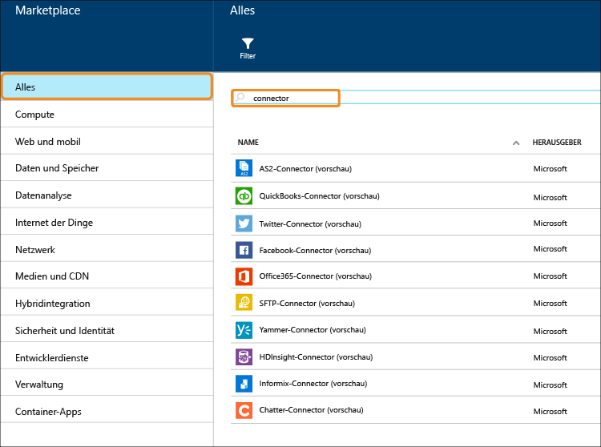

<properties 
    pageTitle="Was sind Connectors und BizTalk-API-Apps?" 
    description="Erfahren Sie mehr über API-Apps, Connectors und BizTalk-API-Apps" 
    services="logic-apps" 
    documentationCenter="" 
    authors="MandiOhlinger" 
    manager="erikre" 
    editor=""/>

<tags 
    ms.service="logic-apps" 
    ms.workload="integration" 
    ms.tgt_pltfrm="na" 
    ms.devlang="na" 
    ms.topic="get-started-article" 
    ms.date="09/01/2016" 
    ms.author="mandia"/>

# Was sind Connectors und BizTalk-API-Apps?

[AZURE.INCLUDE [app-service-logic-version-message](../../includes/app-service-logic-version-message.md)]

Ein *Connector* ist eine Art API-App mit Fokus auf Konnektivität. Connectors werden wie alle anderen API-Apps von Web-Apps, Mobile Apps und Logik-Apps verwendet. Connectors vereinfachen Verbindungen mit vorhandenen Diensten, helfen beim Verwalten der Authentifizierung und bieten Überwachungs-, Analyse- und weitere Funktionen.

Entwickler können eigene API-Apps erstellen und sie privat bereitstellen. In Zukunft können Entwickler ihre eigens erstellten API-Apps über den Marketplace freigeben und daran verdienen. 

Um die Entwicklung von Lösungen zu beschleunigen, hat das Azure-Team dem Marketplace verschiedene Connectors für zahlreiche gängige Szenarien hinzugefügt. Darüber hinaus sind zum Erweitern der Funktionalität für komplexe Integrationsszenarien auch verschiedene Premium- und BizTalk-Funktionen verfügbar.

Es sind unterschiedliche Dienstebenen verfügbar. Alle Ebenen umfassen alle Connectors und API-Apps, einschließlich ihrer vollen Funktionalität.  

Unter [App Service-Preise](https://azure.microsoft.com/pricing/details/app-service/) werden diese Dienstebenen beschrieben. Zudem wird aufgeführt, was in den einzelnen Ebenen enthalten ist. In den folgenden Abschnitten werden die verschiedenen Kategorien von BizTalk-API-Apps und -Connectors beschrieben.

## Hybrid-Connectors 
Die Hybrid-Connectors ermöglichen eine weitere Integration in Unternehmensanwendungen wie [DB2](app-service-logic-connector-db2.md), [Informix](app-service-logic-connector-informix.md) WebSphere MQ. 

Weitere Ressourcen: [Business-to-Business-Connectors und API-Apps](app-service-logic-b2b-connectors.md)  
[Erstellen eines B2B-Prozesses](app-service-logic-create-a-b2b-process.md)  
[Erstellen einer Handelspartnervereinbarung](app-service-logic-create-a-trading-partner-agreement.md)  
[Nachverfolgen von B2B-Nachrichten](app-service-logic-track-b2b-messages.md)  

## Regeln
Geschäftsregeln umfassen die Richtlinien und Entscheidungen, welche Geschäftsprozesse steuern. Normalerweise sind Regeln dynamisch und ändern sich im Laufe der Zeit, zum Beispiel aufgrund von Geschäftsplänen oder Bestimmungen oder aus vielen anderen Gründen. [BizTalk-Regeln](app-service-logic-use-biztalk-rules.md) können Sie diese Richtlinien von Ihrem Anwendungscode entkoppeln und den Änderungsprozess einfacher und schneller gestalten.

## Liste der Connectors und API-Apps
Eine vollständige Liste der Connectors und API-Apps, die in den einzelnen Kategorien wie den Standardconnectors, BizTalk-EAI, Premiumconnectors usw. enthalten sind, finden Sie unter [Liste mit Connectors und API-Apps](app-service-logic-connectors-list.md).
 

<!--HONumber=Oct16_HO2-->

