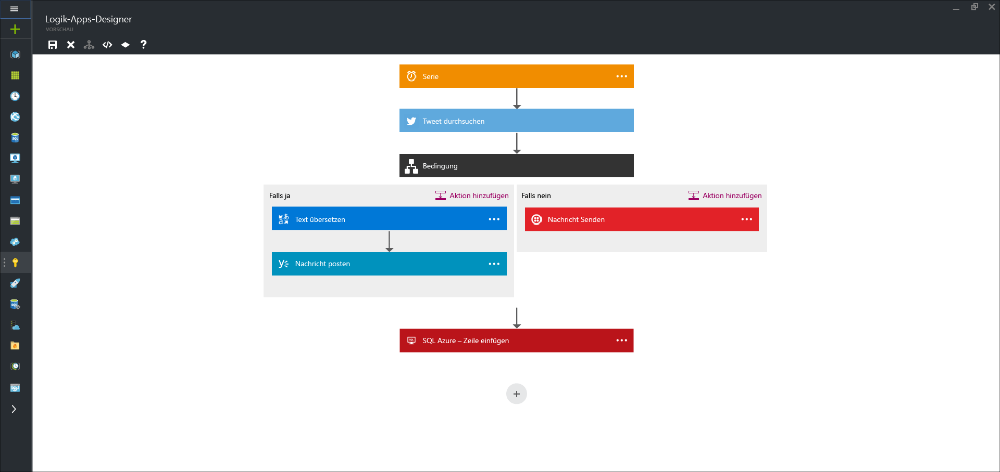

<properties 
	pageTitle="Was sind Logik-Apps?" 
	description="Weitere Informationen zu App Service-Logik-Apps" 
	authors="kevinlam1" 
	manager="dwrede" 
	editor="" 
	services="app-service\logic" 
	documentationCenter=""/>

<tags
	ms.service="logic-apps"
	ms.workload="na"
	ms.tgt_pltfrm="na"
	ms.devlang="na"
	ms.topic="hero-article" 
	ms.date="07/12/2016"
	ms.author="klam"/>

#Was sind Logik-Apps?

Logik-Apps ermöglichen die Vereinfachung und die Implementierung skalierbarer Integrationen und Workflows in die Cloud. Es wird ein visueller Designer bereitgestellt, mit dem Sie Ihre Prozesse in Form von Schritten (als Workflow bezeichnet) modellieren und automatisieren können. In der Cloud und der lokalen Umgebung sind [viele Connectors](../connectors/apis-list.md) zur schnellen Integration für Dienste und Protokolle enthalten. Eine Logik-App beginnt mit einem Trigger (z.B. „Wenn Dynamics CRM ein Konto hinzugefügt wird“), und nach der Auslösung sind viele verschiedene Kombinationen von Aktionen, Konvertierungen und Bedingungslogikabläufen möglich.

Die Verwendung von Logik-Apps hat u.a. die folgenden Vorteile:

- Sparen von Zeit, indem komplexe Prozesse mit einfachen Designtools entworfen werden
- Nahtloses Implementieren von Mustern und Workflows, die andernfalls im Code nur schwer zu implementieren sind
- Schnelles Starten mit Vorlagen
- Anpassen der Logik-App mit eigenen APIs, Codeelementen und Aktionen
- Herstellen einer Verbindung und Synchronisieren von unterschiedlichen Systemen in lokalen Umgebungen und der Cloud
- Erstellen mit BizTalk Server, API Management, Azure Functions und Azure Service Bus mit erstklassiger Integrationsunterstützung

Bei Logik-Apps handelt es sich um einen vollständig verwalteten Dienst vom Typ „iPaaS“ (integration Platform as a Service), mit dem Entwickler sich keine Sorgen in Bezug auf Hosting, Skalierbarkeit, Verfügbarkeit und Verwaltung machen müssen. Logik-Apps werden automatisch zentral hochskaliert, um den Bedarf zu decken.

Wie erwähnt können Sie mit Logik-Apps Geschäftsprozesse automatisieren. Hier sind einige Beispiele:
 
* Verschieben von auf einen FTP-Server hochgeladenen Dateien nach Azure Storage
* Verarbeiten und Weiterleiten von Bestellungen in lokalen Systemen und Cloudsystemen
* Überwachen aller Tweets zu einem bestimmten Thema, Analysieren der Stimmung und Erstellen von Warnungen und Aufgaben für Elemente, für die weitere Maßnahmen erforderlich sind

Ähnliche Szenarios können über den visuellen Designer konfiguriert werden, ohne eine einzige Codezeile schreiben zu müssen. Erste Schritte zum sofortigen [Erstellen Ihrer Logik-App][create]. Nachdem sie geschrieben wurde, kann eine Logik-App über mehrere Umgebungen und Regionen hinweg [schnell bereitgestellt und neu konfiguriert werden](app-service-logic-create-deploy-template.md).

## Gründe für Logik-Apps

Logik-Apps sorgen in Unternehmen in Bezug auf die Integration für Geschwindigkeit und Skalierbarkeit. Die einfache Verwendung des Designers, die Vielzahl der verfügbaren Trigger und Aktionen und leistungsfähige Verwaltungstools machen das Zentralisieren der Apps einfacher als jemals zuvor. Die Digitalisierung wird in Unternehmen immer weiter vorangetrieben, und mit Logik-Apps können Sie bestehende und moderne Systeme miteinander verbinden.

Mit unserem [Unternehmensintegrationskonto][biztalk] können Sie erweiterte Integrationsszenarien nutzen, z.B. [XML-Messaging][xml], [Handelspartnerverwaltung][tpm] und vielem mehr.

- **Leicht zu bedienende Entwurfstools** – Logik-Apps können von A bis Z im Browser oder mit Visual Studio-Tools entwickelt werden. Beginnen Sie mit einem Trigger – von einem einfachen Zeitplan bis zur Erstellung eines GitHub-Problems. Orchestrieren Sie anschließend eine beliebige Anzahl von Aktionen mithilfe des umfassenden Angebots an Connectors.

- **Einfaches Verbinden von APIs** – Auch Zusammensetzungsaufgaben, die einfach zu beschreiben sind, lassen sich nur schwer in Code implementieren. Mit Logik-Apps ist es kinderleicht, verschiedenartige Systeme miteinander zu verbinden. Wollen Sie Ihre Marketinglösung in der Cloud mit Ihrem lokalen Abrechnungssystem verbinden? Möchten Sie das Messaging per Enterprise Service Bus über APIs und Systeme hinweg zentralisieren? Logik-Apps sind die schnellste und zuverlässigste Möglichkeit, Lösungen für diese Probleme bereitzustellen.

- **Schneller Einstieg mit Vorlagen** – Um Ihnen den Einstieg zu erleichtern, bieten wir einen [Katalog mit Vorlagen][templates], mit deren Hilfe Sie einige allgemeine Lösungen rasch erstellen können. Von erweiterten B2B-Lösungen bis zu einfachen SaaS-Konnektivitätslösungen und sogar einigen Just-for-fun-Lösungen: der Katalog ist die schnellste Möglichkeit, sich mit der Leistungsfähigkeit von Logik-Apps vertraut zu machen.

- **Integrierte Erweiterbarkeit** – Sie finden den benötigten Connector nicht? Logik-Apps sind für die Zusammenarbeit mit Ihren eigenen APIs und Codeelementen konzipiert. Sie können auf einfache Weise eine eigene API-App als benutzerdefinierten Connector erstellen oder eine [Azure-Funktion](https://functions.azure.com) aufrufen, um Codeausschnitte bedarfsgesteuert auszuführen.

- **Hohes Integrationspotenzial** – Fangen Sie einfach an, und wachsen Sie Ihrem Bedarf entsprechend. Logik-Apps können problemlos die Leistungsstärke von BizTalk, der branchenführenden Integrationslösung von Microsoft nutzen, damit Integrationsexperten die Lösungen erstellen können, die sie brauchen. Informieren Sie sich eingehender über das [Enterprise Integration Pack](./app-service-logic-enterprise-integration-overview.md).

## Logik-App – Konzepte

Es folgt eine Beschreibung einiger der wichtigsten Elemente von Logik-Apps.

- **Workflow** – Logik-Apps bieten eine grafische Möglichkeit zum Abbilden Ihrer Geschäftsprozesse als Folge von Schritten bzw. Workflow.
- **Verwaltete Connectors** – Ihre Logik-Apps benötigen Zugriff auf Daten und Dienste. Verwaltete Connectors werden speziell erstellt, um Ihnen beim Herstellen von Verbindungen und Arbeiten mit Ihren Daten zu helfen. Die Liste der aktuell verfügbaren Connectors finden Sie unter [Verwaltete Connectors][managedapis].
- **Trigger** – Einige verwaltete Connectors können auch als Trigger fungieren. Ein Trigger startet eine neue Instanz eines Workflows basierend auf einem bestimmten Ereignis, z. B. Eingang einer E-Mail oder einer Änderung in Ihrem Azure Storage-Konto.
-  **Aktionen** – Jeder Schritt nach dem Trigger in einem Workflow wird als Aktion bezeichnet. Jede Aktion wird in der Regel einem Vorgang in Ihrem verwalteten Connector oder benutzerdefinierten API-Apps zugeordnet.
- **Enterprise Integration Pack** – Für anspruchsvollere Integrationsszenarien enthalten Logik-Apps Funktionen von BizTalk. BizTalk ist die branchenführende Integrationsplattform von Microsoft. Mit den Enterprise Integration Pack-Connectors können Sie in Ihre Logik-App-Workflows auf einfache Weise eine Überprüfung, Transformation usw. einbinden.

## Erste Schritte  

- Befolgen Sie zum Einstieg in Logik-Apps das Lernprogramm [Erstellen einer Logik-App][create].
- [Anzeigen allgemeiner Beispiele und Szenarien](app-service-logic-examples-and-scenarios.md)
- [Sie können Geschäftsprozesse mit Logik-Apps automatisieren.](http://channel9.msdn.com/Events/Build/2016/T694)
- [Erfahren Sie, wie Sie Ihre Systeme in Logik-Apps integrieren.](http://channel9.msdn.com/Events/Build/2016/P462)

[biztalk]: app-service-logic-enterprise-integration-accounts.md
[appservice]: ../app-service/app-service-value-prop-what-is.md
[create]: app-service-logic-create-a-logic-app.md
[managedapis]: ../connectors/apis-list.md
[tpm]: app-service-logic-enterprise-integration-accounts.md
[xml]: app-service-logic-enterprise-integration-b2b.md
[templates]: app-service-logic-use-logic-app-templates.md

<!---HONumber=AcomDC_0727_2016-->