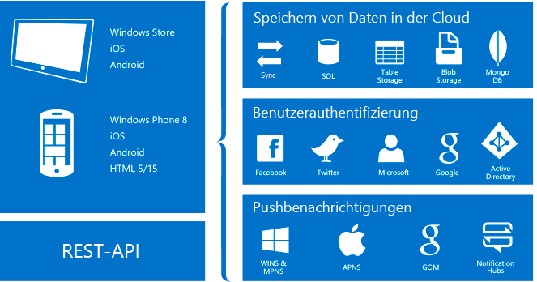

# Informationen zu Mobile Apps in Azure App Service
Azure App Service ist ein vollständig verwaltetes PaaS-Angebot ([Platform-as-a-Service](https://azure.microsoft.com/overview/what-is-paas/)) für professionelle Entwickler. Der Dienst stellt umfangreiche Funktionen für Web- und Integrationsszenarien sowie für mobile Szenarien bereit. 

Das Mobile Apps-Feature von Azure App Service bietet Unternehmensentwicklern und Systemintegratoren eine hochgradig skalierbare, global verfügbare Entwicklungsplattform für mobile Anwendungen.

## Warum Mobile Apps?
Das Mobile Apps-Feature ermöglicht Folgendes:

* **Entwickeln nativer und plattformübergreifender Apps:** Nutzen Sie die Vorteile von App Service mithilfe nativer SDKs – ob Sie nun native iOS-, Android- und Windows-Apps oder plattformübergreifende Xamarin- oder Cordova-Apps (PhoneGap) erstellen.
* **Herstellen einer Verbindung mit Ihren Unternehmenssystemen:** Mit dem Mobile Apps-Feature können Sie die Unternehmensanmeldung innerhalb von Minuten hinzufügen und eine Verbindung mit Ihren lokalen Unternehmensressourcen oder Cloudressourcen herstellen.
* **Erstellen offlinefähiger Apps mit Datensynchronisierung:** Steigern Sie die Produktivität Ihrer mobilen Mitarbeiter mithilfe von Apps, die auch offline verwendet werden können, und nutzen Sie Mobile Apps zur Datensynchronisierung im Hintergrund, wenn eine Verbindung mit Ihren Unternehmensdatenquellen oder SaaS-APIs (Software-as-a-Service) besteht.
* **Senden von Pushbenachrichtigungen an Millionen von Benutzer in Sekundenschnelle:** Sprechen Sie Ihre Kunden auf beliebigen Geräten genau zum richtigen Zeitpunkt mit personalisierten Pushbenachrichtigungen an.

## Mobile Apps-Features
Die folgenden Features sind für die cloudfähige mobile Entwicklung wichtig:

* **Authentifizierung und Autorisierung:** Wählen Sie aus einer ständig wachsenden Liste mit Identitätsanbietern (wie etwa Azure Active Directory für die Authentifizierung von Unternehmen) sowie mit Anbietern von sozialen Netzwerken wie Facebook, Google, Twitter und Microsoft-Konten. Mobile Apps bietet für jeden Anbieter einen OAuth 2.0-Dienst. Sie können auch das SDK für den Identitätsanbieter integrieren, um anbieterspezifische Funktionen zu erhalten.

    Erfahren Sie mehr über unsere [Authentifizierungsfeatures].

* **Datenzugriff:** Mobile Apps stellt eine für Mobilgeräte geeignete OData v3-Datenquelle bereit, die mit Azure SQL-Datenbank oder einer lokalen SQL Server-Instanz verknüpft ist. Da dieser Dienst auf Entity Framework basieren kann, ermöglicht er die einfache Integration in andere NoSQL- und SQL-Datenanbieter wie [Azure Table Storage], MongoDB, [Azure Cosmos DB] und SaaS-API-Anbieter wie Office 365 und Salesforce.com.

* **Offlinesynchronisierung:** Mit unseren Client-SDKs können Sie komfortabel robuste und reaktionsfähige mobile Anwendungen mit einem Offlinedataset erstellen. Dieses Dataset kann automatisch mit den Back-End-Daten synchronisiert werden, und es steht eine Unterstützung bei der Konfliktlösung zur Verfügung.

  Erfahren Sie mehr über unsere [Datenfeatures].

* **Pushbenachrichtigungen:** Unsere Client-SDKs lassen sich nahtlos in die Registrierungsfunktionen von Azure Notification Hubs integrieren, sodass Sie Pushbenachrichtigungen gleichzeitig an Millionen von Benutzern senden können.

  Erfahren Sie mehr über unsere [Pushbenachrichtigungsfeatures].

* **Client-SDKs:** Wir stellen einen umfassenden Satz von Client-SDKs für die native Entwicklung ([iOS], [Android] und [Windows]), plattformübergreifende Entwicklung [(Xamarin.iOS und Xamarin.Android], [Xamarin.Forms]) und die Entwicklung von Hybridanwendungen ([Apache Cordova]) bereit. Jedes Client-SDK ist mit einer MIT-Lizenz erhältlich und quelloffen.

## Azure App Service-Features
Die folgenden Plattformfeatures sind für mobile Produktionswebsites nützlich:

* **Automatische Skalierung:** Mit App Service können Sie schnell zentral oder horizontal hochskalieren, um beliebige eingehende Datenlasten von Kunden zu bewältigen. Wählen Sie Anzahl und Größe der virtuellen Computer manuell aus, oder richten Sie eine automatische Skalierung zur last- oder zeitplanbasierten Skalierung Ihres mobilen App-Back-Ends ein.

  Weitere Informationen zur automatischen Skalierung finden Sie [hier].

* **Stagingumgebungen:** App Service kann mehrere Versionen Ihrer Website ausführen, um A/B-Tests, Produktionstests im Rahmen eines umfassenderen DevOps-Plans und direktes Staging eines neuen Back-Ends zu ermöglichen.

  Erfahren Sie mehr über [Stagingumgebungen].

* **Continuous Deployment:** App Service kann in gängige SCM-Systeme (Supply Chain Management) integriert werden, sodass Sie automatisch eine neue Version Ihres Back-Ends bereitstellen können, indem Sie sie mittels Pushvorgang an eine Verzweigung Ihres SCM-Systems übermitteln.

  Erfahren Sie mehr über [Bereitstellungsoptionen].

* **Virtuelles Netzwerk:** App Service kann eine Verbindung mit lokalen Ressourcen über ein virtuelles Netzwerk, über Azure ExpressRoute oder über Hybridverbindungen herstellen.

  Erfahren Sie mehr über [Hybridverbindungen], [virtuelle Netzwerke] und [ExpressRoute].

* **Isolierte und dedizierte Umgebungen:** Sie können App Service in einer vollständig isolierten und dedizierten Umgebung betreiben, um Azure App Service-Apps mit umfangreicher Skalierung sicher auszuführen. Diese Umgebung eignet sich perfekt für Anwendungsworkloads, die eine umfassende Skalierung, Isolierung oder sicheren Netzwerkzugriff benötigen.

  Weitere Informationen zu App Service-Umgebungen finden Sie [hier].

## Nächste Schritte

Absolvieren Sie das [Einstiegstutorial], um mit der Verwendung von Mobile Apps in Azure App Service zu beginnen. Dieses Tutorial vermittelt die Grundlagen für die Erstellung eines mobilen Back-Ends und Clients Ihrer Wahl. Außerdem erfahren Sie, wie Sie Authentifizierung, Offlinesynchronisierung und Pushbenachrichtigungen integrieren. Das Tutorial kann mehrmals durchlaufen werden, um die einzelnen Clientanwendungen abzudecken.

Weitere Informationen zu Mobile Apps finden Sie in unserem [Lernpfad].
Weitere Informationen zur Azure App Service-Plattform finden Sie unter [Azure App Service].

<!-- URLs. -->
[Migrate your mobile service to App Service]: app-service-mobile-migrating-from-mobile-services.md
[Azure App Service]: ../app-service/app-service-value-prop-what-is.md
[Einstiegstutorial]: app-service-mobile-ios-get-started.md
[Azure Table Storage]:../cosmos-db/table-storage-how-to-use-dotnet.md
[Azure Cosmos DB]: ../cosmos-db/documentdb-get-started.md
[Authentifizierungsfeatures]: ./app-service-mobile-auth.md
[Datenfeatures]: ./app-service-mobile-offline-data-sync.md
[Pushbenachrichtigungsfeatures]: ../notification-hubs/notification-hubs-push-notification-overview.md
[iOS]: ./app-service-mobile-ios-how-to-use-client-library.md
[Android]: ./app-service-mobile-android-how-to-use-client-library.md
[Windows]: ./app-service-mobile-dotnet-how-to-use-client-library.md
[(Xamarin.iOS und Xamarin.Android]: ./app-service-mobile-dotnet-how-to-use-client-library.md
[Xamarin.Forms]: ./app-service-mobile-xamarin-forms-get-started.md
[Apache Cordova]: ./app-service-mobile-cordova-how-to-use-client-library.md
[hier]: ../app-service-web/web-sites-scale.md
[Stagingumgebungen]: ../app-service-web/web-sites-staged-publishing.md
[Bereitstellungsoptionen]: ../app-service-web/web-sites-deploy.md
[Hybridverbindungen]: ../app-service-web/web-sites-hybrid-connection-get-started.md
[virtuelle Netzwerke]: ../app-service-web/web-sites-integrate-with-vnet.md
[ExpressRoute]: ../app-service-web/app-service-app-service-environment-network-configuration-expressroute.md
[hier]: ../app-service-web/app-service-app-service-environment-intro.md
[Lernpfad]: https://azure.microsoft.com/en-us/documentation/learning-paths/appservice-mobileapps/

