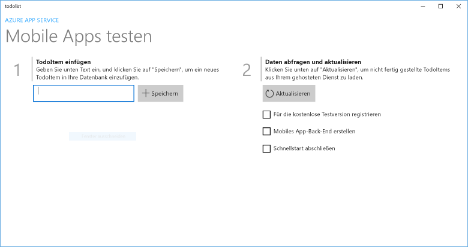
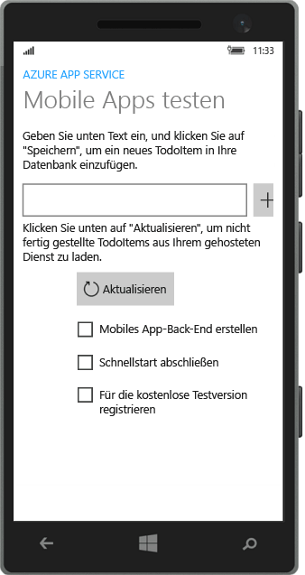

# Erstellen einer Windows-App
[!INCLUDE [app-service-mobile-selector-get-started](../../includes/app-service-mobile-selector-get-started.md)]

## Übersicht
In diesem Tutorial erfahren Sie, wie Sie einer App für die universelle Windows-Plattform (UWP) einen cloudbasierten Back-End-Dienst hinzufügen. Weitere Informationen finden Sie unter [Was sind Mobile Apps?](app-service-mobile-value-prop.md) Im Folgenden sehen Sie Screenshots aus der fertigen App:

   
Auf einem Desktopgerät 

  
Auf einem Smartphone

Die Absolvierung dieses Tutorials wird für alle anderen Mobile App-Tutorials für UWP-Apps vorausgesetzt. 

## Voraussetzungen
Für dieses Lernprogramm benötigen Sie Folgendes:

* Ein aktives Azure-Konto. Falls Sie kein Konto besitzen, können Sie sich für eine Azure-Testversion registrieren. So erhalten Sie bis zu 10 kostenlose mobile Apps, die Sie auch nach Ablauf der Testversion weiter nutzen können. Weitere Informationen finden Sie unter [Kostenloses Azure-Testkonto](https://azure.microsoft.com/pricing/free-trial/).
* [Visual Studio Community 2015] oder eine höhere Version.

> [!NOTE]
> Wenn Sie Azure App Service ausprobieren möchten, ehe Sie sich für ein Azure-Konto anmelden, besuchen Sie [Azure App Service-App erstellen](https://azure.microsoft.com/try/app-service/mobile/). Dort können Sie direkt eine kurzzeitige mobile Start-App in App Service erstellen – keine Kreditkarte erforderlich, keine weiteren Verpflichtungen.
> 
> 

## Erstellen eines neuen Azure Mobile App-Back-Ends
Führen Sie die folgenden Schritte aus, um ein neues mobiles App-Back-End zu erstellen.

[!INCLUDE [app-service-mobile-dotnet-backend-create-new-service](../../includes/app-service-mobile-dotnet-backend-create-new-service.md)]

Sie haben nun ein Azure-Back-End für mobile Apps bereitgestellt, das von Ihren mobilen Clientanwendungen verwendet werden kann. Als Nächstes laden Sie ein Serverprojekt für ein einfaches "Aufgabenlisten"-Back-End herunter und veröffentlichen es in Azure.

## Konfigurieren des Serverprojekts
[!INCLUDE [app-service-mobile-configure-new-backend.md](../../includes/app-service-mobile-configure-new-backend.md)]

## Herunterladen und Ausführen des Clientprojekts
Sobald Sie Ihr Back-End für mobile Apps konfiguriert haben, können Sie eine neue Client-App erstellen oder eine vorhandene App so ändern, dass eine Verbindung mit Azure hergestellt wird. In diesem Abschnitt laden Sie ein Vorlagenprojekt für eine UWP-App herunter, das zum Herstellen einer Verbindung mit dem Mobile App-Back-End angepasst wird.

1. Klicken Sie im Blatt **Schnellstart** für Ihr Back-End für mobile Apps auf **Neue App erstellen** > **Herunterladen**, und entpacken Sie die komprimierten Projektdateien auf Ihrem lokalen Computer.
   
    
2. (Optional) Fügen Sie das UWP-App-Projekt der gleichen Projektmappe hinzu wie das Serverprojekt. Dies erleichtert es, bei Bedarf sowohl die App als auch das Back-End in der gleichen Visual Studio-Projektmappe zu debuggen. Wenn Sie der Projektmappe ein UWP-App-Projekt hinzufügen möchten, müssen Sie mindestens Visual Studio 2015 verwenden.
3. Vergewissern Sie sich, dass die UWP-App als Startprojekt festgelegt ist, und drücken Sie anschließend F5, um die App bereitzustellen und auszuführen.
4. Geben Sie in der App unter **TodoItem** einfügen einen beschreibenden Text ein, zum Beispiel *Abschließen des Tutorials*. Klicken Sie dann auf **Speichern**.
   
    
   
    Dadurch wird eine POST-Anforderung an das neue in Azure gehostete mobile App-Back-End gesendet.
5. (Optional) Beenden Sie die App, und starten Sie sie auf einem anderen Gerät oder in einem Emulator für mobile Geräte.
   
    
   
    Beachten Sie, dass nach dem Starten der UWP-App Daten aus Azure geladen werden, die im vorhergehenden Schritt gespeichert wurden. 

## Nächste Schritte
* [Hinzufügen von Authentifizierung zur App](app-service-mobile-windows-store-dotnet-get-started-users.md)  
  Enthält Informationen über die Authentifizierung von Benutzern der App mit einem Identitätsanbieter.
* [Hinzufügen von Pushbenachrichtigungen zur App](app-service-mobile-windows-store-dotnet-get-started-push.md)  
  Hier erfahren Sie, wie Sie Ihrer App die Unterstützung von Pushbenachrichtigungen hinzufügen und Ihr Mobile App-Back-End für die Verwendung von Azure Notification Hubs zum Senden von Pushbenachrichtigungen konfigurieren.
* [Aktivieren der Offlinesynchronisierung für Ihre App](app-service-mobile-windows-store-dotnet-get-started-offline-data.md)  
  Erfahren Sie, wie Sie mithilfe eines Mobile App-Back-Ends Ihrer App Offlineunterstützung hinzufügen. Die Offlinesynchronisierung ermöglicht Endbenutzern die Interaktion mit einer mobilen App (also das Anzeigen, Hinzufügen oder Ändern von Daten), auch wenn keine Netzwerkverbindung besteht.

<!-- Anchors. -->
<!-- Images. -->
<!-- URLs. -->
[Mobile App SDK]: http://go.microsoft.com/fwlink/?LinkId=257545
[Azure portal]: https://portal.azure.com/
[Visual Studio Community 2015]: https://go.microsoft.com/fwLink/p/?LinkID=534203

<!--HONumber=Jan17_HO3-->

