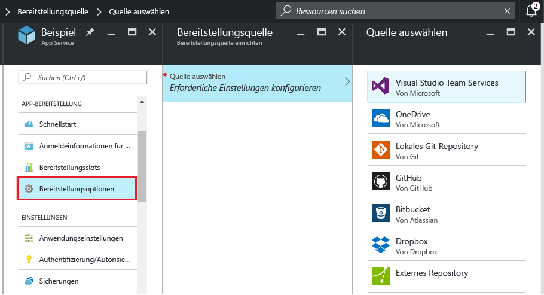
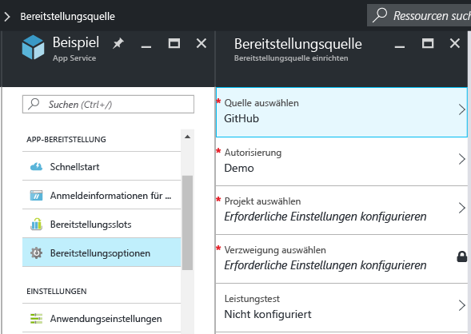
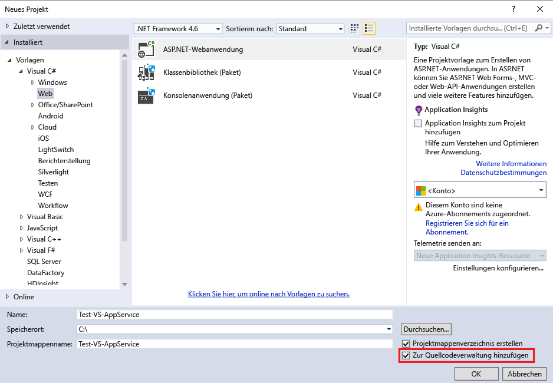
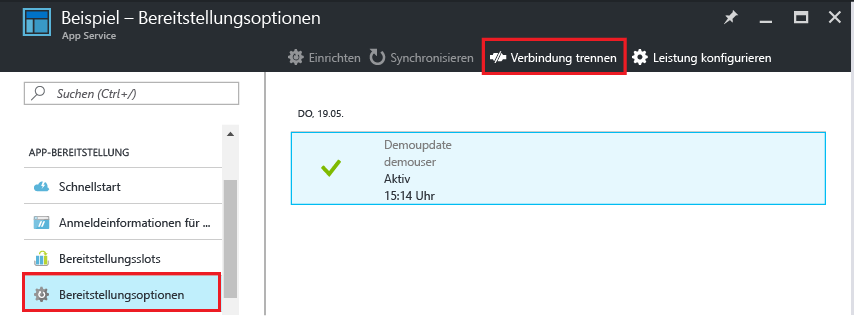

# Kontinuierliche Bereitstellung in Azure App Service
In diesem Tutorial erfahren Sie, wie Sie einen Workflow für die kontinuierliche Bereitstellung für Ihre [Azure App Service]-App konfigurieren. Die Integration von App Service in BitBucket, GitHub und [Visual Studio Team Services (VSTS)](https://www.visualstudio.com/team-services/) ermöglicht einen Workflow für die kontinuierliche Bereitstellung. Hierbei werden die neuesten Updates aus Ihrem Projekt, das in einem der genannten Dienste veröffentlicht ist, per Pull nach Azure übertragen. Die kontinuierliche Bereitstellung ist hervorragend für Projekte geeignet, bei denen häufig zahlreiche Beiträge integriert werden.

Informationen zum manuellen Konfigurieren der kontinuierlichen Bereitstellung in einem Cloudrepository, das nicht im Azure-Portal aufgeführt ist (etwa [GitLab](https://gitlab.com/)), finden Sie unter [Setting up continuous deployment using manual steps](https://github.com/projectkudu/kudu/wiki/Continuous-deployment#setting-up-continuous-deployment-using-manual-steps) (Manuelles Einrichten der kontinuierlichen Bereitstellung).

## Aktivieren der kontinuierlichen Bereitstellung
Führen Sie die folgenden Schritte aus, um die kontinuierliche Bereitstellung zu aktivieren:

1. Veröffentlichen Sie Ihren App-Inhalt indem Repository, das für die kontinuierliche Bereitstellung verwendet werden soll.  
    Weitere Informationen zum Veröffentlichen Ihres Projekts in einem dieser Dienste finden Sie unter [Erstellen eines Repositorys (GitHub)], [Erstellen eines Repositorys (BitBucket)] und [Erste Schritte mit VSTS].
2. Klicken Sie im [Azure-Portal] auf dem Menüblatt Ihrer App auf **APP-BEREITSTELLUNG > Bereitstellungsoptionen**. Klicken Sie auf **Quelle auswählen**, und wählen Sie die Bereitstellungsquelle aus.  
   
    
   
   > [!NOTE]
   > Informationen zum Konfigurieren eines VSTS-Kontos für die App Service-Bereitstellung finden Sie in diesem [Tutorial](https://github.com/projectkudu/kudu/wiki/Setting-up-a-VSTS-account-so-it-can-deploy-to-a-Web-App).
   > 
   > 
3. Schließen Sie den Autorisierungsworkflow ab.
4. Wählen Sie auf dem Blatt **Bereitstellungsquelle** das Projekt und den Branch für die Bereitstellung aus. Wenn Sie fertig sind, klicken Sie auf **OK**.
   
    
   
   > [!NOTE]
   > Wenn Sie die kontinuierliche Bereitstellung mit GitHub oder BitBucket aktivieren, werden öffentliche und private Projekte angezeigt.
   > 
   > 
   
    App Service erstellt eine Verknüpfung mit dem ausgewählten Repository, ruft die Dateien aus dem angegebenen Branch per Pull ab und verwaltet einen Klon Ihres Repositorys für Ihre App Service-App. Wenn Sie VSTS für die kontinuierliche Bereitstellung aus dem Azure-Portal konfigurieren, wird für die Integration das [Kudu-Bereitstellungsmodul](https://github.com/projectkudu/kudu/wiki) von App Service verwendet, das bereits mit jedem `git push`-Vorgang Build- und Bereitstellungsaufgaben (Build & Deployment) automatisiert. Es ist nicht erforderlich, die kontinuierliche Bereitstellung in VSTS separat einzurichten. Nach Abschluss dieses Vorgangs wird auf dem App-Blatt **Bereitstellungsoptionen** eine aktive Bereitstellung angezeigt, die auf die erfolgreiche Bereitstellung hinweist.
5. Um zu überprüfen, ob die App erfolgreich bereitgestellt wurde, klicken Sie im Azure-Portal oben auf dem Blatt der App auf **URL**.
6. Um sicherzustellen, dass die fortlaufende Bereitstellung aus dem Repository Ihrer Wahl stattfindet, übertragen Sie eine Änderung per Push in das Repository. Ihre App sollte aktualisiert werden und die Änderungen kurz nach dem Push ins Repository widerspiegeln. Sie können auf dem Blatt **Bereitstellungsoptionen** Ihrer App überprüfen, ob das Update abgerufen wurde.

## Kontinuierliche Bereitstellung einer Visual Studio-Projektmappe
Eine Visual Studio-Projektmappe lässt sich genauso leicht mithilfe von Push an Azure App Service übertragen wie eine einfache index.html-Datei. Der App Service-Bereitstellungsprozess optimiert alle Details, darunter das Wiederherstellen von NuGet-Abhängigkeiten und die Erstellung der Binärdateien der Anwendung. Sie können die Best Practices der Quellcodeverwaltung befolgen und Code ausschließlich in Ihrem Git-Repository verwalten, während die App Service-Bereitstellung den Rest erledigt.

Die Schritte zur Pushübertragung der Visual Studio-Projektmappe an App Service sind mit denen im [vorherigen Abschnitt](#overview)identisch, wenn Sie Ihre Projektmappe und das Repository wie folgt konfigurieren:

* Verwenden Sie die Visual Studio-Option zur Quellcodeverwaltung, um wie in der nachstehenden Abbildung eine `.gitignore`-Datei zu generieren, oder fügen Sie Ihrem Repositorystamm manuell eine `.gitignore`-Datei hinzu, die einen ähnlichen Inhalt wie dieses [.gitignore](https://github.com/github/gitignore/blob/master/VisualStudio.gitignore)-Beispiel hat.
  
  
* Fügen Sie Ihrem Repository die gesamte Verzeichnisstruktur des Projekts hinzu, wobei sich die .sln-Datei im Stammverzeichnis des Repositorys befinden muss.

Nachdem Sie Ihr Repository wie beschrieben eingerichtet und Ihre App in Azure für die kontinuierliche Veröffentlichung aus einem der Online-Git-Repositorys konfiguriert haben, können Sie Ihre ASP.NET-Anwendung lokal in Visual Studio entwickeln und Ihren Code kontinuierlich bereitstellen, indem Sie einfach Ihre Änderungen mithilfe von Push an Ihr Online-Git-Repository übertragen.

## Deaktivieren der fortlaufenden Bereitstellung
Führen Sie die folgenden Schritte aus, um die kontinuierliche Bereitstellung zu deaktivieren:

1. Klicken Sie im [Azure-Portal] auf dem Menüblatt Ihrer App auf **APP-BEREITSTELLUNG > Bereitstellungsoptionen**. Klicken Sie dann auf dem Blatt **Bereitstellungsoptionen** auf **Trennen**.
   
    
2. Nachdem Sie die Bestätigungsmeldung mit **Ja** beantwortet haben, können Sie zum Blatt Ihrer App zurückkehren und auf **APP-BEREITSTELLUNG > Bereitstellungsoptionen** klicken, wenn Sie die Veröffentlichung aus einer anderen Quelle einrichten möchten.

## Zusätzliche Ressourcen
* [How to investigate common issues with continuous deployment](https://github.com/projectkudu/kudu/wiki/Investigating-continuous-deployment)
* [Verwenden von PowerShell für Azure]
* [Verwenden des Azure-Befehlszeilentools für Mac und Linux]
* [Git-Dokumentation]
* [Projekt Kudu](https://github.com/projectkudu/kudu/wiki)
* [Use Azure to automatically generate a CI/CD pipeline to deploy an ASP.NET 4 app (Verwenden von Azure zum automatischen Erstellen einer CI/CD-Pipeline zum Bereitstellen einer ASP.NET 4-App)](https://www.visualstudio.com/docs/build/get-started/aspnet-4-ci-cd-azure-automatic)

> [!NOTE]
> Wenn Sie Azure App Service ausprobieren möchten, ehe Sie sich für ein Azure-Konto anmelden, können Sie unter [App Service testen](https://azure.microsoft.com/try/app-service/)sofort kostenlos eine kurzlebige Starter-Web-App in App Service erstellen. Keine Kreditkarte erforderlich, keine Verpflichtungen.
> 
> 

[Azure App Service]: https://azure.microsoft.com/en-us/documentation/articles/app-service-changes-existing-services/
[Azure-Portal]: https://portal.azure.com
[VSTS Portal]: https://www.visualstudio.com/en-us/products/visual-studio-team-services-vs.aspx
[Installing Git]: http://git-scm.com/book/en/Getting-Started-Installing-Git
[Verwenden von PowerShell für Azure]: /powershell/azureps-cmdlets-docs
[Verwenden des Azure-Befehlszeilentools für Mac und Linux]:../cli-install-nodejs.md
[Git-Dokumentation]: http://git-scm.com/documentation

[Erstellen eines Repositorys (GitHub)]: https://help.github.com/articles/create-a-repo
[Erstellen eines Repositorys (BitBucket)]: https://confluence.atlassian.com/display/BITBUCKET/Create+an+Account+and+a+Git+Repo
[Erste Schritte mit VSTS]: https://www.visualstudio.com/docs/vsts-tfs-overview

