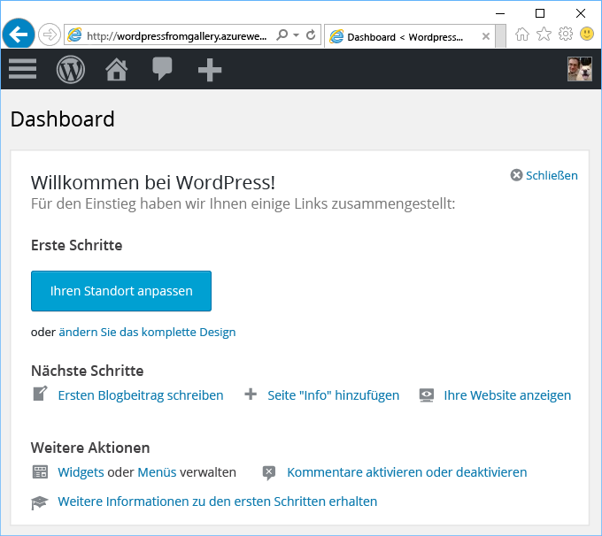

# Erstellen einer Web-App aus dem Azure Marketplace
<!-- Note: This article replaces web-sites-php-web-site-gallery.md -->

[!INCLUDE [tabs](../../includes/app-service-web-get-started-nav-tabs.md)]

Azure Marketplace bietet eine Vielzahl von beliebten Web-Apps, die in Open-Source-Softwarecommunitys entwickelt wurden, beispielsweise WordPress oder Umbraco CMS. In diesem Tutorial erfahren Sie, wie Sie eine WordPress-App aus Azure Marketplace erstellen.
Dadurch werden eine Azure-Web-App und eine MySQL-Datenbank erstellt. 

## Voraussetzungen 

Wenn Sie kein Azure-Abonnement besitzen, können Sie ein [kostenloses Konto](https://azure.microsoft.com/free/?WT.mc_id=A261C142F) erstellen, bevor Sie beginnen.

## Bereitstellen aus Azure Marketplace
Führen Sie die nachstehenden Schritte aus, um WordPress aus Azure Marketplace bereitzustellen.

### Anmelden bei Azure
Melden Sie sich beim [Azure-Portal](https://portal.azure.com)an.

### Bereitstellen einer WordPress-Vorlage
Azure Marketplace stellt Vorlagen zum Einrichten von Ressourcen bereit. Richten Sie zunächst die [WordPress](https://portal.azure.com/#create/WordPress.WordPress)-Vorlage ein.
   
Geben Sie die folgenden Informationen ein, um die WordPress-App und die zugehörigen Ressourcen bereitzustellen.

  

| Feld         | Empfohlener Wert           | Beschreibung  |
| ------------- |-------------------------|-------------|
| App-Name      | mywordpressapp          | Geben Sie für **Web-App-Name** einen eindeutigen App-Namen ein. Da dieser Name als Teil des DNS-Standardnamens für Ihre App (`<app_name>.azurewebsites.net`) verwendet wird, muss er für alle Apps in Azure eindeutig sein. Sie können Ihrer App später einen benutzerdefinierten Domänennamen zuordnen, bevor Sie sie für Ihre Benutzer verfügbar machen. |
| Abonnement  | Nutzungsbasierte Bezahlung             | Wählen Sie ein **Abonnement**aus. Wenn Sie über mehrere Abonnements verfügen, wählen Sie das entsprechende Abonnement aus. |
| Ressourcengruppe| mywordpressappgroup                 |    Geben Sie eine **Ressourcengruppe** ein. Eine Ressourcengruppe ist ein logischer Container, in dem Azure-Ressourcen wie Web-Apps und Datenbanken bereitgestellt und verwaltet werden. Sie können eine Ressourcengruppe erstellen oder eine bereits vorhandene verwenden. |
| App Service-Plan | myappplan          | App Service-Pläne stellen die Sammlung physischer Ressourcen dar, die zum Hosten Ihrer Apps verwendet werden. Wählen Sie den **Standort** und den **Tarif** aus. Weitere Informationen zu den Preisen finden Sie unter [App Service-Tarif](https://azure.microsoft.com/pricing/details/app-service/). |
| Datenbank      | mywordpressapp          | Wählen Sie den entsprechenden Datenbankanbieter für MySQL aus. Web-Apps unterstützt **ClearDB**, **Azure-Datenbank für MySQL** und **MySQL In-App**. Weitere Informationen finden Sie weiter unten im Abschnitt [Datenbankkonfiguration](#database-config). |
| Application Insights | EIN oder AUS          | Dies ist optional. [Application Insights](https://azure.microsoft.com/en-us/services/application-insights/) stellt Überwachungsdienste für Ihre Web-App bereit, wenn Sie auf **EIN** klicken.|

### Datenbankkonfiguration
Führen Sie die folgenden Schritte gemäß dem von Ihnen ausgewählten MySQL-Datenbank-Anbieter aus.  Es wird empfohlen, die Web-App und die MySQL-Datenbank am gleichen Standort zu verwalten.

#### ClearDB 
[ClearDB](https://azuremarketplace.microsoft.com/en-us/marketplace/apps/SuccessBricksInc.ClearDBMySQLDatabase?tab=Overview) ist eine Drittanbieter-Lösung eines vollständig integrierten MySQL-Diensts bei Azure. Um ClearDB-Datenbanken zu verwenden, müssen Sie Ihrem [Azure-Konto](http://account.windowsazure.com/subscriptions) eine Kreditkarte zuordnen. Wenn Sie ClearDB-Datenbankanbieter ausgewählt haben, können Sie eine Liste der vorhandenen Datenbanken anzeigen, die zur Auswahl stehen, oder auf die Schaltfläche **Neu erstellen** klicken, um eine Datenbank zu erstellen.

#### Azure-Datenbank für MySQL (Vorschau)
[Azure-Datenbank für MySQL](https://azure.microsoft.com/en-us/services/mysql) bietet einen verwalteten Datenbankdienst für die App-Entwicklung und -Bereitstellung, mit dem Sie eine MySQL-Datenbank in Minuten einrichten und bei laufendem Betrieb in Ihrer bevorzugten Cloud skalieren. Mit den umfassenden Preismodellen erhalten Sie alle gewünschten Funktionen, z.B. hohe Verfügbarkeit, Sicherheit und Wiederherstellung, direkt integriert und ohne zusätzliche Kosten. Klicken Sie auf **Tarif**, um einen anderen [Tarif](https://azure.microsoft.com/pricing/details/mysql) auszuwählen. Wenn Sie eine vorhandene Datenbank oder einen vorhandenen MySQL-Server verwenden möchten, verwenden Sie die Ressourcengruppe, in der sich der Server befindet. 

> [!NOTE]
>  Azure-Datenbank für MySQL (Vorschau) und Web-Apps unter Linux (Vorschau) sind nicht in allen Regionen verfügbar. Weitere Informationen zu den Einschränkungen finden Sie unter [Azure-Datenbank für MySQL (Vorschau)](https://docs.microsoft.com/en-us/azure/mysql) und [Web-Apps unter Linux](./app-service-linux-intro.md). 

#### MySQL In-App
[MySQL In-App](https://blogs.msdn.microsoft.com/appserviceteam/2017/03/06/announcing-general-availability-for-mysql-in-app) ist ein Feature von App Service, das das native Ausführen von MySQL auf der Plattform ermöglicht. Dabei wird mit der Veröffentlichung dieses Features folgende Kernfunktion unterstützt:

- Ein parallel zu dem Webserver, der die Website hostet, in derselben Instanz ausgeführter MySQL-Server. Dadurch wird die Leistung Ihrer Anwendung gesteigert.
- Der Speicher wird von MySQL und Ihren Web-App-Dateien gemeinsam verwendet. Beachten Sie, dass Sie mit den Tarifen Free und Shared bei Verwendung der Website auf unsere Kontingentgrenzen stoßen können. Dies hängt von den ausgeführten Aktionen ab. Weitere Informationen finden Sie in den [Kontingentbeschränkungen](https://azure.microsoft.com/en-us/pricing/details/app-service/plans/) für die Tarife Free und Shared.
- Sie können die Protokollierung von langsamen Abfragen und die allgemeine Protokollierung für MySQL aktivieren. Beachten Sie, dass dies die Leistung der Website beeinträchtigen kann und NICHT immer aktiviert sein sollte. Das Protokollierungsfeature hilft dabei, Anwendungsprobleme zu untersuchen. 

Weitere Informationen finden Sie in [diesem Artikel](https://blogs.msdn.microsoft.com/appserviceteam/2016/08/18/announcing-mysql-in-app-preview-for-web-apps/ ).

Sie können den Fortschritt verfolgen, indem Sie oben auf der Portalseite auf das Glockensymbol klicken, während die WordPress-App bereitgestellt wird.    

## Verwalten Ihrer neuen Azure-Web-App

Sehen Sie sich die soeben erstellte Web-App im Azure-Portal an.

Melden Sie sich hierzu bei [https://portal.azure.com](https://portal.azure.com) an.

Klicken Sie im linken Menü auf **App Services** und anschließend auf den Namen Ihrer Azure-Web-App.

Dadurch gelangen Sie auf das _Blatt_ Ihrer Web-App (eine Portalseite, die horizontal geöffnet wird).

Auf dem Blatt Ihrer Web-App wird standardmäßig die Seite **Übersicht** angezeigt. Diese Seite bietet einen Überblick über den Status Ihrer App. Hier können Sie auch einfache Verwaltungsaufgaben wie Durchsuchen, Beenden, Neustarten und Löschen durchführen. Die Registerkarten auf der linken Seite des Blatts zeigen die verschiedenen Konfigurationsseiten, die Sie öffnen können.

Die Registerkarten auf dem Blatt zeigen die vielen tollen Features, mit denen Sie Ihre Web-App ausstatten können. Ein paar Beispiele:

* Zuordnen eines benutzerdefinierten DNS-Namens
* Binden eines benutzerdefinierten SSL-Zertifikats
* Konfigurieren von Continuous Deployment
* Zentrales und horizontales Hochskalieren
* Hinzufügen einer Benutzerauthentifizierung

Führen Sie den WordPress-Installations-Assistenten aus, um die WordPress-App in 5 Minuten einzurichten. Weitere Informationen zum Entwickeln Ihrer Web-App finden Sie in der [WordPress-Dokumentation](https://codex.WordPress.org/).

## Konfigurieren der App 
Für die Verwaltung Ihrer WordPress-App sind mehrere Schritte erforderlich, bevor sie für den Einsatz in der Produktion bereit ist. Führen Sie diese Schritte aus, um Ihre WordPress-App zu konfigurieren und zu verwalten:

| Maßnahme | Option |
| --- | --- |
| **Hochladen oder Speichern großer Dateien** |[WordPress-Plug-In für die Verwendung von Blob Storage](https://wordpress.org/plugins/windows-azure-storage/)|
| **Senden von E-Mails** |Kaufen des E-Mail-Diensts [SendGrid](https://azuremarketplace.microsoft.com/en-us/marketplace/apps/SendGrid.SendGrid?tab=Overview) und Verwenden des [WordPress-Plug-Ins zum Verwenden von SendGrid](https://wordpress.org/plugins/sendgrid-email-delivery-simplified/) für die Konfiguration|
| **Benutzerdefinierte Domänennamen** |[Konfigurieren eines benutzerdefinierten Domänennamens in Azure App Service](app-service-web-tutorial-custom-domain.md) |
| **HTTPS** |[Aktivieren von HTTPS für eine Web-App in Azure App Service](app-service-web-tutorial-custom-ssl.md) |
| **Überprüfung vor Wechsel zur Produktionsumgebung** |[Einrichten von Staging- und Entwicklungsumgebungen für Web-Apps in Azure App Service](web-sites-staged-publishing.md)|
| **Überwachung und Problembehandlung** |[Aktivieren der Diagnoseprotokollierung für Web-Apps in Azure App Service](web-sites-enable-diagnostic-log.md) und [Überwachen von Web-Apps in Azure App Service](app-service-web-tutorial-monitoring.md) |
| **Bereitstellen Ihrer Website** |[Bereitstellen von Web-Apps in Azure App Service](app-service-deploy-local-git.md) |

## Sichern der App 
Für die Verwaltung Ihrer WordPress-App sind mehrere Schritte erforderlich, bevor sie für den Einsatz in der Produktion bereit ist. Führen Sie diese Schritte aus, um Ihre WordPress-App zu konfigurieren und zu verwalten:

| Maßnahme | Option |
| --- | --- |
| **Starker Benutzername und sicheres Kennwort**|  Häufiges Ändern des Kennworts. Verwenden Sie keine häufig verwendeten Benutzernamen wie *admin* oder *wordpress* usw. Erzwingen Sie die Verwendung eindeutiger Benutzernamen und sicherer Kennwörter bei allen WordPress-Benutzern. |
| **Auf dem Laufenden Bleiben** | Halten Sie Ihren WordPress-Kern sowie die Designs und Plug-Ins auf dem neuesten Stand. Verwenden Sie die aktuelle PHP-Runtime, die in Azure App Service erhältlich ist. |
| **Aktualisieren der WordPress-Sicherheitsschlüssel** | Aktualisieren Sie die [WordPress-Sicherheitsschlüssel](https://codex.wordpress.org/Editing_wp-config.php#Security_Keys), um die Verschlüsselung der in Cookies gespeicherten Daten zu verbessern.|

## Verbessern der Leistung
Die Leistung in der Cloud wird primär durch Zwischenspeichern und horizontales Skalieren erzielt. Es sollten aber der Arbeitsspeicher, die Bandbreite sowie weitere Attribute beim Web-Apps-Hosting berücksichtigt werden.

| Maßnahme | Option |
| --- | --- |
| **Grundlagen von App Service-Instanzfunktionen** |[Preisübersicht, einschließlich der Funktionen von App Service-Stufen](https://azure.microsoft.com/en-us/pricing/details/app-service/)|
| **Cacheressourcen** |Verwenden von [Azure Redis Cache](https://azure.microsoft.com/en-us/services/cache/) oder einem der anderen Cacheangebote im [Azure Store](https://azuremarketplace.microsoft.com) |
| **Skalieren Ihrer Anwendung** |Sie müssen [die Web-App in Azure App Service](web-sites-scale.md) und/oder die MySQL-Datenbank skalieren. MySQL In-App unterstützt keine horizontale Hochskalierung, wählen Sie daher ClearDB oder Azure-Datenbank für MySQL (Vorschau) aus. Informationen zum Skalieren Ihrer Datenbank finden Sie unter [Skalieren von Azure-Datenbank für MySQL (Vorschau)](https://azure.microsoft.com/en-us/pricing/details/mysql/) bzw. [ClearDB-Hochverfügbarkeitsrouting](http://w2.cleardb.net/faqs/). |

## Verfügbarkeit und Notfallwiederherstellung
Hohe Verfügbarkeit schließt den Aspekt der Notfallwiederherstellung zur Aufrechterhaltung der Geschäftskontinuität ein. Das Planen für Ausfälle und Notfälle in der Cloud beginnt damit, dass Sie Ausfälle schnell erkennen. Diese Lösungen tragen dazu bei, eine Strategie für hohe Verfügbarkeit zu implementieren.

| Maßnahme | Option |
| --- | --- |
| **Vornehmen eines Lastenausgleichs für Websites** oder **Geografische Verteilung von Websites** |[Weiterleiten von Datenverkehr mit Azure Traffic Manager](https://azure.microsoft.com/en-us/services/traffic-manager/) |
| **Sichern und Wiederherstellen** |[Sichern von Web-Apps in Azure App Service](web-sites-backup.md) und [Wiederherstellen einer Web-App in Azure App Service](web-sites-restore.md) |

## Nächste Schritte
Erfahren Sie mehr über verschiedene Features von [App Service zum Entwickeln und Skalieren](/app-service-web/).
