<properties 
	pageTitle="Hinzufügen von Funktionen zu Ihrer ersten Web-App" 
	description="Fügen Sie Ihrer ersten Web-App in minutenschnelle tolle Features hinzu." 
	services="app-service\web"
	documentationCenter=""
	authors="cephalin" 
	manager="wpickett" 
	editor="" 
/>

<tags 
	ms.service="app-service-web" 
	ms.workload="web" 
	ms.tgt_pltfrm="na" 
	ms.devlang="na" 
	ms.topic="hero-article"
	ms.date="05/12/2016" 
	ms.author="cephalin"
/>

# Hinzufügen von Funktionen zu Ihrer ersten Web-App

In [Erste Schritte mit Web-Apps in Azure App Service](app-service-web-get-started.md) haben Sie eine Beispiel-Web-App für [Azure App Service](../app-service/app-service-value-prop-what-is.md) bereitgestellt. In diesem Artikel fügen Sie Ihrer bereitgestellten Web-App schnell einige tolle Funktionen hinzu. Die folgenden Schritte können innerhalb weniger Minuten durchgeführt werden:

- Erzwingen der Authentifizierung für Benutzer
- Automatisches Skalieren der App
- Empfangen von Warnungen zur Leistung der App

Die Schritte des Tutorials sind unabhängig davon, welche Beispiel-App Sie im vorherigen Artikel bereitgestellt haben, für Sie geeignet.

Die drei Aktivitäten in diesem Tutorial sind nur einige Beispiele für die vielen nützlichen Features, die Sie durch die Nutzung von App Service für Ihre Web-App erhalten. Viele der Features stehen im Tarif **Free** zur Verfügung. Dieser Tarif wird auch von Ihrer ersten Web-App verwendet. Wenn Sie Features eines höheren Tarifs testen möchten, können Sie Ihr Testversionsguthaben verwenden. Ihre Web-App bleibt so lange im Tarif **Free**, bis Sie ausdrücklich in einen anderen Tarif wählen.

>[AZURE.NOTE] Da die Web-App, die Sie mithilfe der Azure-Befehlszeilenschnittstelle erstellt haben, unter dem Tarif **Free** ausgeführt wird, steht nur eine einzelne freigegebene VM-Instanz mit Ressourcenkontingenten zur Verfügung. Weitere Informationen zum Umfang des Tarifs **Free** finden Sie unter [App Service-Grenzwerte](../azure-subscription-service-limits.md#app-service-limits).

## Authentifizieren der Benutzer

In diesem Abschnitt erfahren Sie, wie Sie Ihrer App ganz einfach eine Authentifizierung hinzufügen können. Weitere Informationen finden Sie unter [Expanding App Service Authentication/Authorization](https://azure.microsoft.com/blog/announcing-app-service-authentication-authorization/) (Erweitern der App Service-Authentifizierung/-Autorisierung).

1. Klicken Sie auf dem Portalblatt für Ihre App, das Sie soeben geöffnet haben, auf **Einstellungen** > **Authentifizierung/Autorisierung**. 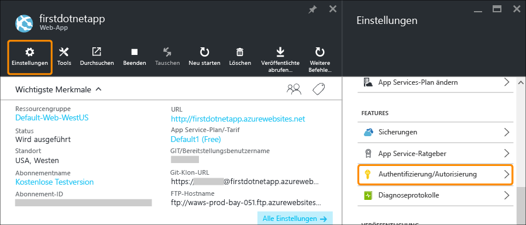
    
2. Klicken Sie auf **Ein**, um die Authentifizierung zu aktivieren.
    
4. Klicken Sie unter **Authentifizierungsanbieter** auf **Azure Active Directory**. 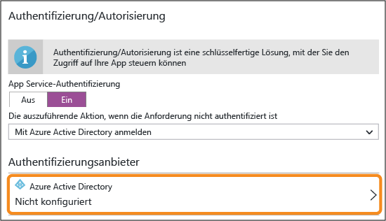

5. Klicken Sie auf dem Blatt **Azure Active Directory-Einstellungen** auf **Express** und dann auf **OK**. Bei Verwendung der Standardeinstellungen wird eine neue Azure AD-Anwendung in Ihrem Standardverzeichnis erstellt. 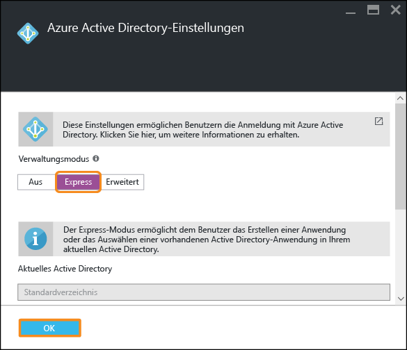

6. Klicken Sie auf **Speichern**. 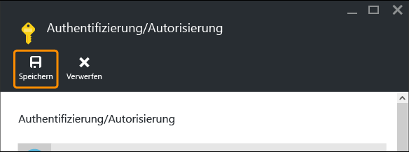

    Nach einer erfolgreichen Änderung sehen Sie, dass die Benachrichtigungsglocke grün und zusätzlich eine benutzerfreundliche Nachricht angezeigt wird.

7. Klicken Sie auf dem Portalblatt Ihrer App auf den Link **URL** (oder auf der Menüleiste auf **Durchsuchen**). Der Link ist eine HTTP-Adresse.  Aber sobald die App auf einer neuen Registerkarte geöffnet wird, führt das Feld „URL“ mehrere Umleitungen durch, bis Ihre App schließlich über eine HTTPS-Adresse verfügt. Sie sehen, dass Sie bereits beim Azure-Abonnement angemeldet sind, und Sie werden automatisch in der App authentifiziert. 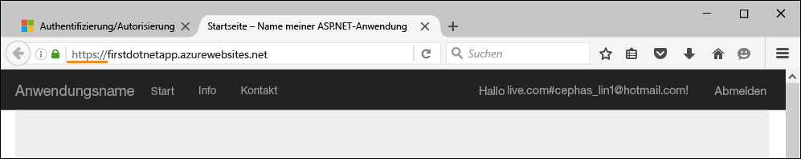 Wenn Sie nun eine nicht authentifizierte Sitzung in einem anderen Browser öffnen, wird ein Anmeldebildschirm angezeigt, sobald Sie zur gleichen URL navigieren.
    <!--   -->
    Falls Sie Azure Active Directory noch nie verwendet haben, enthält Ihr Standardverzeichnis ggf. keine Azure AD-Benutzer. In diesem Fall ist das einzige darin enthaltene Konto wahrscheinlich das Microsoft-Konto mit Ihrem Azure-Abonnement. Dies ist der Grund dafür, warum Sie in demselben Browser zuvor automatisch an der App angemeldet wurden. Sie können dasselbe Microsoft-Konto verwenden, um sich auf dieser Anmeldeseite anzumelden.

Herzlichen Glückwunsch! Der gesamte eingehende Datenverkehr wird nun für Ihre Web-App authentifiziert.

Auf dem Blatt **Authentifizierung/Autorisierung** stehen noch weitere Optionen zur Verfügung, beispielsweise:

- Aktivieren der Anmeldung für soziale Netzwerke
- Aktivieren mehrerer Anmeldeoptionen
- Ändern des Standardverhaltens, wenn Personen zum ersten Mal zu Ihrer App navigieren

App Service umfasst eine fertige Lösung für einige häufige Authentifizierungsanforderungen, sodass Sie die Authentifizierungslogik nicht selbst bereitstellen müssen. Weitere Informationen finden Sie unter [App Service-Authentifizierung/Autorisierung](https://azure.microsoft.com/blog/announcing-app-service-authentication-authorization/).

## Automatisches Skalieren der App nach Bedarf

Als Nächstes widmen wir uns der automatischen Skalierung Ihrer App, damit ihre Kapazität automatisch an den Bedarf der Benutzer angepasst wird. Weitere Informationen finden Sie unter [Automatisches Skalieren der App nach Bedarf](web-sites-scale.md) und [Manuelles oder automatisches Skalieren der Instanzenzahl](../azure-portal/insights-how-to-scale.md).

Kurz gesagt können Sie Ihre Web-App auf zwei Arten skalieren:

- [Zentrales Hochskalieren](https://en.wikipedia.org/wiki/Scalability#Horizontal_and_vertical_scaling): Bei dieser Methode erhalten Sie mehr CPUs, mehr Arbeitsspeicher und mehr Speicherplatz sowie zusätzliche Features wie dedizierte virtuelle Computer, benutzerdefinierte Domänen und Zertifikate, Stagingslots, automatische Skalierung und mehr. Zum zentralen Hochskalieren muss der Tarif des App Service-Plans geändert werden, zu dem die App gehört.
- [Horizontales Hochskalieren](https://en.wikipedia.org/wiki/Scalability#Horizontal_and_vertical_scaling): Bei dieser Methode wird die Anzahl von VM-Instanzen erhöht, die Ihre App ausführen. Die Instanzenanzahl kann je nach Tarif auf bis zu 50 erhöht werden.

Kümmern wir uns nun also um die Einrichtung der automatischen Skalierung.

1. Zuerst skalieren wir zentral hoch, um die automatische Skalierung zu ermöglichen. Klicken Sie auf dem Portalblatt Ihrer App auf **Einstellungen** > **Zentral hochskalieren (App Service-Plan)**. 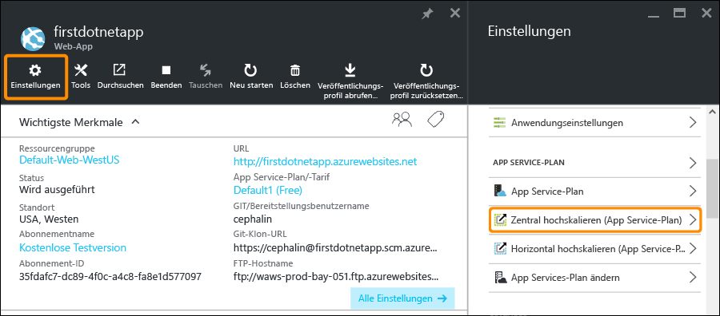

2. Führen Sie einen Bildlauf durch, und wählen Sie den Tarif **S1 Standard** aus. Ab diesem Tarif wird die automatische Skalierung unterstützt (im Screenshot eingekreist). Klicken Sie anschließend auf **Auswählen**. 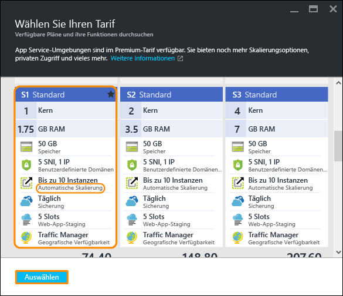

    Sie sind mit dem zentralen Hochskalieren jetzt fertig.
    
    >[AZURE.IMPORTANT] Mit diesem Tarif wird Ihr Guthaben für eine kostenlose Testversion aufgebraucht. Falls Sie über ein Konto mit nutzungsbasierter Bezahlung verfügen, fallen Kosten für Ihr Konto an.
    
3. Als Nächstes konfigurieren wir die automatische Skalierung. Klicken Sie auf dem Portalblatt Ihrer App auf **Einstellungen** > **Horizontal hochskalieren (App Service-Plan)**. 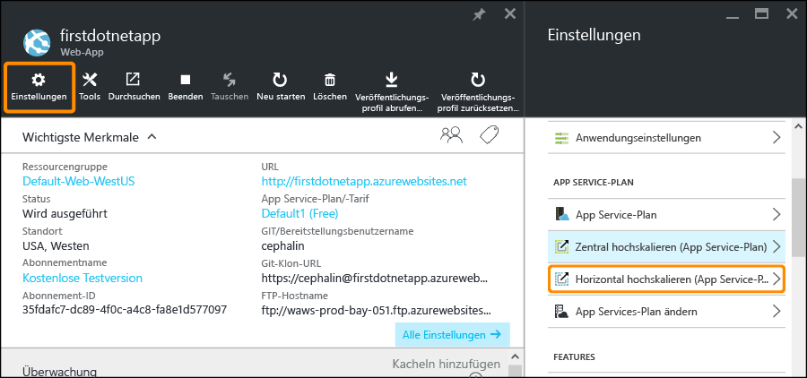

4. Ändern Sie **Skalieren nach** in **CPU-Prozentsatz**. Die Schieberegler unterhalb der Dropdownliste werden entsprechend aktualisiert. Legen Sie für den Bereich **Instanzen** anschließend einen Wert zwischen **1** und **2** und für den **Zielbereich** einen Wert zwischen **40** und **80** fest. Geben Sie hierzu entweder Werte in die Felder ein, oder verwenden Sie die Schieberegler. 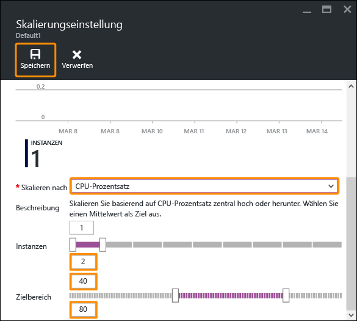
    
    Basierend auf dieser Konfiguration wird Ihre App automatisch horizontal hochskaliert, wenn die CPU-Auslastung über 80 Prozent liegt, und horizontal herunterskaliert, wenn die CPU-Auslastung unter 40 Prozent liegt.
    
5. Klicken Sie auf der Menüleiste auf **Speichern**.

Herzlichen Glückwunsch! Die automatische Skalierung wird für Ihre App durchgeführt.

Auf dem Blatt **Skalierungseinstellungen** stehen noch weitere Optionen zur Verfügung, beispielsweise:

- Manuelles Skalieren auf eine bestimmte Anzahl von Instanzen
- Skalieren nach anderen Leistungsmetriken, z.B. Arbeitsspeicherprozentsatz oder Warteschlange des Datenträgers
- Anpassen des Skalierungsverhaltens bei Auslösung einer Leistungsregel
- Automatisches Skalieren nach einem Zeitplan
- Festlegen der automatischen Skalierung für ein zukünftiges Ereignis

Weitere Informationen zum zentralen Hochskalieren der App finden Sie unter [Automatisches Skalieren der App nach Bedarf](../app-service-web/web-sites-scale.md). Weitere Informationen zum horizontalen Hochskalieren finden Sie unter [Manuelles oder automatisches Skalieren der Instanzenzahl](../azure-portal/insights-how-to-scale.md).

## Empfangen von Warnungen für die App

Nachdem für die App jetzt die automatische Skalierung durchgeführt wird, stellt sich folgende Frage: Was passiert, wenn die maximale Instanzanzahl (2) erreicht ist und die CPU-Auslastung über dem gewünschten Wert (80%) liegt? Sie können eine Warnung einrichten (siehe [Empfangen von Warnungsbenachrichtigungen](../azure-portal/insights-receive-alert-notifications.md)), mit der Sie über diese Situation informiert werden, damit Sie beispielsweise das zentrale/horizontale Hochskalieren für die App erweitern können. Wir richten jetzt schnell eine entsprechende Warnung für dieses Szenario ein.

1. Klicken Sie auf dem Portalblatt Ihrer App auf **Extras** > **Warnungen**. 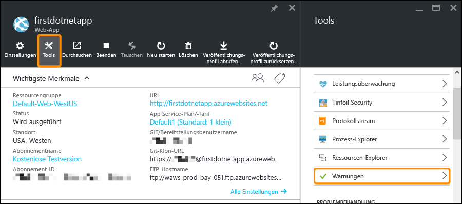

2. Klicken Sie auf **Warnung hinzufügen**. Wählen Sie im Feld **Ressource** die Ressource aus, die auf **(serverfarms)** endet. Dies ist Ihr App Service-Plan. 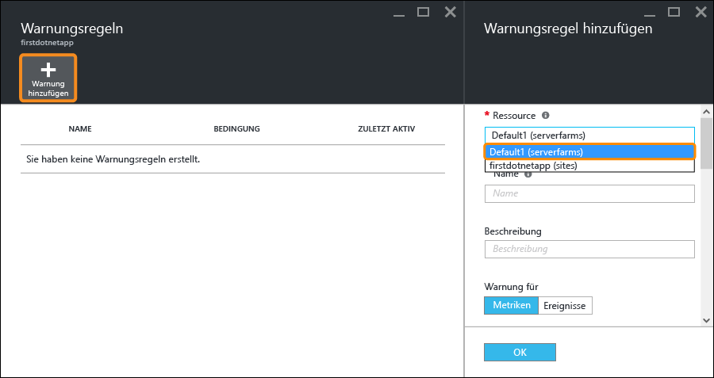

3. Geben Sie unter **Name** die Zeichenfolge `CPU Maxed`, unter **Metrik** die Option **CPU-Prozentsatz** und unter **Schwellenwert** den Wert `90` an. Aktivieren Sie anschließend das Kontrollkästchen **E-Mail-Besitzer, Mitwirkende und Leser**, und klicken Sie auf **OK**. 
    
    Wenn Azure die Erstellung der Warnung abgeschlossen hat, wird sie auf dem Blatt **Warnungen** angezeigt. 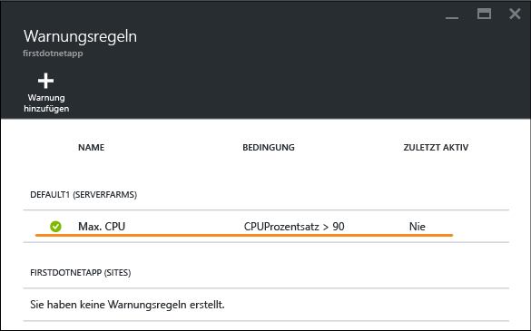

Herzlichen Glückwunsch! Sie erhalten nun Warnungen.

Mit dieser Warnungseinstellung wird die CPU-Auslastung alle fünf Minuten überprüft. Wenn die Anzahl 90 % überschreitet, erhalten Sie und alle anderen autorisierten Personen eine E-Mail als Warnung. Um alle Personen anzuzeigen, die zum Empfang der Warnungen autorisiert sind, wechseln Sie zurück zum Portalblatt Ihrer App, und klicken Sie auf die Schaltfläche **Zugang**. 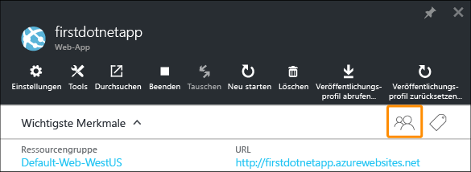

Wie Sie sehen, sind **Abonnement-Administratoren** bereits als **Besitzer** der App angegeben. Zu dieser Gruppe zählen auch Sie, wenn Sie der Kontoadministrator Ihres Azure-Abonnements (z.B. des Testabonnements) sind. Weitere Informationen zur rollenbasierten Azure-Zugriffssteuerung finden Sie unter [Verwenden von Rollenzuweisungen zum Verwalten Ihrer Azure Active Directory-Ressourcen](../active-directory/role-based-access-control-configure.md).

> [AZURE.NOTE] Warnungsregeln sind ein Feature von Azure. Weitere Informationen finden Sie unter [Empfangen von Warnbenachrichtigungen](../azure-portal/insights-receive-alert-notifications.md).

## Nächste Schritte

Beim Konfigurieren der Warnung ist Ihnen unter Umständen aufgefallen, dass auf dem Blatt **Extras** zahlreiche Tools zur Verfügung stehen. Mit diesen Tools können Sie Probleme behandeln, die Leistung überwachen, Tests auf Sicherheitsrisiken durchführen, Ressourcen verwalten, mit der VM-Konsole interagieren und nützliche Erweiterungen hinzufügen. Wir laden Sie ein, auf diese einzelnen Tools zu klicken, um die einfachen und gleichzeitig leistungsstarken Tools zu entdecken, die Ihnen zur Verfügung stehen.

Sie können sich darüber informieren, welche anderen Möglichkeiten Sie mit der bereitgestellten App haben. Im Anschluss folgen einige Beispiele:

- [Kaufen und Konfigurieren eines benutzerdefinierten Domänennamens](custom-dns-web-site-buydomains-web-app.md): Erwerben Sie für Ihre Web-App eine attraktive Domäne (anstelle von „*.azurewebsites.net“). Alternativ können Sie natürlich auch eine Domäne verwenden, die Ihnen bereits gehört.
- [Einrichten von Stagingumgebungen](web-sites-staged-publishing.md): Stellen Sie Ihre App vor der Bereitstellung in einer Produktionsumgebung mit einer Staging-URL bereit. Aktualisieren Sie bedenkenlos Ihre Live-Web-App. Richten Sie eine ausgeklügelte DevOps-Lösung mit mehreren Bereitstellungsslots ein.
- [Einrichten der fortlaufenden Bereitstellung](app-service-continuous-deployment.md): Integrieren Sie die App-Bereitstellung in Ihr Quellcodeverwaltungssystem. Führen Sie bei jedem Commit eine Bereitstellung für Azure durch.
- [Zugreifen auf lokale Ressourcen](web-sites-hybrid-connection-get-started.md): Greifen Sie auf eine bereits vorhandene lokale Datenbank oder auf ein bereits vorhandenes CRM-System zu.
- [Sichern der App](web-sites-backup.md): Richten Sie Sicherung und Wiederherstellung für Ihre Web-App ein. Sorgen Sie für unerwartete Ausfälle und für deren Behebung vor.
- [Aktivieren von Diagnoseprotokollen](web-sites-enable-diagnostic-log.md): Lesen Sie die IIS-Protokolle von Azure oder aus der Anwendungsablaufverfolgung. Lesen Sie sie in einem Datenstrom, laden Sie sie herunter, oder portieren Sie sie zur direkten Analyse in [Application Insights](../application-insights/app-insights-overview.md).
- [Überprüfen der App auf Schwachstellen](https://azure.microsoft.com/blog/web-vulnerability-scanning-for-azure-app-service-powered-by-tinfoil-security/): Überprüfen Sie Ihre Web-App mithilfe der Dienste von [Tinfoil Security](https://www.tinfoilsecurity.com/) auf moderne Bedrohungen.
- [Ausführen von Hintergrundaufträgen](../azure-functions/functions-overview.md): Führen Sie Aufträge für Datenverarbeitung, Berichterstellung usw. aus.
- [Informationen zur Funktionsweise von App Service](../app-service/app-service-how-works-readme.md)

<!---HONumber=AcomDC_0803_2016-->