# <a name="create-your-first-aspnet-web-app-in-azure-in-five-minutes"></a>Erstellen Ihrer ersten ASP.NET-Web-App in Azure in fünf Minuten

[!INCLUDE [app-service-web-selector-get-started](../../includes/app-service-web-selector-get-started.md)] 

Dieser Schnellstart hilft Ihnen bei der Bereitstellung Ihrer ersten ASP.NET-Web-App in [Azure App Service](../app-service/app-service-value-prop-what-is.md) in nur wenigen Minuten. Am Ende des Tutorials verfügen Sie über eine einfache Web-App, die in der Cloud ausgeführt wird.

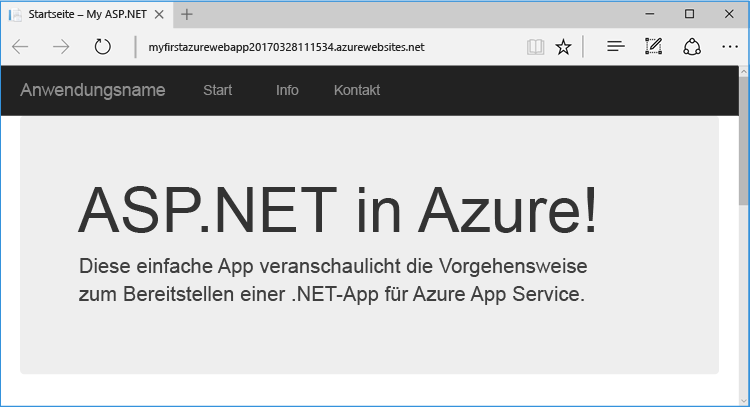

## <a name="prerequisites"></a>Voraussetzungen

Dieses Tutorial veranschaulicht, wie Sie mithilfe von Visual Studio 2017 eine ASP.NET-Web-App erstellen und für Azure bereitstellen. Falls Sie Visual Studio 2017 noch nicht installiert haben, können Sie die **kostenlose** [Visual Studio 2017 Community-Edition](https://www.visualstudio.com/downloads/) herunterladen und verwenden. Aktivieren Sie beim Setup von Visual Studio die Option **Azure-Entwicklung**.

[!INCLUDE [quickstarts-free-trial-note](../../includes/quickstarts-free-trial-note.md)]

## <a name="create-an-aspnet-web-app"></a>Erstellen einer ASP.NET-Web-App

Erstellen Sie in Visual Studio durch Drücken von `Ctrl`+`Shift`+`N` ein Projekt.

Klicken Sie im Dialogfeld **Neues Projekt** auf **Visual C# > Web > ASP.NET-Webanwendung (.NET Framework)**.

Nennen Sie die Anwendung **myFirstAzureWebApp**, und klicken Sie anschließend auf **OK**.
   
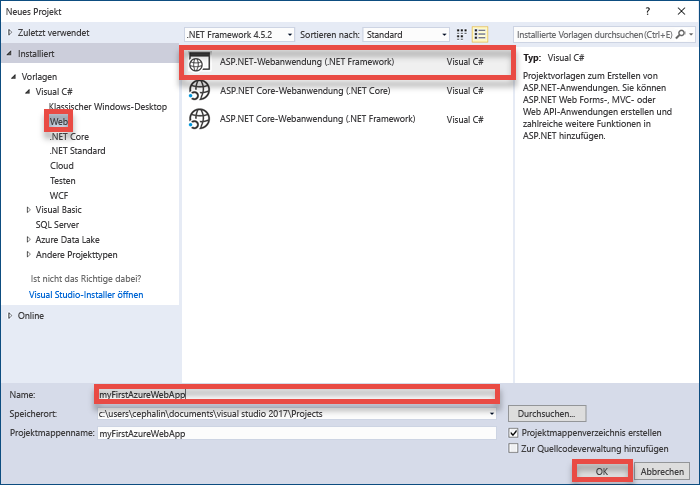

Sie können jede Art von ASP.NET Web-App für Azure bereitstellen. Wählen Sie in diesem Tutorial die Vorlage **MVC** aus, und vergewissern Sie sich, dass die Authentifizierung auf **Keine Authentifizierung** festgelegt ist.
      
Klicken Sie auf **OK**.

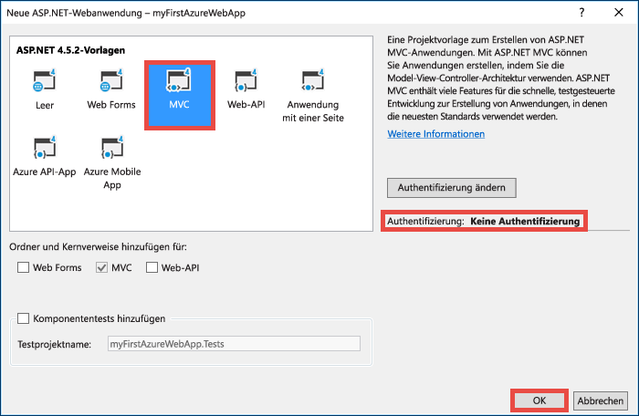

## <a name="publish-to-azure"></a>Veröffentlichen in Azure

Klicken Sie im **Projektmappen-Explorer** mit der rechten Maustaste auf das Projekt **myFirstAzureWebApp**, und wählen Sie **Veröffentlichen** aus.

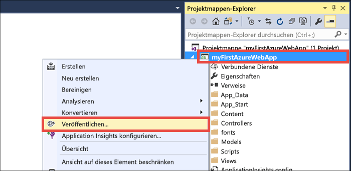

Vergewissern Sie sich, dass **Microsoft Azure App Service** ausgewählt ist, und klicken Sie auf **Veröffentlichen**.

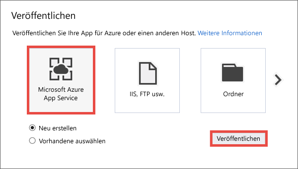

Daraufhin öffnet sich das Dialogfeld **App Service erstellen**, das Sie beim Erstellen sämtlicher Azure-Ressourcen unterstützt, die benötigt werden, um Ihre ASP.NET Web-App in Azure auszuführen.

## <a name="sign-in-to-azure"></a>Anmelden bei Azure

Klicken Sie im Dialogfeld **App Service erstellen** auf **Konto hinzufügen**, und melden Sie sich bei Ihrem Azure-Abonnement an. Falls Sie bereits bei einem Microsoft-Konto angemeldet sind, vergewissern Sie sich, dass dieses Konto Ihr Azure-Abonnement enthält. Wenn das Microsoft-Konto, bei dem Sie angemeldet sind, nicht Ihr Azure-Abonnement enthält, klicken Sie darauf, um das korrekte Konto hinzuzufügen.
   
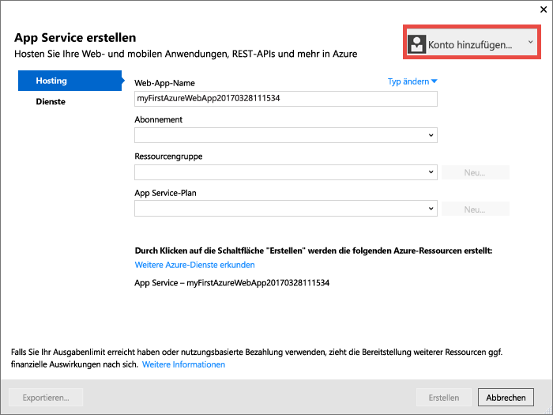

Nach der Anmeldung können Sie in diesem Dialogfeld sämtliche Ressourcen erstellen, die Sie für Ihre Azure-Web-App benötigen.

## <a name="create-a-resource-group"></a>Erstellen einer Ressourcengruppe

Als erstes benötigen Sie eine _Ressourcengruppe_. 

> [!NOTE] 
> Eine Ressourcengruppe ist ein logischer Container, in dem Azure-Ressourcen wie Web-Apps, Datenbanken und Speicherkonten bereitgestellt und verwaltet werden.
>
>

Klicken Sie neben **Ressourcengruppe** auf **Neu**.

Nennen Sie Ihre Ressourcengruppe **myResourceGroup**, und klicken Sie anschließend auf **OK**.

## <a name="create-an-app-service-plan"></a>Wie erstelle ich einen Plan?

[!INCLUDE [app-service-plan](../../includes/app-service-plan.md)]

Klicken Sie neben **App Service-Plan** auf **Neu**. 

Konfigurieren Sie den neuen App Service-Plan im Dialogfeld **App Service-Plan konfigurieren** mit den folgenden Einstellungen:

- **App Service-Plan**: Geben Sie **myAppServicePlan** ein. 
- **Standort**: Wählen Sie **Europa, Westen** oder eine Region in Ihrer Nähe aus.
- **Größe**: Wählen Sie **Free** oder einen anderen [Tarif](https://azure.microsoft.com/pricing/details/app-service/) aus.

Klicken Sie auf **OK**.

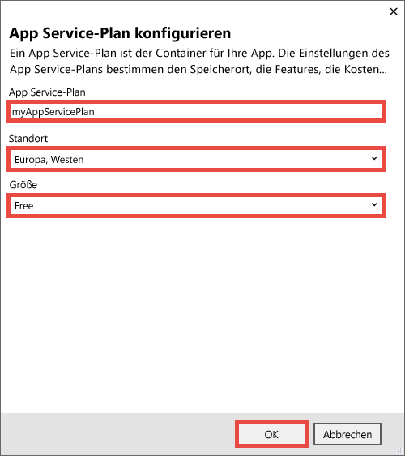

## <a name="create-and-publish-the-web-app"></a>Erstellen und Veröffentlichen der Web-App

Nun muss die Web-App nur noch benannt werden. Geben Sie unter **Web-App-Name** einen eindeutigen Web-App-Namen ein. Da dieser Name als Teil des DNS-Standardnamens für Ihre App (`<app_name>.azurewebsites.net`) verwendet wird, muss er für alle Apps in Azure eindeutig sein. Sie können Ihrer App später einen benutzerdefinierten Domänennamen zuordnen, bevor Sie sie für Ihre Benutzer verfügbar machen.

Sie können auch den automatisch generierten Namen übernehmen. Dieser ist bereits eindeutig.

Klicken Sie auf **Erstellen**, um mit der Erstellung der Azure-Ressourcen zu beginnen.

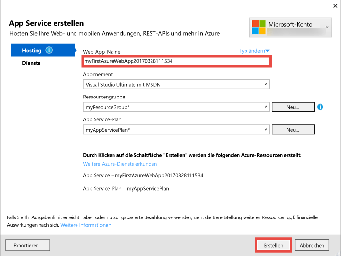

Nachdem der Assistent die Azure-Ressourcen erstellt hat, veröffentlicht er Ihre ASP.NET-Web-App erstmals für Azure und startet die veröffentlichte Azure-Web-App anschließend in Ihrem Standardbrowser.

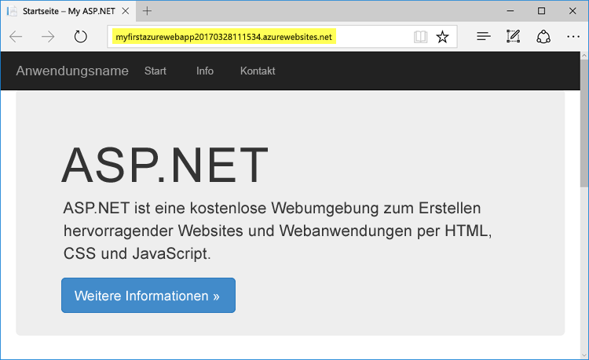

In der URL wird der von Ihnen angegebene Web-App-Name im Format `http://<app_name>.azurewebsites.net` verwendet. 

Herzlichen Glückwunsch, Ihre erste ASP.NET-Web-App wird live in Azure App Service ausgeführt.

## <a name="update-the-app-and-redeploy"></a>Aktualisieren der App und erneutes Bereitstellen

Die Aktualisierung und erneute Bereitstellung in Azure ist ganz einfach. Zur Veranschaulichung führen wir eine Aktualisierung der Startseite durch.

Öffnen Sie im **Projektmappen-Explorer** Folgendes: **Views\Home\Index.cshtml**.

Suchen Sie im oberen Bereich nach dem HTML-Tag `<div class="jumbotron">`, und ersetzen Sie das gesamte Tag durch folgenden Code:

```HTML
<div class="jumbotron">
    <h1>ASP.NET in Azure!</h1>
    <p class="lead">This is a simple app that we’ve built that demonstrates how to deploy a .NET app to Azure App Service.</p>
</div>
```

Klicken Sie zur erneuten Bereitstellung für Azure im **Projektmappen-Explorer** mit der rechten Maustaste auf das Projekt **myFirstAzureWebApp**, und wählen Sie **Veröffentlichen** aus.

Klicken Sie auf der Veröffentlichungsseite auf **Veröffentlichen**.

Nach Abschluss des Vorgangs startet Visual Studio die aktualisierte Azure-Web-App in Ihrem Browser.


## <a name="manage-your-new-azure-web-app"></a>Verwalten Ihrer neuen Azure-Web-App

Sehen Sie sich die soeben erstellte Web-App im Azure-Portal an. 

Melden Sie sich hierzu bei [https://portal.azure.com](https://portal.azure.com) an.

Klicken Sie im linken Menü auf **App Services** und anschließend auf den Namen Ihrer Azure-Web-App.

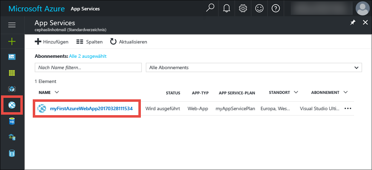

Dadurch gelangen Sie auf das _Blatt_ Ihrer Web-App (eine Portalseite, die horizontal geöffnet wird). 

Auf dem Blatt Ihrer Web-App wird standardmäßig die Seite **Übersicht** angezeigt. Diese Seite bietet einen Überblick über den Status Ihrer App. Hier können Sie auch einfache Verwaltungsaufgaben wie Durchsuchen, Beenden, Neustarten und Löschen durchführen.  

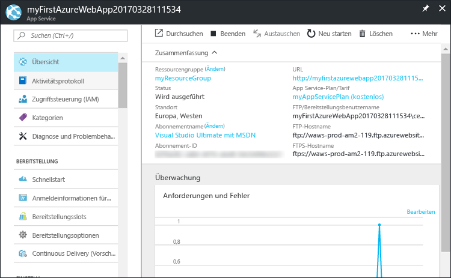

Die Registerkarten auf der linken Seite des Blatts zeigen die verschiedenen Konfigurationsseiten, die Sie öffnen können. Ein paar Beispiele:

- Zuordnen eines benutzerdefinierten DNS-Namens
- Binden eines benutzerdefinierten SSL-Zertifikats
- Konfigurieren von Continuous Deployment
- Zentrales und horizontales Hochskalieren
- Hinzufügen einer Benutzerauthentifizierung

## <a name="clean-up-resources"></a>Bereinigen von Ressourcen

Zum Löschen Ihrer ersten Azure-Web-App können Sie auf der Seite **Übersicht** auf **Löschen** klicken. Es gibt jedoch noch eine bessere Möglichkeit, um alles zu löschen, was Sie im Rahmen dieses Schnellstarttutorials erstellt haben. Klicken Sie auf der Web-App-Seite **Übersicht** auf die Ressourcengruppe, um das entsprechende Blatt zu öffnen. 


Auf dem Ressourcengruppenblatt finden Sie sowohl den App Service-Plan als auch die App Service-App, die Visual Studio für Sie erstellt hat. 

Klicken Sie im oberen Bereich des Blatts auf **Löschen**. 

<!---->

Geben Sie zur Bestätigung auf dem Bestätigungsblatt den Namen der Ressourcengruppe **myResourceGroup** in das Textfeld ein, und klicken Sie auf **Löschen**.

## <a name="next-steps"></a>Nächste Schritte

> [!div class="nextstepaction"]
> [Erfahren Sie, wie Sie eine ASP.NET-App in Azure mit SQL-Datenbank erstellen.](app-service-web-tutorial-dotnet-sqldatabase.md)

> [!div class="nextstepaction"]
> [Machen Sie sich mit PowerShell-Skripts für Beispiel-Web-Apps vertraut.](app-service-powershell-samples.md)

