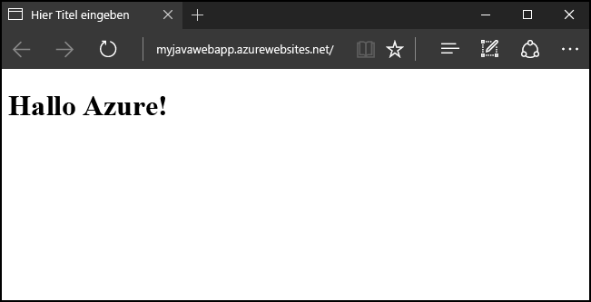
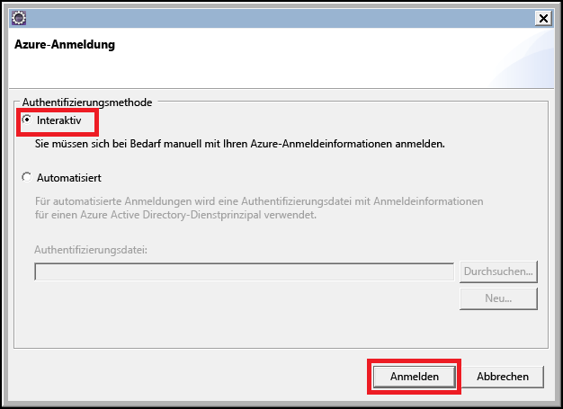
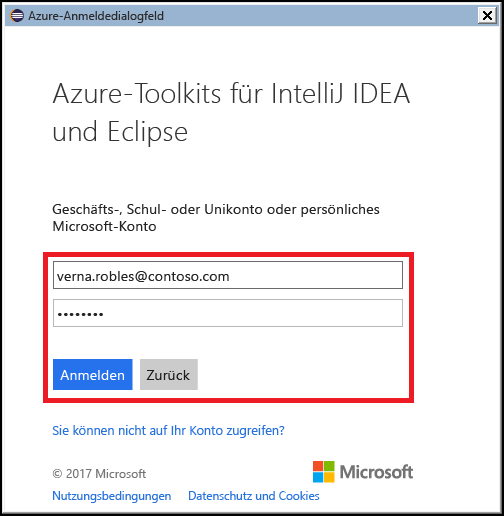
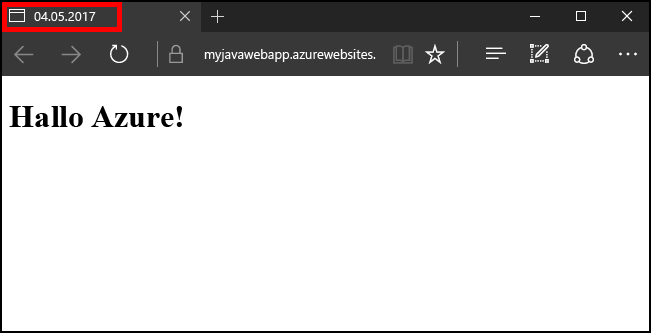

# <a name="create-your-first-java-web-app-in-azure-in-five-minutes"></a>Erstellen Ihrer ersten Java-Web-App in Azure in fünf Minuten

[!INCLUDE [app-service-web-selector-get-started](../../includes/app-service-web-selector-get-started.md)] 

Dieser Schnellstart hilft Ihnen bei der Bereitstellung Ihrer ersten Java-Web-App in [Azure App Service](../app-service/app-service-value-prop-what-is.md) in nur wenigen Minuten. Wenn Sie das Tutorial durchgearbeitet haben, verfügen Sie über eine einfache Java-basierte Web-App, die in der Cloud ausgeführt wird.



## <a name="before-you-begin"></a>Voraussetzungen

In diesem Tutorial wird veranschaulicht, wie Sie die Eclipse-IDE für Java EE-Entwickler verwenden, um eine Java-Web-App zu erstellen und in Azure bereitzustellen. Wenn Sie Eclipse noch nicht installiert haben, können Sie die Anwendung kostenlos von „http://www.eclipse.org/“ herunterladen.

In den Schritten dieses Tutorials wird das [Azure-Toolkit für Eclipse](/azure/azure-toolkit-for-eclipse) verwendet, um den Veröffentlichungsprozess für Java-Web-Apps in Azure zu vereinfachen. Eine Anleitung zum Installieren des Toolkits finden Sie unter [Installieren des Azure-Toolkits für Eclipse](/azure/azure-toolkit-for-eclipse-installation).

> [!NOTE]
>
> Sie können auch [IntelliJ IDEA](https://www.jetbrains.com/idea/) von JetBrains verwenden, um die Schritte in diesem Tutorial auszuführen. Einige Schritte weichen für diese Entwicklungsumgebung unter Umständen etwas ab, aber es ist auch ein [Azure-Toolkit für IntelliJ](/azure/azure-toolkit-for-intellij) verfügbar, das Sie zum Vereinfachen des Veröffentlichungsprozesses für diese IDE verwenden können.
>

Außerdem benötigen Sie ein Azure-Abonnement, um die Schritte in diesem Tutorial auszuführen. Wenn Sie noch kein Azure-Abonnement besitzen, können Sie Ihre [MSDN-Abonnentenvorteile](https://azure.microsoft.com/pricing/member-offers/msdn-benefits-details/) aktivieren oder sich für ein [kostenloses Azure-Konto](https://azure.microsoft.com/pricing/free-trial/) registrieren.

## <a name="create-a-dynamic-web-project-in-eclipse"></a>Erstellen eines dynamischen Webprojekts in Eclipse

Klicken Sie in der Eclipse-IDE nacheinander auf **File** (Datei), **New** (Neu) und **Dynamic Web Project** (Dynamisches Webprojekt).


Wenn das Dialogfeld „Dynamic Web Project“ (Dynamisches Webprojekt) angezeigt wird, geben Sie der Anwendung den Namen **MyFirstJavaOnAzureWebApp**, und klicken Sie anschließend auf **Finish** (Fertig stellen).
   


> [!NOTE]
>
> Wenn Sie eine lokale Laufzeitumgebung installiert haben, z.B. [Apache Tomcat](https://tomcat.apache.org/) können Sie dies im Feld **Target runtime** (Zielruntime) angeben.
>

Fügen Sie nach der Erstellung Ihres dynamischen Webprojekts eine neue JSP-Seite hinzu, indem Sie Ihr Projekt im Projektexplorer erweitern, mit der rechten Maustaste auf den Ordner **WebContent** klicken und dann auf **New** (Neu) und **JSP File** (JSP-Datei) klicken.


Geben Sie im angezeigten Dialogfeld „New JSP File“ (Neue JSP-Datei) den Namen **index.jsp** für die Datei ein, behalten Sie den übergeordneten Ordner **MyFirstJavaOnAzureWebApp/WebContent** bei, und klicken Sie auf **Next** (Weiter).


Geben Sie auf der zweiten Seite des Dialogfelds „New JSP File“ (Neue JSP-Datei) der Datei den Namen **index.jsp**, behalten Sie den übergeordneten Ordner **MyFirstJavaOnAzureWebApp/WebContent** bei, und klicken Sie auf **Finish** (Fertig stellen).


Ersetzen Sie auf der neuen Seite, die in Eclipse geöffnet wird, den vorhandenen Abschnitt `<body></body>` durch den folgenden Code:

```jsp
<body>
<h1><% out.println("Java on Azure!"); %></h1>
</body>
```

Speichern Sie Ihre Änderungen, die Sie auf der Seite vorgenommen haben.


## <a name="publish-your-web-app-to-azure"></a>Veröffentlichen Ihrer Web-App in Azure

Für die Bereitstellung Ihrer Web-App in Azure nutzen Sie mehrere Features, die über das Azure-Toolkit für Eclipse bereitgestellt werden.

Verwenden Sie eine der folgenden Methoden, um mit dem Veröffentlichungsprozess zu beginnen:

* Klicken Sie mit der rechten Maustaste im **Projektexplorer** von Eclipse auf Ihr Projekt, und klicken Sie anschließend auf **Azure** und auf **Publish as Azure Web App** (Als Azure-Web-App veröffentlichen).

   

* Klicken Sie auf der Eclipse-Symbolleiste auf **Publish** (Veröffentlichen) und dann auf **Publish as Azure Web App** (Als Azure-Web-App veröffentlichen).

   

Wenn Sie sich noch nicht an Ihrem Azure-Konto angemeldet haben, erhalten Sie eine entsprechende Aufforderung. Führen Sie dazu die folgenden Schritte aus:

1. Sie haben zwei Möglichkeiten, um sich an Ihrem Azure-Konto anzumelden: Wählen Sie für dieses Tutorial die Option **Interactive** (Interaktiv).

   

1. Geben Sie Ihre Azure-Anmeldeinformationen ein, und klicken Sie auf **Sign in** (Anmelden).

   

1. Wählen Sie Ihre Azure-Abonnements aus, und klicken Sie dann auf **Select** (Auswählen).

   

> [!NOTE]
>
> Eine ausführliche Anleitung zu den Anmeldearten **Interactive** (Interaktiv) und **Automated** (Automatisiert) finden Sie im Artikel [Azure Sign In Instructions for the Azure Toolkit for Eclipse](https://go.microsoft.com/fwlink/?linkid=846174) (Anleitung zur Azure-Anmeldung für das Azure-Toolkit für Eclipse).
>

Nachdem Sie sich an Ihrem Azure-Konto angemeldet haben, wird das Dialogfeld **Deploy Web App** (Web-App bereitstellen) angezeigt. Es sollte keine App Services-Instanz aufgeführt sein, wenn Sie zum ersten Mal eine Web-App in Azure veröffentlichen. Wenn dies der Fall ist oder wenn Sie eine neue App Service-Instanz erstellen möchten, ist der nächste Schritt die Erstellung der neuen App Service-Instanz. Klicken Sie hierfür auf **Create** (Erstellen).


Wenn das Dialogfeld **Create App Service** (App Service erstellen) angezeigt wird, müssen Sie als Erstes die folgenden Daten angeben:

* Einen eindeutigen Namen für Ihre Web-App, der zur DNS-Adresse für Ihre Web-App wird. Beispiel: **MyJavaWebApp** wird zu *myjavawebapp.azurewebsites.net*.

* Den Webcontainer für Ihre Web-App. Beispiel: **Newest Tomcat 8.5**.

* Ihr Azure-Abonnement.

   

Wenn Sie keine vorhandenen App Service-Pläne haben oder wenn Sie einen neuen Dienstplan erstellen möchten, müssen Sie die folgenden Informationen angeben:

* Einen eindeutigen Namen für Ihren neuen Dienstplan. Dieser Name wird angezeigt, wenn Sie später Web-Apps mit dem Azure-Toolkit veröffentlichen, und er wird im [Azure-Portal](https://portal.azure.com) beim Verwalten Ihres Kontos angegeben.

* Den geografischen Standort, an dem Ihr Dienstplan erstellt wird.

* Den Tarif für Ihren Dienstplan.

   

Klicken Sie als Nächstes auf die Registerkarte **Resource group** (Ressourcengruppe). Wenn keine Ressourcengruppen vorhanden sind oder wenn Sie eine neue erstellen möchten, müssen Sie einen eindeutigen Namen für die neue Ressourcengruppe angeben. Wählen Sie andernfalls im Dropdownmenü eine vorhandene Ressourcengruppe.


Klicken Sie abschließend auf die Registerkarte **JDK**. Es sind mehrere Optionen angegeben, mit denen Entwickler JDKs (Java Developer Kits) von Drittanbietern oder benutzerdefinierte JDKs angeben können. Wählen Sie für dieses Tutorial die Option **Default** (Standard), und klicken Sie auf **Create** (Erstellen).


Das Azure-Toolkit beginnt mit der Erstellung Ihrer neuen App Service-Instanz, und während der Verarbeitung wird ein Statusdialogfeld angezeigt.


Nachdem die neue App Service-Instanz erstellt wurde, müssen Sie nur noch angeben, ob die Web-App im Stamm der neuen Website bereitgestellt werden soll. Wenn Sie beispielsweise eine App Service-Instanz unter *wingtiptoys.azurewebsites.net* verwenden und die Bereitstellung im Stamm nicht auswählen, wird Ihre Web-App mit dem Namen **MyFirstJavaOnAzureWebApp** unter *wingtiptoys.azurewebsites.net/MyFirstJavaOnAzureWebApp* bereitgestellt.


Klicken Sie nach Abschluss aller obigen Schritte auf **Deploy** (Bereitstellen), um die Web-App in Azure zu veröffentlichen.


Glückwunsch! Sie haben Ihre Web-App erfolgreich in Azure bereitgestellt! Sie können eine Vorschau der Web-App auf der Azure-Website anzeigen:


## <a name="updating-your-web-app"></a>Aktualisieren Ihrer Web-App

Nachdem Sie Ihre Web-App in Azure veröffentlicht haben, ist die Aktualisierung der Web-App ein deutlich einfacherer Prozess. In den folgenden Schritten wird beschrieben, wie Sie Änderungen für Ihre Web-App veröffentlichen.

Ändern Sie als Erstes den JSP-Beispielcode, damit der Titel durch das heutige Datum ersetzt wird:

```jsp
<%@ page
    language="java"
    contentType="text/html; charset=ISO-8859-1"
    pageEncoding="ISO-8859-1"
    import="java.text.SimpleDateFormat"
    import="java.util.Date" %>
<!DOCTYPE html PUBLIC "-//W3C//DTD HTML 4.01 Transitional//EN" "http://www.w3.org/TR/html4/loose.dtd">
<html>
<head>
<meta http-equiv="Content-Type" content="text/html; charset=ISO-8859-1">
<% SimpleDateFormat date = new SimpleDateFormat("yyyy/MM/dd"); %>
<title><% out.println(date.format(new Date())); %></title>
</head>
<body>
<h1><% out.println("Java on Azure!"); %></h1>
</body>
</html>
```


Klicken Sie nach dem Speichern der Änderungen für die Seite im **Projektexplorer** von Eclipse mit der rechten Maustaste auf Ihr Projekt, und klicken Sie dann auf **Azure** und **Publish as Azure Web App** (Als Azure-Web-App veröffentlichen).


Wenn das Dialogfeld **Deploy Web App** (Web-App bereitstellen) angezeigt wird, wird die obige App Service-Instanz aufgeführt. Zum Aktualisieren der Web-App müssen Sie lediglich Ihre App Service-Instanz markieren und auf **Deploy** (Bereitstellen) klicken, um Ihre Änderungen zu veröffentlichen.


> [!NOTE]
>
> Wenn Sie Ihre Web-App im Stamm der App Service-Instanz bereitstellen, müssen Sie die Option **Deploy to root** (Im Stamm bereitstellen) bei jedem Veröffentlichungsvorgang Ihrer Änderungen erneut aktivieren.
>

Nachdem Sie die Änderungen veröffentlicht haben, sehen Sie, dass der Seitentitel im Browser geändert wurde und das heutige Datum angezeigt wird.



## <a name="deleting-your-web-app"></a>Löschen Ihrer Web-App

Zum Löschen einer Web-App können Sie den **Azure Explorer** verwenden, der Teil des Azure-Toolkits ist. Falls die Ansicht **Azure Explorer** in Eclipse nicht bereits angezeigt wird, können Sie die folgenden Schritte ausführen:

1. Klicken Sie nacheinander auf **Window** (Fenster), **Show View** (Ansicht anzeigen) und **Other** (Andere).

   

2. Wählen Sie im angezeigten Dialogfeld **Show View** (Ansicht anzeigen) die Option **Azure Explorer**, und klicken Sie auf **OK**.

   

Zum Löschen Ihrer Web-App aus dem Azure Explorer erweitern Sie den Knoten **Web Apps** (Web-Apps), klicken mit der rechten Maustaste auf Ihre Web-App und wählen die Option **Delete** (Löschen).


Klicken Sie auf **OK**, wenn die Aufforderung zum Löschen der Web-App angezeigt wird.

## <a name="next-steps"></a>Nächste Schritte

Weitere Informationen zu den Azure-Toolkits für Java-IDEs finden Sie unter den folgenden Links:

* [Azure-Toolkit für Eclipse (dieser Artikel)](../azure-toolkit-for-eclipse.md)
  * [Neuerungen im Azure-Toolkit für Eclipse](../azure-toolkit-for-eclipse-whats-new.md)
  * [Installieren des Azure-Toolkits für Eclipse](../azure-toolkit-for-eclipse-installation.md)
  * [Sign In Instructions for the Azure Toolkit for Eclipse](https://go.microsoft.com/fwlink/?linkid=846174) (Anleitung zur Azure-Anmeldung für das Azure-Toolkit für Eclipse)
* [Azure Toolkit für IntelliJ](../azure-toolkit-for-intellij.md)
  * [Neuerungen im Azure-Toolkit für IntelliJ](../azure-toolkit-for-intellij-whats-new.md)
  * [Installieren des Azure Toolkit für IntelliJ](../azure-toolkit-for-intellij-installation.md)
  * [Azure Sign In Instructions for the Azure Toolkit for IntelliJ](https://go.microsoft.com/fwlink/?linkid=846179) (Anleitung zur Azure-Anmeldung für das Azure-Toolkit für IntelliJ)

Weitere Informationen zum Verwenden von Azure mit Java finden Sie im [Azure Java Developer Center](https://azure.microsoft.com/develop/java/) und in den [Java-Tools für Visual Studio Team Services](https://java.visualstudio.com/).

