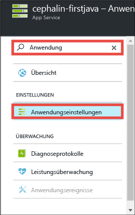
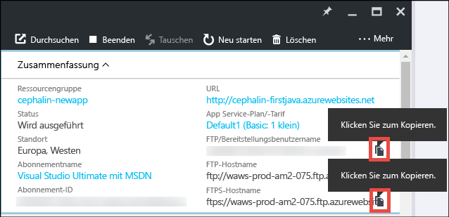
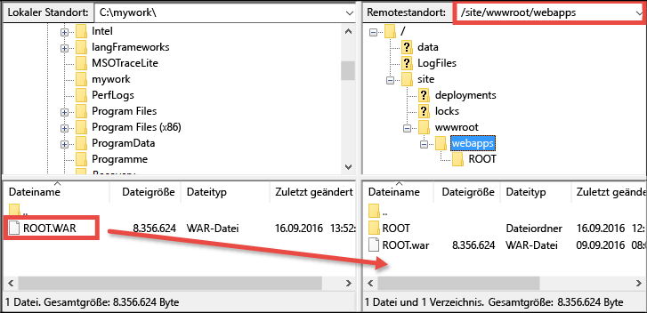

# Bereitstellen Ihrer ersten Java-Web-App für Azure in fünf Minuten
In diesem Tutorial erfahren Sie, wie Sie eine einfache Java-Web-App für [Azure App Service](../app-service/app-service-value-prop-what-is.md) bereitstellen. Mit App Service können Sie Web-Apps, [Mobile App-Back-Ends](/documentation/learning-paths/appservice-mobileapps/) und [API-Apps](../app-service-api/app-service-api-apps-why-best-platform.md) erstellen.

In diesem Tutorial führen Sie folgende Schritte aus:

* Erstellen einer Web-App in Azure App Service
* Bereitstellen einer Java-Beispiel-App
* Anzeigen des live in der Produktion ausgeführten Codes

## Voraussetzungen
* FTP-/FTPS-Client wie etwa [FileZilla](https://filezilla-project.org/) installieren
* Microsoft Azure-Konto erstellen. Falls Sie noch kein Konto haben, können Sie sich [für eine kostenlose Testversion registrieren](/pricing/free-trial/?WT.mc_id=A261C142F) oder [Ihre Visual Studio-Abonnentenvorteile aktivieren](/pricing/member-offers/msdn-benefits-details/?WT.mc_id=A261C142F).

> [!NOTE]
> Zum [Testen von App Service](http://go.microsoft.com/fwlink/?LinkId=523751) benötigen Sie kein Azure-Konto. Sie können eine Starter-App erstellen und bis zu einer Stunde damit experimentieren – ohne Kreditkarte und ohne jegliche Verpflichtungen.
> 
> 

## Erstellen einer Web-App
1. Melden Sie sich mit Ihrem Azure-Konto beim [Azure-Portal](https://portal.azure.com) an.
2. Klicken Sie im linken Menü auf **Neu** > **Web und mobil** > **Web-App**.
   
    
3. Legen Sie auf dem Blatt für die App-Erstellung die folgenden Einstellungen für die neue App fest:
   
   * **App-Name**: Geben Sie einen eindeutigen Namen ein.
   * **Ressourcengruppe**: Wählen Sie **Neu erstellen** aus, und geben Sie einen Namen für die Ressourcengruppe ein.
   * **App Service-Plan/Standort**: Klicken Sie auf diese Option, um sie zu konfigurieren. Klicken Sie anschließend auf **Neu erstellen**, um den Namen, Standort und Tarif des App Service-Plans festzulegen. Sie können auch den Tarif **Free** verwenden.
     
     Wenn Sie fertig sind, sollte das Blatt für die App-Erstellung wie folgt aussehen:
     
     
4. Klicken Sie unten auf dem Blatt auf **Erstellen**. Sie können oben auf das Symbol **Benachrichtigung** klicken, um den Status anzuzeigen.
   
    
5. Nach Abschluss der Bereitstellung sollte die folgende Benachrichtigungsmeldung angezeigt werden. Klicken Sie auf die Meldung, um das Blatt Ihrer Bereitstellung zu öffnen.
   
    
6. Klicken Sie auf dem Blatt **Bereitstellung erfolgreich** auf den Link **Ressource**, um das Blatt Ihrer neuen Web-App zu öffnen.
   
    

## Bereitstellen einer Java-App für Ihre Web-App
Wir stellen nun mithilfe von FTPS eine Java-App in Azure bereit.

1. Klicken Sie auf dem Blatt der Web-App auf **Anwendungseinstellungen** (scrollen Sie dazu nach unten, oder suchen Sie nach der Option).
   
    
2. Wählen Sie unter **Java-Version** die Version **Java 8** aus, und klicken Sie auf **Speichern**.
   
    
   
    Wenn die Benachrichtigung **Die Web-App-Einstellungen wurden erfolgreich aktualisiert.** angezeigt wird, navigieren Sie zu „http://*&lt;appname>*.azurewebsites.net“, um das JSP-Standardservlet in Aktion zu sehen.
3. Klicken Sie auf dem Blatt der Web-App auf **Anmeldeinformationen für die Bereitstellung** (scrollen Sie dazu nach unten, oder suchen Sie nach der Option).
4. Legen Sie Ihre Anmeldeinformationen für die Bereitstellung fest, und klicken Sie auf **Speichern**.
5. Klicken Sie auf dem Blatt der Web-App auf **Übersicht**. Klicken Sie neben **FTP/Bereitstellungsbenutzername** und **FTPS-Hostname** auf die Schaltfläche **Kopieren**, um diese Werte zu kopieren.
   
    
   
    Jetzt können Sie Ihre Java-App mit FTPS bereitstellen.
6. Melden Sie sich in Ihrem FTP-/FTPS-Client bei dem FTP-Server der Azure-Web-App an. Verwenden Sie dazu die im vorherigen Schritt kopierten Werte. Verwenden Sie das Bereitstellungskennwort, das Sie zuvor erstellt haben.
   
    Auf dem folgenden Screenshot ist die Anmeldung mit FileZilla dargestellt:
   
    
   
    Für das nicht erkannte SSL-Zertifikat von Azure werden unter Umständen Sicherheitswarnungen angezeigt. Setzen Sie den Vorgang fort.
7. Klicken Sie auf [diesen Link](https://github.com/Azure-Samples/app-service-web-java-get-started/raw/master/webapps/ROOT.war), um die WAR-Datei auf den lokalen Computer herunterzuladen.
8. Navigieren Sie im FTP-/FTPS-Client auf der Remotesite zu **/site/wwwroot/webapps**, und ziehen Sie die heruntergeladene WAR-Datei in das Remoteverzeichnis auf Ihrem lokalen Computer.
   
    
   
    Klicken Sie auf **OK**, um die Datei in Azure zu überschreiben.
   
   > [!NOTE]
   > Gemäß dem Standardverhalten von Tomcat gibt der Dateiname **ROOT.war** unter „/site/wwwroot/webapps“ die Stamm-Web-App (http://*&lt;appname>*.azurewebsites.net) und der Dateiname ***&lt;anyname>*.war** eine benannte Web-App (http://*&lt;appname>*.azurewebsites.net/*&lt;anyname>*) an.
   > 
   > 

Das ist alles! Ihre Java-App wird jetzt live in Azure ausgeführt. Navigieren Sie im Browser zu „http://*&lt;appname>*.azurewebsites.net“, um ihn in Aktion zu sehen.

## Durchführen von Updates für die App
Wenn Sie eine Aktualisierung vornehmen müssen, laden Sie die neue WAR-Datei einfach mit dem FTP-/FTPS-Client in dasselbe Remoteverzeichnis hoch.

## Nächste Schritte
[Erstellen einer Java-Web-App aus einer Vorlage im Azure Marketplace](web-sites-java-get-started.md#marketplace) Sie können einen eigenen vollständig anpassbaren Tomcat-Container und die vertraute Manager-Benutzeroberfläche erstellen.

Debuggen Sie Ihre Azure-Web-App direkt in [IntelliJ](app-service-web-debug-java-web-app-in-intellij.md) oder [Eclipse](app-service-web-debug-java-web-app-in-eclipse.md).

Sie können auch weiter mit Ihrer ersten Web-App arbeiten. Beispiel:

* Testen Sie [weitere Methoden zum Bereitstellen Ihres Codes in Azure](web-sites-deploy.md). Wenn Sie eines Ihrer GitHub-Repositorys zur Bereitstellung verwenden möchten, wählen Sie beispielsweise unter **Bereitstellungsoptionen** einfach **GitHub** anstelle von **Lokales Git-Repository** aus.
* Entwickeln Sie Ihre Azure-App weiter. Authentifizieren Sie Ihre Benutzer. Skalieren Sie die App je nach Bedarf. Richten Sie einige Leistungswarnungen ein. Es sind jeweils nur wenige Klicks erforderlich. Weitere Informationen finden Sie unter [Hinzufügen von Funktionen zu Ihrer ersten Web-App](app-service-web-get-started-2.md).

<!---HONumber=AcomDC_1005_2016-->