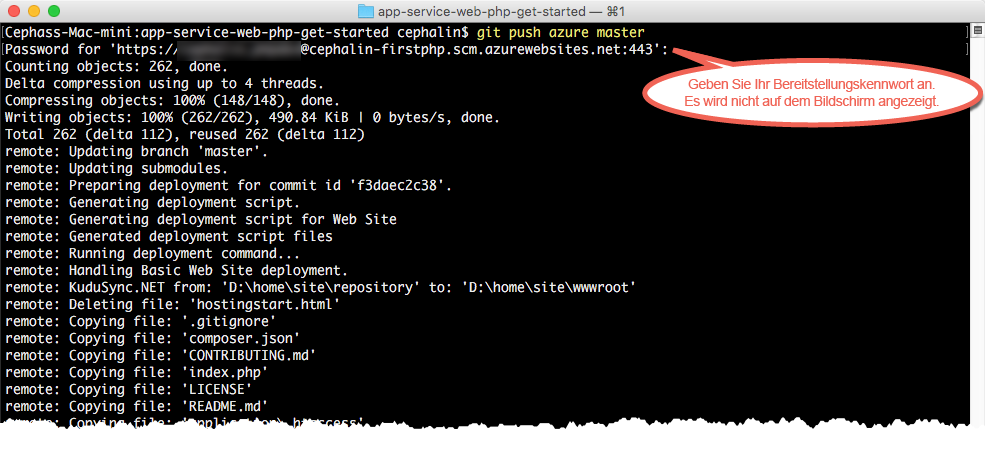

# Bereitstellen Ihrer ersten PHP-Web-App für Azure in fünf Minuten
In diesem Tutorial erfahren Sie, wie Sie Ihre erste PHP-Web-App für [Azure App Service](../app-service/app-service-value-prop-what-is.md)bereitstellen.
Mit App Service können Sie Web-Apps, [Mobile App-Back-Ends](/documentation/learning-paths/appservice-mobileapps/) und [API-Apps](../app-service-api/app-service-api-apps-why-best-platform.md) erstellen.

In diesem Tutorial führen Sie folgende Schritte aus: 

* Erstellen einer Web-App in Azure App Service
* Bereitstellen von PHP-Beispielcode
* Anzeigen des live in der Produktion ausgeführten Codes
* Aktualisieren Ihrer Web-App wie beim [Ausführen von Git-Commits mittels Push](https://git-scm.com/docs/git-push)

## Voraussetzungen
* [Git](http://www.git-scm.com/downloads).
* [Azure-Befehlszeilenschnittstelle](../xplat-cli-install.md).
* Ein Microsoft Azure-Konto. Falls Sie noch kein Konto haben, können Sie sich [für eine kostenlose Testversion registrieren](https://azure.microsoft.com/pricing/free-trial/?WT.mc_id=A261C142F) oder [Ihre Visual Studio-Abonnentenvorteile aktivieren](https://azure.microsoft.com/pricing/member-offers/msdn-benefits-details/?WT.mc_id=A261C142F).

> [!NOTE]
> Zum [Testen von App Service](http://go.microsoft.com/fwlink/?LinkId=523751) benötigen Sie kein Azure-Konto. Sie können eine Starter-App erstellen und bis zu einer Stunde damit experimentieren – ohne Kreditkarte und ohne jegliche Verpflichtungen.
> 
> 

## Bereitstellen einer PHP-Web-App
1. Öffnen Sie eine neue Windows-Eingabeaufforderung, ein PowerShell-Fenster, eine Linux-Shell oder ein OS X-Terminal. Vergewissern Sie sich durch Ausführen von `git --version` und `azure --version`, dass Git und die Azure-Befehlszeilenschnittstelle auf Ihrem Computer installiert sind.
   
    
   
    Entsprechende Downloadlinks finden Sie bei Bedarf unter [Voraussetzungen](#Prerequisites) .
2. Melden Sie sich wie folgt bei Azure an:
   
        azure login
   
    Folgen Sie der Hilfemeldung, um den Anmeldeprozess fortzusetzen.
   
    
3. Wechseln Sie Azure-CLI in den ASM-Modus, und legen Sie dann den Bereitstellungsbenutzer für App Service fest. Sie werden später unter Verwendung der Anmeldeinformationen Code bereitstellen.
   
        azure config mode asm
        azure site deployment user set --username <username> --pass <password>
4. Wechseln Sie in ein Arbeitsverzeichnis (`CD`), und klonen Sie die Beispiel-App wie folgt:
   
        git clone https://github.com/Azure-Samples/app-service-web-php-get-started.git
5. Wechseln Sie in das Repository Ihrer Beispiel-App. Beispiel:
   
        cd app-service-web-php-get-started
6. Erstellen Sie die App Service-App-Ressource in Azure mit einem eindeutigen App-Namen und dem zuvor konfigurierten Bereitstellungsbenutzer. Geben Sie die Zahl der gewünschten Region ein, wenn Sie dazu aufgefordert werden.
   
        azure site create <app_name> --git --gitusername <username>
   
    
   
    Ihre App wird jetzt in Azure erstellt. Ihr aktuelles Verzeichnis wird außerdem für Git initialisiert und mit der neuen App Service-App als Git-Remoteelement verbunden.
    Sie können zwar auch zur URL der App (http://&lt;app_name>.azurewebsites.net) navigieren, um die HTML-Standardseite anzuzeigen, wir möchten hier aber eigentlich Ihren eigenen Code verwenden.
7. Gehen Sie wie bei anderen Pushübertragungen von Code mit Git vor, um Ihren Beispielcode für die Azure-App bereitzustellen. Wenn Sie aufgefordert werden, verwenden Sie das Kennwort, das Sie zuvor konfiguriert haben.
   
        git push azure master
   
    
   
    Mit `git push` wird nicht nur Code in Azure eingefügt, sondern es werden auch Bereitstellungsaufgaben im Bereitstellungsmodul ausgelöst. Sie können auch die  [Composer-Erweiterung aktivieren](web-sites-php-mysql-deploy-use-git.md#composer) , um Dateien vom Typ „composer.json“ in Ihrer PHP-App automatisch zu verarbeiten.

Herzlichen Glückwunsch! Sie haben Ihre App in Azure App Service bereitgestellt.

## Verfolgen der Liveausführung der App
Führen Sie den folgenden Befehl aus einem beliebigen Verzeichnis in Ihrem Repository aus, um die Liveausführung der App in Azure zu verfolgen:

    azure site browse

## Durchführen von Updates für die App
Sie können jetzt Git verwenden, um aus Ihrem Projektstamm (Repositorystamm) jederzeit einen Pushvorgang durchzuführen und so ein Update für die Live-Website vorzunehmen. Dazu gehen Sie wie bei der erstmaligen Bereitstellung Ihres Codes vor. Wenn Sie beispielsweise eine neue Änderung übertragen möchten, die Sie lokal getestet haben, führen Sie einfach die folgenden Befehle in Ihrem Projektstamm (Repositorystamm) aus:

    git add .
    git commit -m "<your_message>"
    git push azure master

## Nächste Schritte
[Erstellen, Konfigurieren und Bereitstellen einer Laravel-Web-App in Azure](app-service-web-php-get-started.md) In diesem Tutorial eignen Sie sich grundlegende Kenntnisse zum Ausführen einer PHP-Web-App in Azure an. Sie erhalten u.a. Informationen zu den folgenden Schritten:

* Erstellen und Konfigurieren von Apps in Azure über PowerShell/Bash
* Festlegen der PHP-Version
* Verwenden einer Startdatei, die sich nicht im Stammverzeichnis der Anwendung befindet
* Aktivieren der Composer-Automatisierung
* Zugreifen auf umgebungsspezifische Variablen
* Problembehandlung für allgemeine Fehler

Sie können auch weiter mit Ihrer ersten Web-App arbeiten. Beispiel:

* Testen Sie [weitere Methoden zum Bereitstellen Ihres Codes in Azure](web-sites-deploy.md). Wenn Sie eines Ihrer GitHub-Repositorys zur Bereitstellung verwenden möchten, wählen Sie beispielsweise unter **Bereitstellungsoptionen** einfach **GitHub** anstelle von **Lokales Git-Repository** aus.
* Entwickeln Sie Ihre Azure-App weiter. Authentifizieren Sie Ihre Benutzer. Skalieren Sie die App je nach Bedarf. Richten Sie einige Leistungswarnungen ein. Es sind jeweils nur wenige Klicks erforderlich. Weitere Informationen finden Sie unter [Hinzufügen von Funktionen zu Ihrer ersten Web-App](app-service-web-get-started-2.md).

<!--HONumber=Dec16_HO1-->

