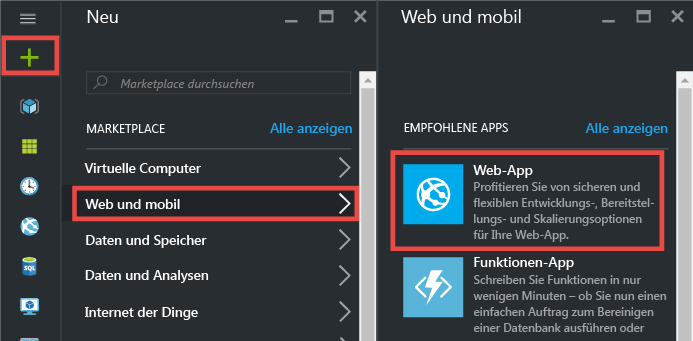
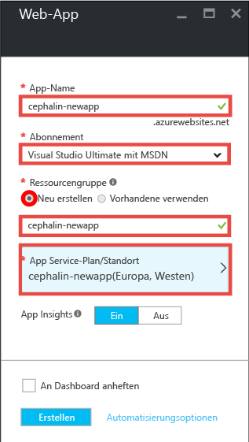
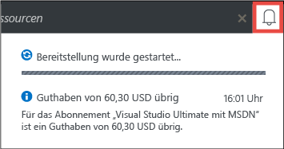
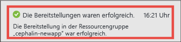
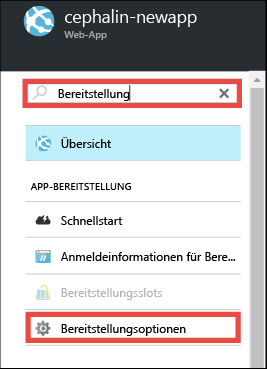
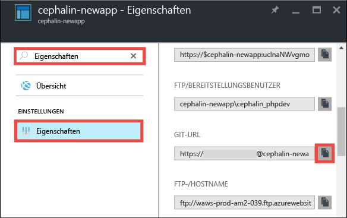
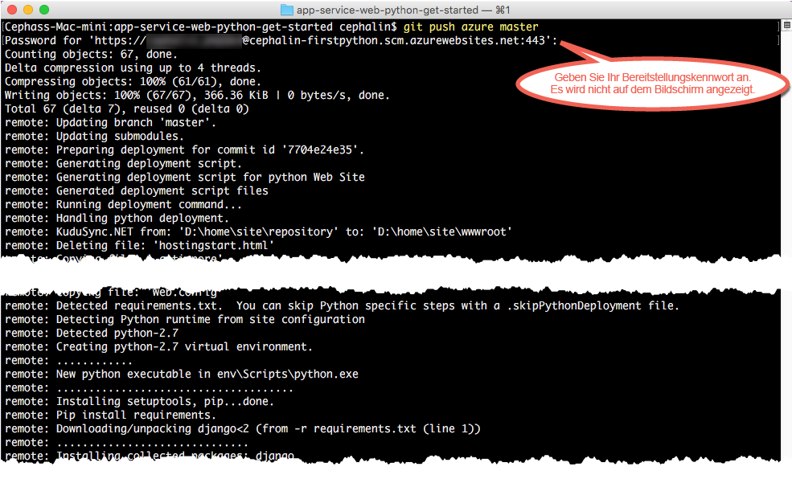

<properties 
	pageTitle="Bereitstellen Ihrer ersten Python-Web-App für Azure in fünf Minuten | Microsoft Azure" 
	description="Erfahren Sie, wie einfach die Ausführung von Web-Apps in App Service ist, indem Sie eine Beispiel-App bereitstellen. Sie können in kürzester Zeit mit der Entwicklung beginnen und sofort Ergebnisse erzielen." 
	services="app-service\web"
	documentationCenter=""
	authors="cephalin"
	manager="wpickett"
	editor=""
/>

<tags
	ms.service="app-service-web"
	ms.workload="web"
	ms.tgt_pltfrm="na"
	ms.devlang="na"
	ms.topic="hero-article"
	ms.date="09/16/2016" 
	ms.author="cephalin"
/>
	
# Bereitstellen Ihrer ersten Python-Web-App für Azure in fünf Minuten

In diesem Tutorial erfahren Sie, wie Sie Ihre erste Python-Web-App für [Azure App Service](../app-service/app-service-value-prop-what-is.md) bereitstellen. 
Mit App Service können Sie Web-Apps, [Mobile App-Back-Ends](/documentation/learning-paths/appservice-mobileapps/) 
und [API-Apps](../app-service-api/app-service-api-apps-why-best-platform.md) erstellen.

In diesem Tutorial führen Sie folgende Schritte aus:

- Erstellen einer Web-App in Azure App Service
- Bereitstellen von Python-Beispielcode
- Anzeigen des live in der Produktion ausgeführten Codes
- Aktualisieren Ihrer Web-App wie beim [Ausführen von Git-Commits mittels Push](https://git-scm.com/docs/git-push)

## Voraussetzungen

- [Git installieren](http://www.git-scm.com/downloads). Stellen Sie sicher, dass die Installation erfolgreich war, indem Sie `git --version` in einer neuen Windows-Eingabeaufforderung, 
einem PowerShell-Fenster, einer Linux-Shell oder einem OS X-Terminal ausführen.
- Microsoft Azure-Konto erstellen. Falls Sie noch kein Konto haben, können Sie sich 
[für eine kostenlose Testversion registrieren](/pricing/free-trial/?WT.mc_id=A261C142F) oder 
[Ihre Visual Studio-Abonnentenvorteile aktivieren](/pricing/member-offers/msdn-benefits-details/?WT.mc_id=A261C142F).

>[AZURE.NOTE] Zum [Testen von App Service](http://go.microsoft.com/fwlink/?LinkId=523751) benötigen Sie kein Azure-Konto. Sie können eine Starter-App erstellen und bis zu einer Stunde damit experimentieren – ohne Kreditkarte und ohne jegliche Verpflichtungen.

## Erstellen einer Web-App

1. Melden Sie sich mit Ihrem Azure-Konto beim [Azure-Portal](https://portal.azure.com) an.

2. Klicken Sie im linken Menü auf **Neu** > **Web und mobil** > **Web-App**.

    

3. Legen Sie auf dem Blatt für die App-Erstellung die folgenden Einstellungen für die neue App fest:

    - **App-Name**: Geben Sie einen eindeutigen Namen ein.
    - **Ressourcengruppe**: Wählen Sie **Neu erstellen** aus, und geben Sie einen Namen für die Ressourcengruppe ein.
    - **App Service-Plan/Standort**: Klicken Sie auf diese Option, um sie zu konfigurieren. Klicken Sie anschließend auf **Neu erstellen**, um den Namen, Standort und 
    Tarif des App Service-Plans festzulegen. Sie können auch den Tarif **Free** verwenden.

    Wenn Sie fertig sind, sollte das Blatt für die App-Erstellung wie folgt aussehen:

    

3. Klicken Sie unten auf dem Blatt auf **Erstellen**. Sie können oben auf das Symbol **Benachrichtigung** klicken, um den Status anzuzeigen.

    

4. Nach Abschluss der Bereitstellung sollte die folgende Benachrichtigungsmeldung angezeigt werden. Klicken Sie auf die Meldung, um das Blatt Ihrer Bereitstellung zu öffnen.

    

5. Klicken Sie auf dem Blatt **Bereitstellung erfolgreich** auf den Link **Ressource**, um das Blatt Ihrer neuen Web-App zu öffnen.

    

## Bereitstellen von Code für die Web-App

Als Nächstes stellen wir mithilfe von Git Code in Azure bereit.

5. Klicken Sie auf dem Blatt der Web-App auf **Bereitstellungsoptionen** (scrollen Sie dazu nach unten, oder suchen Sie nach der Option).

    

6. Klicken Sie auf **Quelle auswählen** > **Lokales Git-Repository** > **OK**.

7. Klicken Sie auf dem Blatt der Web-App auf **Anmeldeinformationen für Bereitstellung**.

8. Legen Sie Ihre Anmeldeinformationen für die Bereitstellung fest, und klicken Sie auf **Speichern**.

7. Klicken Sie auf dem Blatt der Web-App auf **Eigenschaften** (scrollen Sie dazu nach unten, oder suchen Sie nach der Option). Klicken Sie neben **Git-URL** auf die Schaltfläche **Kopieren**.

    

    Jetzt können Sie Ihren Code mit Git bereitstellen.

1. Wechseln Sie im Befehlszeilenterminal zu einem Arbeitsverzeichnis (`CD`), und klonen Sie die Beispiel-App wie folgt:

        git clone https://github.com/Azure-Samples/app-service-web-python-get-started.git

    

    Verwenden Sie für *&lt;github_sample_url>* je nach gewünschtem Framework eine der folgenden URLs:

2. Wechseln Sie in das Repository Ihrer Beispiel-App. Beispiel:

        cd app-service-web-html-get-started

3. Konfigurieren Sie für die Git-Remote-URL Ihrer Azure-App die Git-URL, die Sie in einem der vorherigen Schritte aus dem Portal kopiert haben.

        git remote add azure <giturlfromportal>

4. Gehen Sie wie bei anderen Pushübertragungen von Code mit Git vor, um Ihren Beispielcode für die Azure-App bereitzustellen:

        git push azure master

    

    Bei Verwendung eines der Sprachen-Frameworks wird eine andere Ausgabe angezeigt. Das hat folgenden Grund: Mit `git push` wird nicht nur Code in Azure eingefügt, sondern es werden auch Bereitstellungsaufgaben im Bereitstellungsmodul ausgelöst. Falls Ihr Projektstamm (Repositorystamm) die Datei „requirements.txt“ enthält, stellt das Bereitstellungsskript die erforderlichen Pakete wieder für Sie her.

Das ist alles! Ihr Code wird jetzt live in Azure ausgeführt. Navigieren Sie im Browser zu „http://*&lt;appname>*.azurewebsites.net“, um ihn in Aktion zu sehen.

## Durchführen von Updates für die App

Sie können jetzt Git verwenden, um aus Ihrem Projektstamm (Repositorystamm) jederzeit einen Pushvorgang durchzuführen und so ein Update für die Live-Website vorzunehmen. Dazu gehen Sie wie bei der erstmaligen Bereitstellung Ihres Codes vor. Wenn Sie beispielsweise eine neue Änderung übertragen möchten, die Sie lokal getestet haben, führen Sie einfach die folgenden Befehle in Ihrem Projektstamm (Repositorystamm) aus:

    git add .
    git commit -m "<your_message>"
    git push azure master

## Nächste Schritte

[Erstellen, Konfigurieren und Bereitstellen einer Django-Web-App für Azure in Visual Studio](web-sites-python-ptvs-django-mysql.md) In diesem Tutorial eignen Sie sich grundlegende Kenntnisse zum Ausführen einer Python-Web-App in Azure an. Sie erhalten u.a. Informationen zu den folgenden Schritten:

- Erstellen und Bereitstellen einer Python-App mithilfe einer Vorlage
- Festlegen der Python-Version
- Erstellen virtueller Umgebungen
- Herstellen einer Verbindung mit einer Datenbank

Sie können auch weiter mit Ihrer ersten Web-App arbeiten. Beispiel:

- Testen Sie [weitere Methoden zum Bereitstellen Ihres Codes in Azure](../app-service-web/web-sites-deploy.md). Wenn Sie eines Ihrer GitHub-Repositorys zur Bereitstellung verwenden möchten, wählen Sie beispielsweise unter 
**Bereitstellungsoptionen** einfach **GitHub** anstelle von **Lokales Git-Repository** aus.
- Entwickeln Sie Ihre Azure-App weiter. Authentifizieren Sie Ihre Benutzer. Skalieren Sie die App je nach Bedarf. Richten Sie einige Leistungswarnungen ein. Es sind jeweils nur wenige Klicks erforderlich. Weitere Informationen finden Sie unter 
[Hinzufügen von Funktionen zu Ihrer ersten Web-App](app-service-web-get-started-2.md).

<!---HONumber=AcomDC_0920_2016-->