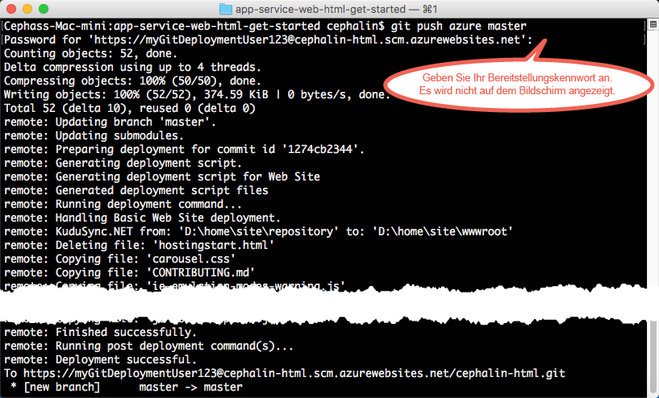
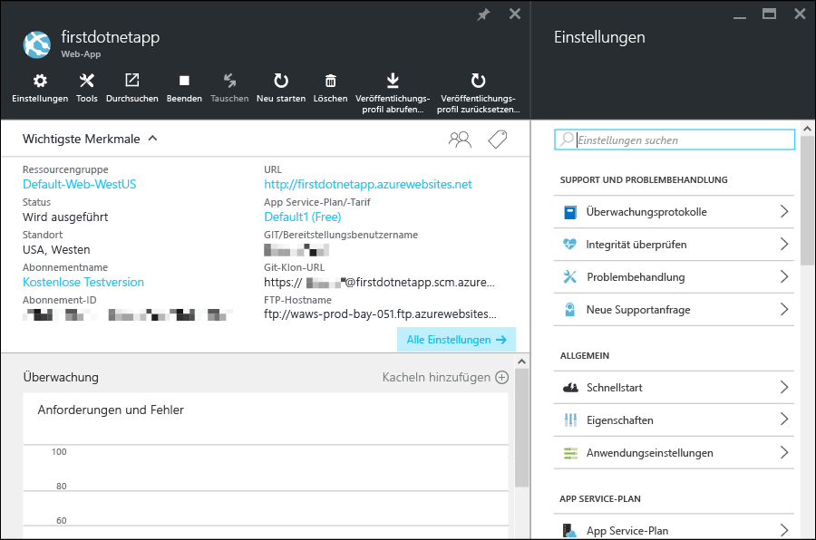

<properties 
	pageTitle="Bereitstellen Ihrer ersten Web-App für Azure in fünf Minuten" 
	description="Hier erfahren Sie anhand der Bereitstellung einer Beispiel-App in wenigen Schritten, wie einfach die Ausführung von Web-Apps in App Service ist. Sie können innerhalb von fünf Minuten mit der Entwicklung beginnen und sofort Ergebnisse erzielen." 
	services="app-service\web"
	documentationCenter=""
	authors="cephalin" 
	manager="wpickett" 
	editor="" 
/>

<tags 
	ms.service="app-service-web" 
	ms.workload="web" 
	ms.tgt_pltfrm="na" 
	ms.devlang="na" 
	ms.topic="hero-article"
	ms.date="05/12/2016" 
	ms.author="cephalin"
/>
	
# Bereitstellen Ihrer ersten Web-App für Azure in fünf Minuten

[AZURE.INCLUDE [Registerkarten](../../includes/app-service-web-get-started-nav-tabs.md)]

In diesem Tutorial erfahren Sie, wie Sie Ihre erste Web-App für [Azure App Service](../app-service/app-service-value-prop-what-is.md) bereitstellen. Mit App Service können Sie Web-Apps, [Mobile App-Back-Ends](/documentation/learning-paths/appservice-mobileapps/) und [API-Apps](../app-service-api/app-service-api-apps-why-best-platform.md) erstellen.

Sie führen ohne großen Aufwand Folgendes durch:

- Bereitstellen einer Beispiel-Web-App (Auswahl: ASP.NET, PHP, Node.js, Java oder Python)
- Liveschalten Ihrer App in wenigen Sekunden
- Aktualisieren Ihrer Web-App wie beim [Ausführen von Git-Commits mittels Push](https://git-scm.com/docs/git-push)

Außerdem erhalten Sie einen ersten Einblick in das [Azure-Portal](https://portal.azure.com) und die darin verfügbaren Features.

## Voraussetzungen

- [Git installieren](http://www.git-scm.com/downloads). 
- [Azure-Befehlszeilenschnittstelle installieren](../xplat-cli-install.md). 
- Microsoft Azure-Konto erstellen. Falls Sie noch kein Konto haben, können Sie sich [für eine kostenlose Testversion registrieren](/pricing/free-trial/?WT.mc_id=A261C142F) oder [Ihre Visual Studio-Abonnentenvorteile aktivieren](/pricing/member-offers/msdn-benefits-details/?WT.mc_id=A261C142F).

>[AZURE.NOTE] Sehen Sie sich eine Web-App in Aktion an: [Probieren Sie App Service gleich aus](http://go.microsoft.com/fwlink/?LinkId=523751), und erstellen Sie eine kurzzeitige Start-App – ohne Kreditkarte oder weitere Verpflichtungen.

## Bereitstellen einer Web-App

Wir stellen jetzt eine Web-App unter Azure App Service bereit.

1. Öffnen Sie eine neue Windows-Eingabeaufforderung, ein PowerShell-Fenster, eine Linux-Shell oder ein OS X-Terminal. Vergewissern Sie sich durch Ausführen von `git --version` und `azure --version`, dass Git und die Azure-Befehlszeilenschnittstelle auf Ihrem Computer installiert sind. 

    

    Entsprechende Downloadlinks finden Sie bei Bedarf unter [Voraussetzungen](#Prerequisites).

1. Wechseln Sie mithilfe von `CD` in ein Arbeitsverzeichnis, und klonen Sie die Beispiel-App wie folgt:

        git clone <github_sample_url>

    

    Verwenden Sie für *&lt;github\_sample\_url>* je nach gewünschtem Framework eine der folgenden URLs:

    - HTML, CSS, JS: [https://github.com/Azure-Samples/app-service-web-html-get-started.git](https://github.com/Azure-Samples/app-service-web-html-get-started.git)
    - ASP.NET: [https://github.com/Azure-Samples/app-service-web-dotnet-get-started.git](https://github.com/Azure-Samples/app-service-web-dotnet-get-started.git)
    - PHP (CodeIgniter): [https://github.com/Azure-Samples/app-service-web-php-get-started.git](https://github.com/Azure-Samples/app-service-web-php-get-started.git)
    - Node.js (Express): [https://github.com/Azure-Samples/app-service-web-nodejs-get-started.git](https://github.com/Azure-Samples/app-service-web-nodejs-get-started.git) 
    - Java: [https://github.com/Azure-Samples/app-service-web-java-get-started.git](https://github.com/Azure-Samples/app-service-web-java-get-started.git)
    - Python (Django): [https://github.com/Azure-Samples/app-service-web-python-get-started.git](https://github.com/Azure-Samples/app-service-web-python-get-started.git)

2. Wechseln Sie mithilfe von `CD` in das Repository Ihrer Beispiel-App. Beispiel:

        cd app-service-web-html-get-started

3. Melden Sie sich wie folgt an Azure an:

        azure login
    
    Folgen Sie der Hilfemeldung, um den Anmeldeprozess fortzusetzen.
    
    

4. Erstellen Sie die App Service-App-Ressource in Azure mit einem eindeutigen App-Namen mit dem nächsten Befehl. Geben Sie die Zahl der gewünschten Region ein, wenn Sie dazu aufgefordert werden.

        azure site create --git <app_name>
    
    
    
    >[AZURE.NOTE] Wenn Sie für Ihr Azure-Abonnement noch nie zuvor Anmeldeinformationen für die Bereitstellung eingerichtet haben, werden Sie aufgefordert, diese zu erstellen. Diese Anmeldeinformationen und nicht Ihre Anmeldeinformationen für das Azure-Konto werden von App Service ausschließlich für Git-Bereitstellungen und FTP-Anmeldungen verwendet.
    
    Ihre App wird jetzt in Azure erstellt. Ihr aktuelles Verzeichnis wird außerdem für Git initialisiert und mit der neuen App Service-App als Git-Remoteelement verbunden. Sie können zwar auch zur URL der App (http://&lt;app_name>.azurewebsites.net) navigieren, um die HTML-Standardseite anzuzeigen, wir möchten hier aber eigentlich Ihren eigenen Code verwenden.

4. Stellen Sie Ihren Beispielcode jetzt für die neue App Service-App bereit, wie Sie dies auch für anderen Code per Pushübertragung mit Git durchführen würden:

        git push azure master 

    
    
    Bei Verwendung eines der Sprachen-Frameworks entspricht Ihre Ausgabe nicht der obigen Darstellung. Das hat folgenden Grund: Mit `git push` wird nicht nur Code in Azure eingefügt, sondern es werden auch Bereitstellungsaufgaben im Bereitstellungsmodul ausgelöst. Falls Ihr Projektstamm (bzw. Repositorystamm) das Element „package.json“ (Node.js) oder „requirements.txt“ (Python) enthält oder falls Ihr ASP.NET-Projekt das Element „packages.config“ enthält, stellen die Bereitstellungsskripts die erforderlichen Pakete wieder für Sie her. Sie können auch die [Composer-Erweiterung aktivieren](web-sites-php-mysql-deploy-use-git.md#composer), um Dateien vom Typ „composer.json“ in Ihrer PHP-App automatisch zu verarbeiten.

Herzlichen Glückwunsch! Sie haben Ihre App in Azure App Service bereitgestellt.

## Verfolgen der Liveausführung der App

Führen Sie den folgenden Befehl aus einem beliebigen Verzeichnis in Ihrem Repository aus, um die Liveausführung der App in Azure zu verfolgen:

    azure site browse

## Durchführen von Updates für die App

Sie können jetzt Git verwenden, um aus Ihrem Projektstamm (Repositorystamm) jederzeit einen Pushvorgang durchzuführen und so ein Update für die Live-Website vorzunehmen. Dies entspricht der Vorgehensweise, die Sie bei der ersten Bereitstellung Ihrer App für Azure genutzt haben. Wenn Sie beispielsweise eine neue Änderung übertragen möchten, die Sie lokal getestet haben, führen Sie einfach die folgenden Befehle in Ihrem Projektstamm (Repositorystamm) aus:
    
    git add .
    git commit -m "<your_message>"
    git push azure master

## Anzeigen der App im Azure-Portal

Wir wechseln jetzt zum Azure-Portal, um anzuzeigen, was Sie erstellt haben:

1. Melden Sie sich im [Azure-Portal](https://portal.azure.com) mit einem Microsoft-Konto an, das Ihr Azure-Abonnement enthält.

2. Klicken Sie auf der linken Leiste auf **App Services**.

3. Klicken Sie auf die App, die Sie gerade erstellt haben, um im Portal die dazugehörige Seite (auch [Blatt](../azure-portal-overview.md) genannt) zu öffnen. Zur Erhöhung der Benutzerfreundlichkeit wird standardmäßig auch das Blatt **Einstellungen** geöffnet.

    

Das Portalblatt Ihrer App Service-App enthält viele Einstellungen und Tools, mit denen Sie die App konfigurieren, überwachen und schützen und die Problembehandlung durchführen können. Machen Sie sich anhand einiger einfacher Aufgaben kurz mit dieser Oberfläche vertraut. (Die Aufgabennummer entspricht jeweils der Zahl auf dem Screenshot).

1. Beenden Sie die App.
2. Starten Sie die App neu.
3. Klicken Sie auf den Link **Ressourcengruppe**, um alle in der Ressourcengruppe bereitgestellten Ressourcen anzuzeigen.
4. Klicken Sie auf **Einstellungen** > **Eigenschaften**, um weitere Informationen zur App anzuzeigen.
5. Klicken Sie auf **Extras**, um auf praktische Überwachungs- und Problembehandlungstools zuzugreifen.  

## Nächste Schritte

- Entwickeln Sie Ihre Azure-App weiter. Schützen Sie die App per Authentifizierung. Skalieren Sie die App je nach Bedarf. Richten Sie einige Leistungswarnungen ein. Es sind jeweils nur wenige Klickvorgänge erforderlich. Weitere Informationen finden Sie unter [Hinzufügen von Funktionen zu Ihrer ersten Web-App](app-service-web-get-started-2.md).
- Web-Apps können nicht nur über Git und die Azure-Befehlszeilenschnittstelle für Azure bereitgestellt werden (siehe [Bereitstellen der App in Azure App Service](../app-service-web/web-sites-deploy.md)). Wählen Sie oben im Artikel Ihr bevorzugtes Framework aus, um die entsprechenden Bereitstellungsschritte für Ihr Sprachen-Framework anzuzeigen.

<!---HONumber=AcomDC_0518_2016-->