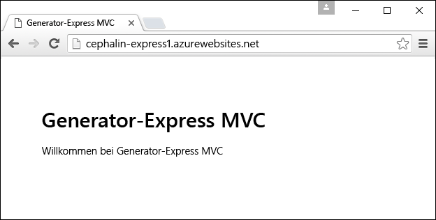
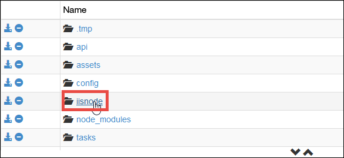
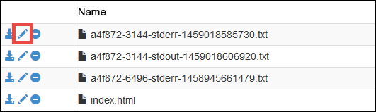
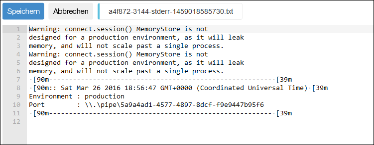

<properties
	pageTitle="Erste Schritte mit Node.js-Web-Apps in Azure App Service"
	description="Erfahren Sie, wie Sie eine Node.js-Anwendung in einer Web-App in Azure App Service bereitstellen."
	services="app-service\web"
	documentationCenter="nodejs"
	authors="cephalin"
	manager="wpickett"
	editor=""/>

<tags
	ms.service="app-service-web"
	ms.workload="web"
	ms.tgt_pltfrm="na"
	ms.devlang="nodejs"
	ms.topic="get-started-article"
	ms.date="03/31/2016"
	ms.author="cephalin;robmcm"/>

# Erste Schritte mit Node.js-Web-Apps in Azure App Service

> [AZURE.SELECTOR]
- [.Net](web-sites-dotnet-get-started.md)
- [Node.js](app-service-web-nodejs-get-started.md)
- [Java](web-sites-java-get-started.md)
- [PHP – Git](web-sites-php-mysql-deploy-use-git.md)
- [PHP – FTP](web-sites-php-mysql-deploy-use-ftp.md)
- [Python](web-sites-python-ptvs-django-mysql.md)

In diesem Tutorial erfahren Sie, wie Sie eine einfache [Node.js](http://nodejs.org)-Anwendung erstellen und für eine [Web-App](app-service-web-overview.md) in [Azure App Service](../app-service/app-service-value-prop-what-is.md) über die Befehlszeile bereitstellen, z.B. „cmd.exe“ oder Bash. Die Anweisungen in diesem Tutorial gelten für alle Betriebssysteme, unter denen Node.js ausgeführt werden kann.

<a name="prereq"/>
## Voraussetzungen

- Node.js. Binärdateien für die Installation finden Sie [hier](https://nodejs.org/).
- Yoeman. Eine Installationsanleitung finden Sie [hier](http://yeoman.io/).
- Git. Binärdateien für die Installation finden Sie [hier](http://www.git-scm.com/downloads).
- Azure-Befehlszeilenschnittstelle. Eine Installationsanleitung finden Sie [hier](../xplat-cli-install.md).
- Ein Microsoft Azure-Konto. Wenn Sie kein Konto haben, können Sie sich [für eine kostenlose Testversion registrieren](/pricing/free-trial/?WT.mc_id=A261C142F) oder [Ihre Visual Studio-Abonnentenvorteile aktivieren](/pricing/member-offers/msdn-benefits-details/?WT.mc_id=A261C142F).

## Erstellen und Bereitstellen einer einfachen Node.js-Web-App

1. Öffnen Sie das Befehlszeilenterminal Ihrer Wahl, und installieren Sie den [Express Generator für Yoeman](https://github.com/petecoop/generator-express).

        npm install -g generator-express

2. Wechseln Sie mit `CD` in ein Arbeitsverzeichnis, und generieren Sie wie folgt eine Express-App:

        yo express
        
    Wählen Sie bei Aufforderung die folgenden Optionen aus:

    `? Would you like to create a new directory for your project?` **Ja** `? Enter directory name` **&lt;appname>** `? Select a version to install:` **MVC** `? Select a view engine to use:` **Jade** `? Select a css preprocessor to use (Sass Requires Ruby):` **Keine** `? Select a database to use:` **Keine** `? Select a build tool to use:` **Grunt**

3. Wechseln Sie mit `CD` zum Stammverzeichnis der neuen App, und starten Sie sie, um sicherzustellen, dass sie in Ihrer Entwicklungsumgebung ausgeführt werden kann:

        npm start

    Navigieren Sie in Ihrem Browser zu [http://localhost:3000](http://localhost:3000), um zu prüfen, ob die Express-Startseite angezeigt wird. Nachdem Sie sich vergewissert haben, dass die App ordnungsgemäß ausgeführt wird, können Sie sie mit `Ctrl-C` beenden.
    
1. Melden Sie sich wie folgt bei Azure an. (Hierzu benötigen Sie die [Azure-Befehlszeilenschnittstelle](#prereq).)

        azure login

    Befolgen Sie die Aufforderung, um die Anmeldung in einem Browser mit einem Microsoft-Konto fortzusetzen, das über Ihr Azure-Abonnement verfügt.

2. Stellen Sie sicher, dass Sie sich noch im Stammverzeichnis Ihrer App befinden. Erstellen Sie die App Service-App-Ressource in Azure mit einem eindeutigen App-Namen mit dem nächsten Befehl. Die URL der Web-App lautet „http://&lt;appname>.azurewebsites.net“.

        azure site create --git <appname>

    Folgen Sie der Aufforderung zum Auswählen einer Azure-Region für die Bereitstellung. Wenn Sie für Ihr Azure-Abonnement noch nie zuvor Git/FTP-Anmeldeinformationen für die Bereitstellung eingerichtet haben, werden Sie aufgefordert, diese zu erstellen.

3. Öffnen Sie „config/config.js“, und ändern Sie den Produktionsport in `process.env.port`. Ihr JSON-Objekt für die Produktion sollte wie folgt aussehen:

        production: {
            root: rootPath,
            app: {
                name: 'express1'
            },
            port: process.env.port,
        }

    So kann die Node.js-App auf Webanforderungen über den Standardport antworten, über den iisnode lauscht.
    
4. Speichern Sie Ihre Änderungen, und verwenden Sie dann Git, um Ihre App in Azure bereitzustellen:

        git add .
        git commit -m "<your commit message>"
        git push azure master

    Vom Express Generator wird bereits eine Datei vom Typ „.gitignore“ bereitgestellt, sodass von `git push` bei dem Versuch, das Verzeichnis „node\_modules/“ hochzuladen, keine Bandbreite beansprucht wird.

5. Starten Sie die fertige Azure-App jetzt einfach im Browser:

        azure site browse

    Sie sollten jetzt verfolgen können, dass Ihre Node.js-Web-App live in Azure App Service ausgeführt wird.
    
    

## Aktualisieren der Node.js-Web-App

Führen Sie zum Durchführen von Updates für die Node.js-Web-App, die in App Service ausgeführt wird, einfach wie bei der ersten Bereitstellung `git add`, `git commit` und `git push` aus.
     
## Bereitstellen der Node.js-App durch App Service

Von Azure App Service wird [iisnode](https://github.com/tjanczuk/iisnode/wiki) verwendet, um Node.js-Apps auszuführen. Die Azure-Befehlszeilenschnittstelle und das Kudu-Modul (Git-Bereitstellung) arbeiten zusammen, damit Sie eine optimierte Benutzeroberfläche erhalten, wenn Sie Node.js-Apps über die Befehlszeile entwickeln und bereitstellen.

- `azure site create --git` erkennt das gängige Node.js-Muster von „server.js“ oder „app.js“ und erstellt in Ihrem Stammverzeichnis die Datei „iisnode.yml“. Sie können diese Datei verwenden, um iisnode anzupassen.
- Unter `git push azure master` automatisiert Kudu die folgenden Bereitstellungsaufgaben:

    - Führen Sie `npm install --production` aus, wenn sich „package.json“ im Repositorystamm befindet.
    - Generieren Sie die Datei „Web.config“ für iisnode, in der auf Ihr Startskript in „package.json“ (z.B. „server.js“ oder „app.js“) verwiesen wird.
    - Passen Sie die Datei „Web.config“ an, um die App auf das Debuggen mit Node-Inspector vorzubereiten.
    
## Verwenden eines Node.js-Frameworks

Wenn Sie bei der App-Entwicklung ein gängiges Node.js-Framework wie [Sails.js](http://sailsjs.org/) oder [MEAN.js](http://meanjs.org/) verwenden, können Sie sie für App Service bereitstellen. Die gängigen Node.js-Frameworks verfügen über bestimmte Eigenheiten, und ihre Paketabhängigkeiten werden ständig aktualisiert. In App Service werden aber die Protokolle stdout und stderr für Sie zur Verfügung gestellt, damit Sie genau wissen, was mit Ihrer App passiert, und entsprechende Änderungen vornehmen können. Weitere Informationen finden Sie unter [Abrufen von stdout- und stderr-Protokollen von iisnode](#iisnodelog).

Sehen Sie sich die Tutorials an, in denen veranschaulicht wird, wie Sie mit einem bestimmten Framework in App Service arbeiten.

- [Bereitstellen einer Sails.js-Web-App in Azure App Service](app-service-web-nodejs-sails.md)
- [Erstellen einer Node.js-Chat-Anwendung mit Socket.IO in Azure App Service](web-sites-nodejs-chat-app-socketio.md)
- [Verwenden von io.js mit Azure App Service-Web-Apps](web-sites-nodejs-iojs.md)

## Verwenden eines bestimmten Node.js-Moduls

In Ihrem typischen Workflow können Sie App Service mitteilen, ein bestimmtes Node.js-Modul zu verwenden, wie dies auch in „package.json“ möglich ist. Beispiel:

    "engines": {
        "node": "5.5.0"
    }, 

Das Kudu-Bereitstellungsmodul bestimmt in der folgenden Reihenfolge, welches Node.js-Modul verwendet werden soll:

- Sehen Sie sich zuerst „iisnode.yml“ an, um zu überprüfen, ob `nodeProcessCommandLine` angegeben ist. Wenn ja, sollten Sie dieses Element verwenden.
- Sehen Sie sich als Nächstes „package.json“ an, um zu prüfen, ob `"node": "..."` im `engines`-Objekt angegeben ist. Wenn ja, sollten Sie dieses Element verwenden.
- Wählen Sie standardmäßig eine Node.js-Version aus.

<a name="iisnodelog" />
## Abrufen von stdout- und stderr-Protokollen von iisnode

Führen Sie diese Schritte aus, um iisnode-Protokolle zu lesen:

1. Öffnen Sie die von der Azure-Befehlszeilenschnittstelle bereitgestellte Datei „iisnode.yml“.

2. Legen Sie die beiden folgenden Parameter fest:

        loggingEnabled: true
        logDirectory: iisnode
    
    Zusammen wird iisnode in App Service damit angewiesen, die Ausgabe von stdout und stderror in das Verzeichnis „D:\\home\\site\\wwwroot**iisnode**“ einzufügen.

3. Speichern Sie die Änderungen, und übertragen Sie diese mit den folgenden Git-Befehlen per Pushvorgang an Azure:

        git add .
        git commit -m "<your commit message>"
        git push azure master
   
   iisnode ist jetzt konfiguriert. In den nächsten Schritten wird veranschaulicht, wie Sie auf diese Protokolle zugreifen.
     
4. Greifen Sie in Ihrem Browser auf die Kudu-Debugkonsole für Ihre App zu, die sich am folgenden Ort befindet:

        https://<appname>.scm.azurewebsites.net/DebugConsole 

5. Navigieren Sie zu „D:\\home\\site\\wwwroot\\iisnode“.

    

6. Klicken Sie für das Protokoll, das Sie lesen möchten, auf das Symbol **Bearbeiten**. Sie können auch auf **Herunterladen** oder **Löschen** klicken.

    

    Jetzt wird das Protokoll angezeigt, das Ihnen als Hilfe beim Debuggen der App Service-Bereitstellung dient.
    
    

## Debuggen der App mit Node-Inspector

Wenn Sie Node-Inspector zum Debuggen Ihrer Node.js-Apps verwenden, können Sie die Anwendung für Ihre live geschaltete App Service-App verwenden. Node-Inspector ist in der iisnode-Installation für App Service vorinstalliert. Falls Sie die Bereitstellung über Git durchführen, enthält die automatisch generierte Datei „Web.config“ aus Kudu bereits die gesamte Konfiguration, die Sie zum Aktivieren von Node-Inspector benötigen.

Führen Sie diese Schritte aus, um Node-Inspector zu aktivieren:

1. Öffnen Sie die Datei „iisnode.yml“ in Ihrem Repositorystamm, und geben Sie die folgenden Parameter an: 

        debuggingEnabled: true
        debuggerExtensionDll: iisnode-inspector.dll

3. Speichern Sie die Änderungen, und übertragen Sie diese mit den folgenden Git-Befehlen per Pushvorgang an Azure:

        git add .
        git commit -m "<your commit message>"
        git push azure master
   
4. Navigieren Sie jetzt einfach zur Startdatei Ihrer App, wie im Startskript in der Datei „package.json“ angegeben, indem Sie der URL „/debug“ hinzufügen. Beispiel:

        http://<appname>.azurewebsites.net/server.js/debug
    
    Oder
    
        http://<appname>.azurewebsites.net/app.js/debug

## Weitere Ressourcen

- [Festlegen einer Node.js-Version in einer Azure-Anwendung](../nodejs-specify-node-version-azure-apps.md)
- [Debuggen einer Node.js-Web-App in Azure App Service](web-sites-nodejs-debug.md)
- [Verwenden von Node.js-Modulen mit Azure-Anwendungen](../nodejs-use-node-modules-azure-apps.md)
- [Azure App Service-Web-Apps: Node.js](http://blogs.msdn.com/b/silverlining/archive/2012/06/14/windows-azure-websites-node-js.aspx)
- [Node.js Developer Center](/develop/nodejs/)
- [Erste Schritte mit Web-Apps in Azure App Service](app-service-web-get-started.md)

<!---HONumber=AcomDC_0413_2016-->