<properties
	pageTitle="Bereitstellen einer ASP.NET-App für Azure App Service mit Visual Studio | Microsoft Azure"
	description="Erfahren Sie, wie Sie ein ASP.NET-Webprojekt mit Visual Studio in einer neuen Web-App in Azure App Service bereitstellen."
	services="app-service\web"
	documentationCenter=".net"
	authors="tdykstra"
	manager="wpickett"
	editor=""/>

<tags
	ms.service="app-service-web"
	ms.workload="web"
	ms.tgt_pltfrm="na"
	ms.devlang="dotnet"
	ms.topic="get-started-article"
	ms.date="07/22/2016"
	ms.author="rachelap"/>

# Bereitstellen einer ASP.NET-Web-App für Azure App Service mit Visual Studio

[AZURE.INCLUDE [Registerkarten](../../includes/app-service-web-get-started-nav-tabs.md)]

## Übersicht

In diesem Tutorial erfahren Sie, wie Sie mithilfe von Visual Studio 2015 eine ASP.NET-Webanwendung für eine [Web-App in Azure App Service](app-service-web-overview.md) bereitstellen.

Das Tutorial ist für ASP.NET-Entwickler ohne Azure-Erfahrung konzipiert. Am Ende des Tutorials verfügen Sie über eine einfache cloudbasierte Webanwendung.

Sie lernen Folgendes:

* Erstellen einer neuen App Service-Web-App beim Erstellen eines neuen Webprojekts in Visual Studio
* Bereitstellen eines Webprojekts für eine App Service-Web-App mit Visual Studio

Das Diagramm veranschaulicht die Schritte in diesem Tutorial.

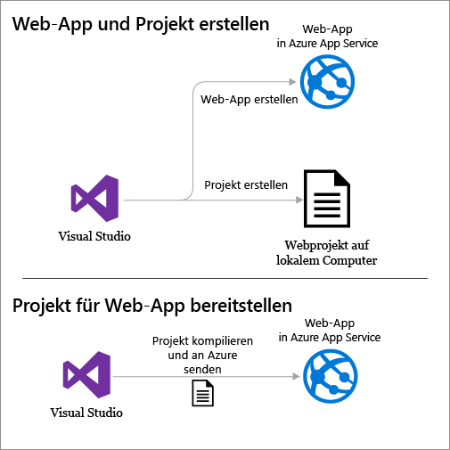

Der Abschnitt [Problembehandlung](#troubleshooting) am Ende des Tutorials enthält Tipps für den Fall, dass etwas nicht funktioniert. Der Abschnitt [Nächste Schritte](#next-steps) enthält Links zu anderen Tutorials, in denen die Verwendung von Azure App Service ausführlicher behandelt wird.

Da es sich hierbei um ein Tutorial für Einsteiger handelt, wird zur Veranschaulichung der Bereitstellungsschritte ein einfaches Webprojekt ohne Datenbank, Authentifizierung oder Autorisierung verwendet. Links zu komplexeren Bereitstellungsthemen finden Sie unter [Bereitstellen der App in Azure App Service](web-sites-deploy.md).

Dieses Tutorial dauert etwa 10 bis 15 Minuten (ohne Berücksichtigung der Zeit für die Installation des Azure SDK für .NET).

## Voraussetzungen

* In diesem Tutorial werden Erfahrungen mit ASP.NET MVC und Visual Studio vorausgesetzt. Eine Einführung finden Sie unter [Erste Schritte mit ASP.NET MVC 5](http://www.asp.net/mvc/overview/getting-started/introduction/getting-started).

* Sie benötigen ein Azure-Konto. Sie können entweder [ein kostenloses Azure-Konto erstellen](/pricing/free-trial/?WT.mc_id=A261C142F) oder [Visual Studio-Abonnementvorteile aktivieren](/pricing/member-offers/msdn-benefits-details/?WT.mc_id=A261C142F).

	Wenn Sie Azure App Service ausprobieren möchten, ehe Sie sich für ein Azure-Konto anmelden, besuchen Sie [Azure App Service-App erstellen](http://go.microsoft.com/fwlink/?LinkId=523751). Dort können Sie eine kurzzeitige Start-App in App Service erstellen – ohne Kreditkarte oder weitere Verpflichtungen.

## Einrichten der Entwicklungsumgebung

Das Tutorial wurde für Visual Studio 2015 mit dem [Azure SDK für .NET](../dotnet-sdk.md) 2.9 (oder höher) geschrieben.

* Das aktuelle Azure SDK für Visual Studio 2015 können Sie [hier](http://go.microsoft.com/fwlink/?linkid=518003) herunterladen. Das SDK installiert Visual Studio 2015, falls es noch nicht vorhanden ist.

	>[AZURE.NOTE] Abhängig von der Anzahl an bereits bestehenden SDK-Abhängigkeiten auf Ihrem Computer kann der Installationsvorgang des SDK von mehreren Minuten bis hin zu einer halben Stunde oder länger dauern.

Wenn Sie lieber Visual Studio 2013 verwenden, können Sie [hier](http://go.microsoft.com/fwlink/?LinkID=324322) das aktuelle Azure SDK für Visual Studio 2013 herunterladen. Einige Bildschirme unterscheiden sich unter Umständen von den Abbildungen.

## Konfigurieren eines neuen Webprojekts

Der nächste Schritt besteht darin, ein Webprojekt in Visual Studio und eine Web-App in Azure App Service zu erstellen. In diesem Abschnitt des Tutorials wird das neue Webprojekt konfiguriert.

1. Öffnen Sie Visual Studio 2015.

2. Klicken Sie auf **Datei > Neu > Projekt**.

3. Klicken Sie im Dialogfeld **Neues Projekt** auf **Visual C# > Web > ASP.NET-Webanwendung**.

3. Stellen Sie sicher, dass als Zielframework **.NET Framework 4.5.2** ausgewählt ist.

4.  [Azure Application Insights](../application-insights/app-insights-overview.md) überwacht die Verfügbarkeit, Leistung und Nutzung Ihrer Web-App. Das Kontrollkästchen **Application Insights zum Projekt hinzufügen** ist standardmäßig aktiviert, wenn Sie nach der Installation von Visual Studio erstmals ein Webprojekt erstellen. Deaktivieren Sie das Kontrollkästchen, wenn Sie Application Insights nicht ausprobieren möchten.

4. Nennen Sie die Anwendung **MyExample**, und klicken Sie anschließend auf **OK**.

	

5. Wählen Sie im Dialogfeld **Neues ASP.NET-Projekt** die Vorlage **MVC** aus, und klicken Sie anschließend auf **Authentifizierung ändern**.

	In diesem Tutorial wird ein ASP.NET MVC-Webprojekt bereitgestellt. Informationen zum Bereitstellen eines ASP.NET-Web-API-Projekts finden Sie im Abschnitt [Nächste Schritte](#next-steps).

	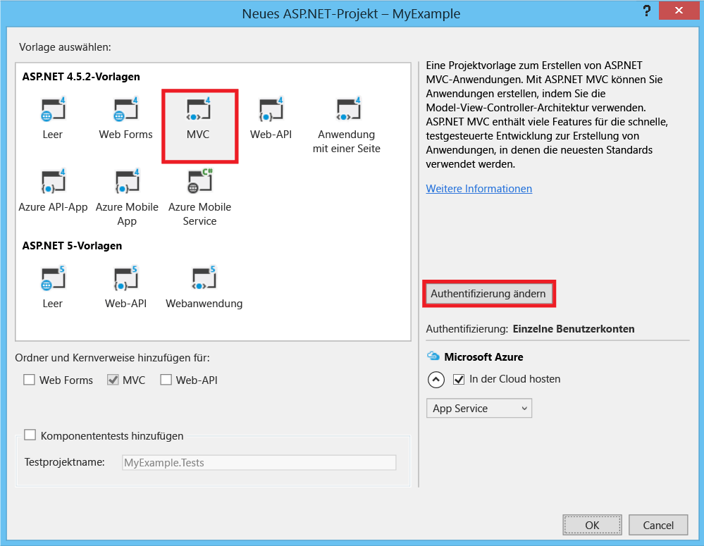

6. Klicken Sie im Dialogfeld **Authentifizierung ändern** auf **Keine Authentifizierung** und dann auf **OK**.

	

	In diesem Tutorial für Einsteiger wird eine einfache App ohne Benutzeranmeldung bereitgestellt.

5. Vergewissern Sie sich im Dialogfeld **Neues ASP.NET-Projekt** im Abschnitt **Microsoft Azure**, dass **In der Cloud hosten** und in der Dropdownliste die Option **App Service** ausgewählt ist.

	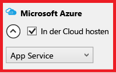

	Mit diesen Einstellungen wird Visual Studio angewiesen, eine Azure-Web-App für das Webprojekt zu erstellen.

6. Klicken Sie auf **OK**.

## Konfigurieren der Azure-Ressourcen für eine neue Web-App

Als Nächstes informieren Sie Visual Studio über die Azure-Ressourcen, die Sie erstellen möchten.

5. Klicken Sie im Dialogfeld **App Service erstellen** auf **Konto hinzufügen**, und melden Sie sich dann mit der ID und dem Kennwort des Kontos an, mit dem Sie Ihr Azure-Abonnement verwalten.

	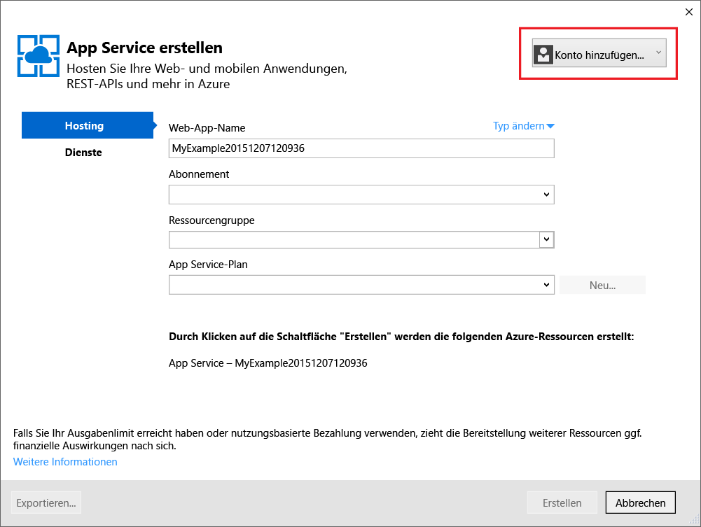

	Falls Sie sich bereits zuvor bei diesem Computer angemeldet haben, wird die Schaltfläche **Konto hinzufügen** unter Umständen nicht angezeigt. In diesem Fall können Sie diesen Schritt überspringen oder müssen ggf. Ihre Anmeldeinformationen erneut eingeben.
 
3. Geben Sie einen **Web-App-Namen** ein, der in der Domäne *azurewebsites.net* eindeutig ist. Beispielsweise können Sie sie "MyExample" nennen und Zahlen anhängen, damit der Name eindeutig ist, z. B. "MyExample810". Wenn ein Standardwebname für Sie erstellt wird, ist dieser eindeutig und Sie können ihn verwenden.

	Wenn eine andere Person den eingegebenen Namen bereits verwendet hat, wird rechts ein rotes Ausrufungszeichen anstelle eines grünen Häkchens angezeigt, und Sie müssen einen anderen Namen eingeben.

	Die URL für Ihre Anwendung setzt sich aus diesem Namen und *.azurewebsites.net* zusammen. Wenn der Name also etwa `MyExample810` lautet, ist die URL `myexample810.azurewebsites.net`.

	Sie können auch eine benutzerdefinierte Domäne mit einer Azure Web-App verwenden. Weitere Informationen finden Sie unter [Konfigurieren eines benutzerdefinierten Domänennamens in Azure App Service](web-sites-custom-domain-name.md).

6. Klicken Sie neben dem Feld **Ressourcengruppe** auf die Schaltfläche **Neu**, und geben Sie „MyExample“ oder einen Namen Ihrer Wahl ein.

	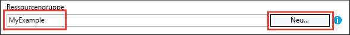

	Eine Ressourcengruppe ist eine Sammlung mit Azure-Ressourcen, z.B. Web-Apps, Datenbanken und VMs. Für dieses Tutorial ist es im Allgemeinen besser, eine neue Ressourcengruppe zu erstellen. Es ist dann einfacher, alle Azure-Ressourcen, die Sie für das Tutorial erstellen, in einem Schritt zu löschen. Weitere Informationen finden Sie unter [Übersicht über den Azure Resource Manager](../resource-group-overview.md).

4. Klicken Sie neben der Dropdownliste **App Service-Plan** auf die Schaltfläche **Neu**.

	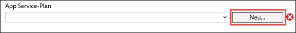

	Das Dialogfeld **App Service-Plan konfigurieren** wird angezeigt.

	

	In den folgenden Schritten wird ein App Service-Plan für die neue Ressourcengruppe konfiguriert. Mit einem App Service-Plan werden die Computeressourcen angegeben, auf denen Ihre Web-App ausgeführt wird. Wenn Sie beispielsweise den Free-Tarif wählen, wird Ihre API-App auf freigegebenen VMs ausgeführt. Für einige kostenpflichtige Tarife wird sie dagegen auf dedizierten VMs ausgeführt. Weitere Informationen finden Sie unter [App Service-Pläne – Übersicht](../app-service/azure-web-sites-web-hosting-plans-in-depth-overview.md).

5. Geben Sie im Dialogfeld **App Service-Plan konfigurieren** den Namen „MyExamplePlan“ oder einen anderen Namen Ihrer Wahl ein.

5. Wählen Sie in der Dropdownliste **Standort** den Standort aus, der Ihnen am nächsten liegt.

	Mit dieser Einstellung wird das Azure-Rechenzentrum angegeben, in dem Ihre App ausgeführt wird. In diesem Lernprogramm können Sie ohne spürbaren Unterschied eine beliebige Region auswählen. Bei einer Produktions-App sollte sich der Server allerdings so nah wie möglich bei den Clients befinden, mit denen darauf zugegriffen wird, um die [Latenz](http://www.bing.com/search?q=web%20latency%20introduction&qs=n&form=QBRE&pq=web%20latency%20introduction&sc=1-24&sp=-1&sk=&cvid=eefff99dfc864d25a75a83740f1e0090) zu minimieren.

5. Klicken Sie in der Dropdownliste **Größe** auf **Free**.

	Für dieses Tutorial bietet der Tarif „Free“ eine ausreichende Leistung.

6. Klicken Sie im Dialogfeld **App Service-Plan konfigurieren** auf **OK**.

7. Klicken Sie im Dialogfeld **App Service erstellen** auf **Erstellen**.

## Erstellen von Projekt und Web-App

Visual Studio erstellt das Webprojekt und die Web-App innerhalb kurzer Zeit, üblicherweise in weniger als einer Minute.

Im Fenster **Projektmappen-Explorer** werden die Dateien und Ordner in dem neuen Projekt angezeigt.

Im Fenster **Azure App Service Activity** wird angegeben, dass die Web-App erstellt wurde.

Im Fenster **Cloud-Explorer** können Sie Azure-Ressourcen (und somit auch die soeben erstellte Web-App) anzeigen und verwalten.

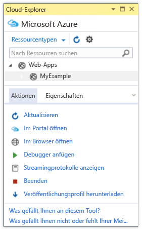
	
## Bereitstellen des Webprojekts für die Azure-Web-App

In diesem Abschnitt wird das Webprojekt für die Web-App bereitgestellt.

1. Klicken Sie im Projektmappen-Explorer mit der rechten Maustaste auf das Projekt, und wählen Sie **Veröffentlichen** aus.

	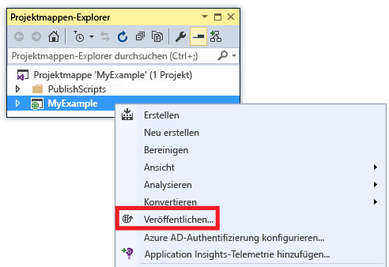

	Wenige Sekunden später wird der Assistent **Web veröffentlichen** geöffnet. Im Assistenten wird ein *Veröffentlichungsprofil* mit Einstellungen für die Bereitstellung des Webprojekts in der neuen Web-App angezeigt.

	Das Veröffentlichungsprofil enthält einen Benutzernamen und ein Kennwort für die Bereitstellung. Diese Anmeldeinformationen wurden für Sie generiert und müssen nicht eingegeben werden. Das Kennwort wird in einer versteckten benutzerspezifischen Datei im Ordner `Properties\PublishProfiles` verschlüsselt.
 
8. Klicken Sie auf der Registerkarte **Verbindung** des Assistenten **Web veröffentlichen** auf **Weiter**.

	

	Als Nächstes folgt die Registerkarte **Einstellungen**. Hier können Sie die Buildkonfiguration ändern, um einen Debugbuild für das [Remotedebuggen](../app-service-web/web-sites-dotnet-troubleshoot-visual-studio.md#remotedebug) bereitzustellen. Die Registerkarte bietet außerdem mehrere [Dateiveröffentlichungsoptionen](https://msdn.microsoft.com/library/dd465337.aspx#Anchor_2).

10. Klicken Sie auf der Registerkarte **Einstellungen** auf **Weiter**.

	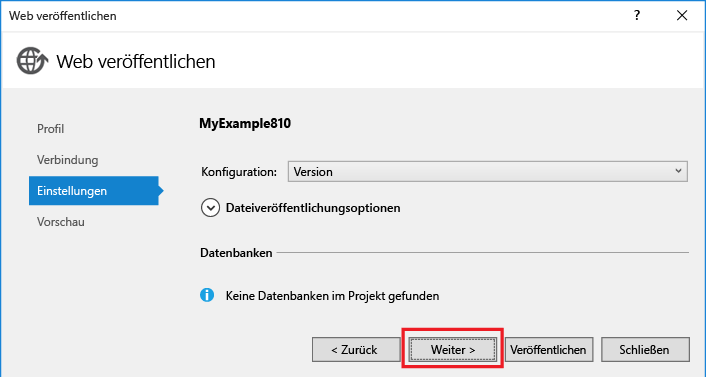

	Als Nächstes folgt die Registerkarte **Vorschau**. Hier können Sie sehen, welche Dateien aus Ihrem Projekt in die API-App kopiert werden. Wenn Sie ein Projekt für eine API-App bereitstellen, für die Sie bereits eine Bereitstellung durchgeführt haben, werden nur geänderte Dateien kopiert. Über die Schaltfläche **Vorschau starten** können Sie eine Liste mit den kopierten Dateien anzeigen.

11. Klicken Sie auf der Registerkarte **Vorschau** auf **Veröffentlichen**.

	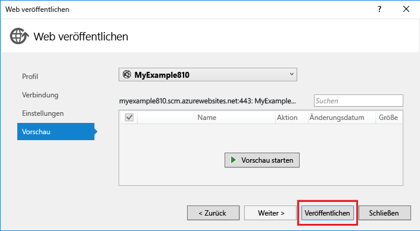

	Wenn Sie auf **Veröffentlichen** klicken, werden die Dateien von Visual Studio auf den Azure-Server kopiert. Dies kann ein oder zwei Minuten dauern.

	In den Fenstern **Ausgabe** und **Azure App Service-Aktivität** wird angezeigt, welche Bereitstellungsaktionen ausgeführt wurden, und es wird die erfolgreiche Durchführung der Bereitstellung gemeldet.

	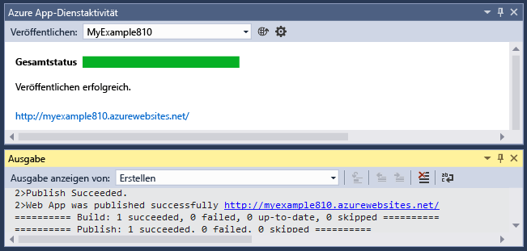

	Nach der erfolgreichen Bereitstellung wird die URL der bereitgestellten Web-App automatisch im Standardbrowser geöffnet, und die erstellte Anwendung wird jetzt in der Cloud ausgeführt. Die URL in der Adressleiste des Browsers gibt an, dass die Web-App aus dem Internet geladen wird.

	

	> [AZURE.TIP] Um eine schnelle Bereitstellung zu ermöglichen, können Sie die Symbolleiste **Webveröffentlichung mit einem Klick** aktivieren. Klicken Sie auf **Ansicht > Symbolleisten**, und wählen Sie dann **Webveröffentlichung mit einem Klick** aus. Auf der Symbolleiste können Sie ein Profil auswählen, auf eine Schaltfläche zum Veröffentlichen klicken oder auf eine Schaltfläche klicken, um den Assistenten **Web veröffentlichen** zu öffnen. 

## Problembehandlung

Wenn Sie beim Durcharbeiten dieses Tutorials auf ein Problem stoßen, sollten Sie sich vergewissern, dass Sie die aktuelle Version des Azure SDK für .NET verwenden. Das geht am einfachsten durch [Herunterladen des Azure SDK für Visual Studio 2015](http://go.microsoft.com/fwlink/?linkid=518003). Wenn Sie die aktuelle Version installiert haben, werden Sie vom Webplattform-Installer darüber informiert, dass keine Installation erforderlich ist.

Falls Sie sich in einem Unternehmensnetzwerk befinden und versuchen, die Bereitstellung für Azure App Service über eine Firewall durchzuführen, sollten Sie sicherstellen, dass die Ports 443 und 8172 für Web Deploy geöffnet sind. Wenn Sie diese Ports nicht öffnen können, helfen Ihnen die anderen Bereitstellungsoptionen unten im Abschnitt „Nächste Schritte“ weiter.

Sobald Ihre ASP.NET-Web-App in Azure App Service ausgeführt wird, können Sie sich näher mit Visual Studio-Features zur Vereinfachung der Problembehandlung befassen. Informationen zu Protokollierung, Remotedebuggen und weiteren Themen finden Sie unter [Problembehandlung von Azure-Web-Apps in Visual Studio](web-sites-dotnet-troubleshoot-visual-studio.md).

## Nächste Schritte

In diesem Lernprogramm haben Sie erfahren, wie eine einfache Webanwendung erstellt und in einer Azure-Web-App bereitgestellt wird. In den folgenden Themen und Ressourcen finden Sie weitere Informationen zu Azure App Service:

* Überwachen und Verwalten Ihrer Web-App im [Azure-Portal](https://portal.azure.com/)

	Weitere Informationen finden Sie in einer [Übersicht über das Azure-Portal](/services/management-portal/) und unter [Konfigurieren von Web-Apps in Azure App Service](web-sites-configure.md).

* Bereitstellen eines vorhandenen Webprojekts für eine neue Web-App mit Visual Studio

	Klicken Sie im Projektmappen-Explorer mit der rechten Maustaste auf das Projekt, und klicken Sie anschließend auf **Veröffentlichen**. Wählen Sie **Microsoft Azure App Service** als Veröffentlichungsziel aus, und klicken Sie anschließend auf **Neu**. Daraufhin werden die gleichen Dialogfelder angezeigt wie in diesem Tutorial.

* Bereitstellen eines Webprojekts über die Quellcodeverwaltung

	Informationen zum [Automatisieren der Bereitstellung](http://www.asp.net/aspnet/overview/developing-apps-with-windows-azure/building-real-world-cloud-apps-with-windows-azure/continuous-integration-and-continuous-delivery) über ein [Quellcode-Verwaltungssystem](http://www.asp.net/aspnet/overview/developing-apps-with-windows-azure/building-real-world-cloud-apps-with-windows-azure/source-control) finden Sie unter [Erste Schritte mit Web-Apps in Azure App Service](app-service-web-get-started.md) sowie unter [Bereitstellen der App in Azure App Service](web-sites-deploy.md).

* Bereitstellen einer ASP.NET-Web-API für eine API-App in Azure App Service

	Sie haben gelernt, wie Sie eine Instanz von Azure App Service erstellen, die in erster Linie eine Website hosten soll. App Service bietet auch Features zum Hosten von Web-APIs – etwa CORS-Unterstützung und API-Metadatenunterstützung für die Generierung von Clientcode. API-Features können zwar in einer Web-App genutzt werden, wenn Sie allerdings in erster Linie eine API in einer App Service-Instanz hosten möchten, ist eine **API-App** die bessere Wahl. Weitere Informationen finden Sie unter [Erste Schritte mit API-Apps und ASP.NET in Azure App Service](../app-service-api/app-service-api-dotnet-get-started.md).

* Hinzufügen eines benutzerdefinierten Domänennamens und von SSL

	Informationen zur Verwendung von SSL und einer eigenen Domäne (z. B. www.contoso.com statt contoso.azurewebsites.net) finden Sie in den folgenden Ressourcen:

	* [Konfigurieren eines benutzerdefinierten Domänennamens in Azure App Service](web-sites-custom-domain-name.md)
	* [Aktivieren von HTTPS für Azure-Web-Apps](web-sites-configure-ssl-certificate.md)

* Löschen Sie die Ressourcengruppe mit Ihrer Web-App sowie alle dazugehörigen Azure-Ressourcen, wenn Sie sie nicht mehr benötigen.

	Informationen zur Verwendung von Ressourcengruppen im Azure-Portal finden Sie unter [Bereitstellen von Ressourcen mit Azure Resource Manager-Vorlagen und Azure-Portal](../resource-group-template-deploy-portal.md).

*	Weitere Beispiele zum Erstellen einer ASP.NET-Web-App in App Service finden Sie in der 2015 Connect-[Demo](https://blogs.msdn.microsoft.com/visualstudio/2015/12/08/connectdemos-2015-healthclinic-biz/) [HealthClinic.biz](https://github.com/Microsoft/HealthClinic.biz) unter [Create and deploy an ASP.NET web app in Azure App Service](https://github.com/Microsoft/HealthClinic.biz/wiki/Create-and-deploy-an-ASP.NET-web-app-in-Azure-App-Service) (Erstellen und Bereitstellen einer ASP.NET-Web-App in Azure App Service). Weitere Schnellstarts aus der Demo „HealthClinic.biz“ finden Sie unter [Azure Developer Tools Quickstarts](https://github.com/Microsoft/HealthClinic.biz/wiki/Azure-Developer-Tools-Quickstarts) (Schnellstarts zu Azure-Entwicklungstools).

<!---HONumber=AcomDC_0727_2016-->