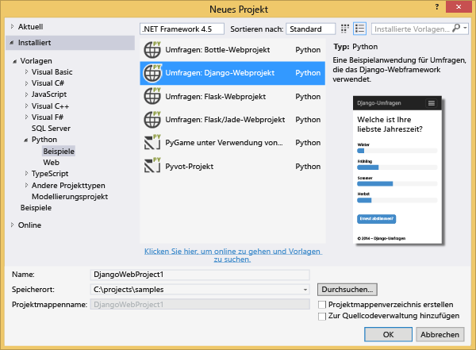
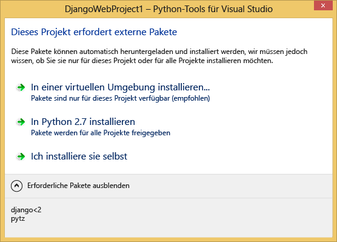
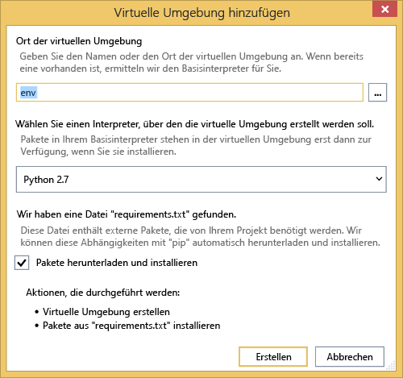
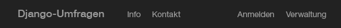
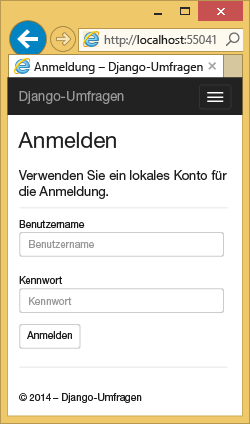
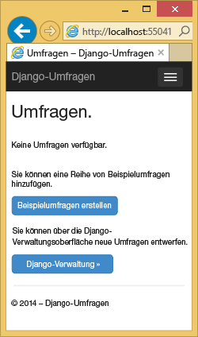
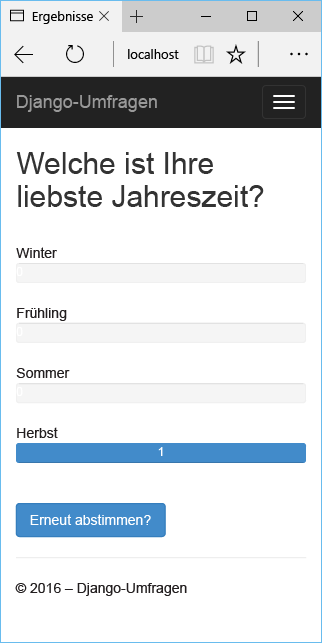
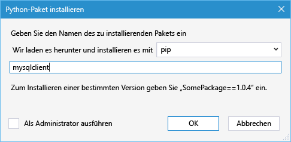
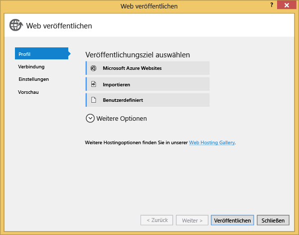
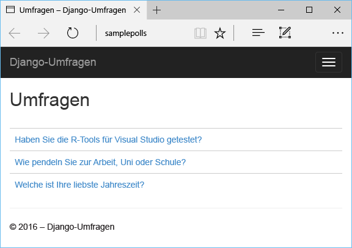

# Django und MySQL in Azure mit Python Tools 2.2 für Visual Studio
[!INCLUDE [tabs](../../includes/app-service-web-get-started-nav-tabs.md)]

In diesem Tutorial erstellen Sie mit [Python-Tools für Visual Studio](https://www.visualstudio.com/vs/python) unter Verwendung einer der PTVS-Beispielvorlagen eine einfache Web-App für Umfragen. Sie erfahren, wie Sie einen in Azure gehosteten MySQL-Dienst verwenden, wie Sie die Web-App für die Nutzung von MySQL konfigurieren und wie Sie sie für [Azure App Service-Web-Apps](http://go.microsoft.com/fwlink/?LinkId=529714)veröffentlichen.

> [!NOTE]
> Die Informationen in diesem Tutorial stehen auch in folgendem Video zur Verfügung:
> 
> [PTVS 2.1: Django app with MySQL][video] (PTVS 2.1: Django-App mit MySQL)
> 
> 

Weitere Artikel finden Sie im [Python Developer Center]. Diese Artikel behandeln die Entwicklung von Azure App Service-Web-Apps mit PTVS unter Verwendung der Webframeworks Bottle, Flask und Django sowie mithilfe der Dienste Azure Table Storage, MySQL und SQL-Datenbank. Der Schwerpunkt dieses Artikels liegt zwar auf App Service, die Schritte sind jedoch vergleichbar mit der Entwicklung von [Azure Cloud Services].

## Voraussetzungen
* Visual Studio 2015
* [Python 2.7 (32 Bit)] oder [Python 3.4 (32 Bit)]
* [Python Tools 2.2 für Visual Studio]
* [Python Tools 2.2 für Visual Studio, Beispiel-VSIX]
* [Azure SDK-Tools für Visual Studio 2015]
* Django 1.9 oder höher

[!INCLUDE [create-account-and-websites-note](../../includes/create-account-and-websites-note.md)]

<!-- This note should not render as part of the the previous include. -->

> [!NOTE]
> Wenn Sie Azure App Service ausprobieren möchten, ehe Sie sich für ein Azure-Konto anmelden, können Sie unter [App Service testen](https://azure.microsoft.com/try/app-service/)sofort kostenlos eine kurzlebige Starter-Web-App in App Service erstellen. Keine Kreditkarte erforderlich, keine Verpflichtungen.
> 
> 

## Erstellen des Projekts
In diesem Abschnitt erstellen Sie ein Visual Studio-Projekt unter Verwendung einer Beispielvorlage. Sie erstellen eine virtuelle Umgebung und installieren die erforderlichen Pakete. Sie erstellen eine lokale Datenbank mithilfe von SQLite. Anschließend führen Sie die Anwendung lokal aus.

1. Wählen Sie in Visual Studio **Datei** und **Neues Projekt** aus.
2. Die Projektvorlagen aus [Python Tools 2.2 für Visual Studio, Beispiel-VSIX] sind unter **Python** > **Beispiele** verfügbar. Wählen Sie **Polls Django Web Project** aus, und klicken Sie auf "OK", um das Projekt zu erstellen.
   
    
3. Sie werden aufgefordert, externe Pakete zu installieren. Wählen Sie **In einer virtuellen Umgebung installieren**aus.
   
    
4. Wählen Sie **Python 2.7** oder **Python 3.4** als Basisinterpreter.
   
    
5. Klicken Sie im **Projektmappen-Explorer** mit der rechten Maustaste auf den Projektknoten, und wählen Sie **Python** und anschließend **Django Migrate**.  Wählen Sie dann **Django Create Superuser**.
6. Dadurch wird eine Django-Verwaltungskonsole geöffnet und im Projektordner eine SQLite-Datenbank erstellt. Folgen Sie den Anweisungen zum Erstellen eines Benutzers.
7. Drücken Sie `F5`, um sicherzustellen, dass die Anwendung funktioniert.
8. Klicken Sie oben auf der Navigationsleiste auf **Anmelden** .
   
    
9. Geben Sie die Anmeldeinformationen für den Benutzer ein, den Sie beim Synchronisieren der Datenbank erstellt haben.
   
    
10. Klicken Sie auf **Beispielumfrage erstellen**.
    
     
11. Klicken Sie auf eine Umfrage und stimmen Sie ab.
    
     

## Erstellen einer MySQL-Datenbank
Als Datenbank erstellen Sie eine gehostete ClearDB MySQL-Datenbank in Azure.

Alternativ können Sie einen eigenen, auf Azure ausgeführten virtuellen Computer erstellen und dann MySQL selbst installieren und verwalten.

Mit den folgenden Schritten können Sie eine Datenbank im Rahmen eines kostenlosen Plans erstellen.

1. Melden Sie sich beim [Azure-Portal]an.
2. Klicken Sie oben im Navigationsbereich auf **Neu**, klicken Sie auf **Daten und Speicher**, und klicken Sie anschließend auf **MySQL-Datenbank**.
3. Konfigurieren Sie die neue MySQL-Datenbank, indem Sie eine neue Ressourcengruppe erstellen, und wählen Sie den entsprechenden Speicherort aus.
4. Klicken Sie nach der Erstellung der MySQL-Datenbank auf dem Datenbankblatt auf **Eigenschaften** .
5. Mithilfe der Schaltfläche "Kopieren" können Sie den Wert für **VERBINDUNGSZEICHENFOLGE** in die Zwischenablage kopieren.

## Konfigurieren des Projekts
In diesem Abschnitt konfigurieren Sie die Web-App, sodass sie die soeben erstellte MySQL-Datenbank verwendet. Außerdem installieren Sie weitere Python-Pakete, die für die Verwendung von MySQL-Datenbanken mit Django erforderlich sind. Anschließend führen Sie die Web-App lokal aus.

1. Öffnen Sie in Visual Studio die Datei **settings.py**(im Ordner *&lt;Projektname&gt;* ). Fügen Sie die Verbindungszeichenfolge temporär in den Editor ein. Die Verbindungszeichenfolge ist in folgendem Format:
   
        Database=<NAME>;Data Source=<HOST>;User Id=<USER>;Password=<PASSWORD>
   
    Ändern Sie die Standarddatenbank **ENGINE** für die Verwendung von MySQL, und legen Sie die Werte für **NAME**, **BENUTZER**, **KENNWORT** und **HOST** gemäß der **VERBINDUNGSZEICHENFOLGE** fest.
   
        DATABASES = {
            'default': {
                'ENGINE': 'django.db.backends.mysql',
                'NAME': '<Database>',
                'USER': '<User Id>',
                'PASSWORD': '<Password>',
                'HOST': '<Data Source>',
                'PORT': '',
            }
        }
2. Klicken Sie im Projektmappen-Explorer unter **Python-Umgebungen** mit der rechten Maustaste auf die virtuelle Umgebung, und wählen Sie **Python-Paket installieren** aus.
3. Installieren Sie das Paket `mysqlclient` mithilfe von **pip**.
   
    
4. Klicken Sie im **Projektmappen-Explorer** mit der rechten Maustaste auf den Projektknoten, und wählen Sie **Python** und anschließend **Django Migrate**.  Wählen Sie dann **Django Create Superuser**.
   
    Dadurch werden die Tabellen für die MySQL-Datenbank erstellt, die Sie im vorherigen Abschnitt erstellt haben. Folgen Sie den Aufforderungen zum Erstellen eines Benutzers. Dieser muss nicht dem Benutzer in der SQLite-Datenbank entsprechen, die im ersten Abschnitt dieses Artikels erstellt wurde.
5. Drücken Sie `F5`, um die Anwendung auszuführen. Die mittels **Beispielumfrage erstellen** erstellten Umfragen sowie die bei der Abstimmung erfassten Daten werden in der MySQL-Datenbank serialisiert.

## Veröffentlichen der Web-App in Azure App Service
Das Azure .NET SDK bietet eine einfache Möglichkeit zum Bereitstellen Ihrer Web-App in Azure App Service.

1. Klicken Sie im **Projektmappen-Explorer** mit der rechten Maustaste auf den Projektknoten, und wählen Sie **Veröffentlichen** aus.
   
    
2. Klicken Sie auf **Microsoft Azure App Service**.
3. Klicken Sie auf **Neu** , um eine neue Web-App zu erstellen.
4. Füllen Sie die folgenden Felder aus, und klicken Sie auf **Erstellen**:
   
   * **Name der Web-App**
   * **App Service-Plan**
   * **Ressourcengruppe**
   * **Region**
   * Lassen Sie für **Datenbankserver** die Option **Keine Datenbank** festlegt.
5. Übernehmen Sie alle anderen Standardwerte, und klicken Sie auf **Veröffentlichen**.
6. Ihr Webbrowser öffnet automatisch mit der veröffentlichten Web-App. Die Web-App funktioniert nun wie erwartet und verwendet die von Azure gehostete **MySQL** -Datenbank.
   
    
   
    Glückwunsch! Sie haben Ihre MySQL-basierte Web-App erfolgreich in Azure veröffentlicht.

## Nächste Schritte
Folgen Sie diesen Links, wenn Sie mehr über Python Tools für Visual Studio, Django und MySQL erfahren möchten.

* [Python Tools für Visual Studio – Dokumentation]
  * [Webprojekte]
  * [Cloud Service-Projekte]
  * [Remotedebugging in Microsoft Azure]
* [Dokumentation zu Django]
* [MySQL]

Weitere Informationen finden Sie im [Python Developer Center](/develop/python/).

<!--Link references-->

[Python Developer Center]: /develop/python/
[Azure Cloud Services]: ../cloud-services/cloud-services-python-ptvs.md

<!--External Link references-->

[Azure-Portal]: https://portal.azure.com
[Python Tools for Visual Studio]: https://www.visualstudio.com/vs/python/
[Python Tools 2.2 für Visual Studio]: http://go.microsoft.com/fwlink/?LinkID=624025
[Python Tools 2.2 für Visual Studio, Beispiel-VSIX]: http://go.microsoft.com/fwlink/?LinkID=624025
[Azure SDK-Tools für Visual Studio 2015]: http://go.microsoft.com/fwlink/?LinkId=518003
[Python 2.7 (32 Bit)]: http://go.microsoft.com/fwlink/?LinkId=517190
[Python 3.4 (32 Bit)]: http://go.microsoft.com/fwlink/?LinkId=517191
[Python Tools für Visual Studio – Dokumentation]: http://aka.ms/ptvsdocs
[Remotedebugging in Microsoft Azure]: http://go.microsoft.com/fwlink/?LinkId=624026
[Webprojekte]: http://go.microsoft.com/fwlink/?LinkId=624027
[Cloud Service-Projekte]: http://go.microsoft.com/fwlink/?LinkId=624028
[Dokumentation zu Django]: https://www.djangoproject.com/
[MySQL]: http://www.mysql.com/
[video]: http://youtu.be/oKCApIrS0Lo

<!--HONumber=Jan17_HO3-->

