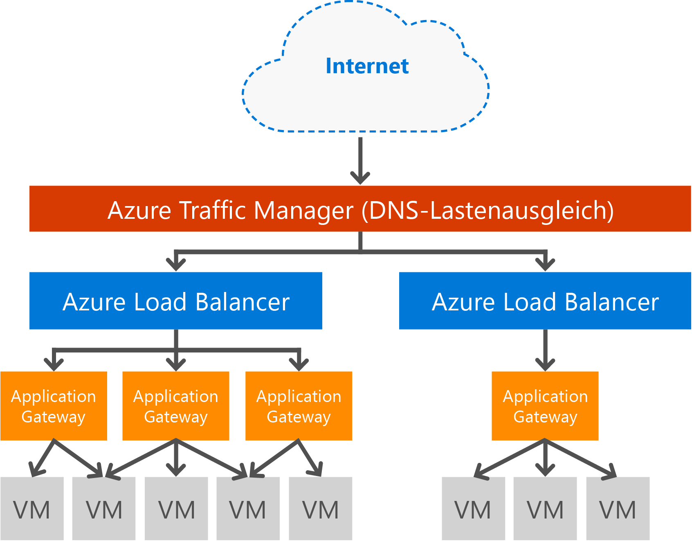

# Übersicht über Application Gateway

Microsoft Azure Application Gateway ist ein dediziertes virtuelles Gerät mit einem ADC (Application Delivery Controller) als Dienst und bietet verschiedene Lastenausgleichsfunktionen der Ebene 7 für Ihre Anwendung. Es setzt sich aus mehreren Worker-Instanzen zusammen, was Skalierbarkeit und hohe Verfügbarkeit ermöglicht. Kunden können damit die Produktivität von Webfarmen steigern, indem sie die CPU-intensive SSL-Beendigung an das Anwendungsgateway auslagern. Darüber hinaus werden noch weitere Routingfunktionen der Ebene 7 bereitgestellt. Hierzu zählen etwa die Roundrobin-Verteilung des eingehenden Datenverkehrs, cookiebasierte Sitzungsaffinität, Routing auf URL-Pfadbasis und die Möglichkeit zum Hosten mehrerer Websites hinter einer einzelnen Application Gateway-Instanz. Application Gateway kann als Gateway mit Internetanbindung, rein internes Gateway oder als Kombination dieser beiden Optionen konfiguriert werden. Application Gateway wird vollständig über Azure verwaltet und ist skalierbar und hoch verfügbar. Die Anwendung umfasst viele Diagnose- und Protokollierungsfunktionen zur Verbesserung der Verwaltbarkeit. Wenn Sie ein Anwendungsgateway erstellen, wird ein Endpunkt (öffentliche VIP oder interne ILB-IP) zugeordnet und für eingehenden Netzwerkverkehr verwendet. Diese VIP oder ILB-IP wird von Azure Load Balancer auf der Transportebene (TCP/UDP) bereitgestellt, und für den gesamten eingehenden Netzwerkdatenverkehr wird unter Verwendung der Anwendungsgateway-Workerinstanzen ein Lastenausgleich durchgeführt. Das Anwendungsgateway leitet den HTTP/HTTPS-Datenverkehr dann auf der Grundlage der Konfiguration (virtueller Computer, Clouddienst oder eine interne oder externe IP-Adresse) weiter.

Im Rahmen der WAF-SKU des Anwendungsgateways wird auch eine Web Application Firewall (WAF) bereitgestellt, die Webanwendungen vor gängigen Sicherheitslücken und Exploits im Web schützt. Hierfür nutzt die Web Application Firewall Regeln aus den [OWASP-Kernregelsätzen](https://www.owasp.org/index.php/Category:OWASP_ModSecurity_Core_Rule_Set_Project) (3.0 oder 2.2.9).

## Unterschiede zwischen Application Gateway-SKUs

Für Application Gateway stehen zwei SKUs zur Verfügung. Eine Standard-SKU und eine WAF-SKU (Web Application Firewall).

### Standard

Die Standard-SKU bietet SSL-Beendigung, cookiebasierte Sitzungsaffinität, Lastverteilung per Roundrobin, inhaltsbasiertes Routing, die Möglichkeit zum Hosten mehrerer Websites sowie Sicherheitsverbesserungen. Zu den Sicherheitsverbesserungen des Anwendungsgateways zählen SSL-Gruppenrichtlinienverwaltung, umfassende SSL-Unterstützung und SSL-Beendigung.

### Web Application Firewall (WAF)

Die WAF-SKU beinhaltet neben den Funktionen der Standard-SKU auch noch die [Web Application Firewall](application-gateway-web-application-firewall-overview.md). Diese bietet Angriffserkennungsregeln zum Schutz von Webanwendungen vor gängigen Sicherheitslücken und Exploits im Web.

## Features

Application Gateway unterstützt derzeit die Anwendungsbereitstellung der Ebene 7 mit folgenden Features:

* **[Web Application Firewall:](application-gateway-webapplicationfirewall-overview.md)** Die Web Application Firewall (WAF) in Azure Application Gateway schützt Webanwendungen vor gängigen webbasierten Angriffen wie Einschleusung von SQL-Befehlen, Cross-Site Scripting und Session Hijacking.
* **HTTP-Lastenausgleich:** Application Gateway bietet Roundrobin-Lastenausgleich. Der Lastenausgleich erfolgt auf Ebene 7 und wird ausschließlich für HTTP(S)-Datenverkehr verwendet.
* **Cookiebasierte Sitzungsaffinität:** Dieses Feature ist hilfreich, wenn eine Benutzersitzung auf dem gleichen Back-End bleiben soll. Mithilfe von auf dem Gateway verwalteten Cookies kann Application Gateway nachfolgenden Datenverkehr einer Benutzersitzung zur Verarbeitung an das gleiche Back-End weiterleiten. Dieses Feature ist wichtig, wenn der Sitzungsstatus für eine Benutzersitzung lokal auf dem Back-End-Server gespeichert wird.
* **[Secure Sockets Layer (SSL)-Auslagerung:](application-gateway-ssl-arm.md)** Dieses Feature befreit Ihre Webserver von der kostspieligen Entschlüsselung von HTTPS-Datenverkehr. Durch die Beendigung der SSL-Verbindung bei Application Gateway und die unverschlüsselte Weiterleitung der Anforderung an den Server wird der Webserver nicht durch die Entschlüsselung belastet.  Die Antwort wird von Application Gateway vor der Rückgabe an den Client wieder verschlüsselt. Dieses Feature ist nützlich, wenn sich das Back-End im gleichen geschützten virtuellen Netzwerk befindet wie die Application Gateway in Azure.
* **[End-to-End-SSL:](application-gateway-backend-ssl.md)** Application Gateway unterstützt die End-to-End-Verschlüsselung des Datenverkehrs. Hierfür wird in Application Gateway die SSL-Verbindung am Anwendungsgateway beendet. Das Gateway wendet dann die Routingregeln auf den Datenverkehr an, verschlüsselt das Paket erneut und leitet das Paket basierend auf den definierten Routingregeln an das entsprechende Back-End weiter. Antworten vom Webserver durchlaufen denselben Prozess zurück an den Endbenutzer.
* **[URL-basiertes Inhaltsrouting:](application-gateway-url-route-overview.md)** Dieses Feature ermöglicht die Verwendung unterschiedlicher Back-End-Server für unterschiedlichen Datenverkehr. So kann beispielsweise Datenverkehr für einen Ordner auf dem Webserver oder für ein CDN an ein anderes Back-End weitergeleitet werden, um Back-Ends, die keine spezifischen Inhalte bereitstellen, nicht unnötig zu belasten.
* **[Multisiterouting:](application-gateway-multi-site-overview.md)** Mit Application Gateway können Sie bis zu 20 Websites in einem einzelnen Anwendungsgateway zusammenfassen.
* **[WebSocket-Unterstützung:](application-gateway-websocket.md)** Die native WebSocket-Unterstützung ist ein weiteres tolles Feature von Application Gateway.
* **[Systemüberwachung:](application-gateway-probe-overview.md)** Application Gateway bietet standardmäßig die Systemüberwachung von Back-End-Ressourcen und benutzerdefinierte Stichproben an, um spezifischere Szenarien zu überwachen.
* **[Erweiterte Diagnose](application-gateway-diagnostics.md)**: Application Gateway bietet umfassende Diagnose- und Zugriffsprotokolle. Firewallprotokolle stehen für Application Gateway-Ressourcen zur Verfügung, für die WAF aktiviert ist.

## Vorteile

Application Gateway ist nützlich für Folgendes:

* Anwendungen, bei denen Anforderungen einer Benutzer-/Clientsitzung den gleichen virtuellen Back-End-Computer erreichen müssen. Beispiele wären etwa Einkaufswagenanwendungen und E-Mail-Webserver.
* Beseitigung des Mehraufwands der SSL-Beendigung für Webserverfarmen.
* Anwendungen, wie z.B. ein Content Delivery Network, für die mehrere HTTP-Anforderungen über die gleiche lange bestehende TCP-Verbindung an verschiedene Back-End-Server weitergeleitet werden bzw. für die dort ein Lastenausgleich erfolgen muss.
* Anwendungen, die den WebSocket-Datenverkehr unterstützen
* Schutz von Webanwendungen vor allgemeinen webbasierten Angriffen, z.B. Einschleusung von SQL-Befehlen, Cross-Site Scripting-Angriffe und Übernahme von Sitzungen.

Der Application Gateway-Lastenausgleich als ein von Azure verwalteter Dienst ermöglicht die Bereitstellung eines Lastenausgleichs der Ebene 7 hinter dem Azure Load Balancer. Traffic Manager dient zum Abschließen des Szenarios (wie in der folgenden Abbildung dargestellt). Traffic Manager ermöglicht die Umleitung (und Verfügbarkeit) von Datenverkehr an mehrere Application Gateway-Ressourcen in unterschiedlichen Regionen, während Application Gateway einen regionsübergreifenden Layer-7-Lastenausgleich bietet. Ein Beispiel dieses Szenarios finden Sie unter [Verwenden von Lastenausgleichsdiensten in der Azure-Cloud](../traffic-manager/traffic-manager-load-balancing-azure.md).

[!INCLUDE [load-balancer-compare-tm-ag-lb-include.md](../../includes/load-balancer-compare-tm-ag-lb-include.md)]

## Gatewaygrößen und -instanzen

Application Gateway wird derzeit in drei Größen angeboten: **klein**, **mittel** und **groß**. Kleine Instanzen sind für Entwicklungs- und Testszenarien vorgesehen.

Sie können bis zu 50 Application Gateways pro Abonnement erstellen, und jedes Application Gateway kann jeweils bis zu 10 Instanzen aufweisen. Jedes Anwendungsgateway kann aus 20 HTTP-Listenern bestehen. Eine vollständige Liste mit den Einschränkungen von Anwendungsgateways finden Sie unter [Application Gateway service limits (Einschränkungen von Application Gateway)](../azure-subscription-service-limits.md?toc=%2fazure%2fapplication-gateway%2ftoc.json#application-gateway-limits).

Die folgende Tabelle zeigt einen durchschnittlichen Leistungsdurchsatz für jede Anwendungsgatewayinstanz mit aktivierter SSL-Auslagerung:

| Back-End-Seitenantwort | Klein | Mittel | Groß |
| --- | --- | --- | --- |
| 6K |7,5 MBit/s |13 MBit/s |50 MBit/s |
| 100k |35 MBit/s |100 MBit/s |200 MBit/s |

> [!NOTE]
> Hierbei handelt es sich um ungefähre Werte für den Durchsatz des Anwendungsgateways. Der tatsächliche Durchsatz ist abhängig von verschiedenen Umgebungsdetails wie etwa durchschnittliche Seitengröße, Speicherort der Back-End-Instanzen und Verarbeitungszeit für die Seitenbereitstellung. Für genaue Leistungsangaben sollten Sie Ihre eigenen Tests ausführen. Diese Werte dienen nur als Leitfaden für die Kapazitätsplanung.

## Systemüberwachung

Azure Application Gateway überprüft die Integrität der Back-End-Instanzen automatisch mithilfe einfacher oder benutzerdefinierter Integritätstests. Mit Integritätstests wird so sichergestellt, dass nur fehlerfreie Hosts auf Datenverkehr reagieren. Weitere Informationen finden Sie unter [Systemüberwachung von Application Gateway – Übersicht](application-gateway-probe-overview.md).

## Konfigurieren und Verwalten

Application Gateway kann für seinen Endpunkt eine öffentliche IP-Adresse, eine private IP-Adresse oder beides besitzen (sofern konfiguriert). Application Gateway wird innerhalb eines virtuellen Netzwerks in einem eigenen Subnetz konfiguriert. Das für Application Gateway erstellte oder verwendete Subnetz darf außer anderen Anwendungsgateways keine anderen Arten von Ressourcen enthalten. Zum Absichern von Back-End-Ressourcen können die Back-End-Server sich in einem anderen Subnetz im gleichen virtuellen Netzwerk befinden wie das Anwendungsgateway. Dieses zusätzliche Subnetz wird für die Back-End-Anwendungen nicht benötigt. Solange das Anwendungsgateway die IP-Adresse erreichen kann, kann das Application Gateway ADC-Funktionen für die Back-End-Server bereitstellen. 

Sie können ein Anwendungsgateway mit REST-APIs, mit PowerShell-Cmdlets, mithilfe der Azure-Befehlszeilenschnittstelle oder über das [Azure-Portal](https://portal.azure.com/)erstellen und verwalten. Sollten Sie noch Fragen zu Application Gateway haben, finden Sie unter [Häufig gestellte Fragen zu Azure Application Gateway](application-gateway-faq.md) eine Reihe häufig gestellter Fragen.

## Preise

Der Preis basiert auf einer Gatewayinstanzgebühr pro Stunde sowie auf einer Datenverarbeitungsgebühr. Der stundenbasierte Gatewaypreis für die WAF-SKU entspricht nicht den Gebühren für die Standard-SKU und ist unter [Application Gateway – Preise](https://azure.microsoft.com/pricing/details/application-gateway/) zu finden. Die Datenverarbeitungsgebühren bleiben unverändert.

## Häufig gestellte Fragen

Häufig gestellte Fragen zu Application Gateway finden Sie unter [Häufig gestellte Fragen zu Azure Application Gateway](application-gateway-faq.md).
## Nächste Schritte

Nachdem Sie sich mit Anwendungsgateways vertraut gemacht haben, können Sie [ein Anwendungsgateway erstellen](application-gateway-create-gateway-portal.md) oder [ein Anwendungsgateway für SSL-Auslagerung erstellen](application-gateway-ssl-arm.md), um einen Lastenausgleich für HTTPS-Verbindungen durchzuführen.

Weitere Informationen zum Erstellen eines Anwendungsgateways mit URL-basiertem Inhaltsrouting finden Sie unter [Erstellen eines Anwendungsgateways mit URL-basiertem Routing](application-gateway-create-url-route-arm-ps.md) .

