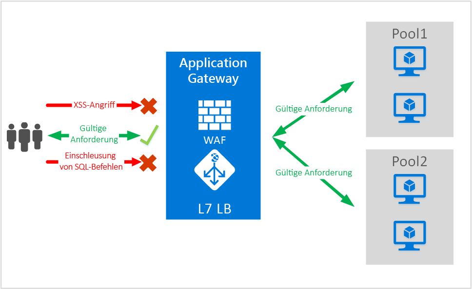
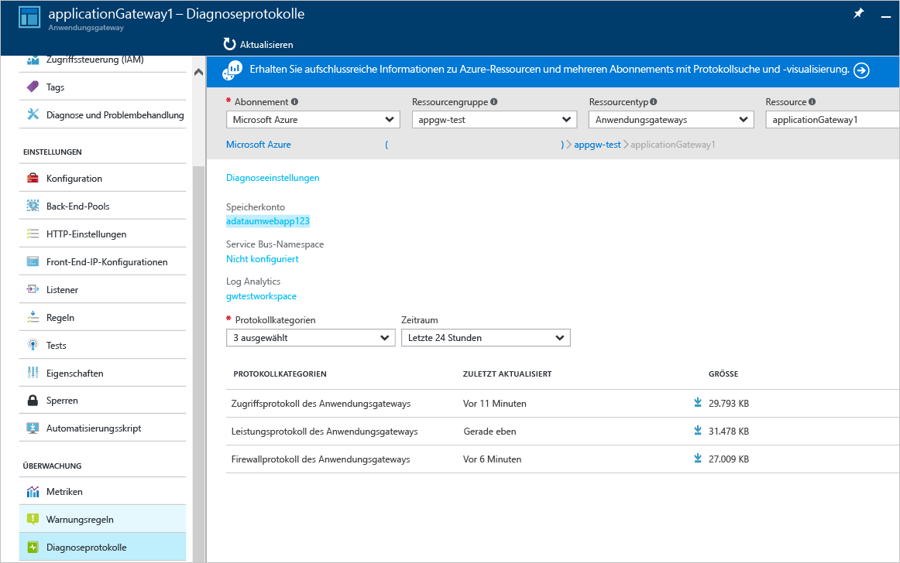

# <a name="application-gateway-web-application-firewall-preview"></a>Web Application Firewall für Application Gateway (Vorschau)

Web Application Firewall (WAF) ist ein Feature von Azure Application Gateway, das Schutz für Webanwendungen bietet, die Application Gateway für ADC-Standardfunktionen (Application Delivery Control, Steuerung der Anwendungsbereitstellung) nutzen. Web Application Firewall schützt sie vor den nach OWASP 10 häufigsten Web-Sicherheitslücken. Webanwendungen sind zunehmend Ziele böswilliger Angriffe, die allgemein bekannte Sicherheitslücken ausnutzen. Zu diesen Sicherheitslücken (Exploits) gehören üblicherweise Angriffe durch Einschleusung von SQL-Befehlen oder Angriffe durch websiteübergreifende Skripts, um nur einige zu nennen. Das Verhindern solcher Angriffe im Anwendungscode ist oft schwierig und erfordert strenge Wartung, Patching und Überwachung auf verschiedenen Ebenen der Anwendungstopologie. Eine zentrale Webanwendungs-Firewall zum Schutz vor Webangriffen vereinfacht die Sicherheitsverwaltung erheblich und verleiht der Anwendung eine bessere Sicherung gegen die Bedrohungen durch Angriffe. Mit einer WAF-Lösung können Sie ebenfalls schneller auf ein Sicherheitsrisiko reagieren, da eine bekannte Schwachstelle an einem zentralen Ort gepatcht wird, statt jede einzelne Webanwendung separat zu sichern. Vorhandene Anwendungsgateways können problemlos in ein Anwendungsgateway mit Web Application Firewall konvertiert werden.



Application Gateway fungiert als Controller für die Anwendungsbereitstellung und bietet SSL-Beendigung, cookiebasierte Sitzungsaffinität, Lastverteilung per Roundrobin, inhaltsbasiertes Routing, die Möglichkeit zum Hosten mehrerer Websites sowie Sicherheitsverbesserungen. Zu den von Application Gateway bereitgestellten Sicherheitsverbesserungen gehören die SSL-Gruppenrichtlinienverwaltung sowie umfassende SSL-Unterstützung. Wir verstärken die Anwendungssicherheitsfunktionen unseres Diensts durch die Einführung einer WAF (Web Application Firewall), die direkt in das ADC-Angebot integriert ist. So erhalten Sie einen einfach konfigurierbaren zentralen Ort zum Verwalten und Schützen Ihrer Webanwendungen vor gängigen Sicherheitsrisiken im Web.

Das Konfigurieren einer WAF auf dem Anwendungsgateway bietet die folgenden Vorteile:

* Schützen Sie Ihre Webanwendung vor Sicherheitsrisiken und Angriffen im Web, ohne den Back-End-Code zu verändern.
* Schützen Sie mehrere Webanwendungen gleichzeitig hinter einem Anwendungsgateway. Application Gateway unterstützt das Hosten von bis zu 20 Websites hinter einem einzelnen Gateway, die alle vor Webangriffen geschützt werden können.
* Überwachen Sie Ihre Webanwendung auf Angriffe, indem Sie Echtzeitberichte verwenden, die anhand von WAF-Protokollen des Anwendungsgateways generiert werden.
* Bestimmte Kompatibilitätssteuerelemente erfordern, dass alle über das Internet zugänglichen Endpunkte durch eine WAF-Lösung geschützt werden müssen. Durch die Verwendung von Application Gateway mit aktivierter WAF können Sie diese Kompatibilitätsauflagen erfüllen.

## <a name="overview"></a>Übersicht

Die Application Gateway-WAF wird in einer neuen SKU angeboten (WAF SKU) und ist mit ModSecurity und dem OWASP-Kernregelsatz vorkonfiguriert. So bietet sie Baselineschutz vor den meisten von OWASP zusammengestellten Top 10-Sicherheitslücken im Web.

* Schutz vor Einschleusung von SQL-Befehlen
* Schutz vor websiteübergreifenden Skripts
* Schutz vor allgemeinen Webangriffen wie Befehlseinschleusung, HTTP Request Smuggling, HTTP Response Splitting und Remote File Inclusion
* Schutz vor Verletzungen des HTTP-Protokolls
* Schutz vor HTTP-Protokollanomalien, z.B. fehlende user-agent- und accept-Header des Hosts
* Verhindern von Bots, Crawlern und Scannern
* Erkennung häufiger Fehler bei der Anwendungskonfiguration (d.h. Apache, IIS usw.)

## <a name="waf-modes"></a>WAF-Modi

Die Application Gateway-WAF kann für die Ausführung in den folgenden beiden Modi konfiguriert werden:

* **Erkennungsmodus** : Wenn sie für die Ausführung im Erkennungsmodus konfiguriert ist, überwacht die Application Gateway-WAF alle Bedrohungswarnungen und protokolliert sie in einer Protokolldatei. Sie müssen sicherstellen, dass die Protokollierung von Diagnosedaten für Application Gateway im Abschnitt „Diagnose“ aktiviert ist. Zudem müssen Sie sicherstellen, dass das WAF-Protokoll ausgewählt und aktiviert ist.
* **Schutzmodus** : Wenn die WAF für die Ausführung im Schutzmodus konfiguriert ist, blockiert Application Gateway aktiv Eindringlinge und Angriffe, die von den Regeln erkannt werden. Der Angreifer erhält eine Ausnahme 403 (nicht autorisierter Zugriff), und die Verbindung wird beendet. Der Schutzmodus protokolliert solche Angriffe weiterhin in den WAF-Protokollen.

## <a name="application-gateway-waf-reports"></a>Application Gateway-WAF-Berichte

Die Application Gateway-WAF bietet detaillierte Berichte zu jeder erkannten Bedrohung. Die Protokollierung ist in Azure-Diagnoseprotokolle integriert, und Warnungen werden in einem JSON-Format aufgezeichnet.



```json
{
    "resourceId": "/SUBSCRIPTIONS/<subscriptionId>/RESOURCEGROUPS/<resourceGroupName>/PROVIDERS/MICROSOFT.NETWORK/APPLICATIONGATEWAYS/<applicationGatewayName>",
    "operationName": "ApplicationGatewayFirewall",
    "time": "2016-09-20T00:40:04.9138513Z",
    "category": "ApplicationGatewayFirewallLog",
    "properties":     {
        "instanceId":"ApplicationGatewayRole_IN_0",
        "clientIp":"108.41.16.164",
        "clientPort":1815,
        "requestUri":"/wavsep/active/RXSS-Detection-Evaluation-POST/",
        "ruleId":"OWASP_973336",
        "message":"XSS Filter - Category 1: Script Tag Vector",
        "action":"Logged",
        "site":"Global",
        "message":"XSS Filter - Category 1: Script Tag Vector",
        "details":{"message":" Warning. Pattern match "(?i)(<script","file":"/owasp_crs/base_rules/modsecurity_crs_41_xss_attacks.conf","line":"14"}}
}
```

## <a name="application-gateway-waf-sku-pricing"></a>SKU-Preise für die Application Gateway-WAF

Während der Vorschau fallen keine zusätzlichen Gebühren für die Nutzung der Application Gateway-WAF an. Ihre vorhandenen Basic-SKU-Gebühren werden weiterhin in Rechnung gestellt. Die WAF-SKU-Gebühren werden zum Zeitpunkt der allgemeinen Verfügbarkeit mitgeteilt. Bei Kunden, die sich für die Bereitstellung von Application Gateway in der WAF-SKU entschieden haben, fallen die WAF-SKU-Preise erst nach Ankündigung der allgemeinen Verfügbarkeit an.

## <a name="next-steps"></a>Nächste Schritte

Nachdem Sie weitere Funktionen der WAF kennen gelernt haben, finden Sie weitere Informationen unter [Konfigurieren der Web Application Firewall auf Application Gateway](application-gateway-web-application-firewall-portal.md).


<!--HONumber=Jan17_HO1-->


