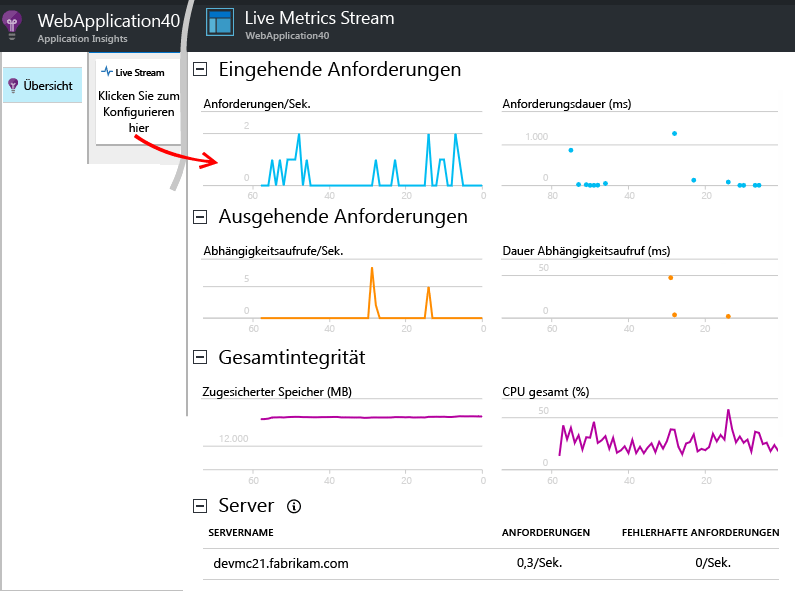
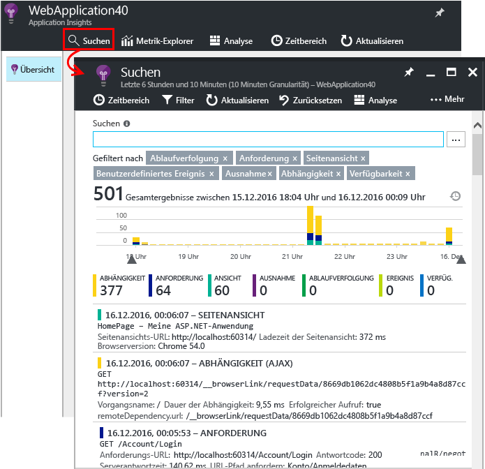
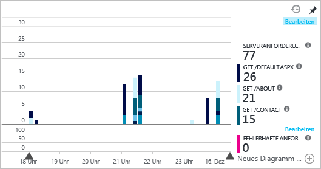
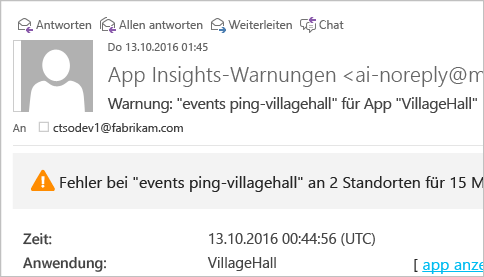
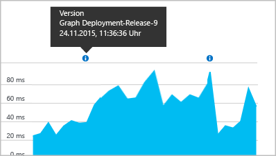

# <a name="set-up-application-insights-for-your-aspnet-website"></a>Einrichten von Application Insights für Ihre ASP.NET-Website
[Azure Application Insights](app-insights-overview.md) überwacht Ihre Liveanwendung, um [Leistungsprobleme und -ausnahmen zu erkennen und zu diagnostizieren](app-insights-detect-triage-diagnose.md). Außerdem können Sie damit [ermitteln, wie Ihre App genutzt wird](app-insights-overview-usage.md). Dies ist für die Web-Apps-Funktion von Azure App Service und für Apps möglich, die auf Ihren eigenen lokalen IIS-Servern oder auf Cloud-VMs gehostet werden.

## <a name="before-you-start"></a>Vorbereitung
Erforderlich:

* Visual Studio 2013, Update 3 oder höher. Eine neuere Version ist besser.
* Ein Abonnement für [Microsoft Azure](http://azure.com). Wenn Ihr Team oder Ihre Organisation über ein Azure-Abonnement verfügt, kann der Besitzer Sie mit Ihrem [Microsoft-Konto](http://live.com) hinzufügen.

Es gibt noch weitere Themen, die für Sie unter Umständen von Interesse sind:

* [Instrumentieren von Web-Apps zur Laufzeit mit Application Insights](app-insights-monitor-performance-live-website-now.md)
* [Azure Cloud Services](app-insights-cloudservices.md)

## <a name="ide"></a> Schritt 1: Hinzufügen des Application Insights SDK

Klicken Sie im Projektmappen-Explorer mit der rechten Maustaste auf Ihr Web-App-Projekt, und klicken Sie auf **Hinzufügen** > **Application Insights-Telemetrie** oder **Application Insights konfigurieren**.


(Visual Studio 2015 enthält im Dialogfeld „Neues Projekt“ auch eine Option zum Hinzufügen von Application Insights.)

Fahren Sie mit der Seite für die Application Insights-Konfiguration fort:


1. Wählen Sie das Konto und das Abonnement aus, das Sie zum Zugreifen auf Azure verwenden.
2. Wählen Sie die Ressource in Azure aus, über die Sie die Daten Ihrer App anzeigen möchten. Normalerweise erstellen Sie eine separate Ressource für jede App. Wenn Sie die Ressourcengruppe oder den Speicherort Ihrer Daten festlegen möchten, klicken Sie auf **Einstellungen konfigurieren**. Ressourcengruppen werden zum Steuern das Zugriffs auf die Daten verwendet. Wenn Sie über mehrere Apps verfügen, die einen Teil desselben Systems bilden, können Sie die dazugehörigen Application Insights-Daten in derselben Ressourcengruppe anordnen.
3. Bis zu einem bestimmten Volumen von Telemetrie ist Application Insights kostenlos. Sie können die Obergrenze auf dieses Volumen festlegen, um das Anfallen von Gebühren zu verhindern. Nach der Erstellung der Ressource können Sie Ihre Auswahl im Portal ändern, indem Sie **Features und Preise** > **Datenverwaltung** > **Volumenbegrenzung pro Tag** öffnen.
4. Klicken Sie auf **Registrieren**, um den Prozess zu starten und Application Insights für Ihre Web-App zu konfigurieren. Die Telemetriedaten werden an das [Azure-Portal](https://portal.azure.com) gesendet – sowohl während des Debuggens als auch nach dem Veröffentlichen Ihrer App.
5. Alternativ dazu können Sie das Application Insights SDK auch einfach Ihrer App hinzufügen. In diesem Fall werden die Telemetriedaten in Visual Studio angezeigt, während Sie debuggen. Sie können später zu dieser Konfigurationsseite zurückkehren oder warten, bis Sie Ihre App bereitgestellt haben, und die [Telemetrie zur Laufzeit aktivieren](app-insights-monitor-performance-live-website-now.md).


## <a name="run"></a> Schritt 2: Ausführen der App
Führen Sie Ihre App mit F5 aus. Öffnen Sie verschiedene Seiten, um Telemetriedaten zu generieren.

In Visual Studio wird die Anzahl von protokollierten Ereignissen angezeigt.


## <a name="step-3-see-your-telemetry-in-visual-studio-or-application-insights"></a>Schritt 3: Anzeigen der Telemetriedaten in Visual Studio oder Application Insights
Sie können Ihre Telemetriedaten entweder in Visual Studio oder im Application Insights-Webportal anzeigen.

Öffnen Sie **in Visual Studio** das Application Insights-Fenster. Klicken Sie entweder auf die Schaltfläche **Application Insights**, oder klicken Sie im Projektmappen-Explorer mit der rechten Maustaste auf das Projekt, wählen Sie **Application Insights**, und klicken Sie dann auf **Nach Livetelemetriedaten suchen**.

Im Application Insights-Suchfenster in Visual Studio wird die Ansicht mit den **Daten aus der Debugsitzung** für die Telemetriedaten angezeigt, die auf der Serverseite Ihrer App generiert werden. Experimentieren Sie mit den Filtern, und klicken Sie auf ein beliebiges Ereignis, um weitere Details anzuzeigen.


> [!NOTE]
> Gehen Sie wie folgt vor, wenn keine Daten angezeigt werden: Stellen Sie sicher, dass der richtige Zeitbereich festgelegt ist, und klicken Sie auf das Suchsymbol.

[Erfahren Sie mehr zu Application Insights-Tools in Visual Studio](app-insights-visual-studio.md).

<a name="monitor"></a>
### <a name="the-application-insights-web-portal"></a>Application Insights-Webportal
Sie können die Telemetriedaten auch im **Application Insights-Webportal** anzeigen, sofern Sie nicht nur das SDK installiert haben. Das Portal verfügt über eine größere Zahl von Diagrammen, Analysetools und Dashboards als Visual Studio.

Öffnen Sie die Application Insights-Ressource. Melden Sie sich entweder beim [Azure-Portal](https://portal.azure.com/) an, und suchen Sie dort danach, oder klicken Sie in Visual Studio mit der rechten Maustaste auf das Projekt, um es aufzurufen.


> [!NOTE]
> Falls Sie einen Zugriffsfehler erhalten, verfügen Sie unter Umständen über mehr als eine Gruppe von Microsoft-Anmeldeinformationen und haben sich mit den falschen Informationen angemeldet. Melden Sie sich vom Portal ab und dann wieder an.

Das Portal wird mit einer Ansicht der Telemetriedaten Ihrer App geöffnet.


Klicken Sie auf eine beliebige Kachel oder ein beliebiges Diagramm, um weitere Details anzuzeigen.

### <a name="more-details-in-the-application-insights-web-portal"></a>Weitere Details im Application Insights-Webportal
Hier sind einige Beispiele für die weiteren Details im Portal angegeben.

* [**Live Metrics Stream**](app-insights-live-stream.md) zeigt Telemetriedaten beinahe sofort an.

    

    Öffnen Sie den Live Metrics Stream während der Ausführung der App, damit eine Verbindung hergestellt werden kann.

    Der Live Metrics Stream zeigt Telemetriedaten erst eine Minute nach dem Senden an. Für weitere Untersuchungen des Verlaufs verwenden Sie die Suche, den Metrik-Explorer und Analysen. Es kann einige Minuten dauern, bis Daten dort angezeigt werden.

* Die [**Suche**](app-insights-diagnostic-search.md) zeigt einzelne Ereignisse wie Anforderungen, Ausnahmen und Seitenansichten. Sie können nach Ereignistyp, Begriffübereinstimmung und Eigenschaftswerten filtern. Klicken Sie auf beliebiges Ereignis, um seine Eigenschaften und verwandten Ereignisse anzuzeigen.

    

 * Im Entwicklungsmodus werden möglicherweise zahlreiche Abhängigkeits ( (AJAX)-Ereignisse angezeigt. Dabei handelt es sich um Synchronisierungen zwischen dem Browser und dem Serveremulator. Klicken Sie auf den Filter **Abhängigkeit**, um sie auszublenden.
* [**Aggregierte Metriken**](app-insights-metrics-explorer.md) wie z.B. die Anforderungs- und Fehlerraten werden in den Diagrammen angezeigt. Klicken Sie auf ein beliebiges Diagramm, um ein Blatt mit mehr Details zu öffnen. Klicken Sie auf das Tag **Bearbeiten** eines beliebigen Diagramms, um Filter und Größe festzulegen.

    

[Erfahren Sie mehr über die Verwendung von Application Insights im Azure-Portal](app-insights-dashboards.md).

## <a name="step-4-publish-your-app"></a>Schritt 4: Veröffentlichen der App
Veröffentlichen Sie Ihre App auf Ihrem IIS-Server oder in Azure. Sehen Sie sich [Live Metrics Stream](app-insights-metrics-explorer.md#live-metrics-stream) an, um sicherzustellen, dass alles reibungslos funktioniert.

Sie können dann verfolgen, wie Ihre Telemetriedaten im Application Insights-Portal erstellt werden. Darin können Sie Metriken überwachen, die Telemetriedaten durchsuchen und [Dashboards](app-insights-dashboards.md) einrichten. Außerdem können Sie die leistungsfähige [Analytics-Abfragesprache](app-insights-analytics.md) verwenden, um die Nutzung und Leistung zu analysieren oder nach bestimmten Ereignissen zu suchen.

Sie können Ihre Telemetriedaten auch in [Visual Studio](app-insights-visual-studio.md) mit Tools wie der Diagnosesuche und [Trends](app-insights-visual-studio-trends.md) weiter analysieren.

> [!NOTE]
> Wenn Ihre App so viele Telemetriedaten sendet, dass die [Einschränkungsgrenzwerte](app-insights-pricing.md#limits-summary) bald erreicht werden, wird das automatische [Sampling](app-insights-sampling.md) aktiviert. Mit dem Sampling wird die Menge der von der App gesendeten Telemetriedaten reduziert, während gleichzeitig korrelierte Daten für Diagnosezwecke beibehalten werden.
>
>

## <a name="land"></a> Wie funktioniert der Befehl „Application Insights hinzufügen“?
Application Insights sendet Telemetriedaten aus Ihrer App an das Application Insights-Portal (in Azure gehostet).


Mit dem Befehl werden also drei Schritte ausgeführt:

1. Er fügt das NuGet-Paket mit dem Application Insights-Web-SDK dem Projekt hinzu. Um es in Visual Studio anzuzeigen, klicken Sie mit der rechten Maustaste auf Ihr Projekt und wählen **NuGet-Pakete verwalten**.
2. Er erstellt eine Application Insights-Ressource im [Azure-Portal](https://portal.azure.com/). Hier werden Ihre Daten angezeigt. Er ruft den *Instrumentationsschlüssel* ab, der die Ressource identifiziert.
3. Fügt den Instrumentationsschlüssel in `ApplicationInsights.config`ein, damit das SDK Telemetriedaten an das Portal senden kann.

Sie können diese Schritte für [ASP.NET 4](app-insights-windows-services.md) oder [ASP.NET Core](https://github.com/Microsoft/ApplicationInsights-aspnetcore/wiki/Getting-Started) auch manuell ausführen.

### <a name="upgrade-to-future-sdk-versions"></a>Durchführen eines Upgrades auf zukünftige SDK-Versionen
Für ein Upgrade auf eine [neue Version des SDK](https://github.com/Microsoft/ApplicationInsights-dotnet-server/releases) öffnen Sie wieder den **NuGet-Paket-Manager** und filtern die Ansicht nach installierten Paketen. Wählen Sie **Microsoft.ApplicationInsights.Web** und dann **Upgrade** aus.

Wenn Sie Anpassungen an „ApplicationInsights.config“ vorgenommen haben, sollten Sie diese vor dem Upgrade speichern. Übernehmen Sie Ihre Änderungen anschließend für die neue Version.

## <a name="add-more-telemetry"></a>Hinzufügen von weiteren Telemetrieelementen
Hier sind weitere Arten von Telemetriedaten angegeben, die Sie hinzufügen können.
### <a name="dependencies-exceptions-and-performance-counters"></a>Abhängigkeiten, Ausnahmen und Leistungsindikatoren

[Installieren Sie den Statusmonitor](http://go.microsoft.com/fwlink/?LinkId=506648) auf Ihrem IIS-Servercomputer, um zusätzliche Telemetriedaten zu Ihren Web-Apps zu erhalten. Wenn der Monitor bereits installiert ist, müssen Sie nichts weiter tun. (Unter Umständen haben Sie den Statusmonitor bereits verwendet, um eine App während der Laufzeit zu überwachen.)

Durch die Verwendung des Statusmonitors neben dem Buildzeit SDK erhalten Sie einen vollständigen Satz von Telemetriedaten, der folgende Informationen enthält:

* [Leistungsindikatoren](app-insights-performance-counters.md): CPU-, Arbeitsspeicher-, Datenträger- und andere Leistungsindikatoren für Ihre App.
* [Ausnahmen](app-insights-asp-net-exceptions.md): Ausführlichere Telemetriedaten für einige Ausnahmen.
* [Abhängigkeiten](app-insights-asp-net-dependencies.md): Einschließlich der Rückgabewerte.

### <a name="webpages-and-single-page-apps"></a>Webseiten und Einzelseiten-Apps
1. [Fügen Sie Ihren Webseiten den JavaScript-Codeausschnitt hinzu](app-insights-javascript.md), um Daten zu Seitenansichten, Ladedauern, Browserausnahmen, AJAX-Aufrufleistung und Benutzer- und Sitzungszahlen anzuzeigen. Diese Daten werden auf den Blättern „Browser“ und „Nutzung“ angezeigt.
2. [Codieren Sie die benutzerdefinierten Ereignisse](app-insights-api-custom-events-metrics.md), um für Benutzeraktionen die Anzahl zu ermitteln, die Dauer zu messen oder Messungen durchzuführen.


### <a name="diagnostic-code"></a>Diagnosecode
Liegt bei Ihnen ein Problem vor? Sie haben mehrere Möglichkeiten, wenn Sie zur Unterstützung der Diagnose Code in die App einfügen möchten:

* [Erfassen von Protokollablaufverfolgungen](app-insights-asp-net-trace-logs.md): Wenn Sie bereits Log4N, NLog oder System.Diagnostics.Trace zum Protokollieren von Ablaufverfolgungsereignissen verwenden, kann die Ausgabe an Application Insights gesendet werden. Sie können diese Ausgabe mit Anforderungen korrelieren, durchsuchen und analysieren.
* [Benutzerdefinierte Ereignisse und Metriken](app-insights-api-custom-events-metrics.md): Verwenden Sie „TrackEvent()“ und „TrackMetric()“ entweder im Server- oder Webseitencode.
* [Kennzeichnen von Telemetrie mit zusätzlichen Eigenschaften](app-insights-api-filtering-sampling.md#add-properties)

Verwenden Sie [Search](app-insights-diagnostic-search.md), um bestimmte Ereignisse zu finden und zu korrelieren, und [Analytics](app-insights-analytics.md), um leistungsstärkere Abfragen durchzuführen.

## <a name="alerts"></a>Warnungen
Sie sollten die erste Person sein, die über Probleme mit Ihrer App informiert wird.

* [Verfügbarkeitstests](app-insights-monitor-web-app-availability.md): Erstellen Sie Tests, um sicherzustellen, dass Ihre Website im Web sichtbar ist.
* [Intelligente Diagnose](app-insights-proactive-diagnostics.md): Diese Tests werden automatisch ausgeführt, sodass Sie keinerlei Einrichtungsschritte ausführen müssen. Sie werden darüber benachrichtigt, ob für Ihre App eine ungewöhnlich hohe Zahl von Anforderungen mit Fehlern vorliegt.
* [Metrikwarnungen](app-insights-alerts.md): Legen Sie Metrikwarnungen fest, damit Sie gewarnt werden, wenn für eine Metrik ein Schwellenwert überschritten wird. Sie können diese für benutzerdefinierte Metriken festlegen, die Sie in Ihrer App codieren.

Standardmäßig werden Warnungsbenachrichtigungen an den Besitzer des Azure-Abonnements gesendet.



## <a name="version-and-release-tracking"></a>Versionsnachverfolgung
Stellen Sie für die Nachverfolgung der Anwendungsversion sicher, dass `buildinfo.config` über den Prozess Ihres Microsoft-Buildmoduls generiert wird. Fügen Sie in Ihrer CSPROJ-Datei Folgendes hinzu:  

```XML

    <PropertyGroup>
      <GenerateBuildInfoConfigFile>true</GenerateBuildInfoConfigFile>    <IncludeServerNameInBuildInfo>true</IncludeServerNameInBuildInfo>
    </PropertyGroup>
```

Wenn das Webmodul Application Insights über die Buildinformationen verfügt, fügt es jedem Telemetrieelement automatisch die **Anwendungsversion** als Eigenschaft hinzu. Dies ermöglicht es Ihnen, nach der Version zu filtern, wenn Sie [Diagnosesuchen](app-insights-diagnostic-search.md) durchführen oder [Metriken untersuchen](app-insights-metrics-explorer.md).

Beachten Sie aber, dass die Buildversionsnummer nur vom Microsoft-Buildmodul generiert wird, und nicht vom Entwicklerbuild in Visual Studio.

### <a name="release-annotations"></a>Versionsanmerkungen
Bei Verwendung von Visual Studio Team Services können Sie Ihren Diagrammen einen [Anmerkungsmarker](app-insights-annotations.md) hinzufügen lassen, wenn Sie eine neue Version veröffentlichen. In der folgenden Abbildung ist dargestellt, wie dieser Marker angezeigt wird.



## <a name="video"></a>Video

> [!VIDEO https://channel9.msdn.com/events/Connect/2016/100/player]

## <a name="next-steps"></a>Nächste Schritte
**[Arbeiten mit Application Insights in Visual Studio](app-insights-visual-studio.md)**<br/>Enthält Informationen zum Debuggen per Telemetrie, zur Diagnosesuche und zum Drillthrough für Code.

**[Navigation und Dashboards im Application Insights-Portal](app-insights-dashboards.md)**<br/> Enthält Informationen zu Dashboards, leistungsstarken Diagnose- und Analysetools, Warnungen und zum Export von Telemetriedaten sowie eine Livekarte der Abhängigkeiten Ihrer Anwendung.

