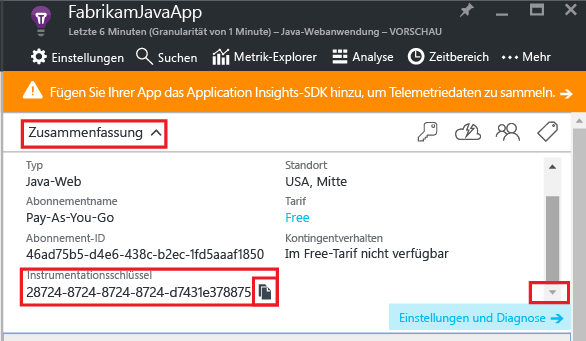
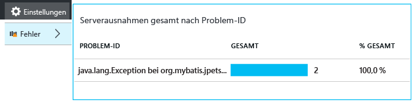
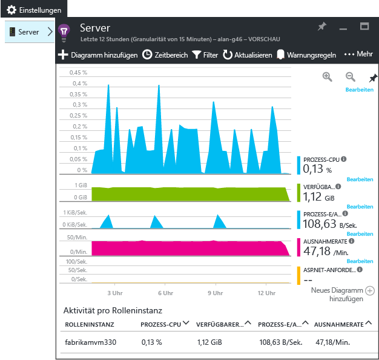

# <a name="get-started-with-application-insights-in-a-java-web-project"></a>Erste Schritte mit Application Insights in einem Java-Webprojekt


[Application Insights](https://azure.microsoft.com/services/application-insights/) ist ein erweiterbarer Analysedienst für Webentwickler, der Ihnen dabei hilft, die Leistung und die Verwendung der Liveanwendung zu verstehen. Verwenden Sie den Dienst, um [Leistungsprobleme und Ausnahmen zu erkennen und zu diagnostizieren](app-insights-detect-triage-diagnose.md), und [schreiben Sie Code][api], um zu verfolgen, welche Aktionen Benutzer mit Ihrer App ausführen.


Application Insights unterstützt Java-Apps, die unter Linux, Unix oder Windows ausgeführt werden.

Erforderlich:

* Oracle JRE 1.6 oder höher bzw. Zulu JRE 1.6 oder höher
* Ein Abonnement für [Microsoft Azure](https://azure.microsoft.com/).

*Wenn Sie eine Web-App haben, die bereits aktiv ist, könnten Sie das alternative Verfahren nutzen, [um das SDK zur Laufzeit auf dem Webserver hinzuzufügen](app-insights-java-live.md). Diese Alternative vermeidet das Neuerstellen des Codes, jedoch erhalten Sie nicht die Möglichkeit, Code schreiben, um die Benutzeraktivität nachzuverfolgen.*

## <a name="1-get-an-application-insights-instrumentation-key"></a>1. Abrufen eines Application Insights-Instrumentationsschlüssels
1. Melden Sie sich beim [Microsoft Azure-Portal](https://portal.azure.com)an.
2. Erstellen Sie eine Application Insights-Ressource. Legen Sie den Anwendungstyp auf "Java-Webanwendung" fest.
   
    
3. Suchen Sie den Instrumentationsschlüssel der neuen Ressource. Dieser Schlüssel muss in Kürze in das Codeprojekt eingefügt werden.
   
    

## <a name="2-add-the-application-insights-sdk-for-java-to-your-project"></a>2. Hinzufügen des Application Insights SDK für Java zu Ihrem Projekt
*Wählen Sie die geeignete Methode für Ihr Projekt.*

#### <a name="if-youre-using-eclipse-to-create-a-maven-or-dynamic-web-project-"></a>Wenn Sie Eclipse zum Erstellen eines Maven-Projekts oder eines dynamischen Webprojekts verwenden,...
Verwenden Sie das [Application Insights SDK für Java-Plug-In][eclipse].

#### <a name="if-youre-using-maven"></a>Wenn Sie Maven verwenden...
Wenn Ihr Projekt bereits für die Verwendung von Maven für den Buildprozess eingerichtet ist, fügen Sie Ihrer Datei „pom.xml“ den folgenden Code hinzu:

Aktualisieren Sie dann die Projektabhängigkeiten, damit die Binärdateien heruntergeladen werden.

```XML

    <repositories>
       <repository>
          <id>central</id>
          <name>Central</name>
          <url>http://repo1.maven.org/maven2</url>
       </repository>
    </repositories>

    <dependencies>
      <dependency>
        <groupId>com.microsoft.azure</groupId>
        <artifactId>applicationinsights-web</artifactId>
        <!-- or applicationinsights-core for bare API -->
        <version>[1.0,)</version>
      </dependency>
    </dependencies>
```

* *Build- oder Prüfsummenvalidierungsfehler?* Versuchen Sie es mit einer bestimmten Version, z. B.: `<version>1.0.n</version>`. Sie finden die neueste Version in den [SDK-Versionshinweisen](https://github.com/Microsoft/ApplicationInsights-Java#release-notes) oder in unseren [Maven-Artefakten](http://search.maven.org/#search%7Cga%7C1%7Capplicationinsights).
* *Sie müssen auf ein neues SDK aktualisieren?*  Aktualisieren Sie die Abhängigkeiten des Projekts.

#### <a name="if-youre-using-gradle"></a>Wenn Sie Gradle verwenden...
Wenn Ihr Projekt bereits für die Verwendung von Gradle für den Buildprozess eingerichtet ist, fügen Sie Ihrer Datei „build.gradle“ den folgenden Code hinzu:

Aktualisieren Sie dann die Projektabhängigkeiten, damit die Binärdateien heruntergeladen werden.

```JSON

    repositories {
      mavenCentral()
    }

    dependencies {
      compile group: 'com.microsoft.azure', name: 'applicationinsights-web', version: '1.+'
      // or applicationinsights-core for bare API
    }
```

* *Build- oder Prüfsummenvalidierungsfehler? Versuchen Sie es mit einer bestimmten Version, z. B.: * `version:'1.0.n'`. *Sie finden die neueste Version in den [SDK-Versionshinweisen](https://github.com/Microsoft/ApplicationInsights-Java#release-notes).*
* *So aktualisieren Sie auf ein neues SDK*
  *  Aktualisieren Sie die Abhängigkeiten des Projekts.

#### <a name="otherwise-"></a>Andernfalls...
Fügen Sie das SDK manuell hinzu:

1. Laden Sie das [Application Insights-SDK für Java](https://aka.ms/aijavasdk)herunter.
2. Extrahieren Sie die Binärdateien aus der ZIP-Datei, und fügen Sie sie Ihrem Projekt hinzu.

### <a name="questions"></a>Fragen...
* *Wie ist die Beziehung zwischen den Komponenten `-core` und `-web` in der ZIP-Datei?*
  
  * `applicationinsights-core` erhalten Sie die bloße API. Diese Komponente ist immer erforderlich.
  * Mit `applicationinsights-web` erhalten Sie Metriken zum Verfolgen der Anzahl der HTTP-Anforderungen und der Antwortzeiten. Diese Komponente können Sie weglassen, wenn die entsprechenden Telemetriedaten nicht automatisch gesammelt werden sollen – beispielsweise, wenn Sie den Code selbst schreiben möchten.
* *So aktualisieren Sie das SDK, wenn wir Änderungen veröffentlichen*
  
  * Laden Sie das aktuelle [Application Insights-SDK für Java](https://aka.ms/qqkaq6) herunter, und ersetzen Sie die alte Version.
  * Änderungen werden in den [SDK-Versionshinweisen](https://github.com/Microsoft/ApplicationInsights-Java#release-notes)beschrieben.

## <a name="3-add-an-application-insights-xml-file"></a>3. Hinzufügen der Datei „ApplicationInsights.xml“
Fügen Sie dem Ressourcenordner in Ihrem Projekt die Datei „ApplicationInsights.xml“ hinzu, oder stellen Sie sicher, dass sie dem Bereitstellungsklassenpfad Ihres Projekts hinzugefügt wird. Kopieren Sie den folgenden XML-Code in die Datei.

Fügen Sie den Instrumentationsschlüssel ein, den Sie aus dem Azure-Portal abgerufen haben.

```XML

    <?xml version="1.0" encoding="utf-8"?>
    <ApplicationInsights xmlns="http://schemas.microsoft.com/ApplicationInsights/2013/Settings" schemaVersion="2014-05-30">


      <!-- The key from the portal: -->

      <InstrumentationKey>** Your instrumentation key **</InstrumentationKey>


      <!-- HTTP request component (not required for bare API) -->

      <TelemetryModules>
        <Add type="com.microsoft.applicationinsights.web.extensibility.modules.WebRequestTrackingTelemetryModule"/>
        <Add type="com.microsoft.applicationinsights.web.extensibility.modules.WebSessionTrackingTelemetryModule"/>
        <Add type="com.microsoft.applicationinsights.web.extensibility.modules.WebUserTrackingTelemetryModule"/>
      </TelemetryModules>

      <!-- Events correlation (not required for bare API) -->
      <!-- These initializers add context data to each event -->

      <TelemetryInitializers>
        <Add   type="com.microsoft.applicationinsights.web.extensibility.initializers.WebOperationIdTelemetryInitializer"/>
        <Add type="com.microsoft.applicationinsights.web.extensibility.initializers.WebOperationNameTelemetryInitializer"/>
        <Add type="com.microsoft.applicationinsights.web.extensibility.initializers.WebSessionTelemetryInitializer"/>
        <Add type="com.microsoft.applicationinsights.web.extensibility.initializers.WebUserTelemetryInitializer"/>
        <Add type="com.microsoft.applicationinsights.web.extensibility.initializers.WebUserAgentTelemetryInitializer"/>

      </TelemetryInitializers>
    </ApplicationInsights>
```


* Der Instrumentationsschlüssel wird zusammen mit jedem Telemetrieelement übermittelt und weist Application Insights an, ihn in Ihrer Ressource anzuzeigen.
* Die Komponente "HTTP-Anforderung" ist optional. Sie sendet automatisch Telemetriedaten zu Anforderungen und Antwortzeiten zum Portal.
* Die Korrelation von Ereignissen ist eine Ergänzung der HTTP-Anforderungskomponente. Sie weist den einzelnen Anforderungen, die vom Server empfangen wurden, einen Bezeichner zu und fügt ihn als Operation.Id-Eigenschaft jedem Telemetrieelement hinzu. Diese Eigenschaft ermöglicht das Korrelieren der jeder Anforderung zugeordneten Telemetriedaten, indem in [Diagnosesuche][diagnostic] ein Filter festgelegt wird.
* Der Application Insights-Schlüssel kann dynamisch vom Azure-Portal als Systemeigenschaft (-DAPPLICATION_INSIGHTS_IKEY=Ihr_Schlüssel) übergeben werden. Ist keine Eigenschaft definiert, wird in den App-Einstellungen in Azure nach der Umgebungsvariablen (APPLICATION_INSIGHTS_IKEY) gesucht. Sind beide Eigenschaften nicht definiert, wird das InstrumentationKey-Standardelement aus „ApplicationInsights.xml“ verwendet. Diese Sequenz unterstützt Sie bei der dynamischen Verwaltung verschiedener InstrumentationKeys für unterschiedliche Umgebungen.

### <a name="alternative-ways-to-set-the-instrumentation-key"></a>Alternative Methoden zum Festlegen des Instrumentationsschlüssels
Das Application Insights SDK sucht in dieser Reihenfolge nach dem Schlüssel:

1. Systemeigenschaft: -DAPPLICATION_INSIGHTS_IKEY=your_ikey
2. Umgebungsvariable: APPLICATION_INSIGHTS_IKEY
3. Konfigurationsdatei: ApplicationInsights.xml

Sie können dies auch [per Code festlegen](app-insights-api-custom-events-metrics.md#ikey):

```Java

    telemetryClient.InstrumentationKey = "...";
```

## <a name="4-add-an-http-filter"></a>4. Hinzufügen eines HTTP-Filters
Der letzte Konfigurationsschritt ermöglicht der HTTP-Anforderungskomponente das Protokollieren jeder Webanforderung. (Nicht erforderlich, wenn nur die bloße API wünschen.)

Suchen und öffnen Sie die Datei „web.xml“ in Ihrem Projekt, und führen Sie den folgenden Code unter dem Web-App-Knoten zusammen, in dem Ihre Anwendungsfilter konfiguriert sind.

Um möglichst genaue Ergebnisse zu erhalten, muss der Filter vor allen anderen Filtern zugeordnet werden.

```XML

    <filter>
      <filter-name>ApplicationInsightsWebFilter</filter-name>
      <filter-class>
        com.microsoft.applicationinsights.web.internal.WebRequestTrackingFilter
      </filter-class>
    </filter>
    <filter-mapping>
       <filter-name>ApplicationInsightsWebFilter</filter-name>
       <url-pattern>/*</url-pattern>
    </filter-mapping>
```

#### <a name="if-youre-using-spring-web-mvc-31-or-later"></a>Vorgehensweise bei Verwendung von Spring Web MVC 3.1 oder einer höheren Version
Bearbeiten Sie diese Elemente in „*-servlet.xml“ so, dass das Application Insights-Paket einbezogen wird:

```XML

    <context:component-scan base-package=" com.springapp.mvc, com.microsoft.applicationinsights.web.spring"/>

    <mvc:interceptors>
        <mvc:interceptor>
            <mvc:mapping path="/**"/>
            <bean class="com.microsoft.applicationinsights.web.spring.RequestNameHandlerInterceptorAdapter" />
        </mvc:interceptor>
    </mvc:interceptors>
```

#### <a name="if-youre-using-struts-2"></a>Wenn Sie Struts 2 verwenden...
Fügen Sie dieses Element der Struts-Konfigurationsdatei (die in der Regel "struts.xml" oder "struts-default.xml" heißt) hinzu:

```XML

     <interceptors>
       <interceptor name="ApplicationInsightsRequestNameInterceptor" class="com.microsoft.applicationinsights.web.struts.RequestNameInterceptor" />
     </interceptors>
     <default-interceptor-ref name="ApplicationInsightsRequestNameInterceptor" />
```

(Wenn Sie in einem Standardstapel Interceptors definiert haben, kann der Interceptor einfach diesem Stapel hinzugefügt werden.)

## <a name="5-run-your-application"></a>5. Ausführen der Anwendung
Führen Sie sie entweder im Debugmodus auf dem Entwicklungscomputer aus, oder veröffentlichen Sie sie auf Ihrem Server.

## <a name="6-view-your-telemetry-in-application-insights"></a>6. Anzeigen Ihrer Telemetriedaten in Application Insights
Kehren Sie zur Application Insights-Ressource im [Microsoft Azure-Portal](https://portal.azure.com)zurück.

HTTP-Anforderungsdaten werden auf dem Übersichtsblatt angezeigt. (Wenn sie nicht vorhanden sind, warten Sie einige Sekunden, und klicken Sie dann auf "Aktualisieren".)


[Weitere Informationen zu Metriken.][metrics]

Klicken Sie sich durch ein beliebiges Diagramm, um ausführliche aggregierte Metriken anzuzeigen.


> Application Insights geht bei HTTP-Anforderungen für MVC-Anwendungen von folgendem Format aus: `VERB controller/action`. `GET Home/Product/f9anuh81`, `GET Home/Product/2dffwrf5` und `GET Home/Product/sdf96vws` werden beispielsweise zu `GET Home/Product` gruppiert. Diese Gruppierung ermöglicht aussagekräftige Aggregationen von Anforderungen (etwa die Anzahl und die durchschnittliche Ausführungszeit von Anforderungen).
> 
> 

### <a name="instance-data"></a>Instanzdaten
Klicken Sie sich durch einen bestimmten Anforderungstyp, um einzelne Instanzen anzuzeigen. 

In Application Insights werden zwei Arten von Daten angezeigt: aggregierte Daten, die als Mittelwerte, Anzahl und Summen gespeichert und angezeigt werden, sowie Instanzdaten, bei denen es sich um einzelne Berichte von HTTP-Anforderungen, Ausnahmen, Seitenansichten oder benutzerdefinierten Ereignissen handelt.

Beim Anzeigen der Eigenschaften einer Anforderung können Sie die damit verbundenen Telemetrieereignisse erkennen, wie z.B. Anforderungen und Ausnahmen.


### <a name="analytics-powerful-query-language"></a>Analytics: Leistungsfähige Abfragesprache
Wenn sich mehr Daten ansammeln, können Sie Abfragen sowohl zum Aggregieren von Daten als auch zum Ermitteln einzelner Instanzen ausführen.  [Analytics](app-insights-analytics.md) ist ein leistungsfähiges Tool zum Nachvollziehen der Leistung und Nutzung sowie für Diagnosezwecke.


## <a name="7-install-your-app-on-the-server"></a>7. Installieren der App auf dem Server
Jetzt veröffentlichen Sie Ihre App auf dem Server, erlauben deren Benutzung und sehen sich an, wie die Telemetrie im Portal angezeigt wird.

* Stellen Sie sicher, dass die Firewall der Anwendung das Senden von Telemetrie an die folgenden Ports erlaubt:
  
  * dc.services.visualstudio.com:443
  * f5.services.visualstudio.com:443

* Wenn ausgehender Datenverkehr über eine Firewall geleitet werden muss, legen Sie Systemeigenschaften wie `http.proxyHost` und `http.proxyPort` fest. 

* Installieren Sie auf Windows-Servern:
  
  * [Microsoft Visual C++ Redistributable](http://www.microsoft.com/download/details.aspx?id=40784)
    
    (Diese Komponente aktiviert Leistungsindikatoren.)


## <a name="exceptions-and-request-failures"></a>Ausnahmen und Anforderungsfehler
Nicht behandelte Ausnahmen werden automatisch gesammelt:



Um Daten zu anderen Ausnahmen zu erfassen, haben Sie zwei Möglichkeiten:

* [Fügen Sie trackException()-Aufrufe in den Code ein.][apiexceptions] 
* [Installieren Sie den Java-Agent auf dem Server](app-insights-java-agent.md). Sie geben die Methoden an, die Sie überwachen möchten.

## <a name="monitor-method-calls-and-external-dependencies"></a>Überwachen von Methodenaufrufen und externen Abhängigkeiten
[Installieren Sie den Java-Agent](app-insights-java-agent.md) , um die angegebenen internen Methoden und Aufrufe über JDBC mit Zeitdaten zu protokollieren.

## <a name="performance-counters"></a>Leistungsindikatoren
Unter **Einstellungen** >**Server** finden Sie eine Reihe von Leistungsindikatoren.



### <a name="customize-performance-counter-collection"></a>Anpassen der Erfassung von Leistungsindikatoren
Um die Erfassung der Standardgruppe von Leistungsindikatoren zu deaktivieren, fügen Sie unter dem Stammknoten der Datei „ApplicationInsights.xml“ den folgenden Code hinzu:

```XML
    <PerformanceCounters>
       <UseBuiltIn>False</UseBuiltIn>
    </PerformanceCounters>
```

### <a name="collect-additional-performance-counters"></a>Erfassen weiterer Leistungsindikatoren
Sie können weitere Leistungsindikatoren angeben, die erfasst werden sollen.

#### <a name="jmx-counters-exposed-by-the-java-virtual-machine"></a>JMX-Leistungsindikatoren (von der Java Virtual Machine bereitgestellt)

```XML
    <PerformanceCounters>
      <Jmx>
        <Add objectName="java.lang:type=ClassLoading" attribute="TotalLoadedClassCount" displayName="Loaded Class Count"/>
        <Add objectName="java.lang:type=Memory" attribute="HeapMemoryUsage.used" displayName="Heap Memory Usage-used" type="composite"/>
      </Jmx>
    </PerformanceCounters>
```

* `displayName` – Der im Application Insights-Portal angezeigte Name.
* `objectName` – Der JMX-Objektname.
* `attribute` – Das Attribut des abzurufenden JMX-Objektnamens
* `type` (optional) – Der Typ des Attributs des JMX-Objekts:
  * Standard: ein einfacher Typ wie "int" oder "long".
  * `composite`: Die Leistungsindikatordaten haben das Format 'Attribut.Daten'.
  * `tabular`: Die Leistungsindikatordaten haben das Format einer Tabellenzeile.

#### <a name="windows-performance-counters"></a>Windows-Leistungsindikatoren
Jeder [Windows-Leistungsindikator](https://msdn.microsoft.com/library/windows/desktop/aa373083.aspx) gehört zu einer Kategorie (genauso wie ein Feld zu einer Klasse gehört). Kategorien können entweder global sein oder nummerierte oder benannte Instanzen haben.

```XML
    <PerformanceCounters>
      <Windows>
        <Add displayName="Process User Time" categoryName="Process" counterName="%User Time" instanceName="__SELF__" />
        <Add displayName="Bytes Printed per Second" categoryName="Print Queue" counterName="Bytes Printed/sec" instanceName="Fax" />
      </Windows>
    </PerformanceCounters>
```

* displayName – Der im Application Insights-Portal angezeigte Name
* categoryName – Die Leistungsindikatorkategorie (Leistungsobjekt), der dieser Leistungsindikator zugeordnet ist
* counterName – Der Name des Leistungsindikators
* instanceName – Der Name der Instanz der Leistungsindikatorkategorie oder eine leere Zeichenfolge (""), wenn die Kategorie eine einzelne Instanz enthält. Wenn "categoryName" auf "Process" festgelegt ist und der Leistungsindikator, den Sie erfassen möchten, aus dem aktuellen JVM-Prozess stammt, in dem Ihre Anwendung ausgeführt wird, geben Sie `"__SELF__"`an.

Ihre Leistungsindikatoren werden im [Metrik-Explorer][metrics] als benutzerdefinierte Metriken angezeigt.


### <a name="unix-performance-counters"></a>Unix-Leistungsindikatoren
* [Installieren Sie „collectd“ mit dem Application Insights-Plug-In](app-insights-java-collectd.md) , um eine Vielzahl von System- und Netzwerkdaten abzurufen.

## <a name="get-user-and-session-data"></a>Abrufen von Benutzer- und Sitzungsdaten
Sie senden also Telemetriedaten vom Webserver. Um jetzt eine Rundum-Ansicht Ihrer Anwendung zu erhalten, können Sie weitere Überwachungsfunktionen hinzufügen:

* [Fügen Sie Ihren Webseiten Telemetrie hinzu][usage], um Seitenaufrufe und Benutzermetriken zu überwachen.
* [Richten Sie Webtests ein][availability], um sicherzustellen, dass die Anwendung online und reaktionsfähig bleibt.

## <a name="capture-log-traces"></a>Erfassen von Protokollablaufverfolgungen
Sie können Application Insights verwenden, um Protokolle aus Log4J, Logback oder anderen Frameworks zu segmentieren. Sie können die Protokolle mit HTTP-Anforderungen und anderer Telemetrie in Beziehung setzen. [Weitere Informationen][javalogs]

## <a name="send-your-own-telemetry"></a>Senden eigener Telemetriedaten
Nachdem Sie das SDK installiert haben, können Sie die API verwenden, um eigene Telemetriedaten senden.

* [Verfolgen Sie benutzerdefinierte Ereignisse und Metriken nach][api], um zu erfahren, welche Aktionen Benutzer ausführen.
* [Durchsuchen Sie Ereignisse und Protokolle][diagnostic], um Probleme besser zu diagnostizieren.

## <a name="availability-web-tests"></a>Verfügbarkeitswebtests
Application Insights kann Ihre Website in regelmäßigen Abständen testen, um zu überprüfen, ob sie betriebsbereit ist und gut reagiert. Klicken Sie zum [Einrichten][availability] auf „Webtests“.


Sie erhalten Diagramme von Reaktionszeiten sowie E-Mail-Benachrichtigungen, falls Ihre Website ausfällt.


[Weitere Informationen zu Verfügbarkeitswebtests][availability] 

## <a name="questions-problems"></a>Fragen? Probleme?
[Problembehandlung für Java](app-insights-java-troubleshoot.md)

## <a name="next-steps"></a>Nächste Schritte
* [Überwachen von Abhängigkeitsaufrufen](app-insights-java-agent.md)
* [Überwachen von Unix-Leistungsindikatoren](app-insights-java-collectd.md)
* Richten Sie die [Überwachung für Ihre Webseiten ein](app-insights-javascript.md), um Seitenladezeiten, AJAX-Aufrufe und Browserausnahmen zu überwachen.
* Schreiben Sie [benutzerdefinierte Telemetriedaten](app-insights-api-custom-events-metrics.md), um die Nutzung im Browser oder auf dem Server nachzuverfolgen.
* Erstellen Sie [Dashboards](app-insights-dashboards.md), um die wichtigsten Diagramme zur Überwachung Ihres Systems zusammenzuführen.
* Verwenden Sie [Analytics](app-insights-analytics.md) für leistungsfähige Abfragen über Telemetriedaten in Ihrer App.
* Weitere Informationen finden Sie im [Java Developer Center](/develop/java/).

<!--Link references-->

[api]: app-insights-api-custom-events-metrics.md
[apiexceptions]: app-insights-api-custom-events-metrics.md#track-exception
[availability]: app-insights-monitor-web-app-availability.md
[diagnostic]: app-insights-diagnostic-search.md
[eclipse]: app-insights-java-eclipse.md
[javalogs]: app-insights-java-trace-logs.md
[metrics]: app-insights-metrics-explorer.md
[usage]: app-insights-web-track-usage.md


<!--HONumber=Jan17_HO1-->


