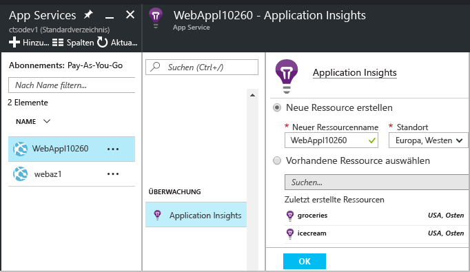
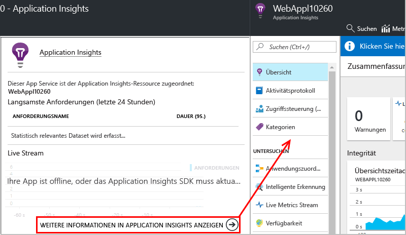

# Instrumentieren von Web-Apps zur Laufzeit mit Application Insights

Sie können eine Live-Web-App mit Azure Application Insights instrumentieren, ohne dass Sie Ihren Code ändern oder erneut bereitstellen müssen. Installieren Sie den Statusmonitor, wenn Ihre Apps von einem lokalen IIS-Server gehostet werden. Wenn es sich um Azure-Web-Apps handelt oder die Apps auf einer Azure-VM ausgeführt werden, können Sie die Application Insights-Überwachung über die Azure-Systemsteuerung aktivieren. (Es gibt auch separate Artikel zum Instrumentieren von [Live-J2EE-Web-Apps](app-insights-java-live.md) und [Azure Cloud Services](app-insights-cloudservices.md).) Sie benötigen ein [Microsoft Azure](http://azure.com) -Abonnement.

Bei der Anwendung von Application Insights auf die .NET-Webanwendungen können Sie zwischen drei Möglichkeiten wählen:

* **Buildzeit:** [Fügen Sie Ihrem Web-App-Code das Application Insights-SDK hinzu][greenbrown].
* **Laufzeit:** Instrumentieren Sie Ihre Web-App auf dem Server wie unten beschrieben, ohne den Code neu zu erstellen und bereitzustellen.
* **Beides:** Erstellen Sie das SDK in Ihrem Web-App-Code, und wenden Sie auch die Laufzeiterweiterungen an. So können Sie die Vorteile beider Optionen nutzen.

Hier ist zusammengefasst, was Sie jeweils erhalten:

|  | Buildzeit | Laufzeit |
| --- | --- | --- |
| Anforderungen und Ausnahmen |Ja |Ja |
| [Weitere ausführliche Ausnahmen](app-insights-asp-net-exceptions.md) | |Ja |
| [Abhängigkeitsdiagnose](app-insights-asp-net-dependencies.md) |Bei .NET 4.6 und höheren Versionen, aber weniger Details |Ja, vollständige Details: Ergebniscodes, SQL-Befehlstext, HTTP-Verb|
| [Systemleistungsindikatoren](app-insights-performance-counters.md) |Ja |Ja |
| [API für benutzerdefinierte Telemetrie][api] |Ja |Nein |
| [Ablaufverfolgungsprotokoll-Integration](app-insights-asp-net-trace-logs.md) |Ja |Nein |
| [Seitenansicht und Benutzerdaten](app-insights-javascript.md) |Ja |Nein |
| Neuerstellung des Codes erforderlich |Ja | Nein |

## Überwachen einer Azure-Live-Web-App

So aktivieren Sie die Überwachung, wenn Ihre Anwendung als Azure-Webdienst ausgeführt wird:

* Wählen Sie in der Systemsteuerung der App in Azure „Application Insights“ aus.

    
* Klicken Sie auf der Zusammenfassungsseite von Application Insights auf den Link am unteren Rand, um die vollständige Application Insights-Ressource zu öffnen.

    

[Überwachen von Cloud- und VM-Apps](app-insights-azure.md)

### Aktivieren der clientseitigen Überwachung in Azure

Wenn Sie Application Insights in Azure aktiviert haben, können Sie Seitenansicht und Benutzertelemetrie hinzufügen.

1. Wählen Sie „Einstellungen“ > „Anwendungseinstellungen“ aus.
2.  Fügen Sie unter „App-Einstellungen“ ein neues Schlüssel-Wert-Paar hinzu: 
   
    Schlüssel: `APPINSIGHTS_JAVASCRIPT_ENABLED` 
    
    Wert: `true`
3. **Speichern** Sie die Einstellungen, und **starten Sie die App neu**.

Das JavaScript SDK für Application Insights wird nun in jede Webseite eingefügt.

## Überwachen einer IIS-Live-Web-App

Wenn Ihre App auf einem IIS-Server gehostet wird, aktivieren Sie Application Insights über den Statusmonitor.

1. Melden Sie sich mit Administratorrechten auf Ihrem IIS-Webserver an.
2. Wenn der Application Insights-Statusmonitor nicht bereits installiert ist, können Sie das [Installationsprogramm für den Statusmonitor](http://go.microsoft.com/fwlink/?LinkId=506648) herunterladen und ausführen (oder führen Sie den [Webplattform-Installer](https://www.microsoft.com/web/downloads/platform.aspx) aus, und suchen Sie darin nach dem Application Insights-Statusmonitor).
3. Wählen Sie im Statusmonitor die installierte Webanwendung oder Website aus, die Sie überwachen möchten. Melden Sie sich mit Ihren Azure-Anmeldeinformationen an.

    Konfigurieren Sie die Ressource, in der die Ergebnisse im Application Insights-Portal angezeigt werden sollen. (In der Regel empfiehlt es sich, eine neue Ressource zu erstellen. Wählen Sie eine vorhandene Ressource aus, falls Sie bereits über [Webtests][availability] oder über eine [Clientüberwachung][client] für die App verfügen.) 

    

4. Starten Sie IIS neu.

    

    Der Webdienst wird für kurze Zeit unterbrochen.

## Anpassen der Überwachungsoptionen

Wenn Sie Application Insights aktivieren, werden Ihrer Web-App DLLs und „ApplicationInsights.config“ hinzugefügt. Sie können [die CONFIG-Datei bearbeiten](app-insights-configuration-with-applicationinsights-config.md), um einige der Optionen zu ändern.

## Erneutes Aktivieren von Application Insights bei erneuter Veröffentlichung der App

Überlegen Sie sich vor dem erneuten Veröffentlichen Ihrer App, ob Sie [Application Insights dem Code in Visual Studio hinzufügen][greenbrown] möchten. Sie erhalten ausführlichere Telemetriedaten und können benutzerdefinierte Telemetrie schreiben.

Wenn Sie die App erneut veröffentlichen möchten, ohne Application Insights dem Code hinzuzufügen, beachten Sie, dass die DLLs und „ApplicationInsights.config“ im Rahmen des Bereitstellungsprozesses unter Umständen aus der veröffentlichten Website gelöscht werden. Deshalb gilt Folgendes:

1. Falls Sie „ApplicationInsights.config“ bearbeitet haben, erstellen Sie eine Kopie der Datei, bevor Sie Ihre App erneut veröffentlichen.
2. Veröffentlichen Sie Ihre App erneut.
3. Reaktivieren Sie die Application Insights-Überwachung. (Verwenden Sie die geeignete Methode: entweder die Systemsteuerung der Azure-Web-App oder den Statusmonitor auf einem IIS-Host.)
4. Stellen Sie alle Änderungen wieder her, die Sie an der CONFIG-Datei vorgenommen haben.

## Behandeln von Problemen mit der Laufzeitkonfiguration von Application Insights

### Keine Verbindung möglich? Keine Telemetriedaten?

* Öffnen Sie [die erforderlichen ausgehenden Ports](app-insights-ip-addresses.md#outgoing-ports) in der Firewall des Servers, damit der Statusmonitor funktioniert.

* Öffnen Sie den Statusmonitor, und wählen Sie Ihre Anwendung auf der linken Seite aus. Prüfen Sie, ob für diese Anwendung Diagnosemeldungen im Abschnitt mit den Konfigurationsbenachrichtigungen vorliegen:

  
* Wenn auf dem Server eine Meldung über "unzureichende Berechtigungen" angezeigt wird, versuchen Sie Folgendes:
  * Wählen Sie in IIS-Manager Ihren Anwendungspool aus, öffnen Sie **Erweiterte Einstellungen**, und überprüfen Sie die Identität unter **Prozessmodell**.
  * Fügen Sie in der Systemsteuerung "Computerverwaltung" diese Identität der Gruppe "Systemmonitorbenutzer" hinzu.
* Es kann zu Versionskonflikten kommen, wenn Sie MMA/SCOM (Systems Center Operations Manager) auf Ihrem Server installiert haben. Deinstallieren Sie sowohl SCOM als auch den Statusmonitor, und installieren Sie die neuesten Versionen.
* Informationen hierzu finden Sie unter [Problembehandlung][qna].

## Systemanforderungen
Betriebssystemunterstützung für den Application Insights-Statusmonitor auf dem Server:

* Windows Server 2008
* Windows Server 2008 R2
* Windows Server 2012
* Windows Server 2012 R2
* Windows Server 2016

mit den neuesten Service Packs und .NET Framework 4.5

Auf der Clientseite: Windows 7, 8, 8.1 und 10, ebenfalls mit .NET Framework 4.5

IIS-Unterstützung: IIS 7, 7.5, 8, 8.5 (IIS ist erforderlich)

## Automation mit PowerShell
Sie können die Überwachung mit PowerShell auf Ihrem IIS-Server starten und beenden.

Importieren Sie zunächst das Application Insights-Modul:

`Import-Module 'C:\Program Files\Microsoft Application Insights\Status Monitor\PowerShell\Microsoft.Diagnostics.Agent.StatusMonitor.PowerShell.dll'`

Ermitteln Sie, welche Apps überwacht werden:

`Get-ApplicationInsightsMonitoringStatus [-Name appName]`

* `-Name` (Optional) Dies ist der Name einer Web-App.
* Zeigt den Application Insights-Überwachungsstatus für jede Web-App (oder die benannte App) in diesem IIS-Server an.
* Gibt `ApplicationInsightsApplication` für jede App zurück:

  * `SdkState==EnabledAfterDeployment`: Die App wird überwacht und wurde zur Laufzeit instrumentiert, und zwar entweder mit dem Statusmonitor-Tool oder mit `Start-ApplicationInsightsMonitoring`.
  * `SdkState==Disabled`: Die App ist für Application Insights nicht instrumentiert. Entweder wurde sie nie instrumentiert, oder die Laufzeitüberwachung wurde mit dem Statusmonitor-Tool oder mit `Stop-ApplicationInsightsMonitoring`deaktiviert.
  * `SdkState==EnabledByCodeInstrumentation`: Die App wurde instrumentiert, indem das SDK dem Quellcode hinzugefügt wurde. Das SDK kann nicht aktualisiert oder beendet werden.
  * `SdkVersion` wird die Version angezeigt, die für die Überwachung dieser App verwendet wird.
  * Mit `LatestAvailableSdkVersion` wird die Version angezeigt, die im NuGet-Katalog derzeit verfügbar ist. Verwenden Sie zum Aktualisieren der App auf diese Version `Update-ApplicationInsightsMonitoring`.

`Start-ApplicationInsightsMonitoring -Name appName -InstrumentationKey 00000000-000-000-000-0000000`

* `-Name` Gibt den Namen der App in IIS an.
* `-InstrumentationKey` Dies ist der iKey der Application Insights-Ressource, für die die Ergebnisse angezeigt werden sollen.
* Dieses Cmdlet wirkt sich nur auf Apps aus, die nicht bereits instrumentiert wurden (SdkState==NotInstrumented).

    Das Cmdlet wirkt sich nicht auf eine App aus, die bereits instrumentiert wurde. Es spielt keine Rolle, ob die App zur Buildzeit instrumentiert wurde, indem dem Code das SDK hinzugefügt wurde, oder zur Laufzeit durch eine vorherige Verwendung dieses Cmdlets.

    Die zum Instrumentieren der App verwendete SDK-Version ist die Version, die zuletzt auf diesen Server heruntergeladen wurde.

    Verwenden Sie zum Herunterladen der aktuellen Version „Update-ApplicationInsightsVersion“.
* Es wird `ApplicationInsightsApplication` zurückgegeben, wenn der Vorgang erfolgreich ist. Wenn nicht, wird unter stderr eine Ablaufverfolgung protokolliert.

          Name                      : Default Web Site/WebApp1
          InstrumentationKey        : 00000000-0000-0000-0000-000000000000
          ProfilerState             : ApplicationInsights
          SdkState                  : EnabledAfterDeployment
          SdkVersion                : 1.2.1
          LatestAvailableSdkVersion : 1.2.3

`Stop-ApplicationInsightsMonitoring [-Name appName | -All]`

* `-Name` Dies ist der Name einer App in IIS.
* `-All` Beendet die Überwachung aller Apps auf diesem IIS-Server, für die `SdkState==EnabledAfterDeployment` gilt.
* Beendet die Überwachung der angegebenen Apps und entfernt die Instrumentierung. Dies funktioniert nur für Apps, die zur Laufzeit mit dem Tool für die Statusüberwachung oder mit „Start-ApplicationInsightsApplication“ überwacht wurden. (`SdkState==EnabledAfterDeployment`)
* Gibt „ApplicationInsightsApplication“ zurück.

`Update-ApplicationInsightsMonitoring -Name appName [-InstrumentationKey "0000000-0000-000-000-0000"`]

* `-Name`: Dies ist der Name einer Web-App in IIS.
* `-InstrumentationKey` (Optional.) Verwenden Sie dieses Element zum Ändern der Ressource, an die die Telemetriedaten der App gesendet werden.
* Mit diesem Cmdlet wird Folgendes durchgeführt:
  * Aktualisiert die benannte App auf die Version des SDK, die zuletzt auf den Computer heruntergeladen wurde. (Funktioniert nur, wenn `SdkState==EnabledAfterDeployment`gilt.)
  * Wenn Sie einen Instrumentierungsschlüssel angeben, wird die benannte App neu konfiguriert, um Telemetriedaten an die Ressource mit diesem Schlüssel zu senden. (Funktioniert, wenn `SdkState != Disabled`gilt.)

`Update-ApplicationInsightsVersion`

* Lädt das aktuelle Application Insights SDK auf den Server herunter.

## Fragen zum Statusmonitor

### Was ist der Statusmonitor?

Eine Desktopanwendung, die Sie auf Ihrem IIS-Webserver installieren. Sie dient zur Unterstützung beim Instrumentieren und Konfigurieren von Web-Apps. 

### Wann sollte ich den Statusmonitor verwenden?

* Verwenden Sie ihn zum Instrumentieren aller Web-Apps, die auf Ihrem IIS-Server ausgeführt werden sollen. Dies ist auch möglich, wenn diese bereits ausgeführt werden.
* Verwenden Sie ihn beim Kompilieren zum Aktivieren von zusätzlichen Telemetriedaten für Web-Apps, die [mit dem Application Insights SDK erstellt wurden](app-insights-asp-net.md). 

### Kann ich den Statusmonitor nach dem Ausführen schließen?

Ja. Nachdem die ausgewählten Websites instrumentiert wurden, können Sie ihn schließen.

Der Statusmonitor selbst erfasst keine Telemetriedaten. Er dient nur zum Konfigurieren der Web-Apps und Festlegen einiger Berechtigungen.

### Welche Schritte werden vom Statusmonitor ausgeführt?

Wenn Sie eine Web-App auswählen, die mit dem Statusmonitor instrumentiert werden soll, werden folgende Schritte ausgeführt:

* Die Application Insights-Assemblys und die CONFIG-Datei werden heruntergeladen und im Binärdateiordner der Web-App abgelegt.
* Die Datei `web.config` wird geändert, um das HTTP-Nachverfolgungsmodul von Application Insights hinzuzufügen.
* Die CLR-Profilerstellung wird aktiviert, um Abhängigkeitsaufrufe zu erfassen.

### Muss ich den Statusmonitor immer ausführen, wenn ich die App aktualisiere?

Dies ist nicht erforderlich, wenn Sie die erneute Bereitstellung inkrementell durchführen. 

Wenn Sie während des Veröffentlichungsvorgangs die Option „Vorhandene Dateien löschen“ auswählen, müssen Sie den Statusmonitor erneut ausführen, um Application Insights zu konfigurieren.

### Welche Telemetriedaten werden erfasst?

Für Anwendungen, die Sie nur zur Laufzeit mit dem Statusmonitor instrumentieren:

* HTTP-Anforderungen
* Aufrufe von Abhängigkeiten
* Ausnahmen
* Leistungsindikatoren

Für Anwendungen, die beim Kompilieren bereits instrumentiert sind:

 * Prozessleistungsindikatoren
 * Abhängigkeitsaufrufe (.NET 4.5), Rückgabewerte in Abhängigkeitsaufrufen (.NET 4.6)
 * Werte der Ausnahmestapelüberwachung

[Weitere Informationen](http://apmtips.com/blog/2016/11/18/how-application-insights-status-monitor-not-monitors-dependencies/)

## Video

> [!VIDEO https://channel9.msdn.com/events/Connect/2016/100/player]

## Nächste Schritte

Anzeigen der Telemetrie:

* [Untersuchen Sie Metriken](app-insights-metrics-explorer.md) für die Überwachung von Leistung und Auslastung.
* [Durchsuchen Sie Ereignisse und Protokolle][diagnostic], um Probleme zu diagnostizieren.
* [Verwenden Sie Analytics](app-insights-analytics.md) für erweiterte Abfragen.
* [Erstellen Sie Dashboards.](app-insights-dashboards.md)

Hinzufügen weiterer Telemetrieelemente:

* [Erstellen Sie Webtests][availability], um sicherzustellen, dass Ihre Website live bleibt.
* [Fügen Sie Webclienttelemetrie hinzu][usage], um Ausnahmen von Webseitencode anzuzeigen und Ablaufverfolgungsaufrufe einfügen zu können.
* [Fügen Sie Ihrem Code das Application Insights SDK hinzu][greenbrown], um Ablaufverfolgungs- und Protokollaufrufe einfügen zu können.

<!--Link references-->

[api]: app-insights-api-custom-events-metrics.md
[availability]: app-insights-monitor-web-app-availability.md
[client]: app-insights-javascript.md
[diagnostic]: app-insights-diagnostic-search.md
[greenbrown]: app-insights-asp-net.md
[qna]: app-insights-troubleshoot-faq.md
[roles]: app-insights-resources-roles-access-control.md
[usage]: app-insights-javascript.md

