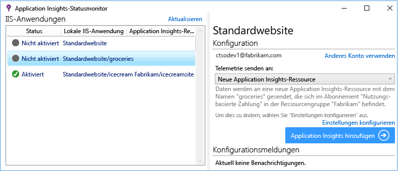

<properties
	pageTitle="Diagnostizieren von Leistungsproblemen auf einer ausgeführten IIS-Website | Microsoft Azure"
	description="Überwachen Sie die Leistung einer Website, ohne sie erneut bereitzustellen. Zur eigenständigen Verwendung oder in Verbindung mit dem Application Insights-SDK zum Abrufen von Telemetriedaten zu Abhängigkeiten."
	services="application-insights"
    documentationCenter=".net"
	authors="alancameronwills"
	manager="douge"/>

<tags
	ms.service="application-insights"
	ms.workload="tbd"
	ms.tgt_pltfrm="ibiza"
	ms.devlang="na"
	ms.topic="get-started-article"
	ms.date="08/24/2016"
	ms.author="awills"/>

# Instrumentieren von Web-Apps zur Laufzeit mit Application Insights

*Application Insights befindet sich in der Vorschau.*

Sie können eine Live-Web-App mit Visual Studio Application Insights instrumentieren, ohne dass Sie Ihren Code ändern oder erneut bereitstellen müssen. Wenn Ihre Apps mit einem lokalen IIS-Server gehostet werden, installieren Sie den Statusmonitor. Wenn es sich um Azure-Web-Apps handelt oder wenn sie in einer Azure-VM ausgeführt werden, können Sie die Application Insights-Erweiterung installieren. (Es gibt auch separate Artikel zum Instrumentieren von [Live-J2EE-Web-Apps](app-insights-java-live.md) und [Azure Cloud Services](app-insights-cloudservices.md).)

Bei der Anwendung von Application Insights auf die .NET-Webanwendungen können Sie zwischen drei Möglichkeiten wählen:

* **Buildzeit:** [Fügen Sie Ihrem Web-App-Code das Application Insights-SDK hinzu][greenbrown].
* **Laufzeit:** Instrumentieren Sie Ihre Web-App auf dem Server wie unten beschrieben, ohne den Code neu zu erstellen und bereitzustellen.
* **Beides:** Erstellen Sie das SDK in Ihrem Web-App-Code, und wenden Sie auch die Laufzeiterweiterungen an. So können Sie die Vorteile beider Optionen nutzen.

Hier ist zusammengefasst, was Sie jeweils erhalten:

||Buildzeit|Laufzeit|
|---|---|---|
|Anforderungen und Ausnahmen|Ja|Ja|
|[Weitere ausführliche Ausnahmen](app-insights-asp-net-exceptions.md)||Ja|
|[Abhängigkeitsdiagnose](app-insights-asp-net-dependencies.md)|Unter .NET 4.6+|Ja|
|[Systemleistungsindikatoren](app-insights-web-monitor-performance.md#system-performance-counters)||IIS oder Azure-Clouddienst, nicht Azure-Web-App|
|[API für benutzerdefinierte Telemetrie][api]|Ja||
|[Ablaufverfolgungsprotokoll-Integration](app-insights-asp-net-trace-logs.md)|Ja||
|[Seitenansicht und Benutzerdaten](app-insights-javascript.md)|Ja||
|Neuerstellung des Codes nicht erforderlich|Nein||

## Instrumentieren der Web-App zur Laufzeit

Sie benötigen ein [Microsoft Azure](http://azure.com)-Abonnement.

### Bei auf dem IIS-Server gehosteter App

1. Melden Sie sich mit Administratorrechten auf Ihrem IIS-Webserver an.
2. Laden Sie den [Statusmonitor-Installer](http://go.microsoft.com/fwlink/?LinkId=506648) herunter, und starten Sie ihn.
4. Melden Sie sich im Installations-Assistenten bei Microsoft Azure an.

    

    *Verbindungsfehler? Informationen hierzu finden Sie unter [Problembehandlung](#troubleshooting).*

5. Wählen Sie die installierte Webanwendung oder Website aus, die Sie überwachen möchten, und konfigurieren Sie die Ressource, in der die Ergebnisse im Application Insights-Portal angezeigt werden sollen.

    

    In der Regel konfigurieren Sie eine neue Ressource und [Ressourcengruppe][roles].

    Sie können andernfalls auch eine vorhandene Ressource verwenden, wenn Sie bereits [Webtests][availability] für Ihre Website oder die [Webclientüberwachung][client] eingerichtet haben.

6. Starten Sie IIS neu.

    

    Der Webdienst wird für kurze Zeit unterbrochen.

6. Beachten Sie, dass die Datei "ApplicationInsights.config" in die Web-Apps eingefügt wurde, die Sie überwachen möchten.

    

   Außerdem wurden Änderungen an der Datei web.config vorgenommen.

#### Möchten Sie die Konfiguration später ändern?

Nach Abschluss des Assistenten können Sie die Konfiguration des Agenten später jederzeit ändern. Sie können dies auch verwenden, wenn bei der ursprünglichen Einrichtung des Agenten ein Problem aufgetreten ist.

### Wenn Ihre App als Azure-Web-App ausgeführt wird

1. Erstellen Sie im [Azure-Portal](https://portal.azure.com) eine Application Insights-Ressource vom Typ ASP.NET. Hier werden Ihre Anwendungstelemetriedaten gespeichert, analysiert und angezeigt.

    
     
2. Öffnen Sie nun das Blatt zur Steuerung der Azure-Web-App. Öffnen Sie **Extras > Leistungsüberwachung**, und fügen Sie die Application Insights-Erweiterung hinzu.

    

    Wählen Sie die Application Insights-Ressource aus, die Sie gerade erstellt haben.

### Wenn es sich um ein Azure-Clouddienstprojekt handelt

[Fügen Sie Web- und Workerrollen Skripts hinzu](app-insights-cloudservices.md).

## Anzeigen von Leistungstelemetriedaten

Melden Sie sich beim [Azure-Portal](https://portal.azure.com) an, navigieren Sie zu Application Insights, und öffnen Sie die zuvor erstellte Ressource.

Öffnen Sie das Blatt "Leistung", um die Anforderung, Antwortzeit, Abhängigkeiten und andere Daten anzuzeigen.

Klicken Sie jeweils auf ein Diagramm, um eine ausführlichere Ansicht zu öffnen.

Sie können Diagramme [bearbeiten, neu anordnen und speichern](app-insights-metrics-explorer.md) und Diagramme oder das gesamte Blatt an ein [Dashboard](app-insights-dashboards.md) anheften.

## Abhängigkeiten

Das Diagramm mit der Abhängigkeitsdauer zeigt die Dauer, die Ihre App für Aufrufe externer Komponenten (z. B. Datenbanken, REST-APIs oder Azure-BLOB-Speicher) benötigt.

Gehen Sie wie folgt vor, um das Diagramm nach Aufrufen verschiedener Abhängigkeiten zu segmentieren: Bearbeiten Sie das Diagramm, aktivieren Sie „Gruppierung“, und wählen Sie dann die Gruppierung nach „Abhängigkeit“, „Abhängigkeitstyp“ oder „Abhängigkeitsleistung“ aus.

## Leistungsindikatoren 

(Nicht für Azure-Web-Apps.) Klicken Sie auf dem Übersichtsblatt auf "Server", um die Diagramme von Serverleistungsindikatoren wie CPU- und Speicherauslastung anzuzeigen.

Wenn Sie über mehrere Serverinstanzen verfügen, kann es ratsam sein, die Diagramme so zu bearbeiten, dass sie nach der Rolleninstanz gruppiert werden.

Sie können auch die [Leistungsindikatoren ändern, die vom SDK gemeldet werden](app-insights-configuration-with-applicationinsights-config.md#nuget-package-3).

## Ausnahmen

Sie können Detailinformationen zu bestimmten Ausnahmen (der letzten sieben Tage) anzeigen sowie Stapelüberwachung und Kontextdaten abrufen.

## Stichproben

Wenn Ihre Anwendung eine große Menge von Daten sendet und Sie das Application Insights-SDK für ASP.NET Version 2.0.0-beta3 oder höher verwenden, wird möglicherweise die adaptive Stichprobenerstellung verwendet, bei der nur ein bestimmter Prozentsatz der Telemetriedaten übermittelt wird. [Erfahren Sie mehr über das Erstellen von Stichproben.](app-insights-sampling.md)

## Problembehandlung

### Verbindungsfehler

Sie müssen [einige ausgehende Ports](app-insights-ip-addresses.md#outgoing-ports) in der Firewall des Servers öffnen, damit der Statusmonitor funktioniert.

### Keine Telemetriedaten?

  * Verwenden Sie Ihre Website, um einige Daten zu generieren.
  * Warten Sie einige Minuten, bis die Daten empfangen wurden, und klicken Sie dann auf **Aktualisieren**.
  * Öffnen Sie die "Diagnosesuche" (die Kachel "Search"), um einzelne Ereignisse anzuzeigen. Ereignisse werden häufig in der Diagnosesuche angezeigt, bevor Aggregatdaten in den Diagrammen dargestellt werden.
  * Öffnen Sie den Statusmonitor, und wählen Sie Ihre Anwendung auf der linken Seite aus. Prüfen Sie, ob für diese Anwendung Diagnosemeldungen im Abschnitt mit den Konfigurationsbenachrichtigungen vorliegen:

  

  * Stellen Sie sicher, dass die Firewall Ihres Servers ausgehenden Datenverkehr an die oben aufgeführten Ports erlaubt.
  * Wenn auf dem Server eine Meldung über "unzureichende Berechtigungen" angezeigt wird, versuchen Sie Folgendes:
    * Wählen Sie in IIS-Manager Ihren Anwendungspool aus, öffnen Sie **Erweiterte Einstellungen**, und überprüfen Sie die Identität unter **Prozessmodell**.
    * Fügen Sie in der Systemsteuerung "Computerverwaltung" diese Identität der Gruppe "Systemmonitorbenutzer" hinzu.
  * Wenn Sie MMA/SCOM auf Ihrem Server installiert haben, können einige Versionen in Konflikt stehen. Deinstallieren Sie sowohl SCOM als auch den Statusmonitor, und installieren Sie die neuesten Versionen.
  * Informationen hierzu finden Sie unter [Problembehandlung][qna].

## Systemanforderungen

Betriebssystemunterstützung für den Application Insights-Statusmonitor auf dem Server:

- Windows Server 2008
- Windows Server 2008 R2
- Windows Server 2012
- Windows Server 2012 R2

mit den neuesten Service Packs und .NET Framework 4.0 und 4.5

Auf der Clientseite: Windows 7, 8 und 8.1, ebenfalls mit .NET Framework 4.0 und 4.5

IIS-Unterstützung: IIS 7, 7.5, 8, 8.5 (IIS ist erforderlich)

## Automation mit PowerShell

Sie können die Überwachung mit PowerShell starten und beenden.

Importieren Sie zunächst das Application Insights-Modul:

`Import-Module 'C:\Program Files\Microsoft Application Insights\Status Monitor\PowerShell\Microsoft.Diagnostics.Agent.StatusMonitor.PowerShell.dll'`

Ermitteln Sie, welche Apps überwacht werden:

`Get-ApplicationInsightsMonitoringStatus [-Name appName]`

* `-Name` (Optional) Dies ist der Name einer Web-App.
* Zeigt den Application Insights-Überwachungsstatus für jede Web-App (oder die benannte App) in diesem IIS-Server an.

* Gibt `ApplicationInsightsApplication` für jede App zurück:
 * `SdkState==EnabledAfterDeployment`: Die App wird überwacht und wurde zur Laufzeit instrumentiert, und zwar entweder mit dem Statusmonitor-Tool oder mit `Start-ApplicationInsightsMonitoring`.
 * `SdkState==Disabled`: Die App ist für Application Insights nicht instrumentiert. Entweder wurde sie nie instrumentiert, oder die Laufzeitüberwachung wurde mit dem Statusmonitor-Tool oder mit `Stop-ApplicationInsightsMonitoring` deaktiviert.
 * `SdkState==EnabledByCodeInstrumentation`: Die App wurde instrumentiert, indem das SDK dem Quellcode hinzugefügt wurde. Das SDK kann nicht aktualisiert oder beendet werden.
 * Mit `SdkVersion` wird die Version angezeigt, die für die Überwachung dieser App verwendet wird.
 * Mit `LatestAvailableSdkVersion` wird die Version angezeigt, die im NuGet-Katalog derzeit verfügbar ist. Verwenden Sie zum Aktualisieren der App auf diese Version `Update-ApplicationInsightsMonitoring`.

`Start-ApplicationInsightsMonitoring -Name appName -InstrumentationKey 00000000-000-000-000-0000000`

* `-Name` Gibt den Namen der App in IIS an.
* `-InstrumentationKey` Dies ist der iKey der Application Insights-Ressource, für die die Ergebnisse angezeigt werden sollen.

* Dieses Cmdlet wirkt sich nur auf Apps aus, die nicht bereits instrumentiert wurden (SdkState==NotInstrumented).

    Das Cmdlet wirkt sich nicht auf eine App aus, die bereits instrumentiert wurde, und zwar entweder zur Erstellungszeit, indem dem Code das SDK hinzugefügt wurde, oder zur Laufzeit bei einer vorherigen Nutzung dieses Cmdlets.

    Die zum Instrumentieren der App verwendete SDK-Version ist die Version, die zuletzt auf diesen Server heruntergeladen wurde.

    Verwenden Sie zum Herunterladen der aktuellen Version „Update-ApplicationInsightsVersion“.

* Es wird `ApplicationInsightsApplication` zurückgegeben, wenn der Vorgang erfolgreich ist. Wenn nicht, wird unter stderr eine Ablaufverfolgung protokolliert.

    
          Name                      : Default Web Site/WebApp1
          InstrumentationKey        : 00000000-0000-0000-0000-000000000000
          ProfilerState             : ApplicationInsights
          SdkState                  : EnabledAfterDeployment
          SdkVersion                : 1.2.1
          LatestAvailableSdkVersion : 1.2.3

`Stop-ApplicationInsightsMonitoring [-Name appName | -All]`

* `-Name` Dies ist der Name einer App in IIS.
* `-All` Beendet die Überwachung aller Apps auf diesem IIS-Server, für die `SdkState==EnabledAfterDeployment` gilt.

* Beendet die Überwachung der angegebenen Apps und entfernt die Instrumentierung. Dies funktioniert nur für Apps, die zur Laufzeit mit dem Tool für die Statusüberwachung oder mit „Start-ApplicationInsightsApplication“ (`SdkState==EnabledAfterDeployment`) überwacht wurden.

* Gibt „ApplicationInsightsApplication“ zurück.

`Update-ApplicationInsightsMonitoring -Name appName [-InstrumentationKey "0000000-0000-000-000-0000"`]

* `-Name`: Dies ist der Name einer Web-App in IIS.
* `-InstrumentationKey` (Optional.) Verwenden Sie dieses Element zum Ändern der Ressource, an die die Telemetriedaten der App gesendet werden.
* Mit diesem Cmdlet wird Folgendes durchgeführt:
 * Aktualisiert die benannte App auf die Version des SDK, die zuletzt auf den Computer heruntergeladen wurde. (Funktioniert nur, wenn `SdkState==EnabledAfterDeployment` gilt.)
 * Wenn Sie einen Instrumentierungsschlüssel angeben, wird die benannte App neu konfiguriert, um Telemetriedaten an die Ressource mit diesem Schlüssel zu senden. (Funktioniert, wenn `SdkState != Disabled` gilt.)

`Update-ApplicationInsightsVersion`

* Lädt das aktuelle Application Insights SDK auf den Server herunter.

## Azure-Vorlage

Wenn sich die Web-App in Azure befindet und Sie Ihre Ressourcen mit einer Azure Resource Manager-Vorlage erstellen, können Sie Application Insights konfigurieren, indem Sie dem Ressourcenknoten Folgendes hinzufügen:

    {
      resources: [
        /* Create Application Insights resource */
        {
          "apiVersion": "2015-05-01",
          "type": "microsoft.insights/components",
          "name": "nameOfAIAppResource",
          "location": "centralus",
          "kind": "web",
          "properties": { "ApplicationId": "nameOfAIAppResource" },
          "dependsOn": [
            "[concat('Microsoft.Web/sites/', myWebAppName)]"
          ]
        }
       ]
     } 

* `nameOfAIAppResource`: Name für die Application Insights-Ressource
* `myWebAppName`: ID der Web-App

## Nächste Schritte

* [Erstellen Sie Webtests][availability], um sicherzustellen, dass Ihre Website live bleibt.
* [Durchsuchen Sie Ereignisse und Protokolle][diagnostic], um Probleme besser zu diagnostizieren.
* [Fügen Sie Webclienttelemetrie hinzu][usage], um Ausnahmen von Webseitencode anzuzeigen und Ablaufverfolgungsaufrufe einfügen zu können.
* [Fügen Sie Ihrem Webdienstcode das Application Insights-SDK hinzu][greenbrown], damit Sie die Ablaufverfolgungs- und Protokollaufrufe im Servercode einfügen können.

## Video

#### Leistungsüberwachung

[AZURE.VIDEO app-insights-performance-monitoring]

<!--Link references-->

[api]: app-insights-api-custom-events-metrics.md
[availability]: app-insights-monitor-web-app-availability.md
[client]: app-insights-javascript.md
[diagnostic]: app-insights-diagnostic-search.md
[greenbrown]: app-insights-asp-net.md
[qna]: app-insights-troubleshoot-faq.md
[roles]: app-insights-resources-roles-access-control.md
[usage]: app-insights-web-track-usage.md

<!---HONumber=AcomDC_0824_2016-->